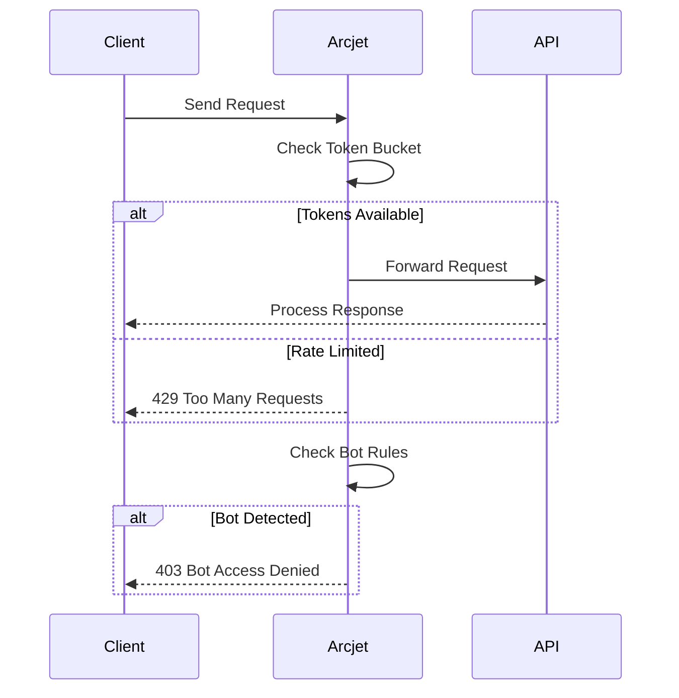
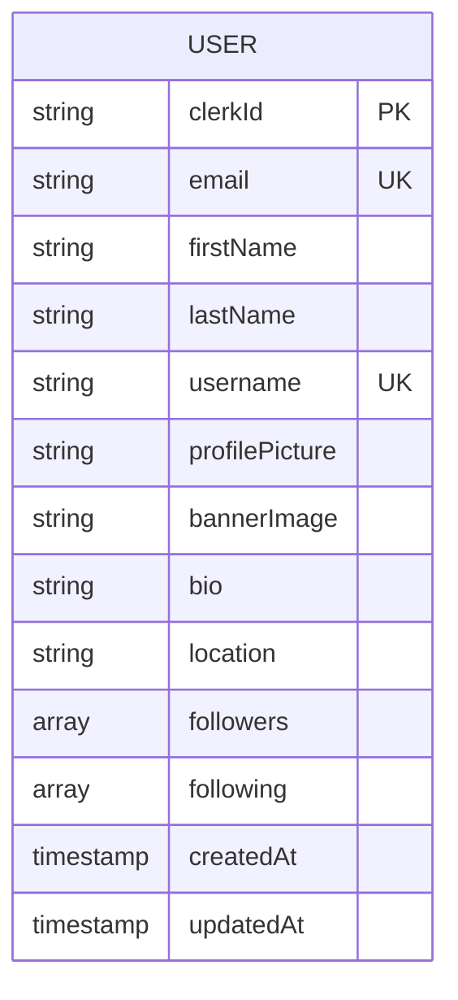
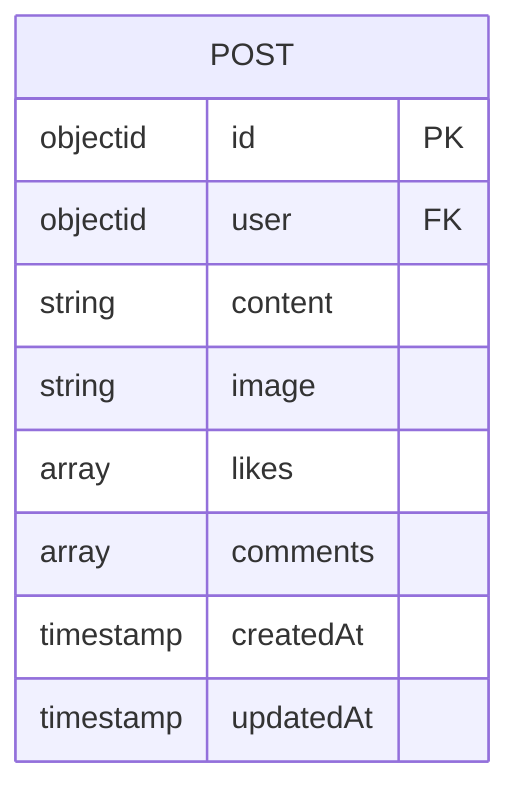
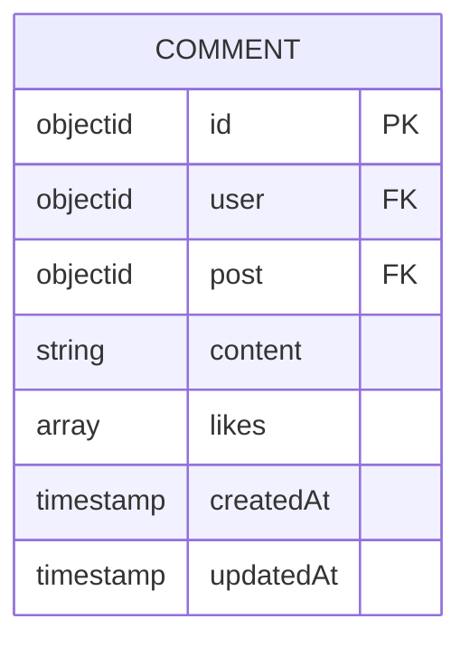
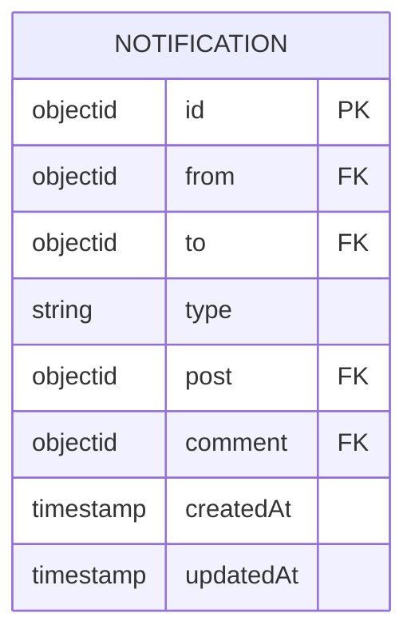

# API Reference

<cite>
**Referenced Files in This Document**   
- [user.route.js](file://backend/src/routes/user.route.js)
- [post.route.js](file://backend/src/routes/post.route.js)
- [comment.route.js](file://backend/src/routes/comment.route.js)
- [notification.route.js](file://backend/src/routes/notification.route.js)
- [user.controller.js](file://backend/src/controllers/user.controller.js)
- [post.controller.js](file://backend/src/controllers/post.controller.js)
- [comment.controller.js](file://backend/src/controllers/comment.controller.js)
- [notification.controller.js](file://backend/src/controllers/notification.controller.js)
- [auth.middleware.js](file://backend/src/middleware/auth.middleware.js)
- [arcjet.middleware.js](file://backend/src/middleware/arcjet.middleware.js)
- [upload.middleware.js](file://backend/src/middleware/upload.middleware.js)
- [arcjet.js](file://backend/src/config/arcjet.js)
- [user.model.js](file://backend/src/models/user.model.js)
- [post.model.js](file://backend/src/models/post.model.js)
- [comment.model.js](file://backend/src/models/comment.model.js)
- [notification.model.js](file://backend/src/models/notification.model.js)
</cite>

## Update Summary
**Changes Made**   
- Updated Posts API section to reflect image upload functionality and form data handling
- Added detailed information about Cloudinary integration and image transformation rules
- Enhanced request body specifications for POST /api/posts endpoint
- Updated curl example to demonstrate multipart form data submission
- Added file upload constraints and validation rules
- Verified middleware integration for file uploads
- Corrected error response format for image upload failures
- Added section sources for upload middleware and updated post controller

## Table of Contents
1. [API Reference](#api-reference)
2. [Authentication and Authorization](#authentication-and-authorization)
3. [Rate Limiting and Security](#rate-limiting-and-security)
4. [Users API](#users-api)
5. [Posts API](#posts-api)
6. [Comments API](#comments-api)
7. [Notifications API](#notifications-api)
8. [Data Models](#data-models)

## Authentication and Authorization

All protected endpoints require authentication via Clerk JWT tokens. The `protectRoute` middleware validates the presence and authenticity of the token.

**Authorization Rules:**
- Public routes: Accessible without authentication
- Protected routes: Require valid Clerk JWT token in request context
- User-specific actions: Only the authenticated user can modify their own data

```javascript
// Example: protectRoute middleware
export const protectRoute = async (req, res, next) => {
  if (!req.auth().isAuthenticated) {
    return res.status(401).json({
      message: "Unauthorized - you must be logged in",
    });
  }
  next();
};
```

**Section sources**
- [auth.middleware.js](file://backend/src/middleware/auth.middleware.js#L1-L9)

## Rate Limiting and Security

The API enforces rate limiting and bot protection using Arcjet. Security rules are applied globally via middleware.

### Rate Limiting Policy
- **Algorithm**: Token bucket
- **Refill Rate**: 10 tokens per 10 seconds
- **Bucket Capacity**: 15 tokens
- **Consumption**: 1 token per request

### Security Rules
- **Shield**: Protects against common attacks (SQL injection, XSS, CSRF)
- **Bot Detection**: Blocks automated bots except search engines
- **Spoofed Bot Detection**: Detects and blocks malicious spoofed bots

```javascript
// Arcjet configuration
tokenBucket({
  mode: "LIVE",
  refillRate: 10,
  interval: 10,
  capacity: 15,
});
```

**Error Responses:**
- `429 Too Many Requests`: Rate limit exceeded
- `403 Forbidden`: Bot access denied or spoofed bot detected



**Diagram sources**
- [arcjet.middleware.js](file://backend/src/middleware/arcjet.middleware.js#L1-L45)
- [arcjet.js](file://backend/src/config/arcjet.js#L1-L30)

## Users API

### GET /api/users/profile/:username
Retrieve a user's public profile by username.

**Authentication**: Not required  
**Parameters:**
- `username` (path): Username of the user to retrieve

**Response (200):**
```json
{
  "user": {
    "clerkId": "user_123",
    "email": "user@example.com",
    "firstName": "John",
    "lastName": "Doe",
    "username": "johndoe",
    "profilePicture": "https://example.com/image.jpg",
    "bio": "Software developer",
    "location": "New York",
    "followers": ["user_456"],
    "following": ["user_789"],
    "createdAt": "2023-01-01T00:00:00.000Z",
    "updatedAt": "2023-01-02T00:00:00.000Z"
  }
}
```

**Error Responses:**
- `404 Not Found`: User not found

**curl Example:**
```bash
curl -X GET http://localhost:5000/api/users/profile/johndoe
```

**Section sources**
- [user.route.js](file://backend/src/routes/user.route.js#L7-L8)
- [user.controller.js](file://backend/src/controllers/user.controller.js#L5-L12)

### POST /api/users/sync
Sync user data from Clerk to the application database.

**Authentication**: Required  
**Request Body:**
None (uses Clerk JWT token to identify user)

**Response (201):**
```json
{
  "user": {
    "clerkId": "user_123",
    "email": "user@example.com",
    "firstName": "John",
    "lastName": "Doe",
    "username": "johndoe",
    "profilePicture": "https://example.com/image.jpg"
  },
  "message": "User created successfully"
}
```

**Response (200):**
```json
{
  "message": "User already exists"
}
```

**curl Example:**
```bash
curl -X POST http://localhost:5000/api/users/sync \
  -H "Authorization: Bearer <clerk-jwt-token>"
```

**Section sources**
- [user.route.js](file://backend/src/routes/user.route.js#L10-L11)
- [user.controller.js](file://backend/src/controllers/user.controller.js#L14-L43)

### POST /api/users/me
Get the currently authenticated user's profile.

**Authentication**: Required  

**Response (200):**
```json
{
  "user": {
    "clerkId": "user_123",
    "email": "user@example.com",
    "firstName": "John",
    "lastName": "Doe",
    "username": "johndoe",
    "profilePicture": "https://example.com/image.jpg"
  }
}
```

**Error Responses:**
- `404 Not Found`: User not found in database

**curl Example:**
```bash
curl -X POST http://localhost:5000/api/users/me \
  -H "Authorization: Bearer <clerk-jwt-token>"
```

**Section sources**
- [user.route.js](file://backend/src/routes/user.route.js#L12-L13)
- [user.controller.js](file://backend/src/controllers/user.controller.js#L45-L53)

### PUT /api/users/profile
Update the authenticated user's profile.

**Authentication**: Required  
**Request Body:**
Any user profile fields to update (e.g., `bio`, `location`, `bannerImage`)

**Response (200):**
```json
{
  "user": {
    "clerkId": "user_123",
    "email": "user@example.com",
    "firstName": "John",
    "lastName": "Doe",
    "username": "johndoe",
    "profilePicture": "https://example.com/image.jpg",
    "bio": "Updated bio",
    "location": "San Francisco"
  }
}
```

**Error Responses:**
- `404 Not Found`: User not found

**curl Example:**
```bash
curl -X PUT http://localhost:5000/api/users/profile \
  -H "Authorization: Bearer <clerk-jwt-token>" \
  -H "Content-Type: application/json" \
  -d '{"bio": "Updated bio", "location": "San Francisco"}'
```

**Section sources**
- [user.route.js](file://backend/src/routes/user.route.js#L14-L15)
- [user.controller.js](file://backend/src/controllers/user.controller.js#L14-L23)

### POST /api/users/follow/:targetUserId
Follow or unfollow another user.

**Authentication**: Required  
**Parameters:**
- `targetUserId` (path): ID of the user to follow/unfollow

**Response (200):**
```json
{
  "message": "User followed successfully"
}
```

**Error Responses:**
- `400 Bad Request`: Cannot follow yourself
- `404 Not Found`: User not found

**curl Example:**
```bash
curl -X POST http://localhost:5000/api/users/follow/user_456 \
  -H "Authorization: Bearer <clerk-jwt-token>"
```

**Section sources**
- [user.route.js](file://backend/src/routes/user.route.js#L16-L17)
- [user.controller.js](file://backend/src/controllers/user.controller.js#L55-L96)

## Posts API

### GET /api/posts
Retrieve all posts sorted by creation date (newest first).

**Authentication**: Not required  

**Response (200):**
```json
{
  "posts": [
    {
      "id": "post_123",
      "user": {
        "username": "johndoe",
        "firstName": "John",
        "lastName": "Doe",
        "profilePicture": "https://example.com/image.jpg"
      },
      "content": "Hello world!",
      "image": "https://example.com/post-image.jpg",
      "likes": ["user_456"],
      "comments": [
        {
          "id": "comment_789",
          "user": {
            "username": "janedoe",
            "firstName": "Jane",
            "lastName": "Doe",
            "profilePicture": "https://example.com/jane.jpg"
          },
          "content": "Great post!",
          "createdAt": "2023-01-01T00:00:00.000Z"
        }
      ],
      "createdAt": "2023-01-01T00:00:00.000Z",
      "updatedAt": "2023-01-01T00:00:00.000Z"
    }
  ]
}
```

**curl Example:**
```bash
curl -X GET http://localhost:5000/api/posts
```

**Section sources**
- [post.route.js](file://backend/src/routes/post.route.js#L10-L11)
- [post.controller.js](file://backend/src/controllers/post.controller.js#L5-L15)

### GET /api/posts/:postId
Retrieve a specific post by ID.

**Authentication**: Not required  
**Parameters:**
- `postId` (path): ID of the post to retrieve

**Response (200):**
```json
{
  "post": {
    "id": "post_123",
    "user": {
      "username": "johndoe",
      "firstName": "John",
      "lastName": "Doe",
      "profilePicture": "https://example.com/image.jpg"
    },
    "content": "Hello world!",
    "image": "https://example.com/post-image.jpg",
    "likes": ["user_456"],
    "comments": [
      {
        "id": "comment_789",
        "user": {
          "username": "janedoe",
          "firstName": "Jane",
          "lastName": "Doe",
          "profilePicture": "https://example.com/jane.jpg"
        },
        "content": "Great post!",
        "createdAt": "2023-01-01T00:00:00.000Z"
      }
    ],
    "createdAt": "2023-01-01T00:00:00.000Z",
    "updatedAt": "2023-01-01T00:00:00.000Z"
  }
}
```

**Error Responses:**
- `404 Not Found`: Post not found

**curl Example:**
```bash
curl -X GET http://localhost:5000/api/posts/post_123
```

**Section sources**
- [post.route.js](file://backend/src/routes/post.route.js#L12-L13)
- [post.controller.js](file://backend/src/controllers/post.controller.js#L17-L28)

### GET /api/posts/user/:username
Retrieve all posts by a specific user.

**Authentication**: Not required  
**Parameters:**
- `username` (path): Username of the user whose posts to retrieve

**Response (200):**
```json
{
  "posts": [
    {
      "id": "post_123",
      "user": {
        "username": "johndoe",
        "firstName": "John",
        "lastName": "Doe",
        "profilePicture": "https://example.com/image.jpg"
      },
      "content": "Hello world!",
      "image": "https://example.com/post-image.jpg",
      "likes": ["user_456"],
      "comments": [],
      "createdAt": "2023-01-01T00:00:00.000Z",
      "updatedAt": "2023-01-01T00:00:00.000Z"
    }
  ]
}
```

**Error Responses:**
- `404 Not Found`: User not found

**curl Example:**
```bash
curl -X GET http://localhost:5000/api/posts/user/johndoe
```

**Section sources**
- [post.route.js](file://backend/src/routes/post.route.js#L14-L15)
- [post.controller.js](file://backend/src/controllers/post.controller.js#L30-L45)

### POST /api/posts
Create a new post.

**Authentication**: Required  
**Request Body:**
- `content` (string, optional): Text content of the post (max 280 characters)
- `image` (file, optional): Image file to upload

**Form Data Requirements:**
- Must provide either `content` or `image`
- Image uploads are processed through Cloudinary with transformations (800x600 limit, auto quality/format)
- Maximum file size: 5MB
- Only image files are allowed (content-type starting with "image/")

**Cloudinary Configuration:**
- Folder: "social_media_posts"
- Resource type: "image"
- Transformations: 
  - Resize to 800x600 with limit crop
  - Auto quality optimization
  - Auto format conversion

**Response (201):**
```json
{
  "post": {
    "id": "post_123",
    "user": "user_123",
    "content": "Hello world!",
    "image": "https://res.cloudinary.com/social_media_posts/image.jpg",
    "likes": [],
    "comments": [],
    "createdAt": "2023-01-01T00:00:00.000Z",
    "updatedAt": "2023-01-01T00:00:00.000Z"
  }
}
```

**Error Responses:**
- `400 Bad Request`: No content or image provided, or image upload failed
- `404 Not Found`: User not found
- `400 Bad Request`: File size exceeds 5MB limit
- `400 Bad Request`: Invalid file type (not an image)

**curl Example:**
```bash
curl -X POST http://localhost:5000/api/posts \
  -H "Authorization: Bearer <clerk-jwt-token>" \
  -F "content=Hello world!" \
  -F "image=@/path/to/image.jpg"
```

**Section sources**
- [post.route.js](file://backend/src/routes/post.route.js#L17-L18)
- [post.controller.js](file://backend/src/controllers/post.controller.js#L47-L97)
- [upload.middleware.js](file://backend/src/middleware/upload.middleware.js#L1-L21)

### POST /api/posts/:postId/like
Like or unlike a post.

**Authentication**: Required  
**Parameters:**
- `postId` (path): ID of the post to like/unlike

**Response (200):**
```json
{
  "message": "Post liked successfully"
}
```

**Behavior:**
- If already liked, removes the like (unlike)
- Creates a notification for the post owner (unless liking own post)

**Error Responses:**
- `404 Not Found`: User or post not found

**curl Example:**
```bash
curl -X POST http://localhost:5000/api/posts/post_123/like \
  -H "Authorization: Bearer <clerk-jwt-token>"
```

**Section sources**
- [post.route.js](file://backend/src/routes/post.route.js#L19-L20)
- [post.controller.js](file://backend/src/controllers/post.controller.js#L99-L136)

### DELETE /api/posts/:postId
Delete a post.

**Authentication**: Required  
**Parameters:**
- `postId` (path): ID of the post to delete

**Behavior:**
- Only the post owner can delete their post
- Deletes all comments associated with the post
- Removes the post from the database

**Response (200):**
```json
{
  "message": "Post deleted successfully"
}
```

**Error Responses:**
- `403 Forbidden`: Attempting to delete another user's post
- `404 Not Found`: User or post not found

**curl Example:**
```bash
curl -X DELETE http://localhost:5000/api/posts/post_123 \
  -H "Authorization: Bearer <clerk-jwt-token>"
```

**Section sources**
- [post.route.js](file://backend/src/routes/post.route.js#L21-L22)
- [post.controller.js](file://backend/src/controllers/post.controller.js#L138-L158)

## Comments API

### GET /api/comments/post/:postId
Retrieve all comments for a specific post.

**Authentication**: Not required  
**Parameters:**
- `postId` (path): ID of the post to get comments for

**Response (200):**
```json
{
  "comment": [
    {
      "id": "comment_123",
      "user": {
        "username": "johndoe",
        "firstName": "John",
        "lastName": "Doe",
        "profilePicture": "https://example.com/image.jpg"
      },
      "post": "post_123",
      "content": "Great post!",
      "likes": [],
      "createdAt": "2023-01-01T00:00:00.000Z",
      "updatedAt": "2023-01-01T00:00:00.000Z"
    }
  ]
}
```

**Error Responses:**
- `404 Not Found`: No comments found (returns empty array)

**curl Example:**
```bash
curl -X GET http://localhost:5000/api/comments/post/post_123
```

**Section sources**
- [comment.route.js](file://backend/src/routes/comment.route.js#L9-L10)
- [comment.controller.js](file://backend/src/controllers/comment.controller.js#L5-L13)

### POST /api/comments/post/:postId
Create a new comment on a post.

**Authentication**: Required  
**Parameters:**
- `postId` (path): ID of the post to comment on
**Request Body:**
- `content` (string): Comment text (required, max 280 characters)

**Behavior:**
- Validates non-empty content
- Links comment to post in both directions
- Creates notification for post owner (unless commenting on own post)

**Response (201):**
```json
{
  "comment": {
    "id": "comment_123",
    "user": "user_123",
    "post": "post_123",
    "content": "Great post!",
    "likes": [],
    "createdAt": "2023-01-01T00:00:00.000Z",
    "updatedAt": "2023-01-01T00:00:00.000Z"
  }
}
```

**Error Responses:**
- `400 Bad Request`: Empty comment
- `404 Not Found`: User or post not found

**curl Example:**
```bash
curl -X POST http://localhost:5000/api/comments/post/post_123 \
  -H "Authorization: Bearer <clerk-jwt-token>" \
  -H "Content-Type: application/json" \
  -d '{"content": "Great post!"}'
```

**Section sources**
- [comment.route.js](file://backend/src/routes/comment.route.js#L13-L14)
- [comment.controller.js](file://backend/src/controllers/comment.controller.js#L15-L54)

### DELETE /api/comments/:commentId
Delete a comment.

**Authentication**: Required  
**Parameters:**
- `commentId` (path): ID of the comment to delete

**Behavior:**
- Only the comment owner can delete their comment
- Removes comment reference from parent post
- Deletes comment from database

**Response (200):**
```json
{
  "message": "Comment deleted successfully"
}
```

**Error Responses:**
- `403 Forbidden`: Attempting to delete another user's comment
- `404 Not Found`: User or comment not found

**curl Example:**
```bash
curl -X DELETE http://localhost:5000/api/comments/comment_123 \
  -H "Authorization: Bearer <clerk-jwt-token>"
```

**Section sources**
- [comment.route.js](file://backend/src/routes/comment.route.js#L15-L16)
- [comment.controller.js](file://backend/src/controllers/comment.controller.js#L56-L83)

## Notifications API

### GET /api/notifications
Retrieve all notifications for the authenticated user.

**Authentication**: Required  
**Parameters:**
- None

**Response (200):**
```json
{
  "notifications": [
    {
      "id": "notif_123",
      "from": {
        "username": "janedoe",
        "firstName": "Jane",
        "lastName": "Doe",
        "profilePicture": "https://example.com/jane.jpg"
      },
      "to": "user_123",
      "type": "follow",
      "post": null,
      "comment": null,
      "createdAt": "2023-01-01T00:00:00.000Z",
      "updatedAt": "2023-01-01T00:00:00.000Z"
    },
    {
      "id": "notif_456",
      "from": {
        "username": "bobsmith",
        "firstName": "Bob",
        "lastName": "Smith",
        "profilePicture": "https://example.com/bob.jpg"
      },
      "to": "user_123",
      "type": "like",
      "post": {
        "id": "post_123",
        "content": "Hello world!",
        "image": "https://example.com/post-image.jpg"
      },
      "comment": null,
      "createdAt": "2023-01-02T00:00:00.000Z",
      "updatedAt": "2023-01-02T00:00:00.000Z"
    }
  ]
}
```

**Error Responses:**
- `404 Not Found`: User not found

**curl Example:**
```bash
curl -X GET http://localhost:5000/api/notifications \
  -H "Authorization: Bearer <clerk-jwt-token>"
```

**Section sources**
- [notification.route.js](file://backend/src/routes/notification.route.js#L7-L8) - *Updated to enforce authentication*
- [notification.controller.js](file://backend/src/controllers/notification.controller.js#L5-L17) - *Updated to enforce authentication*

### DELETE /api/notifications/:notificationId
Delete a notification.

**Authentication**: Required  
**Parameters:**
- `notificationId` (path): ID of the notification to delete

**Behavior:**
- Only deletes notifications belonging to the authenticated user
- Returns 404 if notification doesn't exist or doesn't belong to user

**Response (200):**
```json
{
  "message": "Notification deleted successfully"
}
```

**Error Responses:**
- `404 Not Found`: Notification not found or user not found

**curl Example:**
```bash
curl -X DELETE http://localhost:5000/api/notifications/notif_123 \
  -H "Authorization: Bearer <clerk-jwt-token>"
```

**Section sources**
- [notification.route.js](file://backend/src/routes/notification.route.js#L9-L10) - *Updated to enforce authentication*
- [notification.controller.js](file://backend/src/controllers/notification.controller.js#L19-L36) - *Updated to enforce authentication*

## Data Models

### User Model
Represents a user in the system.

**Fields:**
- `clerkId`: Clerk authentication ID (required, unique)
- `email`: User email (required, unique)
- `firstName`: First name (required)
- `lastName`: Last name (required)
- `username`: Username (required, unique)
- `profilePicture`: URL to profile image
- `bannerImage`: URL to banner image
- `bio`: User biography (max 160 characters)
- `location`: User location
- `followers`: Array of user IDs who follow this user
- `following`: Array of user IDs this user follows



**Diagram sources**
- [user.model.js](file://backend/src/models/user.model.js#L1-L63)

### Post Model
Represents a social media post.

**Fields:**
- `user`: Reference to User (required)
- `content`: Post text (max 280 characters)
- `image`: URL to post image
- `likes`: Array of user IDs who liked the post
- `comments`: Array of comment IDs on this post



**Diagram sources**
- [post.model.js](file://backend/src/models/post.model.js#L1-L36)

### Comment Model
Represents a comment on a post.

**Fields:**
- `user`: Reference to User (required)
- `post`: Reference to Post (required)
- `content`: Comment text (required, max 280 characters)
- `likes`: Array of user IDs who liked the comment



**Diagram sources**
- [comment.model.js](file://backend/src/models/comment.model.js#L1-L32)

### Notification Model
Represents a user notification.

**Fields:**
- `from`: Reference to User who triggered the notification (required)
- `to`: Reference to User who receives the notification (required)
- `type`: Notification type (required, enum: "follow", "like", "comment")
- `post`: Reference to Post (optional)
- `comment`: Reference to Comment (optional)



**Diagram sources**
- [notification.model.js](file://backend/src/models/notification.model.js#L1-L36)