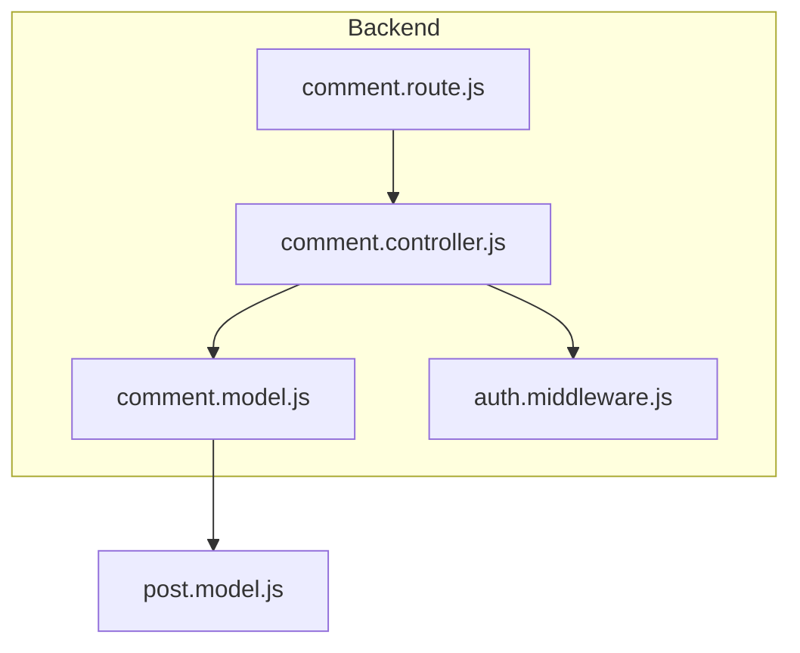
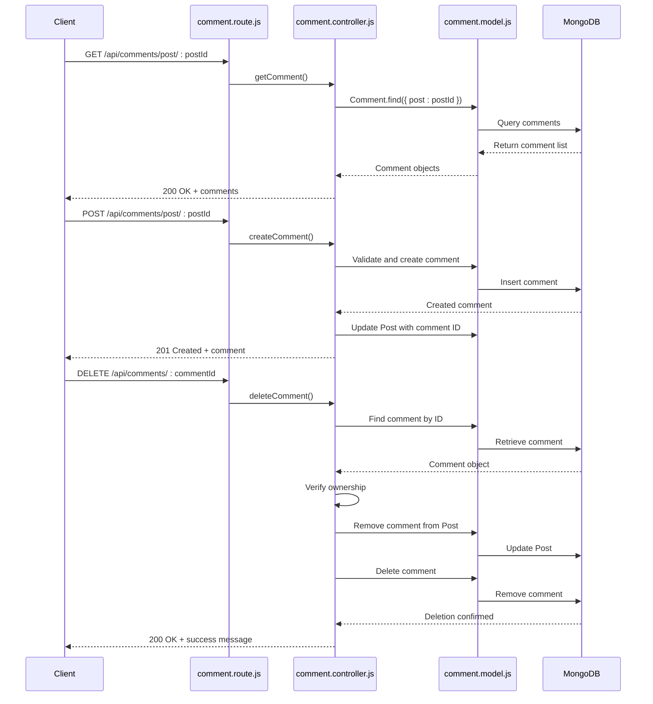
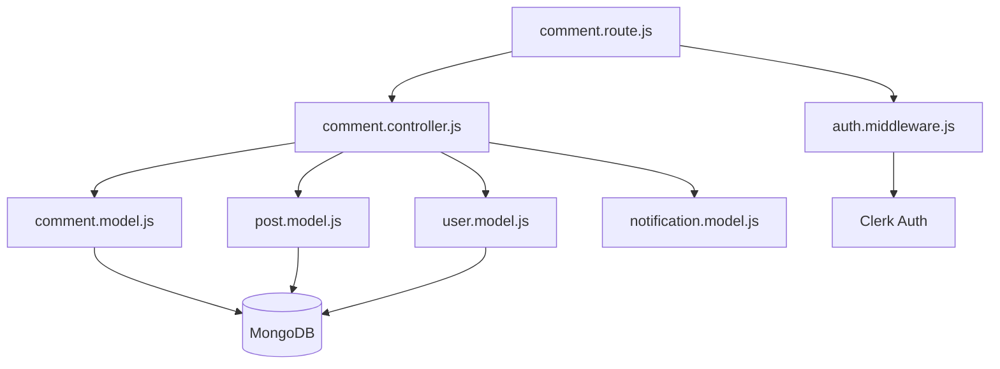

# Comments API

<cite>
**Referenced Files in This Document**   
- [comment.route.js](file://backend/src/routes/comment.route.js)
- [comment.controller.js](file://backend/src/controllers/comment.controller.js)
- [comment.model.js](file://backend/src/models/comment.model.js)
- [post.model.js](file://backend/src/models/post.model.js)
- [auth.middleware.js](file://backend/src/middleware/auth.middleware.js)
- [server.js](file://backend/src/server.js)
</cite>

## Table of Contents
1. [Introduction](#introduction)
2. [Project Structure](#project-structure)
3. [Core Components](#core-components)
4. [Architecture Overview](#architecture-overview)
5. [Detailed Component Analysis](#detailed-component-analysis)
6. [Dependency Analysis](#dependency-analysis)
7. [Performance Considerations](#performance-considerations)
8. [Troubleshooting Guide](#troubleshooting-guide)
9. [Conclusion](#conclusion)

## Introduction
The Comments API in xClone enables users to interact with posts by adding, retrieving, and deleting comments. This document provides comprehensive documentation for the RESTful endpoints defined in `comment.route.js`, including detailed descriptions of request and response formats, authentication requirements, error handling, and usage examples. The API supports nested comment structures through path-based associations with posts and enforces ownership-based authorization for deletion.

## Project Structure
The xClone project is structured into two main directories: `backend` and `mobile`. The backend implements a Node.js/Express server with a modular architecture separating concerns into models, controllers, routes, and middleware. The comments functionality resides in the backend under the `src` directory, organized as follows:
- **models**: Data schema definitions using Mongoose (e.g., `comment.model.js`)
- **controllers**: Business logic for handling HTTP requests (e.g., `comment.controller.js`)
- **routes**: API endpoint definitions and routing (e.g., `comment.route.js`)
- **middleware**: Reusable request processing functions (e.g., authentication)



**Diagram sources**
- [comment.route.js](file://backend/src/routes/comment.route.js#L1-L15)
- [comment.controller.js](file://backend/src/controllers/comment.controller.js#L1-L83)
- [comment.model.js](file://backend/src/models/comment.model.js#L1-L32)

**Section sources**
- [comment.route.js](file://backend/src/routes/comment.route.js#L1-L15)
- [comment.controller.js](file://backend/src/controllers/comment.controller.js#L1-L83)

## Core Components
The core components of the Comments API include:
- **Comment Model**: Defines the structure of comment data stored in MongoDB.
- **Comment Controller**: Implements CRUD operations for comments.
- **Comment Route**: Maps HTTP requests to controller functions.
- **Auth Middleware**: Ensures only authenticated users can create or delete comments.

These components work together to provide secure, scalable comment management functionality integrated with user and post data.

**Section sources**
- [comment.model.js](file://backend/src/models/comment.model.js#L1-L32)
- [comment.controller.js](file://backend/src/controllers/comment.controller.js#L1-L83)

## Architecture Overview
The Comments API follows a standard RESTful architecture with Express.js handling HTTP routing, controllers managing business logic, and Mongoose interacting with MongoDB. Authentication is handled via Clerk, and authorization is enforced at the route level using middleware.



**Diagram sources**
- [comment.route.js](file://backend/src/routes/comment.route.js#L1-L15)
- [comment.controller.js](file://backend/src/controllers/comment.controller.js#L1-L83)
- [comment.model.js](file://backend/src/models/comment.model.js#L1-L32)

## Detailed Component Analysis

### GET /api/comments/post/:postId
Retrieves all comments associated with a specific post, sorted by creation time (newest first).

**HTTP Method**: GET  
**URL Pattern**: `/api/comments/post/:postId`  
**Authentication Required**: No  
**Request Parameters**:
- Path: `postId` (string) - ID of the post to retrieve comments for

**Response Schema**:
```json
{
  "comment": [
    {
      "_id": "string",
      "user": {
        "_id": "string",
        "username": "string",
        "firstName": "string",
        "lastName": "string",
        "profilePicture": "string"
      },
      "post": "string",
      "content": "string",
      "likes": ["string"],
      "createdAt": "string",
      "updatedAt": "string"
    }
  ]
}
```

**Example Response (200 OK)**:
```json
{
  "comment": [
    {
      "_id": "652f8e5b9c9d0a1f4c8b4567",
      "user": {
        "_id": "652f8e5b9c9d0a1f4c8b4561",
        "username": "johndoe",
        "firstName": "John",
        "lastName": "Doe",
        "profilePicture": "https://example.com/profile.jpg"
      },
      "post": "652f8e5b9c9d0a1f4c8b4562",
      "content": "Great post!",
      "likes": [],
      "createdAt": "2023-10-17T08:30:00.000Z",
      "updatedAt": "2023-10-17T08:30:00.000Z"
    }
  ]
}
```

**Error Responses**:
- **404 Not Found**: No comments found for the post
  ```json
  { "message": "there is no comment" }
  ```

**curl Example**:
```bash
curl -X GET "http://localhost:5001/api/comments/post/652f8e5b9c9d0a1f4c8b4562"
```

**Section sources**
- [comment.route.js](file://backend/src/routes/comment.route.js#L8)
- [comment.controller.js](file://backend/src/controllers/comment.controller.js#L4-L13)

### POST /api/comments/post/:postId
Creates a new comment on a post.

**HTTP Method**: POST  
**URL Pattern**: `/api/comments/post/:postId`  
**Authentication Required**: Yes (via `protectRoute` middleware)  
**Authorization Rules**: User must be logged in  
**Request Parameters**:
- Path: `postId` (string) - ID of the post to comment on
- Body: `content` (string) - Comment text (required, max 280 characters)

**Request Validation**:
- Content must not be empty or whitespace-only
- Maximum length: 280 characters

**Response Schema**:
```json
{
  "comment": {
    "_id": "string",
    "user": "string",
    "post": "string",
    "content": "string",
    "likes": [],
    "createdAt": "string",
    "updatedAt": "string"
  }
}
```

**Example Request Body**:
```json
{ "content": "This is a great post!" }
```

**Example Response (201 Created)**:
```json
{
  "comment": {
    "_id": "652f8e5b9c9d0a1f4c8b4568",
    "user": "652f8e5b9c9d0a1f4c8b4561",
    "post": "652f8e5b9c9d0a1f4c8b4562",
    "content": "This is a great post!",
    "likes": [],
    "createdAt": "2023-10-17T09:00:00.000Z",
    "updatedAt": "2023-10-17T09:00:00.000Z"
  }
}
```

**Side Effects**:
- Comment ID is added to the post's `comments` array
- Notification is created if commenting on another user's post

**Error Responses**:
- **400 Bad Request**: Empty comment content
  ```json
  { "error": "Comment cannot be empty" }
  ```
- **401 Unauthorized**: User not logged in
  ```json
  { "message": "Unauthorized-you must be logged in" }
  ```
- **404 Not Found**: User or post not found
  ```json
  { "message": "user or post not found" }
  ```

**curl Example**:
```bash
curl -X POST "http://localhost:5001/api/comments/post/652f8e5b9c9d0a1f4c8b4562" \
  -H "Content-Type: application/json" \
  -H "Authorization: Bearer <token>" \
  -d '{"content": "This is a great post!"}'
```

**Section sources**
- [comment.route.js](file://backend/src/routes/comment.route.js#L11)
- [comment.controller.js](file://backend/src/controllers/comment.controller.js#L15-L40)
- [comment.model.js](file://backend/src/models/comment.model.js#L1-L32)

### DELETE /api/comments/:commentId
Deletes a comment by its ID.

**HTTP Method**: DELETE  
**URL Pattern**: `/api/comments/:commentId`  
**Authentication Required**: Yes  
**Authorization Rules**: Users can only delete their own comments  
**Request Parameters**:
- Path: `commentId` (string) - ID of the comment to delete

**Response Schema**:
```json
{ "message": "Comment deleted successfully" }
```

**Example Response (200 OK)**:
```json
{ "message": "Comment deleted successfully" }
```

**Deletion Logic**:
1. Verify user authentication
2. Find comment by ID
3. Check if comment belongs to the authenticated user
4. Remove comment ID from the associated post's `comments` array
5. Delete the comment document from the database

**Error Responses**:
- **401 Unauthorized**: User not logged in
  ```json
  { "message": "Unauthorized-you must be logged in" }
  ```
- **403 Forbidden**: Attempting to delete another user's comment
  ```json
  { "error": "You can only delete your own comments" }
  ```
- **404 Not Found**: User or comment not found
  ```json
  { "error": "User or comment not found" }
  ```

**curl Example**:
```bash
curl -X DELETE "http://localhost:5001/api/comments/652f8e5b9c9d0a1f4c8b4568" \
  -H "Authorization: Bearer <token>"
```

**Section sources**
- [comment.route.js](file://backend/src/routes/comment.route.js#L12)
- [comment.controller.js](file://backend/src/controllers/comment.controller.js#L42-L82)

## Dependency Analysis
The Comments API depends on several core components and external services:



**Diagram sources**
- [comment.route.js](file://backend/src/routes/comment.route.js#L1-L15)
- [comment.controller.js](file://backend/src/controllers/comment.controller.js#L1-L83)
- [comment.model.js](file://backend/src/models/comment.model.js#L1-L32)
- [post.model.js](file://backend/src/models/post.model.js#L1-L36)
- [user.model.js](file://backend/src/models/user.model.js#L1-L63)
- [auth.middleware.js](file://backend/src/middleware/auth.middleware.js#L1-L8)

**Section sources**
- [comment.controller.js](file://backend/src/controllers/comment.controller.js#L1-L83)
- [comment.model.js](file://backend/src/models/comment.model.js#L1-L32)

## Performance Considerations
- **Indexing**: Ensure `post` field in Comment collection is indexed for efficient querying by postId.
- **Population**: The `getComment` endpoint uses `.populate("user")` which performs a join; consider caching frequently accessed user data.
- **Validation**: Input validation occurs before database operations to prevent unnecessary queries.
- **Atomic Operations**: Comment creation and post update are separate operations; consider using MongoDB transactions for consistency in high-concurrency scenarios.

## Troubleshooting Guide
**Common Issues and Solutions**:
- **401 Unauthorized on POST/DELETE**: Ensure request includes valid authentication token from Clerk.
- **404 Not Found for valid postId**: Verify the post exists in the database and ID is correct.
- **Comment not appearing after creation**: Check that the comment ID was successfully added to the post's comments array.
- **Ownership check failing**: Ensure `clerkId` in User model matches the authenticated user's ID from `getAuth(req)`.

**Debugging Tips**:
- Enable MongoDB query logging to trace database operations.
- Verify middleware execution order in Express.
- Check that `protectRoute` middleware is correctly applied to protected routes.

**Section sources**
- [auth.middleware.js](file://backend/src/middleware/auth.middleware.js#L1-L8)
- [comment.controller.js](file://backend/src/controllers/comment.controller.js#L1-L83)

## Conclusion
The Comments API in xClone provides a robust, secure interface for managing post comments with proper authentication and authorization controls. The implementation follows REST principles with clear separation of concerns between routes, controllers, and models. Key features include ownership-based deletion, automatic post-comment linking, and notification generation. The API is designed for scalability with efficient querying patterns and can be extended to support nested replies or rich text content in future iterations.