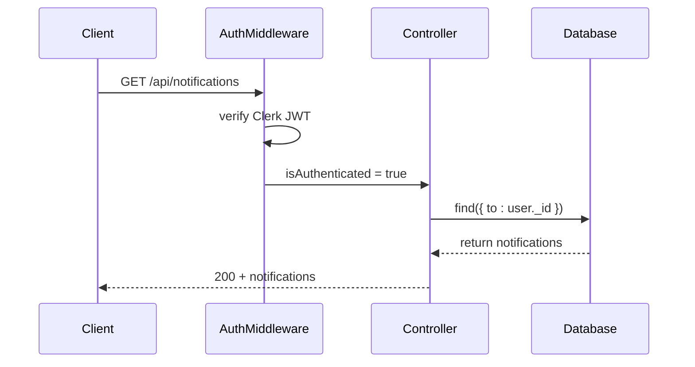
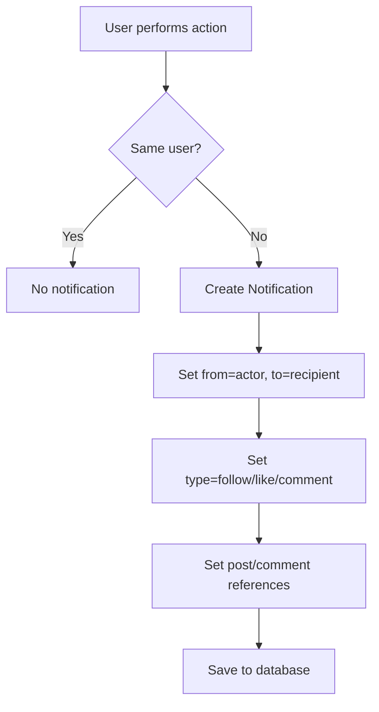

# Notifications API

<cite>
**Referenced Files in This Document**   
- [notification.route.js](file://backend/src/routes/notification.route.js)
- [notification.controller.js](file://backend/src/controllers/notification.controller.js)
- [notification.model.js](file://backend/src/models/notification.model.js)
- [post.controller.js](file://backend/src/controllers/post.controller.js)
- [comment.controller.js](file://backend/src/controllers/comment.controller.js)
- [user.controller.js](file://backend/src/controllers/user.controller.js)
- [auth.middleware.js](file://backend/src/middleware/auth.middleware.js)
</cite>

## Table of Contents
1. [Introduction](#introduction)
2. [API Endpoints](#api-endpoints)
   - [GET /api/notifications](#get-apinotifications)
   - [DELETE /api/notifications/:id](#delete-apinotificationsid)
3. [Notification Data Model](#notification-data-model)
4. [Authentication and Authorization](#authentication-and-authorization)
5. [Error Responses](#error-responses)
6. [Notification Generation Logic](#notification-generation-logic)
7. [Usage Examples](#usage-examples)
8. [Unread Count and Read Status](#unread-count-and-read-status)

## Introduction
The Notifications API in xClone enables users to receive real-time updates about social interactions such as likes, comments, and follows. This document provides comprehensive documentation for the available endpoints, data structures, authentication requirements, and integration logic. The system is designed to ensure users only access their own notifications through strict authorization checks.

## API Endpoints

### GET /api/notifications
Retrieves all notifications for the authenticated user, sorted by creation time in descending order.

**HTTP Method**: `GET`  
**URL Pattern**: `/api/notifications`  
**Authentication Required**: Yes  
**Authorization Rule**: Users can only retrieve their own notifications.

#### Request Parameters
- **Headers**:
  - `Authorization`: Bearer token (managed by Clerk authentication)
- **Query Parameters**: None
- **Path Parameters**: None
- **Body**: None

#### Response Schema
- **Status**: `200 OK`
- **Content-Type**: `application/json`
- **Body**:
```json
{
  "notifications": [
    {
      "_id": "string",
      "from": {
        "_id": "string",
        "username": "string",
        "firstName": "string",
        "lastName": "string",
        "profilePicture": "string"
      },
      "to": "string",
      "type": "follow | like | comment",
      "post": {
        "_id": "string",
        "content": "string",
        "image": "string"
      },
      "comment": {
        "_id": "string",
        "content": "string"
      },
      "createdAt": "ISO 8601 datetime",
      "updatedAt": "ISO 8601 datetime"
    }
  ]
}
```

#### Example Response
```json
{
  "notifications": [
    {
      "_id": "67890abc1234567890abcdef",
      "from": {
        "_id": "12345def67890abc123456",
        "username": "jane_doe",
        "firstName": "Jane",
        "lastName": "Doe",
        "profilePicture": "https://example.com/images/jane.jpg"
      },
      "to": "54321fedcba09876543210",
      "type": "like",
      "post": {
        "_id": "11223344556677889900aabb",
        "content": "Just had a great coffee!",
        "image": "https://example.com/images/coffee.jpg"
      },
      "comment": null,
      "createdAt": "2025-04-05T10:00:00.000Z",
      "updatedAt": "2025-04-05T10:00:00.000Z"
    }
  ]
}
```

**Section sources**
- [notification.controller.js](file://backend/src/controllers/notification.controller.js#L4-L18)
- [notification.route.js](file://backend/src/routes/notification.route.js#L6)

### DELETE /api/notifications/:id
Marks a specific notification as read by deleting it from the user's notification list.

**HTTP Method**: `DELETE`  
**URL Pattern**: `/api/notifications/:notificationId`  
**Authentication Required**: Yes  
**Authorization Rule**: Users can only delete their own notifications.

#### Request Parameters
- **Headers**:
  - `Authorization`: Bearer token
- **Path Parameters**:
  - `notificationId`: The unique identifier of the notification to delete
- **Query Parameters**: None
- **Body**: None

#### Response Schema
- **Status**: `200 OK`
- **Content-Type**: `application/json`
- **Body**:
```json
{
  "message": "Notification deleted successfully"
}
```

#### Example Response
```json
{
  "message": "Notification deleted successfully"
}
```

#### Error Responses
- **404 Not Found**: If the notification does not exist or does not belong to the user.
```json
{
  "error": "Notification not found"
}
```

**Section sources**
- [notification.controller.js](file://backend/src/controllers/notification.controller.js#L20-L35)
- [notification.route.js](file://backend/src/routes/notification.route.js#L7)

## Notification Data Model
The Notification model defines the structure of notifications stored in the database.

### Schema Definition
```javascript
{
  from: {
    type: ObjectId,
    ref: "User",
    required: true
  },
  to: {
    type: ObjectId,
    ref: "User",
    required: true
  },
  type: {
    type: String,
    required: true,
    enum: ["follow", "like", "comment"]
  },
  post: {
    type: ObjectId,
    ref: "Post",
    default: null
  },
  comment: {
    type: ObjectId,
    ref: "Comment",
    default: null
  }
}
```

### Field Descriptions
- **from**: Reference to the user who triggered the notification
- **to**: Reference to the recipient user
- **type**: Type of interaction (`follow`, `like`, `comment`)
- **post**: Reference to the post involved (if applicable)
- **comment**: Reference to the comment involved (if applicable)
- **timestamps**: Automatically added `createdAt` and `updatedAt` fields

**Section sources**
- [notification.model.js](file://backend/src/models/notification.model.js#L1-L36)

## Authentication and Authorization
All endpoints in the Notifications API require authentication via Clerk.

### Authentication Mechanism
- Uses Clerk's `getAuth()` function to extract user identity from JWT
- Protected by `protectRoute` middleware that checks `req.auth().isAuthenticated`

### Authorization Rules
- Each request verifies that the authenticated user owns the requested data
- Implemented by checking `clerkId` against the `to` field in the Notification document
- Prevents users from accessing or modifying others' notifications



**Diagram sources**
- [auth.middleware.js](file://backend/src/middleware/auth.middleware.js#L1-L8)
- [notification.controller.js](file://backend/src/controllers/notification.controller.js#L4-L18)

## Error Responses
The API returns standardized error responses for various failure scenarios.

### Common Error Codes
| Status Code | Error Type | Description |
|-----------|------------|-------------|
| `401` | Unauthorized | User not authenticated |
| `403` | Forbidden | User lacks permission |
| `404` | Not Found | Resource not found |
| `500` | Internal Server Error | Unexpected server error |

### Sample Error Payloads
**401 Unauthorized**
```json
{
  "message": "Unauthorized-you must be logged in"
}
```

**404 User Not Found**
```json
{
  "error": "User not found"
}
```

**404 Notification Not Found**
```json
{
  "error": "Notification not found"
}
```

**Section sources**
- [auth.middleware.js](file://backend/src/middleware/auth.middleware.js#L3-L7)
- [notification.controller.js](file://backend/src/controllers/notification.controller.js#L6-L7, L24-L25)

## Notification Generation Logic
Notifications are automatically generated when specific social interactions occur.

### Trigger Events
| Event | Notification Type | Source File |
|------|-------------------|-----------|
| User follows another user | `follow` | user.controller.js |
| User likes a post | `like` | post.controller.js |
| User comments on a post | `comment` | comment.controller.js |

### Generation Conditions
- Notifications are only created when the action involves different users
- Example: A user liking their own post does not generate a notification



**Diagram sources**
- [user.controller.js](file://backend/src/controllers/user.controller.js#L78-L85)
- [post.controller.js](file://backend/src/controllers/post.controller.js#L121-L128)
- [comment.controller.js](file://backend/src/controllers/comment.controller.js#L40-L48)

## Usage Examples
### Retrieve User Notifications
```bash
curl -X GET "http://localhost:5000/api/notifications" \
  -H "Authorization: Bearer <your_jwt_token>"
```

### Delete (Mark as Read) a Notification
```bash
curl -X DELETE "http://localhost:5000/api/notifications/67890abc1234567890abcdef" \
  -H "Authorization: Bearer <your_jwt_token>"
```

**Section sources**
- [notification.route.js](file://backend/src/routes/notification.route.js#L6-L7)

## Unread Count and Read Status
The system uses a deletion-based model to manage notification read status:

### Read Status Management
- **Unread**: Notification exists in the database
- **Read**: Notification is deleted from the database
- No explicit "read" flag – presence indicates unread state

### Unread Count Calculation
To get the unread count, clients can:
1. Retrieve all notifications and count the results
2. Implement a separate endpoint (not currently available) to return just the count

The current implementation requires fetching all notifications to determine the count, which may impact performance for users with many notifications.

**Section sources**
- [notification.controller.js](file://backend/src/controllers/notification.controller.js#L4-L18)