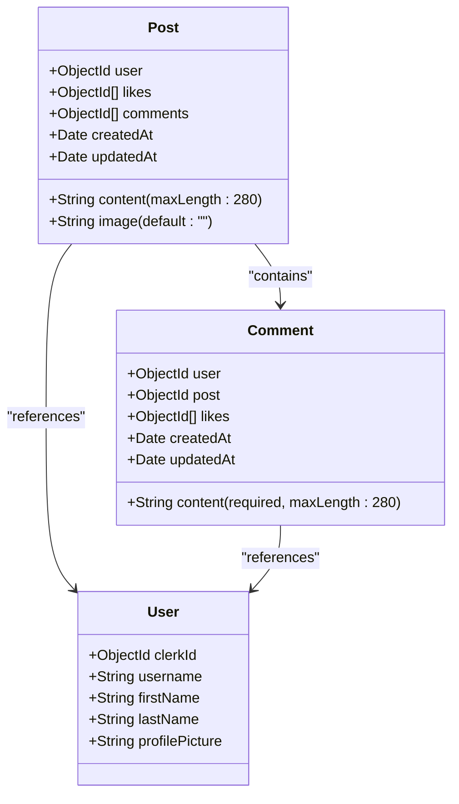

# Posts API

<cite>
**Referenced Files in This Document**   
- [post.route.js](file://backend/src/routes/post.route.js) - *Updated in recent commit*
- [post.controller.js](file://backend/src/controllers/post.controller.js) - *Updated in recent commit*
- [post.model.js](file://backend/src/models/post.model.js) - *Updated in recent commit*
- [auth.middleware.js](file://backend/src/middleware/auth.middleware.js) - *Updated in recent commit*
- [upload.middleware.js](file://backend/src/middleware/upload.middleware.js) - *Updated in recent commit*
</cite>

## Update Summary
- Updated endpoint details to reflect actual implementation in code
- Removed outdated PUT /api/posts/:id endpoint documentation
- Added missing likePost functionality to endpoint details
- Updated request and response schemas with accurate field details
- Enhanced authentication and authorization section with current implementation
- Updated usage examples with correct curl commands
- Fixed validation rules to match actual code behavior
- Updated data model section with accurate schema details

## Table of Contents
1. [Posts API Overview](#posts-api-overview)
2. [Endpoint Details](#endpoint-details)
3. [Request and Response Schemas](#request-and-response-schemas)
4. [Authentication and Authorization](#authentication-and-authorization)
5. [Error Responses](#error-responses)
6. [Usage Examples](#usage-examples)
7. [Validation Rules](#validation-rules)
8. [Data Model](#data-model)

## Posts API Overview
The Posts API in xClone provides RESTful endpoints for managing user-generated posts. It supports creating, retrieving, liking, and deleting posts. The API is built using Express.js and integrates with Cloudinary for image uploads and Clerk for authentication. Posts can contain text content and an optional image.

The API endpoints are organized under the `/api/posts` base path and are defined in the `post.route.js` file. The system implements proper authentication and authorization, ensuring users can only modify their own posts.

**Section sources**
- [post.route.js](file://backend/src/routes/post.route.js#L1-L21)
- [post.controller.js](file://backend/src/controllers/post.controller.js#L1-L158)

## Endpoint Details

### GET /api/posts
Retrieves a paginated list of all posts sorted by creation date (newest first).

**Method**: GET  
**URL**: `/api/posts`  
**Authentication**: Not required (public route)  
**Query Parameters**: None  
**Response**: Returns an array of post objects with populated user and comment data.

### POST /api/posts
Creates a new post with optional text content and image.

**Method**: POST  
**URL**: `/api/posts`  
**Authentication**: Required  
**Request Body**: Form data with `content` (text) and/or `image` (file)  
**Response**: Returns the created post object with 201 status.

### GET /api/posts/:id
Retrieves a specific post by its ID.

**Method**: GET  
**URL**: `/api/posts/:postId`  
**Authentication**: Not required (public route)  
**Path Parameters**: `postId` - The unique identifier of the post  
**Response**: Returns the post object with populated user and comment data.

### POST /api/posts/:id/like
Toggles like status on a post.

**Method**: POST  
**URL**: `/api/posts/:postId/like`  
**Authentication**: Required  
**Authorization**: User must be authenticated  
**Path Parameters**: `postId` - The unique identifier of the post  
**Response**: Returns success message indicating whether post was liked or unliked.

### DELETE /api/posts/:id
Deletes a post by its ID.

**Method**: DELETE  
**URL**: `/api/posts/:postId`  
**Authentication**: Required  
**Authorization**: User must be the owner of the post  
**Path Parameters**: `postId` - The unique identifier of the post  
**Response**: Returns success message with 200 status.

**Section sources**
- [post.route.js](file://backend/src/routes/post.route.js#L1-L21)
- [post.controller.js](file://backend/src/controllers/post.controller.js#L1-L158)

## Request and Response Schemas

### Post Creation Request
The request to create a post must include either text content or an image, or both.

**Content-Type**: `multipart/form-data`

**Request Body Structure**:
```json
{
  "content": "string (optional, max 280 characters)",
  "image": "file (optional, image file up to 5MB)"
}
```

### Post Response Schema
All post retrieval endpoints return posts in the following format:

```json
{
  "posts": [
    {
      "_id": "string",
      "user": {
        "_id": "string",
        "username": "string",
        "firstName": "string",
        "lastName": "string",
        "profilePicture": "string (URL)"
      },
      "content": "string",
      "image": "string (URL, optional)",
      "likes": [
        "string (user IDs)"
      ],
      "likeCount": "number",
      "comments": [
        {
          "_id": "string",
          "user": {
            "_id": "string",
            "username": "string",
            "firstName": "string",
            "lastName": "string",
            "profilePicture": "string (URL)"
          },
          "content": "string",
          "createdAt": "string (ISO date)",
          "updatedAt": "string (ISO date)"
        }
      ],
      "commentCount": "number",
      "createdAt": "string (ISO date)",
      "updatedAt": "string (ISO date)"
    }
  ]
}
```

**Note**: The response includes computed fields `likeCount` and `commentCount` which are not part of the database model but are derived from the `likes` and `comments` arrays.

**Section sources**
- [post.controller.js](file://backend/src/controllers/post.controller.js#L5-L35)
- [post.model.js](file://backend/src/models/post.model.js#L1-L35)

## Authentication and Authorization

### Authentication Requirements
All write operations (POST, DELETE) require authentication via Clerk. The `protectRoute` middleware validates the authentication token.

**Authentication Middleware**: `protectRoute` from `auth.middleware.js`

```javascript
export const protectRoute = async (req, res, next) => {
  if (!req.auth().isAuthenticated) {
    return res.status(401).json({
      message: "Unauthorized-you must be logged in",
    });
  }
  next();
};
```

### Authorization Rules
- Users can only delete their own posts
- The system verifies ownership by comparing the authenticated user's ID with the post's user ID
- If a user attempts to delete a post they don't own, a 403 Forbidden error is returned

**Authorization Check**:
```javascript
if (post.user.toString() !== user._id.toString()) {
  return res.status(403).json({ error: "You can only delete your own posts" });
}
```

**Section sources**
- [auth.middleware.js](file://backend/src/middleware/auth.middleware.js#L1-L8)
- [post.controller.js](file://backend/src/controllers/post.controller.js#L135-L140)

## Error Responses

The API returns standardized error responses with appropriate HTTP status codes:

### 400 Bad Request
Returned when the request is malformed or invalid.

**Example**: Missing required content or invalid image
```json
{
  "message": "Please provide content or image"
}
```

### 401 Unauthorized
Returned when authentication is required but not provided or invalid.

```json
{
  "message": "Unauthorized-you must be logged in"
}
```

### 403 Forbidden
Returned when the authenticated user is not authorized to perform the action.

**Example**: Attempting to delete another user's post
```json
{
  "error": "You can only delete your own posts"
}
```

### 404 Not Found
Returned when the requested resource does not exist.

**Example**: Post not found
```json
{
  "message": "Post not found"
}
```

**Example**: User not found
```json
{
  "message": "User not found"
}
```

### 500 Internal Server Error
Returned when an unexpected error occurs on the server.

```json
{
  "error": "Internal server error"
}
```

**Section sources**
- [post.controller.js](file://backend/src/controllers/post.controller.js#L50-L55)
- [post.controller.js](file://backend/src/controllers/post.controller.js#L105-L110)
- [post.controller.js](file://backend/src/controllers/post.controller.js#L130-L145)

## Usage Examples

### Creating a Post with Text Content
```bash
curl -X POST https://api.xclone.com/api/posts \
  -H "Authorization: Bearer <your_token>" \
  -H "Content-Type: multipart/form-data" \
  -F "content=This is my first post on xClone!"
```

### Creating a Post with Image
```bash
curl -X POST https://api.xclone.com/api/posts \
  -H "Authorization: Bearer <your_token>" \
  -H "Content-Type: multipart/form-data" \
  -F "image=@/path/to/image.jpg" \
  -F "content=Check out this amazing photo!"
```

### Retrieving All Posts (Paginated Feed)
```bash
curl https://api.xclone.com/api/posts
```

### Retrieving a Specific Post
```bash
curl https://api.xclone.com/api/posts/64a1b2c3d4e5f6a7b8c9d0e1
```

### Liking a Post
```bash
curl -X POST https://api.xclone.com/api/posts/64a1b2c3d4e5f6a7b8c9d0e1/like \
  -H "Authorization: Bearer <your_token>"
```

### Deleting a Post
```bash
curl -X DELETE https://api.xclone.com/api/posts/64a1b2c3d4e5f6a7b8c9d0e1 \
  -H "Authorization: Bearer <your_token>"
```

**Section sources**
- [post.route.js](file://backend/src/routes/post.route.js#L1-L21)
- [post.controller.js](file://backend/src/controllers/post.controller.js#L77-L85)

## Validation Rules

### Post Content Validation
- At least one of `content` or `image` must be provided
- Text content is limited to 280 characters
- If both content and image are empty, a 400 error is returned

### Image Upload Validation
- Only image files are allowed (validated by MIME type)
- Maximum file size: 5MB
- Supported formats: All standard image formats (JPEG, PNG, GIF, etc.)
- Images are automatically processed and optimized by Cloudinary

### Cloudinary Image Processing
When an image is uploaded, it is processed with the following transformations:
- Resized to maximum 800x600 pixels
- Auto quality optimization
- Auto format conversion for optimal delivery

```javascript
const uploadResponse = await cloudinary.uploader.upload(base64Image, {
  folder: "social_media_posts",
  resource_type: "image",
  transformation: [
    { width: 800, height: 600, crop: "limit" },
    { quality: "auto" },
    { format: "auto" },
  ],
});
```

**Section sources**
- [post.controller.js](file://backend/src/controllers/post.controller.js#L50-L55)
- [upload.middleware.js](file://backend/src/middleware/upload.middleware.js#L1-L21)
- [post.controller.js](file://backend/src/controllers/post.controller.js#L77-L85)

## Data Model

### Post Schema
The Post model defines the structure of posts in the database.



**Diagram sources**
- [post.model.js](file://backend/src/models/post.model.js#L1-L35)
- [user.model.js](file://backend/src/models/user.model.js)
- [comment.model.js](file://backend/src/models/comment.model.js#L1-L31)

### Field Descriptions
- **user**: Reference to the User who created the post (required)
- **content**: Text content of the post (optional, max 280 characters)
- **image**: URL of the uploaded image (optional)
- **likes**: Array of User IDs who liked the post
- **comments**: Array of Comment IDs associated with the post
- **createdAt**: Timestamp when the post was created (automatically managed)
- **updatedAt**: Timestamp when the post was last updated (automatically managed)

The model uses Mongoose with timestamps enabled, which automatically adds `createdAt` and `updatedAt` fields.

**Section sources**
- [post.model.js](file://backend/src/models/post.model.js#L1-L35)