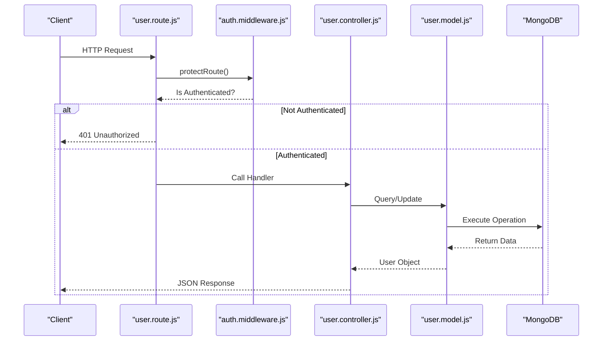
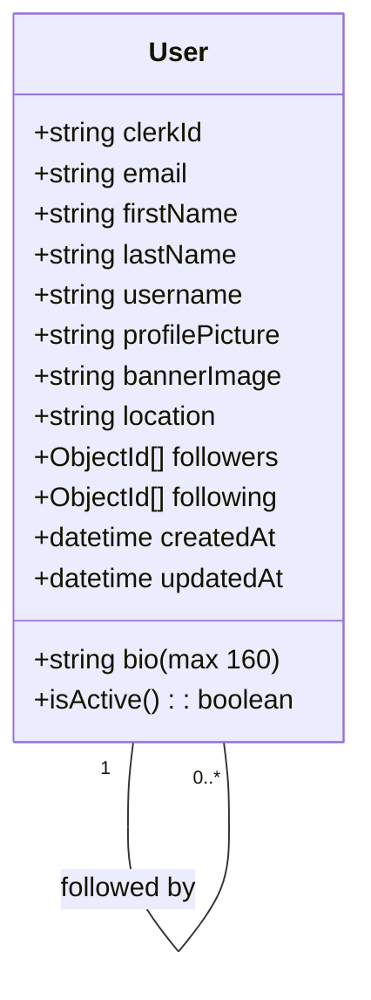
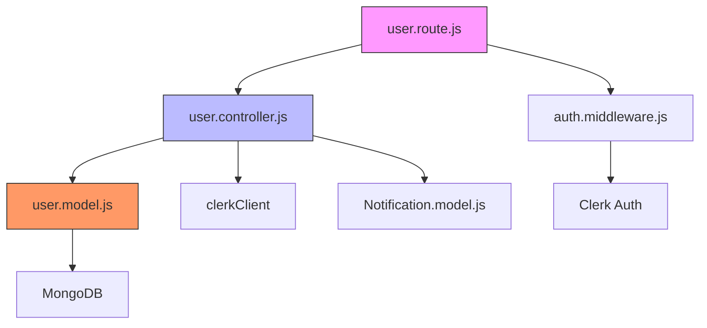

# Users API

<cite>
**Referenced Files in This Document**  
- [user.route.js](file://backend/src/routes/user.route.js#L1-L18)
- [user.controller.js](file://backend/src/controllers/user.controller.js#L1-L97)
- [user.model.js](file://backend/src/models/user.model.js#L1-L64)
- [auth.middleware.js](file://backend/src/middleware/auth.middleware.js#L1-L9)
</cite>

## Table of Contents
1. [Introduction](#introduction)
2. [Project Structure](#project-structure)
3. [Core Components](#core-components)
4. [Architecture Overview](#architecture-overview)
5. [Detailed Component Analysis](#detailed-component-analysis)
6. [Dependency Analysis](#dependency-analysis)
7. [Performance Considerations](#performance-considerations)
8. [Troubleshooting Guide](#troubleshooting-guide)
9. [Conclusion](#conclusion)

## Introduction
This document provides comprehensive RESTful API documentation for the Users API endpoints in xClone. It details all available user-related routes, their request and response structures, authentication requirements, error handling, and integration with Clerk for identity management. The API supports user profile retrieval, updates, synchronization, and social interactions such as following/unfollowing users.

## Project Structure
The xClone backend is organized using a modular architecture with clear separation of concerns. The Users API resides within the backend/src directory and follows a standard MVC-like pattern with distinct folders for routes, controllers, models, and middleware.

```mermaid
graph TB
subgraph "Backend Structure"
Routes[routes/user.route.js]
Controllers[controllers/user.controller.js]
Models[models/user.model.js]
Middleware[middleware/auth.middleware.js]
end
Routes --> Controllers : "Handles logic"
Controllers --> Models : "Interacts with data"
Controllers --> Middleware : "Uses auth protection"
Models --> Database[(MongoDB)]
Middleware --> Clerk["Clerk Auth Service"]
Controllers --> Clerk : "Syncs user data"
```

**Diagram sources**
- [user.route.js](file://backend/src/routes/user.route.js#L1-L18)
- [user.controller.js](file://backend/src/controllers/user.controller.js#L1-L97)
- [user.model.js](file://backend/src/models/user.model.js#L1-L64)
- [auth.middleware.js](file://backend/src/middleware/auth.middleware.js#L1-L9)

**Section sources**
- [user.route.js](file://backend/src/routes/user.route.js#L1-L18)
- [user.model.js](file://backend/src/models/user.model.js#L1-L64)

## Core Components
The Users API consists of four main components: routing definitions, controller logic, data modeling, and authentication middleware. These components work together to provide secure and scalable user management functionality.

**Section sources**
- [user.route.js](file://backend/src/routes/user.route.js#L1-L18)
- [user.controller.js](file://backend/src/controllers/user.controller.js#L1-L97)
- [user.model.js](file://backend/src/models/user.model.js#L1-L64)
- [auth.middleware.js](file://backend/src/middleware/auth.middleware.js#L1-L9)

## Architecture Overview
The Users API follows a layered architecture where incoming HTTP requests are first processed by Express.js routers, then passed through authentication middleware before reaching the controller layer. Controllers interact with MongoDB via Mongoose models to perform CRUD operations and return JSON responses.



**Diagram sources**
- [user.route.js](file://backend/src/routes/user.route.js#L1-L18)
- [user.controller.js](file://backend/src/controllers/user.controller.js#L1-L97)
- [user.model.js](file://backend/src/models/user.model.js#L1-L64)
- [auth.middleware.js](file://backend/src/middleware/auth.middleware.js#L1-L9)

## Detailed Component Analysis

### User Profile Retrieval
Handles fetching user profiles by username and retrieving current authenticated user data.

#### GET /api/users/profile/:username
Retrieves a user's public profile by username.

**Request Parameters**
- Path: `username` (string, required)

**Response Schema**
```json
{
  "user": {
    "clerkId": "string",
    "email": "string",
    "firstName": "string",
    "lastName": "string",
    "username": "string",
    "profilePicture": "string",
    "bannerImage": "string",
    "bio": "string",
    "location": "string",
    "followers": ["ObjectId"],
    "following": ["ObjectId"],
    "createdAt": "datetime",
    "updatedAt": "datetime"
  }
}
```

**Example Response (200 OK)**
```json
{
  "user": {
    "clerkId": "user_2nX8K9l2mQvZ1pR5sT7wY3uV6o",
    "email": "john.doe@example.com",
    "firstName": "John",
    "lastName": "Doe",
    "username": "johndoe",
    "profilePicture": "https://example.com/avatar.jpg",
    "bio": "Software developer",
    "followers": [],
    "following": [],
    "createdAt": "2023-01-15T10:30:00.000Z",
    "updatedAt": "2023-01-15T10:30:00.000Z"
  }
}
```

**Error Responses**
- `404 Not Found`: { "message": "User not found" }

**Section sources**
- [user.route.js](file://backend/src/routes/user.route.js#L7)
- [user.controller.js](file://backend/src/controllers/user.controller.js#L4-L11)

#### POST /api/users/me
Retrieves the current authenticated user's profile.

**Authentication**: Required (Clerk JWT)
**Authorization**: User can only access own profile

**Request Parameters**
- Body: None
- Headers: Authorization Bearer token

**Response Schema**: Same as GET /profile/:username

**Error Responses**
- `401 Unauthorized`: { "message": "Unauthorized-you must be logged in" }
- `404 Not Found`: { "message": "User not found" }

**curl Example**
```bash
curl -X POST http://localhost:5000/api/users/me \
  -H "Authorization: Bearer <clerk-jwt-token>"
```

**Section sources**
- [user.route.js](file://backend/src/routes/user.route.js#L10)
- [user.controller.js](file://backend/src/controllers/user.controller.js#L48-L54)

### User Profile Update
Handles updating user profile information.

#### PUT /api/users/profile
Updates the current user's profile.

**Authentication**: Required (Clerk JWT)
**Authorization**: Only self-update allowed

**Request Parameters**
- Body: Partial user object (all fields optional except those constrained by model)

**Validation Rules**
- `bio`: Maximum length 160 characters
- All other string fields: No additional constraints enforced at API level (rely on model defaults)

**Example Request**
```json
{
  "bio": "Full-stack developer passionate about open source",
  "location": "San Francisco, CA"
}
```

**Response Schema**
```json
{
  "user": { /* updated user object */ }
}
```

**Error Responses**
- `401 Unauthorized`: { "message": "Unauthorized-you must be logged in" }
- `404 Not Found`: { "message": "User not found" }

**curl Example**
```bash
curl -X PUT http://localhost:5000/api/users/profile \
  -H "Authorization: Bearer <clerk-jwt-token>" \
  -H "Content-Type: application/json" \
  -d '{"bio": "Updated bio", "location": "New York, NY"}'
```

**Section sources**
- [user.route.js](file://backend/src/routes/user.route.js#L11)
- [user.controller.js](file://backend/src/controllers/user.controller.js#L13-L21)

### User Synchronization
Integrates with Clerk for user identity synchronization.

#### POST /api/users/sync
Creates a new user in MongoDB based on Clerk user data if not already exists.

**Authentication**: Required (Clerk JWT)

**Process Flow**
1. Extract userId from Clerk JWT
2. Check if user already exists in MongoDB
3. If not exists, fetch user data from Clerk API
4. Create new user with derived username (email prefix) and synced data

**Derived Fields**
- `username`: First part of email address (before @)
- `profilePicture`: Clerk's imageUrl or empty string

**Response Schema**
- Success (201): { "user": { /* new user object */ }, "message": "User created successfully" }
- Already exists (200): { "message": "User already exists" }

**Error Responses**
- `401 Unauthorized`: If no valid JWT provided

**Section sources**
- [user.route.js](file://backend/src/routes/user.route.js#L9)
- [user.controller.js](file://backend/src/controllers/user.controller.js#L23-L46)

### User Relationship Management
Handles follow/unfollow operations between users.

#### POST /api/users/follow/:targetUserId
Toggles follow status between current user and target user.

**Authentication**: Required (Clerk JWT)
**Validation**
- Cannot follow self (400 error)
- Both users must exist (404 if not found)

**Logic**
- If already following: remove from both `following` and `followers` arrays (unfollow)
- If not following: add to both arrays and create notification

**Notification Creation**
- Type: "follow"
- From: Current user's ID
- To: Target user's ID

**Response**
```json
{
  "message": "User followed successfully" 
  // or "User unfollowed successfully"
}
```

**Error Responses**
- `400 Bad Request`: { "error": "You cannot follow yourself" }
- `404 Not Found`: { "error": "User not found" }

**Section sources**
- [user.route.js](file://backend/src/routes/user.route.js#L12)
- [user.controller.js](file://backend/src/controllers/user.controller.js#L56-L97)

### Data Model Structure
Defines the User schema in MongoDB with relationships and constraints.



**Diagram sources**
- [user.model.js](file://backend/src/models/user.model.js#L1-L64)

**Section sources**
- [user.model.js](file://backend/src/models/user.model.js#L1-L64)

## Dependency Analysis
The Users API has well-defined dependencies between components, ensuring separation of concerns while maintaining functionality.



**Diagram sources**
- [user.route.js](file://backend/src/routes/user.route.js#L1-L18)
- [user.controller.js](file://backend/src/controllers/user.controller.js#L1-L97)
- [user.model.js](file://backend/src/models/user.model.js#L1-L64)
- [auth.middleware.js](file://backend/src/middleware/auth.middleware.js#L1-L9)

**Section sources**
- [user.route.js](file://backend/src/routes/user.route.js#L1-L18)
- [user.controller.js](file://backend/src/controllers/user.controller.js#L1-L97)

## Performance Considerations
- **Indexing**: Ensure `clerkId`, `email`, and `username` fields are indexed in MongoDB for fast lookups
- **Caching**: Consider implementing Redis caching for frequently accessed profiles
- **Rate Limiting**: Integrate Arcjet middleware (present in config) to prevent abuse
- **Image Optimization**: Cloudinary integration (configured) should be used for profile picture optimization
- **Query Efficiency**: Use projection to limit returned fields when full profile isn't needed

## Troubleshooting Guide
Common issues and solutions for the Users API:

**Issue**: 401 Unauthorized errors despite valid token  
**Solution**: Verify Clerk middleware is properly configured and JWT is being sent in Authorization header

**Issue**: User not syncing from Clerk  
**Solution**: Check that clerkClient is properly initialized and has valid API keys in environment variables

**Issue**: Follow/unfollow not reflecting immediately  
**Solution**: Ensure both user documents are updated atomically; consider using transactions for critical operations

**Issue**: Username conflicts during sync  
**Solution**: Implement fallback logic for username generation when email prefix is taken

**Issue**: Notification not created on follow  
**Solution**: Verify Notification model is correctly imported and MongoDB has proper write permissions

**Section sources**
- [user.controller.js](file://backend/src/controllers/user.controller.js#L56-L97)
- [auth.middleware.js](file://backend/src/middleware/auth.middleware.js#L1-L9)

## Conclusion
The Users API in xClone provides a robust foundation for user management with secure authentication through Clerk, efficient MongoDB storage, and social features like following. The clean separation of routes, controllers, and models makes it maintainable and extensible. Future improvements could include field validation middleware, response normalization, and enhanced error logging.