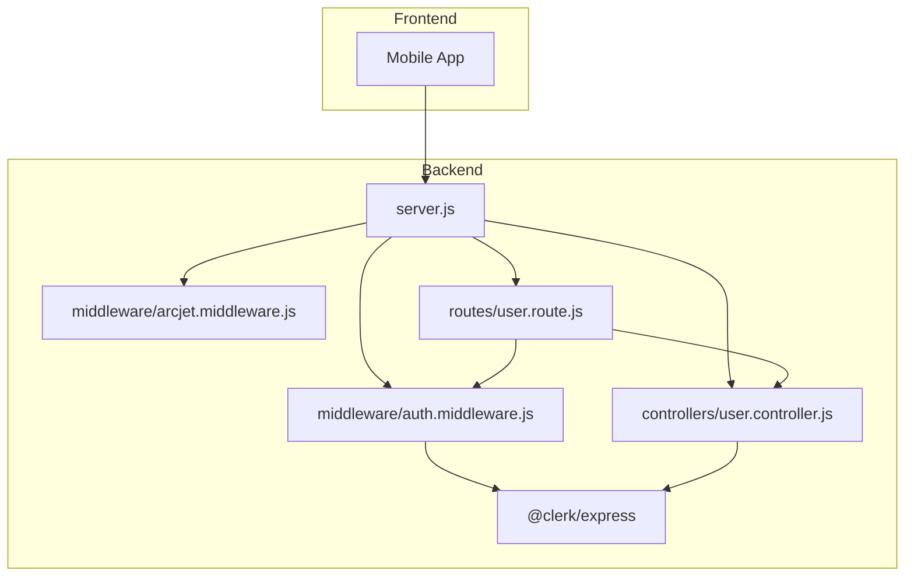

# Authentication Middleware

<cite>
**Referenced Files in This Document**   
- [auth.middleware.js](file://backend/src/middleware/auth.middleware.js)
- [server.js](file://backend/src/server.js)
- [user.controller.js](file://backend/src/controllers/user.controller.js)
</cite>

## Table of Contents
1. [Introduction](#introduction)
2. [Project Structure](#project-structure)
3. [Core Components](#core-components)
4. [Architecture Overview](#architecture-overview)
5. [Detailed Component Analysis](#detailed-component-analysis)
6. [Dependency Analysis](#dependency-analysis)
7. [Performance Considerations](#performance-considerations)
8. [Troubleshooting Guide](#troubleshooting-guide)
9. [Conclusion](#conclusion)

## Introduction
This document provides a comprehensive analysis of the authentication middleware implementation in xClone's backend system. The focus is on the `protectRoute` function defined in `auth.middleware.js`, which serves as a critical gatekeeper for securing API endpoints. Built on top of Clerk’s authentication service and Express.js, this middleware validates session tokens, ensures user identity integrity, and enables downstream route handlers to access authenticated user data. This guide explains its inner workings, integration points, error handling, and best practices for testing and debugging.

## Project Structure
The xClone project follows a modular backend architecture with clear separation of concerns. The authentication middleware resides within the `middleware` directory and is used across various route handlers to enforce access control. The backend uses Express.js as the web framework and integrates with Clerk for authentication, MongoDB for persistence, and Arcjet for security.



**Diagram sources**
- [server.js](file://backend/src/server.js#L1-L48)
- [auth.middleware.js](file://backend/src/middleware/auth.middleware.js#L1-L8)

**Section sources**
- [server.js](file://backend/src/server.js#L1-L48)

## Core Components
The core component under analysis is the `protectRoute` middleware function, which intercepts HTTP requests to verify user authentication status using Clerk’s session system. It leverages the `req.auth()` method injected by the `@clerk/express` package to determine if a user is authenticated. If authentication fails, it returns a 401 Unauthorized response; otherwise, it allows the request to proceed to the next handler.

```javascript
export const protectRoute = async (req, res, next) => {
  if (!req.auth().isAuthenticated) {
    return res.status(401).json({
      message: "Unauthorized-you must be logged in",
    });
  }
  next();
};
```

This simple yet effective pattern ensures that only authenticated users can access protected routes such as profile updates, post creation, or comment submission.

**Section sources**
- [auth.middleware.js](file://backend/src/middleware/auth.middleware.js#L1-L8)

## Architecture Overview
The authentication flow in xClone is built around Clerk’s Express integration, which automatically parses session tokens from incoming requests (typically via cookies or authorization headers). Once parsed, the session data is attached to the request object, making it accessible through `req.auth()`. The `protectRoute` middleware acts as a guard before any sensitive operation.

```mermaid
sequenceDiagram
participant Client as "Client App"
participant Clerk as "Clerk Auth"
participant Middleware as "protectRoute"
participant Controller as "User Controller"
Client->>Middleware : HTTP Request (with session token)
activate Middleware
Middleware->>Clerk : req.auth()
Clerk-->>Middleware : isAuthenticated : true/false
alt User Not Authenticated
Middleware-->>Client : 401 Unauthorized
deactivate Middleware
else User Authenticated
Middleware->>Controller : next()
Controller-->>Client : 200 OK + Data
deactivate Middleware
end
```

**Diagram sources**
- [auth.middleware.js](file://backend/src/middleware/auth.middleware.js#L1-L8)
- [user.controller.js](file://backend/src/controllers/user.controller.js#L32-L34)

## Detailed Component Analysis

### Authentication Middleware Implementation
The `protectRoute` function is an Express middleware that checks whether a user is authenticated by querying the `req.auth()` object provided by `@clerk/express`. This method decodes the session token, verifies its validity (including expiration), and extracts user identity information.

#### Key Functionality
- **Token Validation**: Clerk handles JWT decoding and signature verification automatically.
- **Identity Extraction**: Upon successful validation, `req.auth()` exposes user metadata such as `userId`.
- **Request Continuation**: On success, `next()` is called to pass control to the next middleware or route handler.
- **Error Response**: On failure, a JSON response with status 401 is returned immediately.

#### Code Example
```javascript
export const protectRoute = async (req, res, next) => {
  if (!req.auth().isAuthenticated) {
    return res.status(401).json({
      message: "Unauthorized-you must be logged in",
    });
  }
  next();
};
```

This middleware is typically applied to routes that require login, such as updating a user profile or creating a post.

#### Integration with Express Routes
In `server.js`, the middleware is not applied globally but is instead selectively used in specific routes. For example, in user routes:

```javascript
app.use("/api/users", userRouters);
```

Within `user.route.js` (not shown but inferred), certain routes would use `protectRoute` like so:

```javascript
router.put("/profile", protectRoute, updateUserProfile);
```

This ensures that only authenticated users can update their profiles.

**Section sources**
- [auth.middleware.js](file://backend/src/middleware/auth.middleware.js#L1-L8)
- [server.js](file://backend/src/server.js#L1-L48)

### User Controller Interaction
The `user.controller.js` file demonstrates how authenticated user data is retrieved after passing through the `protectRoute` middleware. Using `getAuth(req)`, controllers extract the `userId` from the validated session.

```javascript
export const getCurrentUser = asyncHandler(async (req, res) => {
  const { userId } = getAuth(req);
  const user = await User.findOne({ clerkId: userId });
  if (!user) return res.status(404).json({ message: "User not found" });
  res.status(200).json({ user });
});
```

Here, `getAuth(req)` relies on the same underlying `req.auth()` object that `protectRoute` uses, ensuring consistency in identity resolution.

**Section sources**
- [user.controller.js](file://backend/src/controllers/user.controller.js#L32-L34)

## Dependency Analysis
The authentication middleware depends on several key packages and configurations:

```mermaid
graph TD
A[auth.middleware.js] --> B["@clerk/express"]
B --> C[Express.js Request Object]
A --> D[Express next() Function]
D --> E[Route Handlers]
B --> F[Clerk Backend API]
F --> G[Session Token Validation]
```

**Diagram sources**
- [auth.middleware.js](file://backend/src/middleware/auth.middleware.js#L1-L8)
- [server.js](file://backend/src/server.js#L4)
- [package-lock.json](file://backend/package-lock.json#L226-L231)

**Section sources**
- [auth.middleware.js](file://backend/src/middleware/auth.middleware.js#L1-L8)
- [package-lock.json](file://backend/package-lock.json#L226-L231)

## Performance Considerations
The `protectRoute` middleware has minimal performance overhead because:
- Token verification is handled efficiently by Clerk’s backend services.
- No database queries are performed within the middleware itself.
- The logic consists of a single conditional check and early return.

However, network latency may occur if Clerk’s verification endpoint is slow or unreachable. In such cases, the request will be denied unless fallback mechanisms are implemented.

## Troubleshooting Guide
Common issues and their solutions when using the authentication middleware:

| Issue | Cause | Solution |
|------|-------|----------|
| **401 Unauthorized despite valid login** | Missing or malformed session token | Ensure frontend sends cookies or Authorization header correctly |
| **req.auth is not a function** | `clerkMiddleware()` not applied in server.js | Verify `app.use(clerkMiddleware())` is present before route usage |
| **Expired sessions not redirecting properly** | Token expiration not handled on client | Implement token refresh logic or redirect to login |
| **CORS-related authentication failures** | Incorrect CORS configuration | Set proper credentials and origin settings in `cors()` middleware |
| **User data not found after authentication** | Mismatch between Clerk ID and stored clerkId | Ensure user sync process correctly maps `userId` to `clerkId` in DB |

To debug token validation issues:
1. Log `req.auth()` output during development (avoid in production).
2. Use browser dev tools to inspect session cookies (`__session`).
3. Test endpoints with Postman by including the session cookie.
4. Check Clerk dashboard for active sessions and token status.

**Section sources**
- [auth.middleware.js](file://backend/src/middleware/auth.middleware.js#L1-L8)
- [server.js](file://backend/src/server.js#L4)
- [user.controller.js](file://backend/src/controllers/user.controller.js#L32-L34)

## Conclusion
The `protectRoute` middleware in xClone provides a robust and efficient mechanism for enforcing authentication across protected API routes. By leveraging Clerk’s Express integration, it abstracts away complex token management while maintaining high security standards. Its lightweight design ensures minimal performance impact, and its integration with Express.js makes it easy to apply selectively across routes. Proper testing and monitoring are recommended to handle edge cases like expired sessions or CORS misconfigurations.