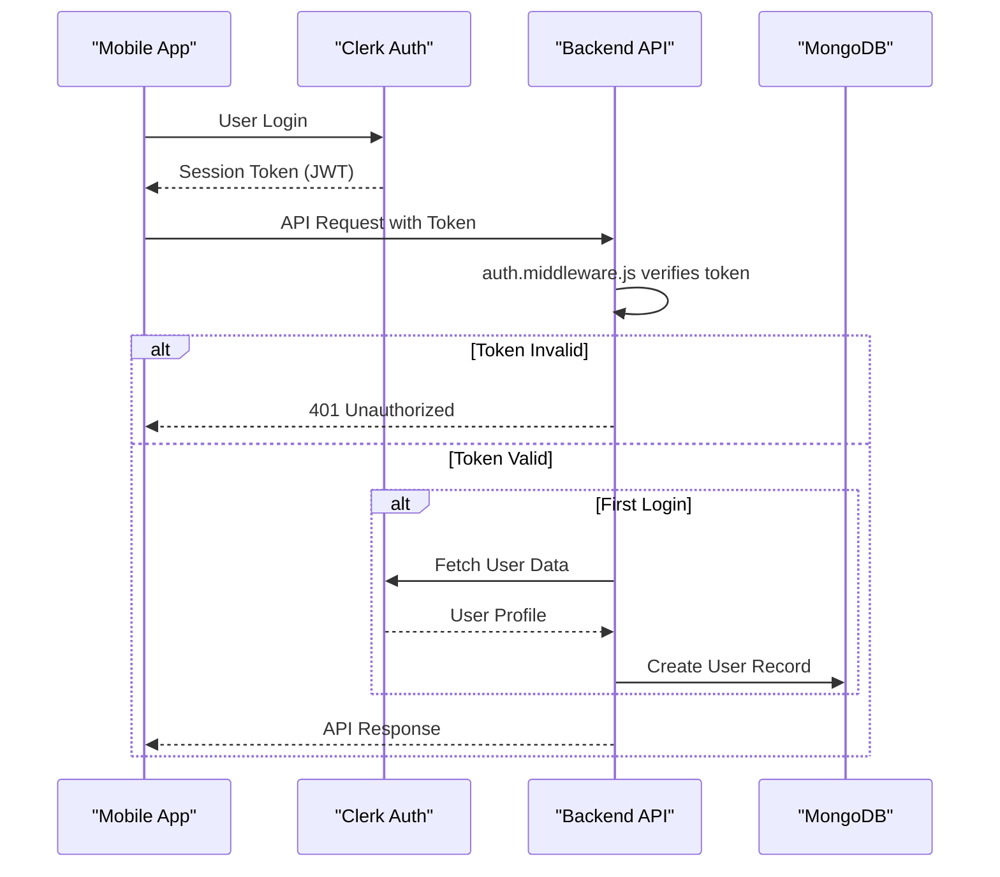
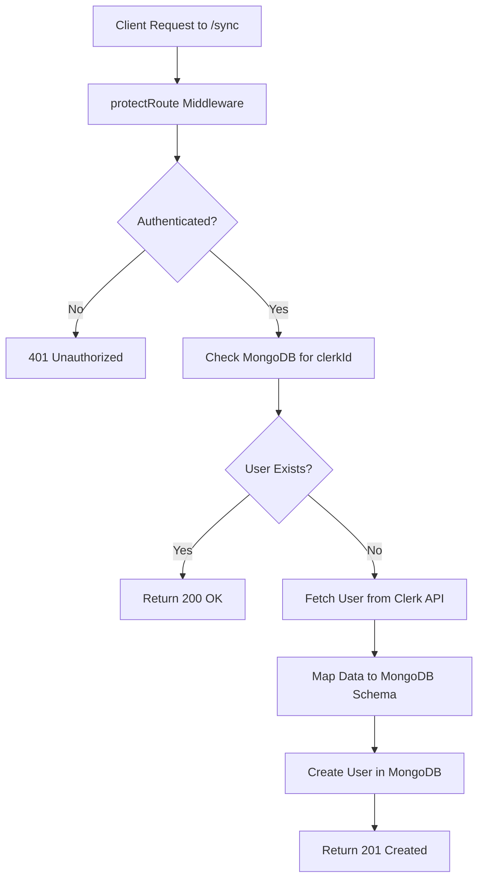

# Authentication System

<cite>
**Referenced Files in This Document**   
- [auth.middleware.js](file://backend/src/middleware/auth.middleware.js#L1-L9)
- [user.model.js](file://backend/src/models/user.model.js#L1-L64)
- [user.controller.js](file://backend/src/controllers/user.controller.js#L1-L97)
- [user.route.js](file://backend/src/routes/user.route.js#L1-L19)
- [useSocialAuth.ts](file://mobile/hooks/useSocialAuth.ts#L1-L29) - *Added in recent commit*
- [index.tsx](file://mobile/app/(auth)/index.tsx#L1-L102) - *Added in recent commit*
- [_layout.tsx](file://mobile/app/(auth)/_layout.tsx#L1-L12) - *Added in recent commit*
- [_layout.tsx](file://mobile/app/_layout.tsx#L1-L14) - *Updated in recent commit*
- [useUserSync.ts](file://mobile/hooks/useUserSync.ts#L1-L25) - *Added in recent commit*
- [index.tsx](file://mobile/app/(tabs)/index.tsx#L1-L17) - *Updated in recent commit*
</cite>

## Update Summary
**Changes Made**   
- Added new section: **Automatic User Synchronization on Login**
- Updated **User Synchronization Between Clerk and MongoDB** with frontend integration details
- Added **Section sources** to synchronization section reflecting new frontend files
- Enhanced **Frontend Authentication Implementation** with user sync hook usage
- Updated **Table of Contents** to include new section
- Added references to `useUserSync.ts` and updated `index.tsx` in document sources

## Table of Contents
1. [Introduction](#introduction)
2. [Authentication Flow Overview](#authentication-flow-overview)
3. [Backend Authentication Middleware](#backend-authentication-middleware)
4. [User Synchronization Between Clerk and MongoDB](#user-synchronization-between-clerk-and-mongodb)
5. [Automatic User Synchronization on Login](#automatic-user-synchronization-on-login)
6. [Profile Management and Protected Routes](#profile-management-and-protected-routes)
7. [Frontend Authentication Implementation](#frontend-authentication-implementation)
8. [Frontend Integration and Navigation Guards](#frontend-integration-and-navigation-guards)
9. [Common Authentication Issues and Troubleshooting](#common-authentication-issues-and-troubleshooting)
10. [Security Best Practices](#security-best-practices)

## Introduction
The xClone application implements a secure, JWT-based authentication system powered by Clerk, a third-party identity provider. This system handles user authentication, session management, and profile synchronization between Clerk's cloud service and the local MongoDB database. The backend, built with Express.js, uses middleware to protect routes and validate session tokens, while the mobile frontend (React Native) integrates with Clerk for seamless login and user state management. This document details the architecture, implementation, and integration points of the authentication system, including the newly implemented social login functionality and automatic user synchronization.

**Section sources**
- [auth.middleware.js](file://backend/src/middleware/auth.middleware.js#L1-L9)
- [user.model.js](file://backend/src/models/user.model.js#L1-L64)

## Authentication Flow Overview
The authentication flow begins on the mobile frontend where users log in via Clerk's authentication interface. Upon successful login, Clerk issues a session token that is automatically attached to subsequent HTTP requests to the backend. The backend verifies this token using Clerk's SDK and, if valid, proceeds to process the request. If the user is logging in for the first time, their profile is synchronized from Clerk to the local MongoDB database. All protected API endpoints require a valid session token, enforced by middleware.



**Diagram sources**
- [auth.middleware.js](file://backend/src/middleware/auth.middleware.js#L1-L9)
- [user.controller.js](file://backend/src/controllers/user.controller.js#L32-L70)

## Backend Authentication Middleware
The authentication middleware, implemented in `auth.middleware.js`, is responsible for intercepting incoming requests and validating the user's authentication status. It uses Clerk's Express integration to access the authentication state via `req.auth()`. If the user is not authenticated, the request is rejected with a 401 status. Otherwise, the request proceeds to the next handler.

### protectRoute Middleware Implementation
```javascript
export const protectRoute = async (req, res, next) => {
  if (!req.auth().isAuthenticated) {
    return res.status(401).json({
      message: "Unauthorized-you must be logged in",
    });
  }
  next();
};
```

This middleware is applied to all protected routes and ensures that only authenticated users can access sensitive endpoints such as profile updates, user synchronization, and follow actions.

**Section sources**
- [auth.middleware.js](file://backend/src/middleware/auth.middleware.js#L1-L9)

## User Synchronization Between Clerk and MongoDB
To maintain a consistent user experience, the system synchronizes user data from Clerk to the local MongoDB database. This occurs when a new user logs in for the first time. The `syncUser` controller function checks if a user with the given Clerk ID exists in MongoDB. If not, it fetches the user's details from Clerk's API and creates a new record.

### User Model Schema
The MongoDB schema, defined in `user.model.js`, maps Clerk user data to local fields:

```javascript
const userSchema = new mongoose.Schema({
  clerkId: { type: String, required: true, unique: true },
  email: { type: String, required: true, unique: true },
  firstName: { type: String, required: true },
  lastName: { type: String, required: true },
  username: { type: String, required: true, unique: true },
  profilePicture: { type: String, default: "" },
  bannerImage: { type: String, default: "" },
  bio: { type: String, default: "", maxLength: 160 },
  location: { type: String, default: "" },
  followers: [{ type: mongoose.Schema.Types.ObjectId, ref: "User" }],
  following: [{ type: mongoose.Schema.Types.ObjectId, ref: "User" }]
}, { timestamps: true });
```

### User Synchronization Logic
The `syncUser` function in `user.controller.js` performs the synchronization:

```javascript
export const syncUser = asyncHandler(async (req, res) => {
  const { userId } = getAuth(req);
  const existingUser = await User.findOne({ clerkId: userId });
  if (existingUser) return res.status(200).json({ message: "User already exists" });

  const clerkUser = await clerkClient.users.getUser(userId);
  const userData = {
    clerkId: userId,
    email: clerkUser.emailAddresses[0].emailAddress,
    firstName: clerkUser.firstName || "",
    lastName: clerkUser.lastName || "",
    username: clerkUser.emailAddresses[0].emailAddress.split("@")[0],
    profilePicture: clerkUser.imageUrl || "",
  };
  const user = await User.create(userData);
  res.status(201).json({ user, message: "User created successfully" });
});
```



**Diagram sources**
- [user.model.js](file://backend/src/models/user.model.js#L1-L64)
- [user.controller.js](file://backend/src/controllers/user.controller.js#L32-L70)

**Section sources**
- [user.model.js](file://backend/src/models/user.model.js#L1-L64)
- [user.controller.js](file://backend/src/controllers/user.controller.js#L32-L70)

## Automatic User Synchronization on Login
A new feature has been implemented to automatically synchronize user data upon successful login. This ensures that user profiles are immediately available in the local database when needed by other application features.

### useUserSync Hook Implementation
The `useUserSync` hook in `mobile/hooks/useUserSync.ts` handles the automatic synchronization:

```tsx
import { useEffect } from "react";
import { useMutation } from "@tanstack/react-query";
import { useAuth } from "@clerk/clerk-expo";
import { useApiClient, userApi } from "../utils/api";

export const useUserSync = () => {
  const { isSignedIn } = useAuth();
  const api = useApiClient();

  const syncUserMutation = useMutation({
    mutationFn: () => userApi.syncUser(api),
    onSuccess: (response: any) => console.log("User synced successfully:", response.data.user),
    onError: (error) => console.error("User sync failed:", error),
  });

  // auto-sync user when signed in
  useEffect(() => {
    if (isSignedIn && !syncUserMutation.data) {
      syncUserMutation.mutate();
    }
  }, [isSignedIn]);

  return null;
};
```

### Integration in Main Application
The hook is integrated into the main application layout in `mobile/app/(tabs)/index.tsx`:

```tsx
import { useUserSync } from "@/hooks/useUserSync";
const HomeScreen = () => {
  useUserSync();
  return (
    <SafeAreaView className="flex-1">
      <Text>Home</Text>
      <SignOutButton />
    </SafeAreaView>
  );
};
```

This implementation ensures that user synchronization occurs automatically when a user signs in, without requiring explicit user action.

**Section sources**
- [useUserSync.ts](file://mobile/hooks/useUserSync.ts#L1-L25) - *Added in recent commit*
- [index.tsx](file://mobile/app/(tabs)/index.tsx#L1-L17) - *Updated in recent commit*

## Profile Management and Protected Routes
User profile management is handled through protected API endpoints that require authentication. The `user.route.js` file defines these routes and applies the `protectRoute` middleware to ensure security.

### Protected Routes in user.route.js
```javascript
router.post("/sync", protectRoute, syncUser);
router.post("/me", protectRoute, getCurrentUser);
router.put("/profile", protectRoute, updateProfile);
router.post("/follow/:targetUserId", protectRoute, followUser);
```

Each of these routes performs a specific user-related action:
- **POST /sync**: Synchronizes user data from Clerk to MongoDB
- **POST /me**: Retrieves the current authenticated user's profile
- **PUT /profile**: Updates the user's profile information
- **POST /follow/:targetUserId**: Toggles follow/unfollow state between users

The `updateProfile` controller uses the authenticated user's Clerk ID to locate and update their record in MongoDB:

```javascript
export const updateProfile = asyncHandler(async (req, res) => {
  const { userId } = getAuth(req);
  const user = await User.findOneAndUpdate({ clerkId: userId }, req.body, {
    new: true,
  });
  if (!user) return res.status(404).json({ message: "User not found" });
  res.status(200).json({ user });
});
```

**Section sources**
- [user.route.js](file://backend/src/routes/user.route.js#L1-L19)
- [user.controller.js](file://backend/src/controllers/user.controller.js#L10-L25)

## Frontend Authentication Implementation
The mobile frontend now includes a complete authentication implementation with social login options. The system uses Clerk's Expo SDK to handle authentication flows and session management.

### Root Layout Configuration
The root layout in `_layout.tsx` initializes the ClerkProvider to manage authentication state across the application:

```tsx
import { ClerkProvider } from "@clerk/clerk-expo";
import { tokenCache } from "@clerk/clerk-expo/token-cache";
import { Stack } from "expo-router";
import "../global.css";

export default function RootLayout() {
  return (
    <ClerkProvider tokenCache={tokenCache}>
      <Stack>
        <Stack.Screen name="(auth)" options={{ headerShown: false }} />
        <Stack.Screen name="index" options={{title: "Home"}} />
      </Stack>
    </ClerkProvider>
  );
}
```

### Authentication Route Layout
The authentication route layout handles redirect logic based on authentication status:

```tsx
import { Redirect, Stack } from 'expo-router'
import { useAuth } from '@clerk/clerk-expo'

export default function AuthRoutesLayout() {
  const { isSignedIn } = useAuth()

  if (isSignedIn) {
    return <Redirect href={'/(tabs)/index'} />
  }

  return <Stack screenOptions={{ headerShown: false }} />;
}
```

### Social Authentication Hook
The `useSocialAuth` hook provides a clean interface for handling social authentication:

```tsx
import { useSSO } from "@clerk/clerk-expo";
import { useState } from "react";
import { Alert } from "react-native";

export const useSocialAuth = () => {
  const [isloading, setIsLoading] = useState(false);
  const { startSSOFlow } = useSSO();

  const handleSocialAuth = async (strategy: "oauth_google" | "oauth_apple") => {
    setIsLoading(true);
    try {
      const { createdSessionId, setActive } = await startSSOFlow({
        strategy,
      });
      if (createdSessionId && setActive) {
        await setActive({ session: createdSessionId });
      }
    } catch (err) {
      console.log("Error in social auth", err);
      const provider = strategy === "oauth_google" ? "Google" : "Apple";
      Alert.alert(
        "Error",
        `Failed to sign in with ${provider}. Please try again.`
      );
    } finally {
      setIsLoading(false);
    }
  };
  return { isloading, handleSocialAuth };
};
```

### Authentication Screen
The authentication screen provides UI for social login options:

```tsx
export default function Index() {
  const { handleSocialAuth, isloading } = useSocialAuth();
  return (
    <View className="flex-1 bg-white">
      <View className="flex-1 px-8 justify-between">
        <View className="flex-1 justify-center">
          <View className="items-center">
            <Image source={require("../../assets/images/auth1.png")} className="size-96" resizeMode="contain" />
          </View>
          <View className="flex-col gap-2 my-5">
            <TouchableOpacity onPress={() => handleSocialAuth("oauth_google")} disabled={isloading}>
              {isloading ? (
                <ActivityIndicator size="small" color="#4285F4" />
              ) : (
                <View className="flex-row items-center justify-center">
                  <Image source={require("../../assets/images/google.png")} className="size-10 mr-3" resizeMode="contain" />
                  <Text className="text-black text-base font-medium">continue with Google</Text>
                </View>
              )}
            </TouchableOpacity>
            <TouchableOpacity onPress={() => handleSocialAuth("oauth_apple")} disabled={isloading}>
              {isloading ? (
                <ActivityIndicator size="small" color="#000" />
              ) : (
                <View className="flex-row items-center justify-center">
                  <Image source={require("../../assets/images/apple.png")} className="size-8 mr-3" resizeMode="contain" />
                  <Text className="text-black text-base font-medium">continue with Apple</Text>
                </View>
              )}
            </TouchableOpacity>
          </View>
          <Text className="text-center text-gray-500 text-xs leading-4 mt-6 px-2">
            By signing up, you agree to our{" "}
            <Text className="text-blue-500">Terms</Text>
            {", "}
            <Text className="text-blue-500">Privacy Policy</Text>
            {", and "}
            <Text className="text-blue-500">Cookie Use</Text>.
          </Text>
        </View>
      </View>
    </View>
  );
}
```

**Section sources**
- [_layout.tsx](file://mobile/app/_layout.tsx#L1-L14)
- [_layout.tsx](file://mobile/app/(auth)/_layout.tsx#L1-L12)
- [index.tsx](file://mobile/app/(auth)/index.tsx#L1-L102)
- [useSocialAuth.ts](file://mobile/hooks/useSocialAuth.ts#L1-L29)

## Frontend Integration and Navigation Guards
The frontend authentication system is now fully implemented with proper navigation guards. The `(auth)` route group handles authentication flows, and the `useAuth` hook provides real-time authentication status.

### Authentication Flow
1. The app initializes with `ClerkProvider` wrapping the entire application
2. The root layout configures routing with authentication and main app stacks
3. The authentication layout checks `isSignedIn` status and redirects authenticated users to the main app
4. Unauthenticated users see the login screen with social login options
5. Upon successful authentication, users are redirected to the main app tabs

### Navigation Guard Implementation
The navigation guard is implemented in the `(auth)/_layout.tsx` file using Clerk's `useAuth` hook:

```tsx
const { isSignedIn } = useAuth()

if (isSignedIn) {
  return <Redirect href={'/(tabs)/index'} />
}
```

This ensures that authenticated users cannot access the login screen and are automatically redirected to the main application.

**Section sources**
- [_layout.tsx](file://mobile/app/(auth)/_layout.tsx#L1-L12)
- [_layout.tsx](file://mobile/app/_layout.tsx#L1-L14)

## Common Authentication Issues and Troubleshooting
### Login Failures
- **Cause**: Invalid credentials or network issues with Clerk
- **Solution**: Verify internet connection, check Clerk dashboard for service status, ensure correct publishable key

### Session Expiration
- **Cause**: JWT token lifetime exceeded (typically 60 minutes)
- **Solution**: Implement token refresh using Clerk's session management. The mobile app should listen for session expiration events and prompt re-authentication.

### User Synchronization Errors
- **Cause**: Duplicate clerkId or email in MongoDB
- **Solution**: Ensure unique constraints are properly enforced. Check for existing users before creating new ones.

### 401 Unauthorized Responses
- **Cause**: Missing or invalid session token in request headers
- **Solution**: Verify that the mobile app includes the Authorization header with Bearer token. Check that `protectRoute` middleware is correctly applied.

### Social Login Failures
- **Cause**: SSO flow interrupted or provider authentication error
- **Solution**: Check network connectivity, verify OAuth configuration in Clerk dashboard, ensure proper redirect URLs are configured

## Security Best Practices
1. **Always use HTTPS** in production to protect token transmission
2. **Validate all input** in profile update endpoints to prevent injection attacks
3. **Implement rate limiting** on authentication endpoints to prevent brute force attacks
4. **Use environment variables** for Clerk secret keys (not exposed in client code)
5. **Keep dependencies updated**, especially security-related packages like `@clerk/express`
6. **Log authentication events** for audit and monitoring purposes
7. **Implement proper error handling** without exposing sensitive information
8. **Secure token storage** using Expo Secure Store on mobile devices
9. **Use token caching** with appropriate expiration policies
10. **Validate redirect URLs** to prevent open redirect vulnerabilities