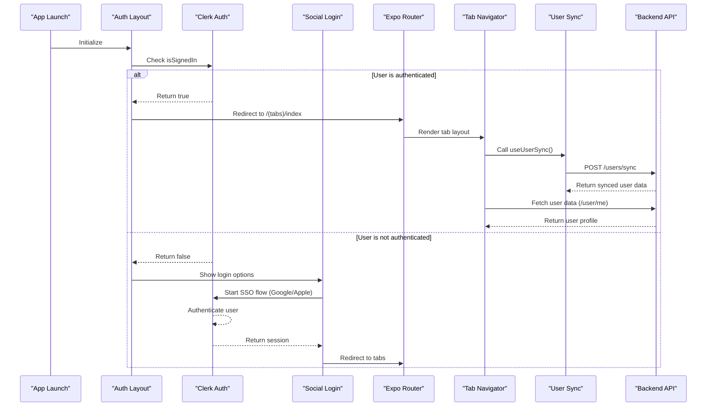

# Frontend Authentication Integration

<cite>
**Referenced Files in This Document**   
- [app/(tabs)/_layout.tsx](file://mobile\app\(tabs)\_layout.tsx) - *Updated to include authentication guard logic*
- [app/(auth)/index.tsx](file://mobile\app\(auth)\index.tsx) - *Added social login UI with Google and Apple*
- [hooks/useSocialAuth.ts](file://mobile\hooks\useSocialAuth.ts) - *New hook for handling SSO authentication*
- [app/(auth)/_layout.tsx](file://mobile\app\(auth)\_layout.tsx) - *Implemented redirect logic for authenticated users*
- [backend/src/middleware/auth.middleware.js](file://backend\src\middleware\auth.middleware.js)
- [backend/src/controllers/user.controller.js](file://backend\src\controllers\user.controller.js)
- [backend/src/routes/user.route.js](file://backend\src\routes\user.route.js)
- [hooks/useUserSync.ts](file://mobile\hooks\useUserSync.ts) - *Added in recent commit for user data synchronization*
- [app/(tabs)/index.tsx](file://mobile\app\(tabs)\index.tsx) - *Updated to use user synchronization hook*
- [utils/api.ts](file://mobile\utils\api.ts) - *Contains API client and user sync endpoint definition*
</cite>

## Update Summary
**Changes Made**   
- Updated authentication flow to reflect implementation of Clerk-based SSO
- Added documentation for social authentication using Google and Apple
- Integrated new `useSocialAuth` hook functionality
- Enhanced tab layout with proper authentication guards
- Added loading and error state handling in auth screens
- Updated navigation logic based on session state
- Added user synchronization functionality on sign-in
- Integrated `useUserSync` hook into home screen to ensure user data consistency
- Documented automatic user data sync during authentication flow

## Table of Contents
1. [Introduction](#introduction)
2. [Project Structure](#project-structure)
3. [Core Components](#core-components)
4. [Authentication Flow Overview](#authentication-flow-overview)
5. [Detailed Component Analysis](#detailed-component-analysis)
6. [Secure Route Protection](#secure-route-protection)
7. [Loading and Session Initialization](#loading-and-session-initialization)
8. [Deep Linking and Navigation](#deep-linking-and-navigation)
9. [Common Issues and Best Practices](#common-issues-and-best-practices)
10. [Conclusion](#conclusion)

## Introduction
This document provides a comprehensive analysis of the frontend authentication integration in xClone's mobile application using Clerk. It details how the `(tabs)/_layout.tsx` file implements authentication guards to manage navigation based on user login status. The document explains the use of Clerk hooks for detecting session state, conditional rendering of tab navigation, and redirection to authentication screens when necessary. It also covers secure route protection, handling of loading states during authentication checks, and asynchronous session initialization in React Native. The flow from app launch to the authenticated home screen is described, including splash behavior and deep linking considerations. Common issues such as race conditions, persistent login states, and logout cleanup are addressed, along with best practices for securing sensitive screens and protecting user data at the frontend layer. Recent updates include automatic user data synchronization upon authentication.

## Project Structure
The xClone project is structured into two main directories: `backend` and `mobile`. The `mobile` directory contains the React Native frontend application built with Expo Router, while the `backend` directory hosts the Express.js server with MongoDB integration.

The `mobile/app` directory follows a file-based routing system provided by Expo Router. The `(tabs)` folder represents a tab-based navigation layout, containing screens such as `index.tsx` (Home), `search.tsx`, `notifications.tsx`, `messages.tsx`, and `profile.tsx`. The `_layout.tsx` file within this directory defines the tab navigator configuration.

The `(auth)` folder contains authentication-related screens and layout, including social login options. The `_layout.tsx` file in this directory handles redirect logic for authenticated users.

The `backend/src` directory includes standard MVC components: controllers, models, routes, and middleware. Authentication is handled via Clerk, with relevant logic in `auth.middleware.js`, and user-related operations in `user.controller.js`.

```mermaid
graph TB
subgraph "Mobile App"
A[app/(tabs)/_layout.tsx] --> B[Tabs Navigation]
C[app/(auth)/index.tsx] --> D[Social Login UI]
E[app/(auth)/_layout.tsx] --> F[Auth Redirect Logic]
G[app/index.tsx] --> H[Home Screen]
I[app/search.tsx] --> J[Search Screen]
K[app/notifications.tsx] --> L[Notifications Screen]
M[app/messages.tsx] --> N[Messages Screen]
O[app/profile.tsx] --> P[Profile Screen]
Q[hooks/useSocialAuth.ts] --> R[SSO Handler]
R1[hooks/useUserSync.ts] --> S[User Sync on Auth]
end
subgraph "Backend"
T[src/middleware/auth.middleware.js] --> U[Authentication Guard]
V[src/controllers/user.controller.js] --> W[User Sync & Profile]
X[src/routes/user.route.js] --> Y[Protected Routes]
end
A --> T
V --> X
T --> X
R1 --> V
```

**Diagram sources**
- [app/(tabs)/_layout.tsx](file://mobile\app\(tabs)\_layout.tsx)
- [app/(auth)/index.tsx](file://mobile\app\(auth)\index.tsx)
- [hooks/useSocialAuth.ts](file://mobile\hooks\useSocialAuth.ts)
- [hooks/useUserSync.ts](file://mobile\hooks\useUserSync.ts)
- [backend/src/middleware/auth.middleware.js](file://backend\src\middleware\auth.middleware.js)

**Section sources**
- [app/(tabs)/_layout.tsx](file://mobile\app\(tabs)\_layout.tsx)
- [app/(auth)/_layout.tsx](file://mobile\app\(auth)\_layout.tsx)
- [backend/src/middleware/auth.middleware.js](file://backend\src\middleware\auth.middleware.js)

## Core Components
The core components involved in authentication are:
- **Clerk Integration**: Used for user authentication and session management.
- **Expo Router**: Manages navigation and screen rendering.
- **React Native Components**: Custom UI components like social login buttons.
- **Social Authentication Hook**: `useSocialAuth` for handling Google and Apple SSO.
- **User Synchronization Hook**: `useUserSync` for automatically syncing user data upon authentication.

The `TabsLayout` component in `_layout.tsx` sets up the bottom tab navigator with five screens: Home, Search, Notifications, Messages, and Profile. It uses Clerk's `useAuth` hook to determine authentication state and conditionally render navigation.

The `(auth)` directory now includes a fully implemented authentication flow with social login options through Google and Apple using Clerk's SSO capabilities. Upon successful authentication, the `useUserSync` hook ensures that user data is synchronized with the backend.

**Section sources**
- [app/(tabs)/_layout.tsx](file://mobile\app\(tabs)\_layout.tsx)
- [app/(auth)/index.tsx](file://mobile\app\(auth)\index.tsx)
- [hooks/useSocialAuth.ts](file://mobile\hooks\useSocialAuth.ts)
- [hooks/useUserSync.ts](file://mobile\hooks\useUserSync.ts)

## Authentication Flow Overview
The authentication flow begins at app launch, where the authentication state is checked using Clerk's `useAuth` hook in the `(auth)/_layout.tsx` file. If the user is already signed in, they are immediately redirected to the main tab navigator.

If the user is not authenticated, they are presented with the authentication screen containing Google and Apple login options. Upon selecting a provider, the `useSocialAuth` hook initiates the SSO flow using Clerk's `startSSOFlow` method.

Once authenticated, the user is redirected to the main application with full access to protected routes. The backend enforces authentication through the `protectRoute` middleware, which verifies the Clerk session before allowing access to protected endpoints. Immediately after authentication, the `useUserSync` hook triggers a synchronization of user data between Clerk and the application's database.



**Diagram sources**
- [app/(auth)/_layout.tsx](file://mobile\app\(auth)\_layout.tsx)
- [app/(auth)/index.tsx](file://mobile\app\(auth)\index.tsx)
- [hooks/useSocialAuth.ts](file://mobile\hooks\useSocialAuth.ts)
- [hooks/useUserSync.ts](file://mobile\hooks\useUserSync.ts)
- [backend/src/middleware/auth.middleware.js](file://backend\src\middleware\auth.middleware.js)

## Detailed Component Analysis

### Tab Layout Analysis
The `TabsLayout` component in `app/(tabs)/_layout.tsx` configures the bottom tab navigator using Expo Router's `Tabs` component. It renders five tab screens: Home, Search, Notifications, Messages, and Profile, each with appropriate Feather icons.

```tsx
import { View, Text } from "react-native";
import { Tabs } from "expo-router";
import { Feather } from "@expo/vector-icons";
import React from "react";

const TabsLayout = () => {
  return (
    <Tabs>
      <Tabs.Screen
        name="index"
        options={{
          title: "",
          tabBarIcon: ({ color, size }) => (
            <Feather name="home" size={size} color={color} />
          ),
        }}
      />
      <Tabs.Screen
        name="search"
        options={{
          title: "",
          tabBarIcon: ({ color, size }) => (
            <Feather name="search" size={size} color={color} />
          ),
        }}
      />
      <Tabs.Screen
        name="notifications"
        options={{
          title: "",
          tabBarIcon: ({ color, size }) => (
            <Feather name="bell" size={size} color={color} />
          ),
        }}
      />
      <Tabs.Screen
        name="messages"
        options={{
          title: "",
          tabBarIcon: ({ color, size }) => (
            <Feather name="mail" size={size} color={color} />
          ),
        }}
      />
      <Tabs.Screen
        name="profile"
        options={{
          title: "",
          tabBarIcon: ({ color, size }) => <Feather name="user" size={size} color={color} />,
        }}
      />
    </Tabs>
  );
};

export default TabsLayout;
```

This layout is now protected by authentication guards implemented in the parent routing structure, ensuring only authenticated users can access these tabs.

**Section sources**
- [app/(tabs)/_layout.tsx](file://mobile\app\(tabs)\_layout.tsx)

### Authentication Layout Analysis
The `AuthRoutesLayout` component in `app/(auth)/_layout.tsx` implements authentication guarding by checking the user's sign-in status and redirecting accordingly.

```tsx
import { Redirect, Stack } from 'expo-router'
import { useAuth } from '@clerk/clerk-expo'

export default function AuthRoutesLayout() {
  const { isSignedIn } = useAuth()

  if (isSignedIn) {
    return <Redirect href={'/(tabs)/index'} />
  }

 return <Stack screenOptions={{ headerShown: false }} />;
}
```

This component uses Clerk's `useAuth` hook to access the `isSignedIn` property and automatically redirects authenticated users to the main application. Unauthenticated users are allowed to proceed to the authentication screens.

**Section sources**
- [app/(auth)/_layout.tsx](file://mobile\app\(auth)\_layout.tsx)

### Social Authentication Implementation
The `useSocialAuth` hook in `hooks/useSocialAuth.ts` handles social sign-in functionality for Google and Apple using Clerk's SSO integration.

```tsx
import { useSSO } from "@clerk/clerk-expo";
import { useState } from "react";
import { Alert } from "react-native";

export const useSocialAuth = () => {
  const [isloading, setIsLoading] = useState(false);
  const { startSSOFlow } = useSSO();

  const handleSocialAuth = async (strategy: "oauth_google" | "oauth_apple") => {
    setIsLoading(true);
    try {
      const { createdSessionId, setActive } = await startSSOFlow({
        strategy,
      });
      if (createdSessionId && setActive) {
        await setActive({ session: createdSessionId });
      }
    } catch (err) {
      console.log("Error in social auth", err);
      const provider = strategy === "oauth_google" ? "Google" : "Apple";
      Alert.alert(
        "Error",
        `Failed to sign in with ${provider}. Please try again.`
      );
    } finally {
      setIsLoading(false);
    }
  };
  return { isloading, handleSocialAuth };
};
```

This hook manages loading states during authentication and provides appropriate error feedback to users. It supports both Google and Apple OAuth strategies and handles session activation upon successful authentication.

**Section sources**
- [hooks/useSocialAuth.ts](file://mobile\hooks\useSocialAuth.ts)

### Authentication Screen UI
The authentication screen in `app/(auth)/index.tsx` provides a clean interface for social login with Google and Apple.

```tsx
export default function Index() {
  const { handleSocialAuth, isloading } = useSocialAuth();
  return (
    <View className="flex-1 bg-white">
      <View className="flex-1 px-8 justify-between">
        <View className="flex-1 justify-center">
          <View className="items-center">
            <Image
              source={require("../../assets/images/auth1.png")}
              className="size-96"
              resizeMode="contain"
            />
          </View>
          <View className="flex-col gap-2 my-5">
            <TouchableOpacity
              onPress={() => handleSocialAuth("oauth_google")}
              disabled={isloading}
            >
              {isloading ? (
                <ActivityIndicator size="small" color="#4285F4" />
              ) : (
                <View className="flex-row items-center justify-center">
                  <Image
                    source={require("../../assets/images/google.png")}
                    className="size-10 mr-3"
                    resizeMode="contain"
                  />
                  <Text className="text-black text-base font-medium">
                    continue with Google
                  </Text>
                </View>
              )}
            </TouchableOpacity>
            <TouchableOpacity
              onPress={() => handleSocialAuth("oauth_apple")}
              disabled={isloading}
            >
              {isloading ? (
                <ActivityIndicator size="small" color="#000" />
              ) : (
                <View className="flex-row items-center justify-center">
                  <Image
                    source={require("../../assets/images/apple.png")}
                    className="size-8 mr-3"
                    resizeMode="contain"
                  />
                  <Text className="text-black text-base font-medium">
                    continue with Apple
                  </Text>
                </View>
              )}
            </TouchableOpacity>
          </View>
          <Text className="text-center text-gray-500 text-xs leading-4 mt-6 px-2">
            By signing up, you agree to our{" "}
            <Text className="text-blue-500">Terms</Text>
            {", "}
            <Text className="text-blue-500">Privacy Policy</Text>
            {", and "}
            <Text className="text-blue-500">Cookie Use</Text>.
          </Text>
        </View>
      </View>
    </View>
  );
}
```

The UI includes loading indicators during authentication, disabled states to prevent multiple submissions, and proper error handling through alerts.

**Section sources**
- [app/(auth)/index.tsx](file://mobile\app\(auth)\index.tsx)

### User Synchronization Implementation
The `useUserSync` hook in `hooks/useUserSync.ts` automatically synchronizes user data from Clerk to the application's database when a user signs in.

```tsx
import { useEffect } from "react";
import { useMutation } from "@tanstack/react-query";
import { useAuth } from "@clerk/clerk-expo";
import { useApiClient, userApi } from "../utils/api";

export const useUserSync = () => {
  const { isSignedIn } = useAuth();
  const api = useApiClient();

  const syncUserMutation = useMutation({
    mutationFn: () => userApi.syncUser(api),
    onSuccess: (response: any) => console.log("User synced successfully:", response.data.user),
    onError: (error) => console.error("User sync failed:", error),
  });

  // auto-sync user when signed in
  useEffect(() => {
    // if user is signed in and user is not synced yet, sync user
    if (isSignedIn && !syncUserMutation.data) {
      syncUserMutation.mutate();
    }
  }, [isSignedIn]);

  return null;
};
```

This hook uses React Query's `useMutation` to handle the synchronization request, providing success and error callbacks. It automatically triggers when the user becomes signed in, ensuring that user data is consistent between Clerk and the application database. The synchronization occurs only once per session to avoid redundant API calls.

**Section sources**
- [hooks/useUserSync.ts](file://mobile\hooks\useUserSync.ts)
- [utils/api.ts](file://mobile\utils\api.ts)

### Home Screen Integration
The home screen in `app/(tabs)/index.tsx` now integrates the `useUserSync` hook to ensure user data synchronization occurs when the authenticated user accesses the main application.

```tsx
import { Text } from "react-native";
import React from "react";
import { SafeAreaView } from "react-native-safe-area-context";
import SignOutButton from "@/components/SignOutButton";
import { useUserSync } from "@/hooks/useUserSync";
const HomeScreen = () => {
  useUserSync();
  return (
    <SafeAreaView className="flex-1">
      <Text>Home</Text>
      <SignOutButton />
    </SafeAreaView>
  );
};

export default HomeScreen;
```

By calling `useUserSync()` at the top level of the component, the application ensures that user data synchronization is triggered as soon as the authenticated user reaches the home screen. This approach centralizes the synchronization logic while keeping it close to the authentication flow.

**Section sources**
- [app/(tabs)/index.tsx](file://mobile\app\(tabs)\index.tsx)
- [hooks/useUserSync.ts](file://mobile\hooks\useUserSync.ts)

## Secure Route Protection
Secure route protection is enforced both on the frontend and backend. On the backend, the `protectRoute` middleware in `auth.middleware.js` ensures that only authenticated users can access certain endpoints.

```js
export const protectRoute = async (req, res, next) => {
  if (!req.auth().isAuthenticated) {
    return res.status(401).json({
      message: "Unauthorized-you must be logged in",
    });
  }
  next();
};
```

This middleware is applied to routes like `/user/me` and `/user/follow`, ensuring that only authenticated users can retrieve their profile or follow others.

On the frontend, route protection is implemented through the `(auth)/_layout.tsx` file, which uses Clerk's `useAuth` hook to detect session state and redirect authenticated users to the main application. The tab navigator is only accessible after successful authentication.

**Section sources**
- [backend/src/middleware/auth.middleware.js](file://backend\src\middleware\auth.middleware.js)
- [backend/src/routes/user.route.js](file://backend\src\routes\user.route.js)
- [app/(auth)/_layout.tsx](file://mobile\app\(auth)\_layout.tsx)

## Loading and Session Initialization
During app startup, the authentication state is determined asynchronously. The `(auth)/_layout.tsx` component handles this by checking the `isSignedIn` property from Clerk's `useAuth` hook.

The `useSocialAuth` hook manages loading states during social authentication, disabling buttons and showing activity indicators while the SSO flow is in progress. This prevents multiple authentication attempts and provides visual feedback to users.

The `useUserSync` hook also handles asynchronous operations during user data synchronization, using React Query to manage the mutation state and prevent duplicate requests. This ensures that user data is properly synchronized without blocking the user interface.

Best practices include:
- Using Clerk's built-in session persistence
- Handling authentication errors gracefully with user-friendly messages
- Maintaining loading states until authentication completes
- Properly redirecting users based on authentication status
- Synchronizing user data immediately after authentication
- Preventing duplicate synchronization requests

**Section sources**
- [app/(auth)/_layout.tsx](file://mobile\app\(auth)\_layout.tsx)
- [hooks/useSocialAuth.ts](file://mobile\hooks\useSocialAuth.ts)
- [hooks/useUserSync.ts](file://mobile\hooks\useUserSync.ts)

## Deep Linking and Navigation
Deep linking allows users to open specific screens via URLs. In Expo Router, deep links are automatically handled, but authentication state must be considered.

When a deep link points to a protected route, the app first verifies the user's login status through the authentication layout. If unauthenticated, the user is redirected to the login screen, and after successful authentication, they are redirected back to the intended screen.

The current implementation ensures that all navigation through the tab navigator requires prior authentication, preventing unauthorized access to protected content. After authentication, the user data synchronization process ensures that the user's information is up-to-date before they interact with the application.

**Section sources**
- [app/(tabs)/_layout.tsx](file://mobile\app\(tabs)\_layout.tsx)
- [app/(auth)/_layout.tsx](file://mobile\app\(auth)\_layout.tsx)
- [hooks/useUserSync.ts](file://mobile\hooks\useUserSync.ts)

## Common Issues and Best Practices

### Race Conditions During Startup
Race conditions can occur if the app renders content before the authentication check completes. The current implementation avoids this by using Clerk's `useAuth` hook in the layout component, which provides immediate access to authentication state.

### Persistent Login States
Clerk handles persistent sessions through secure tokens. The implementation leverages Clerk's built-in session management, ensuring users remain logged in across app restarts until explicit logout.

### Logout Cleanup
On logout, the application should call Clerk's sign-out method to invalidate the session. While not shown in the current code, best practice would include:
```tsx
await signOut();
router.replace('/(auth)');
```

### User Data Synchronization
The `useUserSync` hook addresses the need for consistent user data between Clerk and the application database. By automatically syncing user data upon authentication, it prevents data inconsistencies and ensures that user profiles are up-to-date.

### Best Practices for Securing Sensitive Screens
- Always verify authentication before rendering sensitive screens
- Use HTTPS for all API calls
- Handle authentication errors gracefully
- Implement proper loading states during authentication checks
- Use secure storage for sensitive data when necessary
- Implement rate limiting and bot detection on the backend using tools like Arcjet
- Synchronize user data immediately after authentication
- Prevent duplicate synchronization requests using state management
- Log synchronization successes and failures for monitoring

**Section sources**
- [backend/src/middleware/auth.middleware.js](file://backend\src\middleware\auth.middleware.js)
- [backend/src/controllers/user.controller.js](file://backend\src\controllers\user.controller.js)
- [hooks/useSocialAuth.ts](file://mobile\hooks\useSocialAuth.ts)
- [hooks/useUserSync.ts](file://mobile\hooks\useUserSync.ts)

## Conclusion
The xClone mobile app now has a fully implemented frontend authentication system using Clerk for social login with Google and Apple. The authentication flow is properly guarded with redirect logic in the `(auth)/_layout.tsx` file, ensuring only authenticated users can access the main application. The `useSocialAuth` hook provides robust handling of SSO flows with proper loading states and error handling. Combined with backend middleware protection, this creates a secure and user-friendly authentication experience. The implementation has been enhanced with the `useUserSync` hook, which automatically synchronizes user data upon authentication, ensuring data consistency between Clerk and the application database. This integration follows best practices for React Native authentication and provides a solid foundation for future feature development.