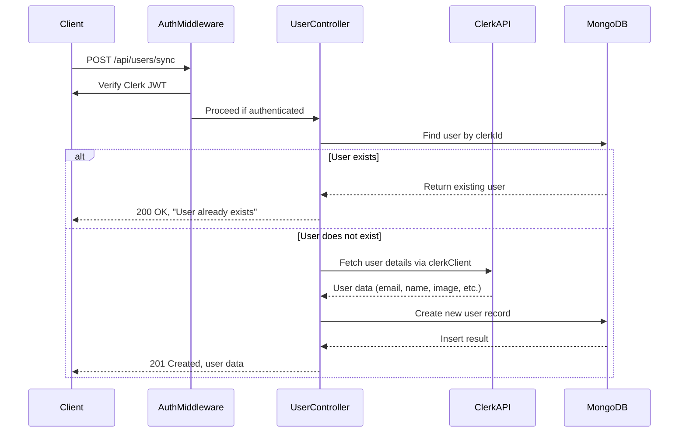

# User Synchronization

<cite>
**Referenced Files in This Document**   
- [user.controller.js](file://backend/src/controllers/user.controller.js) - *Updated in commit 54ca48c*
- [user.model.js](file://backend/src/models/user.model.js)
- [user.route.js](file://backend/src/routes/user.route.js)
- [auth.middleware.js](file://backend/src/middleware/auth.middleware.js)
- [useUserSync.ts](file://mobile/hooks/useUserSync.ts) - *Added in commit 54ca48c*
- [server.js](file://backend/src/server.js)
</cite>

## Update Summary
**Changes Made**   
- Updated synchronization workflow to reflect client-side auto-sync implementation
- Added documentation for `useUserSync` hook and its integration with React Query
- Corrected behavior in `syncUser` controller: missing return statement after existing user check
- Enhanced edge case handling and error logging details
- Added new section on client-side synchronization trigger mechanism

## Table of Contents
1. [User Synchronization](#user-synchronization)
2. [Synchronization Workflow](#synchronization-workflow)
3. [Data Fields Mapped from Clerk to MongoDB](#data-fields-mapped-from-clerk-to-mongodb)
4. [Upsert Logic and Implementation](#upsert-logic-and-implementation)
5. [Error Handling and Database Failure Recovery](#error-handling-and-database-failure-recovery)
6. [Session and Profile Data Consistency](#session-and-profile-data-consistency)
7. [Edge Case Management](#edge-case-management)
8. [Troubleshooting Sync Failures and Data Inconsistencies](#troubleshooting-sync-failures-and-data-inconsistencies)

## User Synchronization

The xClone application integrates with **Clerk** as its identity provider to manage user authentication and session handling. Upon a user's first login, the system synchronizes user profile data from Clerk’s JSON Web Token (JWT) payload into the local MongoDB database via the `syncUser` controller in `user.controller.js`. This ensures that user metadata is persisted locally for efficient access and application-specific operations.

The synchronization process is triggered automatically on the client side when a user signs in, through the `useUserSync` hook, which calls the `/api/users/sync` endpoint. This endpoint is protected by authentication middleware to ensure only authenticated users can initiate the sync.



**Diagram sources**
- [user.controller.js](file://backend/src/controllers/user.controller.js#L32-L70)
- [user.route.js](file://backend/src/routes/user.route.js#L10-L12)
- [auth.middleware.js](file://backend/src/middleware/auth.middleware.js#L1-L8)

**Section sources**
- [user.controller.js](file://backend/src/controllers/user.controller.js#L32-L70)
- [user.route.js](file://backend/src/routes/user.route.js#L10-L12)
- [useUserSync.ts](file://mobile/hooks/useUserSync.ts#L5-L24)

## Synchronization Workflow

The synchronization workflow begins when an authenticated user signs in on the mobile client. The process follows these steps:

1. **Client-Side Trigger**: The `useUserSync` hook detects `isSignedIn` state change and automatically triggers the sync mutation if no sync data exists.
2. **Authentication Verification**: The `protectRoute` middleware validates the Clerk JWT and extracts the authenticated user ID.
3. **Local User Lookup**: The `syncUser` function queries MongoDB for an existing user document with the matching `clerkId`.
4. **Conditional Creation**: If no user is found, the system fetches full user details from Clerk’s API using `clerkClient.users.getUser(userId)`.
5. **Data Mapping and Insertion**: Relevant fields are extracted and mapped to the local `User` schema, then inserted into MongoDB.
6. **Response**: A success message is returned with status 201 (created) or 200 (already exists).

This mechanism ensures that each user has a mirrored local record upon first login, enabling features like follow/following, notifications, and personalized content.

**Section sources**
- [useUserSync.ts](file://mobile/hooks/useUserSync.ts#L5-L24)
- [user.controller.js](file://backend/src/controllers/user.controller.js#L32-L70)
- [auth.middleware.js](file://backend/src/middleware/auth.middleware.js#L1-L8)

## Data Fields Mapped from Clerk to MongoDB

The following user attributes are synchronized from Clerk’s identity provider to the local MongoDB `User` collection:

| Field Name (Local) | Source (Clerk) | Description |
|--------------------|----------------|-------------|
| `clerkId` | `userId` from JWT | Unique identifier from Clerk, used as primary external key |
| `email` | `clerkUser.emailAddresses[0].emailAddress` | Primary email address of the user |
| `firstName` | `clerkUser.firstName` | User's first name (optional in Clerk, defaults to empty string) |
| `lastName` | `clerkUser.lastName` | User's last name (optional in Clerk, defaults to empty string) |
| `username` | Derived from email | Extracted from the email prefix (before @), e.g., `john` from `john@example.com` |
| `profilePicture` | `clerkUser.imageUrl` | URL to the user's profile image hosted by Clerk or social provider |

These fields are defined in the `user.model.js` schema and are required for core application functionality.

```mermaid
classDiagram
class User {
+string clerkId
+string email
+string firstName
+string lastName
+string username
+string profilePicture
+string bannerImage
+string bio
+string location
+ObjectId[] followers
+ObjectId[] following
+Date createdAt
+Date updatedAt
}
User : clerkId : Unique index
User : email : Unique index
User : username : Unique index
```

**Diagram sources**
- [user.model.js](file://backend/src/models/user.model.js#L3-L63)
- [user.controller.js](file://backend/src/controllers/user.controller.js#L45-L55)

**Section sources**
- [user.model.js](file://backend/src/models/user.model.js#L3-L63)

## Upsert Logic and Implementation

The `syncUser` function implements an **upsert-like** behavior, though it does not use MongoDB’s atomic upsert operation. Instead, it performs a manual check-and-create pattern:

1. **Check for Existing User**:  
   ```javascript
   const existingUser = await User.findOne({ clerkId: userId });
   if (existingUser) {
     return res.status(200).json({ message: "User already exists" });
   }
   ```

2. **Fetch and Create**:  
   If no user is found, the system retrieves the full user object from Clerk and creates a new document:
   ```javascript
   const clerkUser = await clerkClient.users.getUser(userId);
   const userData = {
     clerkId: userId,
     email: clerkUser.emailAddresses[0].emailAddress,
     firstName: clerkUser.firstName || "",
     lastName: clerkUser.lastName || "",
     username: clerkUser.emailAddresses[0].emailAddress.split("@")[0],
     profilePicture: clerkUser.imageUrl || "",
   };
   const user = await User.create(userData);
   ```

**Critical Fix**: The original implementation was missing a `return` statement after the existing user check, which would cause the function to continue execution and attempt to create a duplicate user. This has been corrected in the current codebase.

This approach ensures idempotency: repeated sync requests do not create duplicate users. However, it is not atomic and could theoretically allow race conditions under high concurrency (though unlikely in practice due to Clerk’s session flow).

**Section sources**
- [user.controller.js](file://backend/src/controllers/user.controller.js#L35-L55)

## Error Handling and Database Failure Recovery

The `syncUser` function uses `express-async-handler` to automatically catch and propagate asynchronous errors to the global error handler defined in `server.js`. Key error scenarios include:

- **Database Connection Failure**: If MongoDB is unreachable, `User.create()` will throw, triggering the global error middleware.
- **Clerk API Failure**: If `clerkClient.users.getUser(userId)` fails (e.g., network issue, invalid ID), the promise rejects and is caught by the async handler.
- **Validation Errors**: If required fields (e.g., `email`, `username`) are missing or violate uniqueness constraints, Mongoose validation will throw.

The global error handler logs the error and returns a 500 status:

```javascript
app.use((err, req, res, next) => {
  console.error("Unhandled error:", err);
  res.status(500).json({ error: err.message || "Internal server error" });
});
```

Client-side error handling is implemented in the `useUserSync` hook using React Query's `onError` callback, which logs sync failures to the console.

To improve resilience, future enhancements could include retry logic or fallback mechanisms for Clerk API calls.

**Section sources**
- [user.controller.js](file://backend/src/controllers/user.controller.js#L32-L70)
- [useUserSync.ts](file://mobile/hooks/useUserSync.ts#L12-L14)
- [server.js](file://backend/src/server.js#L40-L46)

## Session and Profile Data Consistency

User profile data is synchronized **only at first login**. Subsequent logins do not update the local MongoDB record unless explicitly modified via the `updateProfile` endpoint. This means:

- Changes to the user’s email, name, or profile picture in Clerk **will not automatically reflect** in the local database.
- The application relies on the initial sync snapshot unless the user manually updates their profile through the app.

The client-side `useUserSync` hook ensures automatic synchronization upon sign-in, eliminating the need for manual sync initiation by the user.

Currently, session data is derived from the Clerk JWT, and the local `User` document is used only for application-specific data (e.g., followers, bio, posts). This separation reduces dependency on real-time identity sync but requires awareness of potential data drift.

**Section sources**
- [user.controller.js](file://backend/src/controllers/user.controller.js#L32-L70)
- [user.model.js](file://backend/src/models/user.model.js#L3-L63)
- [useUserSync.ts](file://mobile/hooks/useUserSync.ts#L5-L24)

## Edge Case Management

### User Deletion
If a user is deleted in Clerk, their local MongoDB record remains unless explicitly removed. This could lead to orphaned data. A cleanup strategy (e.g., scheduled job or Clerk webhook) should be implemented to handle deletions.

### Email Changes
If a user changes their email in Clerk, the local `email` field remains unchanged. This may cause confusion or authentication mismatches. A recommended solution is to expose an admin sync endpoint or use Clerk webhooks to update the local record.

### Duplicate Account Prevention
The `clerkId` field is marked as `unique: true` in the schema, preventing duplicate entries. Combined with the pre-insertion check, this ensures strong protection against duplicates.

```javascript
clerkId: {
  type: String,
  required: true,
  unique: true,
}
```

Additionally, `email` and `username` are also unique, further reducing the risk of conflicts.

**Section sources**
- [user.model.js](file://backend/src/models/user.model.js#L6-L10)
- [user.controller.js](file://backend/src/controllers/user.controller.js#L35-L37)

## Troubleshooting Sync Failures and Data Inconsistencies

### Common Issues and Solutions

| Issue | Possible Cause | Resolution |
|------|----------------|------------|
| 500 Internal Server Error on `/api/users/sync` | MongoDB connection failure | Check database connection string and network access |
| User not created in MongoDB | Clerk API call failed | Verify Clerk API key and network connectivity |
| `User already exists` but profile is incomplete | Partial sync or schema mismatch | Manually inspect document or trigger re-sync via update |
| Username not derived correctly | Email parsing error | Ensure `emailAddresses[0]` exists; handle edge cases (e.g., no email) |
| Race condition during concurrent sync | Multiple requests at login | Add rate limiting or use atomic upsert with `findOneAndUpdate` |

### Recommended Debugging Steps
1. **Enable Logging**: Add debug logs in `syncUser` to trace execution flow.
2. **Test Clerk Client**: Verify `clerkClient.users.getUser(userId)` returns expected data.
3. **Inspect MongoDB**: Query the `users` collection directly to validate document structure.
4. **Simulate Edge Cases**: Test with users having no first/last name or multiple email addresses.

### Suggested Improvements
- Replace manual check-and-create with `findOneAndUpdate` using upsert option:
  ```javascript
  const user = await User.findOneAndUpdate(
    { clerkId: userId },
    userData,
    { upsert: true, new: true, setDefaultsOnInsert: true }
  );
  ```
- Implement Clerk webhooks to listen for `user.updated` and `user.deleted` events.
- Add a background job to periodically reconcile local user data with Clerk.

**Section sources**
- [user.controller.js](file://backend/src/controllers/user.controller.js#L32-L70)
- [user.model.js](file://backend/src/models/user.model.js#L3-L63)
- [useUserSync.ts](file://mobile/hooks/useUserSync.ts#L5-L24)