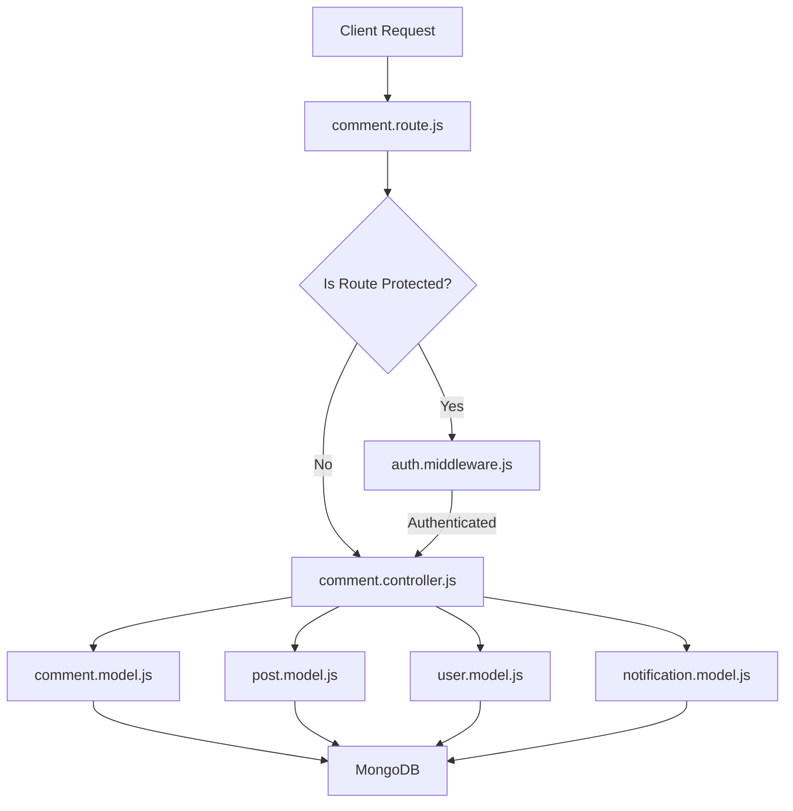
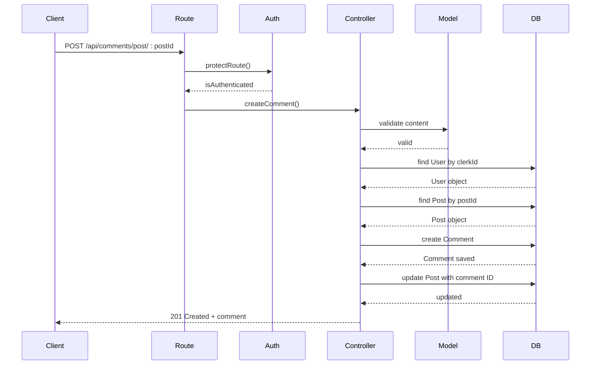
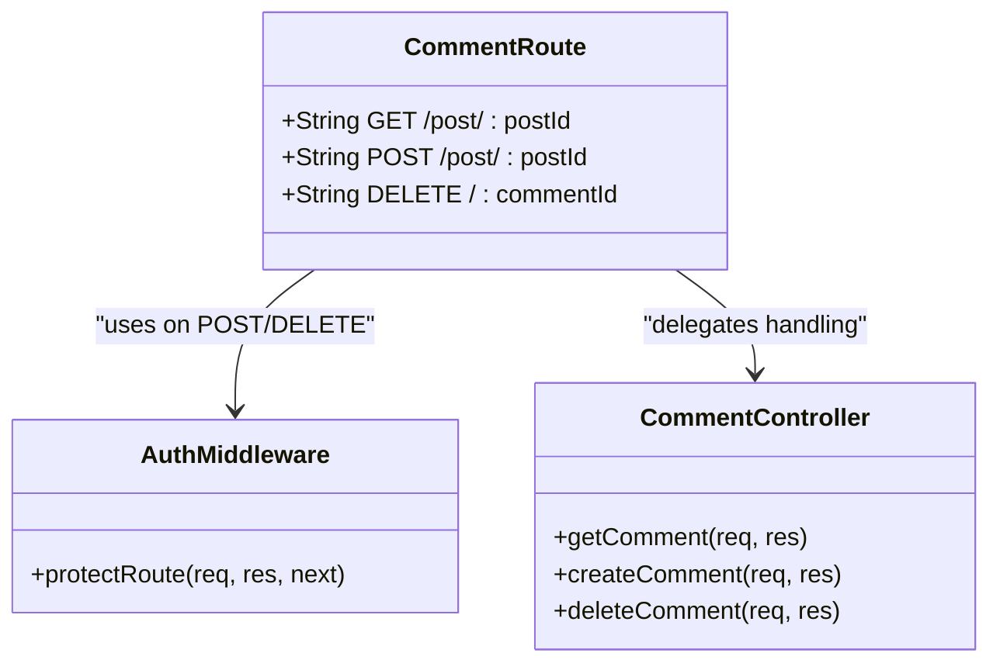
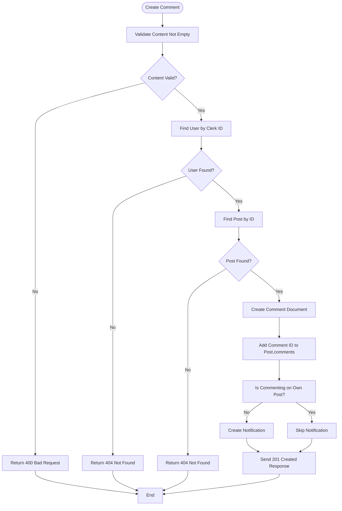
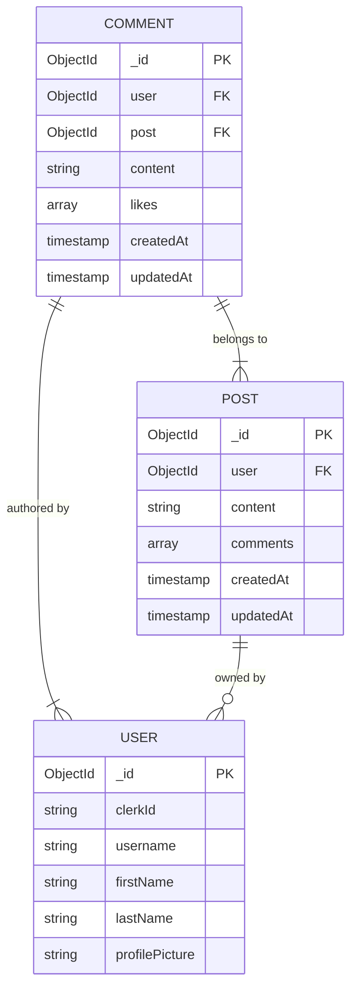
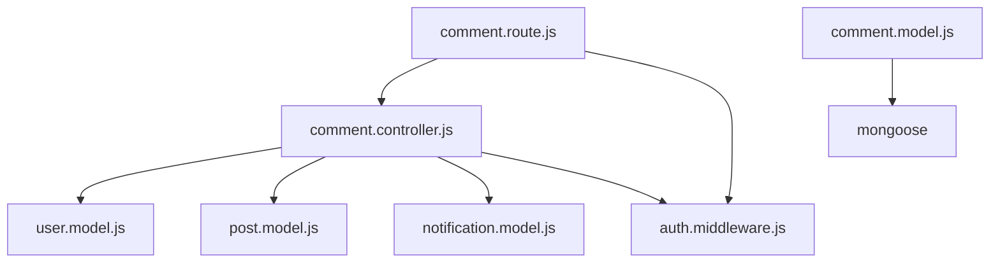

# Comment API Endpoints

<cite>
**Referenced Files in This Document**   
- [comment.route.js](file://backend/src/routes/comment.route.js#L1-L15)
- [comment.controller.js](file://backend/src/controllers/comment.controller.js#L1-L83)
- [comment.model.js](file://backend/src/models/comment.model.js#L1-L32)
- [auth.middleware.js](file://backend/src/middleware/auth.middleware.js#L1-L8)
- [arcjet.middleware.js](file://backend/src/middleware/arcjet.middleware.js)
</cite>

## Table of Contents
1. [Introduction](#introduction)
2. [Project Structure](#project-structure)
3. [Core Components](#core-components)
4. [Architecture Overview](#architecture-overview)
5. [Detailed Component Analysis](#detailed-component-analysis)
6. [Dependency Analysis](#dependency-analysis)
7. [Performance Considerations](#performance-considerations)
8. [Troubleshooting Guide](#troubleshooting-guide)
9. [Conclusion](#conclusion)

## Introduction
This document provides comprehensive documentation for the comment functionality in xClone, a social media application. It details all available API endpoints for creating, retrieving, updating, and deleting comments. The system uses Clerk for authentication via JWT tokens, enforces ownership-based authorization, and integrates with Arcjet for rate limiting. This guide covers request/response formats, validation rules, error handling, and integration with related models such as posts and users.

## Project Structure
The comment functionality is implemented within the backend/src directory of the xClone project. The modular structure separates concerns across routes, controllers, models, and middleware. The key components are organized as follows:
- **routes/comment.route.js**: Defines API endpoints and applies middleware
- **controllers/comment.controller.js**: Contains business logic for comment operations
- **models/comment.model.js**: Defines the MongoDB schema for comments
- **middleware/auth.middleware.js**: Handles authentication checks
- **middleware/arcjet.middleware.js**: Implements rate limiting (not fully shown)

**Diagram sources**
- [comment.route.js](file://backend/src/routes/comment.route.js#L1-L15)
- [comment.controller.js](file://backend/src/controllers/comment.controller.js#L1-L83)
- [comment.model.js](file://backend/src/models/comment.model.js#L1-L32)
- [auth.middleware.js](file://backend/src/middleware/auth.middleware.js#L1-L8)

**Section sources**
- [comment.route.js](file://backend/src/routes/comment.route.js#L1-L15)
- [comment.controller.js](file://backend/src/controllers/comment.controller.js#L1-L83)

## Core Components
The core components of the comment system include the route definitions, controller logic, data model, and authentication middleware. These components work together to provide secure and scalable comment management. The system ensures that only authenticated users can create or delete comments and that users can only modify their own comments.

**Section sources**
- [comment.route.js](file://backend/src/routes/comment.route.js#L1-L15)
- [comment.controller.js](file://backend/src/controllers/comment.controller.js#L1-L83)
- [comment.model.js](file://backend/src/models/comment.model.js#L1-L32)

## Architecture Overview
The comment API follows a RESTful architecture with clear separation between routing, business logic, and data access layers. Authentication is handled via Clerk's JWT integration, and authorization is enforced in the controller layer based on user ownership. Comments are linked to posts and users through MongoDB references, enabling efficient querying and relationship management.

**Diagram sources**
- [comment.route.js](file://backend/src/routes/comment.route.js#L1-L15)
- [comment.controller.js](file://backend/src/controllers/comment.controller.js#L1-L83)
- [comment.model.js](file://backend/src/models/comment.model.js#L1-L32)

## Detailed Component Analysis

### Comment Route Handler Analysis
The comment.route.js file defines three main endpoints: retrieving comments by post, creating a new comment, and deleting a comment. Public routes allow anyone to view comments, while protected routes require authentication using the protectRoute middleware.

**Diagram sources**
- [comment.route.js](file://backend/src/routes/comment.route.js#L1-L15)

**Section sources**
- [comment.route.js](file://backend/src/routes/comment.route.js#L1-L15)

### Comment Controller Logic Analysis
The comment.controller.js file contains the core business logic for comment operations. It handles input validation, database interactions, and notification creation. The controller uses express-async-handler for error handling and integrates with Clerk for authentication.

#### Key Functions:
- **getComment**: Retrieves all comments for a given post, sorted by creation date (newest first), and populates user information.
- **createComment**: Validates input, checks user/post existence, creates a comment, links it to the post, and generates a notification if commenting on someone else's post.
- **deleteComment**: Verifies ownership before deletion, removes the comment reference from the parent post, and deletes the comment document.

**Diagram sources**
- [comment.controller.js](file://backend/src/controllers/comment.controller.js#L1-L83)

**Section sources**
- [comment.controller.js](file://backend/src/controllers/comment.controller.js#L1-L83)

### Comment Data Model Analysis
The comment.model.js file defines the MongoDB schema for comments using Mongoose. Each comment references a user and a post, contains text content with a 280-character limit, and maintains an array of likes (user IDs). Timestamps are automatically added for createdAt and updatedAt fields.

**Diagram sources**
- [comment.model.js](file://backend/src/models/comment.model.js#L1-L32)

**Section sources**
- [comment.model.js](file://backend/src/models/comment.model.js#L1-L32)

## Dependency Analysis
The comment system depends on several other components within the application. It imports models for User, Post, and Notification to establish relationships and maintain data integrity. The auth.middleware.js is used to protect write operations, ensuring only authenticated users can create or delete comments. Although arcjet.middleware.js is present in the project, its usage in comment routes is not evident from the provided code.

**Diagram sources**
- [comment.controller.js](file://backend/src/controllers/comment.controller.js#L1-L83)
- [comment.route.js](file://backend/src/routes/comment.route.js#L1-L15)
- [comment.model.js](file://backend/src/models/comment.model.js#L1-L32)

**Section sources**
- [comment.controller.js](file://backend/src/controllers/comment.controller.js#L1-L83)
- [comment.route.js](file://backend/src/routes/comment.route.js#L1-L15)

## Performance Considerations
The comment retrieval operation uses sorting by createdAt in descending order, which should be optimized with an index on the createdAt field in the Comment collection. The populate operation for user fields may benefit from indexing on the user field. For high-traffic scenarios, consider implementing pagination for comment lists to avoid large payloads. The current implementation lacks rate limiting on comment creation despite the presence of arcjet.middleware.js, which could lead to abuse without proper configuration.

## Troubleshooting Guide
Common issues and their solutions:

- **400 Bad Request - "Comment cannot be empty"**: Ensure the request body includes a non-empty "content" field.
- **401 Unauthorized - "You must be logged in"**: Include valid Clerk JWT token in the request (handled automatically by Clerk).
- **403 Forbidden - "You can only delete your own comments"**: Users can only delete comments they authored; verify the correct user is making the request.
- **404 Not Found - "user or post not found"**: Verify that the userId (from Clerk) and postId exist in the database.
- **Comment not appearing on post**: Ensure the comment creation response was successful and check that the post document was updated with the new comment ID.

**Section sources**
- [comment.controller.js](file://backend/src/controllers/comment.controller.js#L1-L83)
- [auth.middleware.js](file://backend/src/middleware/auth.middleware.js#L1-L8)

## Conclusion
The comment API in xClone provides a robust foundation for user interaction through comments. It properly enforces authentication and authorization, maintains referential integrity between comments, posts, and users, and supports notification generation for engagement. To enhance the system, consider adding PUT /api/comments/:id for comment editing, implementing rate limiting via Arcjet, and adding support for comment threading or replies. The current architecture is well-structured and scalable for future enhancements.