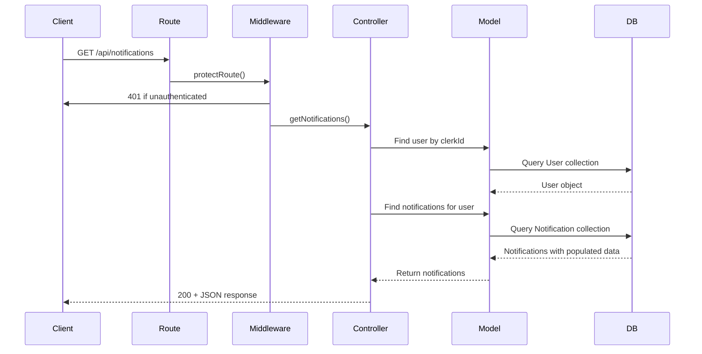
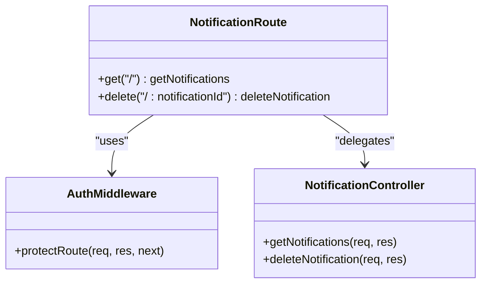
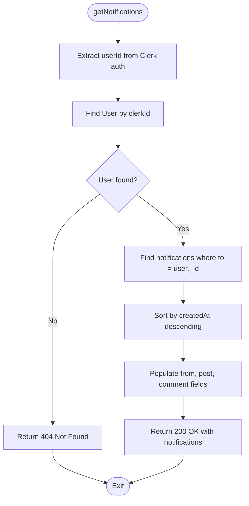
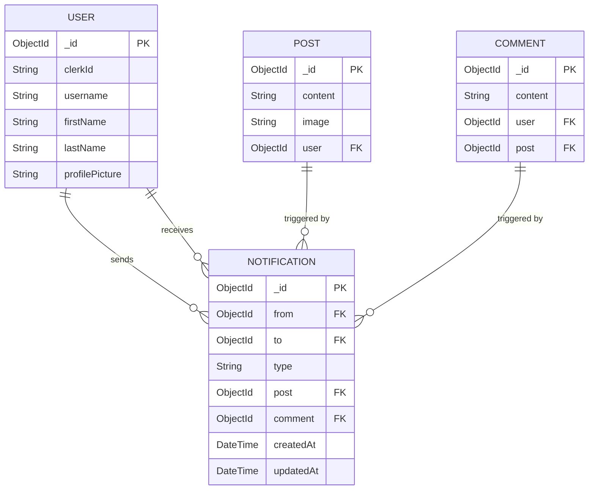
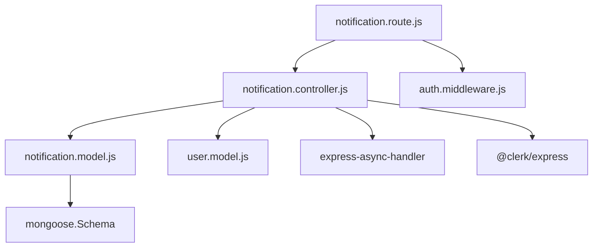

# Notification API Endpoints

<cite>
**Referenced Files in This Document**   
- [notification.route.js](file://backend/src/routes/notification.route.js)
- [notification.controller.js](file://backend/src/controllers/notification.controller.js)
- [notification.model.js](file://backend/src/models/notification.model.js)
- [auth.middleware.js](file://backend/src/middleware/auth.middleware.js)
- [post.route.js](file://backend/src/routes/post.route.js)
</cite>

## Table of Contents
1. [Introduction](#introduction)
2. [Project Structure](#project-structure)
3. [Core Components](#core-components)
4. [Architecture Overview](#architecture-overview)
5. [Detailed Component Analysis](#detailed-component-analysis)
6. [Dependency Analysis](#dependency-analysis)
7. [Performance Considerations](#performance-considerations)
8. [Troubleshooting Guide](#troubleshooting-guide)
9. [Conclusion](#conclusion)

## Introduction
This document provides comprehensive documentation for the Notification API endpoints in xClone, a social media application. The API enables users to retrieve and manage their notifications, including actions such as likes, comments, and follows. All endpoints are secured using Clerk-based JWT authentication and enforce strict authorization rules to ensure users can only access their own notifications. This documentation covers route definitions, controller logic, data models, middleware usage, request/response schemas, error handling, and integration with other system components.

## Project Structure
The xClone backend is organized using a modular structure based on functional components. Key directories include `controllers`, `models`, `routes`, and `middleware`. The notification system is implemented across these layers:
- **routes**: Defines HTTP routes and applies middleware
- **controllers**: Contains business logic for handling requests
- **models**: Defines MongoDB schema for data persistence
- **middleware**: Handles authentication and authorization

```mermaid
graph TB
subgraph "Routes"
NR[notification.route.js]
end
subgraph "Controllers"
NC[notification.controller.js]
end
subgraph "Models"
NM[notification.model.js]
end
subgraph "Middleware"
AM[auth.middleware.js]
end
NR --> NC : "Handles /api/notifications"
NC --> NM : "Uses Notification model"
NR --> AM : "Applies protectRoute"
NC --> |"Queries User model"| UM["user.model.js"]
```

**Diagram sources**
- [notification.route.js](file://backend/src/routes/notification.route.js#L1-L10)
- [notification.controller.js](file://backend/src/controllers/notification.controller.js#L1-L36)
- [notification.model.js](file://backend/src/models/notification.model.js#L1-L36)
- [auth.middleware.js](file://backend/src/middleware/auth.middleware.js#L1-L8)

**Section sources**
- [notification.route.js](file://backend/src/routes/notification.route.js#L1-L10)
- [notification.controller.js](file://backend/src/controllers/notification.controller.js#L1-L36)
- [notification.model.js](file://backend/src/models/notification.model.js#L1-L36)

## Core Components
The core components of the Notification API include:
- **Notification Routes**: Define accessible endpoints
- **Notification Controller**: Implements request handling logic
- **Notification Model**: Specifies data structure and relationships
- **Auth Middleware**: Ensures secure access control

These components work together to provide a secure, scalable notification system that integrates with user, post, and comment actions.

**Section sources**
- [notification.route.js](file://backend/src/routes/notification.route.js#L1-L10)
- [notification.controller.js](file://backend/src/controllers/notification.controller.js#L1-L36)
- [notification.model.js](file://backend/src/models/notification.model.js#L1-L36)
- [auth.middleware.js](file://backend/src/middleware/auth.middleware.js#L1-L8)

## Architecture Overview
The Notification API follows a RESTful architecture pattern with clear separation of concerns between routing, business logic, and data modeling. Authentication is handled via Clerk's JWT integration, ensuring secure access to user-specific resources.



**Diagram sources**
- [notification.route.js](file://backend/src/routes/notification.route.js#L5-L8)
- [auth.middleware.js](file://backend/src/middleware/auth.middleware.js#L1-L8)
- [notification.controller.js](file://backend/src/controllers/notification.controller.js#L6-L20)

## Detailed Component Analysis

### Notification Routes Analysis
The notification routes define two primary endpoints:
- `GET /api/notifications`: Retrieves all notifications for the authenticated user
- `DELETE /api/notifications/:notificationId`: Removes a specific notification

Both routes use the `protectRoute` middleware to enforce authentication.



**Diagram sources**
- [notification.route.js](file://backend/src/routes/notification.route.js#L1-L10)

**Section sources**
- [notification.route.js](file://backend/src/routes/notification.route.js#L1-L10)

### Notification Controller Analysis
The controller handles business logic for notification operations. It verifies user identity using Clerk's authentication context and ensures users can only access their own notifications.



**Diagram sources**
- [notification.controller.js](file://backend/src/controllers/notification.controller.js#L6-L20)

**Section sources**
- [notification.controller.js](file://backend/src/controllers/notification.controller.js#L6-L20)

### Notification Model Analysis
The Notification model defines the schema for storing user notifications with references to related entities.



**Diagram sources**
- [notification.model.js](file://backend/src/models/notification.model.js#L3-L36)

**Section sources**
- [notification.model.js](file://backend/src/models/notification.model.js#L3-L36)

## Dependency Analysis
The notification system depends on several core components:



Key dependencies:
- **Mongoose**: For MongoDB schema definition and querying
- **express-async-handler**: For error handling in async controllers
- **@clerk/express**: For JWT-based authentication
- **User Model**: For user lookup by Clerk ID
- **Post & Comment Models**: For population of related content

**Diagram sources**
- [notification.route.js](file://backend/src/routes/notification.route.js#L1-L10)
- [notification.controller.js](file://backend/src/controllers/notification.controller.js#L1-L36)
- [notification.model.js](file://backend/src/models/notification.model.js#L1-L36)

**Section sources**
- [notification.route.js](file://backend/src/routes/notification.route.js#L1-L10)
- [notification.controller.js](file://backend/src/controllers/notification.controller.js#L1-L36)
- [notification.model.js](file://backend/src/models/notification.model.js#L1-L36)

## Performance Considerations
The notification system includes several performance considerations:
- **Indexing**: Ensure indexes on `to`, `from`, and `createdAt` fields in the Notification collection
- **Population**: Use selective population of referenced fields to minimize data transfer
- **Sorting**: Results are sorted by `createdAt` in descending order for chronological display
- **Query Optimization**: The `find` operation includes both user ID and notification ID filters to ensure efficient lookups
- **Error Handling**: Uses `express-async-handler` to prevent unhandled promise rejections

While the current implementation does not include pagination, adding limit/offset or cursor-based pagination would improve scalability for users with large notification volumes.

## Troubleshooting Guide
Common issues and solutions:

**401 Unauthorized Errors**
- Cause: Missing or invalid JWT token
- Solution: Ensure client includes valid Clerk session token in request

**404 User Not Found**
- Cause: Clerk user ID doesn't match any record in User collection
- Solution: Verify user registration flow properly creates User documents

**404 Notification Not Found**
- Cause: Invalid notification ID or user attempting to access another user's notification
- Solution: Validate notification ID exists and belongs to the authenticated user

**Population Issues**
- Cause: Referenced posts or comments have been deleted
- Solution: Implement cleanup logic to remove orphaned notifications or handle null references gracefully

**Section sources**
- [notification.controller.js](file://backend/src/controllers/notification.controller.js#L6-L36)
- [auth.middleware.js](file://backend/src/middleware/auth.middleware.js#L1-L8)

## Conclusion
The Notification API in xClone provides a secure, efficient way for users to manage their social interactions. By leveraging Clerk for authentication and Mongoose for data modeling, the system ensures proper authorization and data integrity. The current implementation supports retrieving and deleting notifications, with future potential for adding features like marking as read, pagination, and real-time updates. The clean separation of routes, controllers, and models makes the system maintainable and extensible.