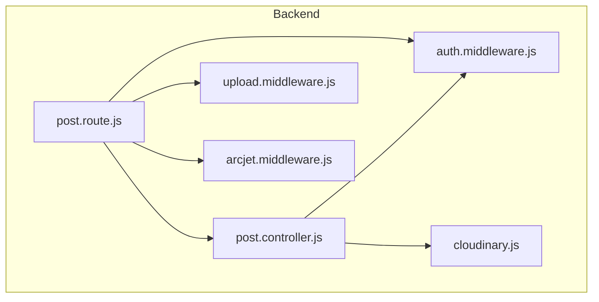
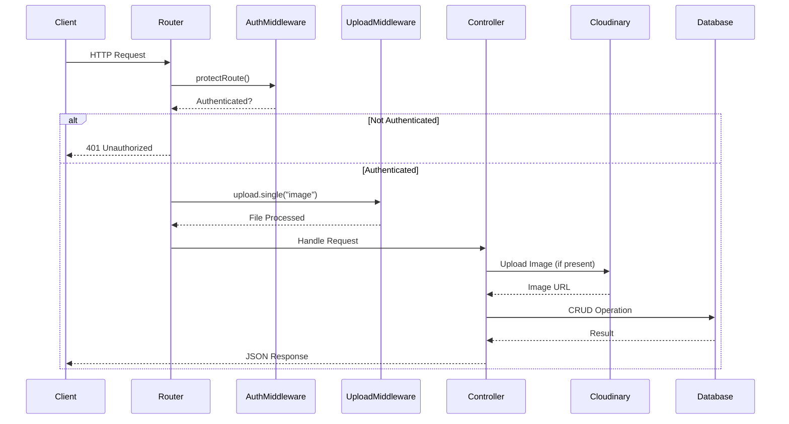
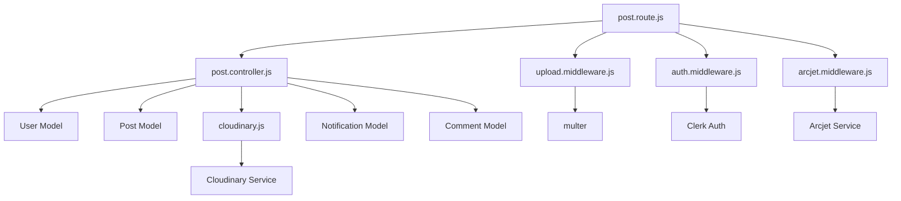

# Post API Endpoints

<cite>
**Referenced Files in This Document**   
- [post.route.js](file://backend/src/routes/post.route.js#L1-L21)
- [post.controller.js](file://backend/src/controllers/post.controller.js#L1-L158)
- [auth.middleware.js](file://backend/src/middleware/auth.middleware.js#L1-L8)
- [upload.middleware.js](file://backend/src/middleware/upload.middleware.js#L1-L21)
- [cloudinary.js](file://backend/src/config/cloudinary.js#L1-L10)
- [arcjet.middleware.js](file://backend/src/middleware/arcjet.middleware.js#L1-L45)
</cite>

## Table of Contents
1. [Introduction](#introduction)
2. [Project Structure](#project-structure)
3. [Core Components](#core-components)
4. [Architecture Overview](#architecture-overview)
5. [Detailed Component Analysis](#detailed-component-analysis)
6. [Dependency Analysis](#dependency-analysis)
7. [Performance Considerations](#performance-considerations)
8. [Troubleshooting Guide](#troubleshooting-guide)
9. [Conclusion](#conclusion)

## Introduction
This document provides comprehensive documentation for the Post Management API endpoints in the xClone application. These endpoints allow users to create, retrieve, update, and delete posts, with support for text content and image uploads. The system integrates authentication via Clerk JWT, image processing through Cloudinary, and rate limiting via Arcjet. This guide details all available routes, request/response schemas, security mechanisms, and usage examples.

## Project Structure
The xClone project is structured into two main directories: `backend` and `mobile`. The backend implements a Node.js/Express server with a modular architecture, separating concerns into config, controllers, middleware, models, and routes. The post management functionality resides in the backend under `src/routes/post.route.js`, which defines the API endpoints and chains relevant middleware and controller functions.



**Diagram sources**
- [post.route.js](file://backend/src/routes/post.route.js#L1-L21)
- [post.controller.js](file://backend/src/controllers/post.controller.js#L1-L158)
- [auth.middleware.js](file://backend/src/middleware/auth.middleware.js#L1-L8)
- [upload.middleware.js](file://backend/src/middleware/upload.middleware.js#L1-L21)
- [cloudinary.js](file://backend/src/config/cloudinary.js#L1-L10)
- [arcjet.middleware.js](file://backend/src/middleware/arcjet.middleware.js#L1-L45)

**Section sources**
- [post.route.js](file://backend/src/routes/post.route.js#L1-L21)

## Core Components
The core components of the Post API include route definitions, controller logic, authentication middleware, file upload handling, and cloud storage integration. These components work together to provide secure, scalable post management functionality with rich media support.

**Section sources**
- [post.route.js](file://backend/src/routes/post.route.js#L1-L21)
- [post.controller.js](file://backend/src/controllers/post.controller.js#L1-L158)

## Architecture Overview
The Post API follows a RESTful architecture with Express.js routing, where incoming HTTP requests are processed through a chain of middleware before reaching controller functions that interact with MongoDB models. The architecture enforces authentication, validates inputs, processes file uploads, and handles errors systematically.



**Diagram sources**
- [post.route.js](file://backend/src/routes/post.route.js#L1-L21)
- [auth.middleware.js](file://backend/src/middleware/auth.middleware.js#L1-L8)
- [upload.middleware.js](file://backend/src/middleware/upload.middleware.js#L1-L21)
- [post.controller.js](file://backend/src/controllers/post.controller.js#L1-L158)
- [cloudinary.js](file://backend/src/config/cloudinary.js#L1-L10)

## Detailed Component Analysis

### Create Post Endpoint (POST /api/posts)
Handles creation of new posts with optional text content and image uploads.

#### Request Flow
```mermaid
flowchart TD
A["POST /api/posts"] --> B[auth.middleware: protectRoute]
B --> C{Authenticated?}
C --> |No| D[401 Unauthorized]
C --> |Yes| E[upload.middleware: multer.single("image")]
E --> F{Has Content or Image?}
F --> |No| G[400 Bad Request]
F --> |Yes| H[post.controller: createPosts]
H --> I{Image Provided?}
I --> |Yes| J[Convert to Base64]
J --> K[Upload to Cloudinary]
K --> L[Get Secure URL]
L --> M[Create Post in DB]
I --> |No| M
M --> N[201 Created + Post Data]
```

**Diagram sources**
- [post.route.js](file://backend/src/routes/post.route.js#L1-L21)
- [post.controller.js](file://backend/src/controllers/post.controller.js#L58-L105)
- [upload.middleware.js](file://backend/src/middleware/upload.middleware.js#L1-L21)
- [cloudinary.js](file://backend/src/config/cloudinary.js#L1-L10)

**Section sources**
- [post.controller.js](file://backend/src/controllers/post.controller.js#L58-L105)

#### Endpoint Details
**HTTP Method**: POST  
**URL Pattern**: `/api/posts`  
**Authentication**: Required (Clerk JWT via `protectRoute`)  
**Headers**: 
- `Authorization: Bearer <token>`
- `Content-Type: multipart/form-data` (when uploading images)

**Request Body Parameters**:
- `content` (string, optional): Text content of the post
- `image` (file, optional): Image file to upload (JPEG, PNG, GIF, etc.)

**Validation Rules**:
- At least one of `content` or `image` must be provided
- Image file size must not exceed 5MB
- Only image files are accepted
- Content length enforced by MongoDB schema (implied)

**Cloudinary Processing**:
- Images are uploaded to folder: `social_media_posts`
- Transformed to max 800x600 pixels
- Optimized for quality and format automatically

**Success Response (201 Created)**:
```json
{
  "post": {
    "_id": "652f8e8b9c9d7b2f44c8a3d2",
    "user": {
      "username": "johndoe",
      "firstName": "John",
      "lastName": "Doe",
      "profilePicture": "https://example.com/profile.jpg"
    },
    "content": "Hello world!",
    "image": "https://res.cloudinary.com/demo/image/upload/v123456789/social_media_posts/photo.jpg",
    "likes": [],
    "comments": [],
    "createdAt": "2023-10-18T12:34:51.123Z"
  }
}
```

**Error Responses**:
- `400 Bad Request`: No content or image provided
- `400 Bad Request`: Failed to upload image to Cloudinary
- `401 Unauthorized`: Missing or invalid authentication token
- `404 Not Found`: User not found in database

**Sample curl Command**:
```bash
curl -X POST https://xclone.com/api/posts \
  -H "Authorization: Bearer YOUR_JWT_TOKEN" \
  -F "content=My first post!" \
  -F "image=@/path/to/photo.jpg"
```

### Retrieve Posts Endpoints (GET /api/posts and GET /api/posts/:id)
Handles retrieval of posts with pagination and detailed post information.

#### List All Posts (GET /api/posts)
**HTTP Method**: GET  
**URL Pattern**: `/api/posts`  
**Authentication**: Not required (public)  
**Query Parameters**: None explicitly defined (returns all posts sorted by creation date)  
**Response Schema**:
```json
{
  "posts": [
    {
      "_id": "652f8e8b9c9d7b2f44c8a3d2",
      "user": {
        "username": "johndoe",
        "firstName": "John",
        "lastName": "Doe",
        "profilePicture": "https://example.com/profile.jpg"
      },
      "content": "Hello world!",
      "image": "https://res.cloudinary.com/...",
      "likes": [],
      "comments": [
        {
          "_id": "652f8e8b9c9d7b2f44c8a3d3",
          "user": {
            "username": "janedoe",
            "firstName": "Jane",
            "lastName": "Doe",
            "profilePicture": "https://example.com/jane.jpg"
          },
          "text": "Great post!",
          "createdAt": "2023-10-18T12:35:00.000Z"
        }
      ],
      "createdAt": "2023-10-18T12:34:51.123Z"
    }
  ]
}
```
**Status**: 200 OK

**Section sources**
- [post.controller.js](file://backend/src/controllers/post.controller.js#L5-L18)

#### Retrieve Single Post (GET /api/posts/:postId)
**HTTP Method**: GET  
**URL Pattern**: `/api/posts/:postId`  
**Authentication**: Not required (public)  
**Path Parameters**:
- `postId` (string): MongoDB ObjectId of the post

**Success Response (200 OK)**:
```json
{
  "post": {
    "_id": "652f8e8b9c9d7b2f44c8a3d2",
    "user": {
      "username": "johndoe",
      "firstName": "John",
      "lastName": "Doe",
      "profilePicture": "https://example.com/profile.jpg"
    },
    "content": "Hello world!",
    "image": "https://res.cloudinary.com/...",
    "likes": [],
    "comments": [],
    "createdAt": "2023-10-18T12:34:51.123Z"
  }
}
```

**Error Responses**:
- `404 Not Found`: Post with specified ID does not exist

**Sample curl Command**:
```bash
curl https://xclone.com/api/posts/652f8e8b9c9d7b2f44c8a3d2
```

**Section sources**
- [post.controller.js](file://backend/src/controllers/post.controller.js#L20-L33)

### Update Post - Like Functionality (POST /api/posts/:postId/like)
Implements toggle-like functionality for posts.

**HTTP Method**: POST  
**URL Pattern**: `/api/posts/:postId/like`  
**Authentication**: Required  
**Path Parameters**:
- `postId` (string): Target post ID

**Logic**:
- Checks if user already liked the post
- Removes like if present (unlike)
- Adds like if not present
- Creates notification if liking someone else's post

**Success Response (200 OK)**:
```json
{
  "message": "Post liked successfully"
}
```
or
```json
{
  "message": "Post unliked successfully"
}
```

**Error Responses**:
- `404 Not Found`: User or post not found
- `401 Unauthorized`: Invalid credentials

**Section sources**
- [post.controller.js](file://backend/src/controllers/post.controller.js#L107-L140)

### Delete Post Endpoint (DELETE /api/posts/:postId)
Allows users to delete their own posts.

**HTTP Method**: DELETE  
**URL Pattern**: `/api/posts/:postId`  
**Authentication**: Required  
**Authorization Rule**: Users can only delete their own posts  
**Path Parameters**:
- `postId` (string): ID of post to delete

**Deletion Process**:
1. Verify user owns the post
2. Delete all comments associated with the post
3. Remove post from database

**Success Response (200 OK)**:
```json
{
  "message": "Post deleted successfully"
}
```

**Error Responses**:
- `403 Forbidden`: Attempting to delete another user's post
- `404 Not Found`: User or post not found
- `401 Unauthorized`: Missing or invalid token

**Sample curl Command**:
```bash
curl -X DELETE https://xclone.com/api/posts/652f8e8b9c9d7b2f44c8a3d2 \
  -H "Authorization: Bearer YOUR_JWT_TOKEN"
```

**Section sources**
- [post.controller.js](file://backend/src/controllers/post.controller.js#L142-L158)

## Dependency Analysis
The Post API components have well-defined dependencies that enable modular functionality while maintaining security and performance.



**Diagram sources**
- [post.route.js](file://backend/src/routes/post.route.js#L1-L21)
- [post.controller.js](file://backend/src/controllers/post.controller.js#L1-L158)
- [auth.middleware.js](file://backend/src/middleware/auth.middleware.js#L1-L8)
- [upload.middleware.js](file://backend/src/middleware/upload.middleware.js#L1-L21)
- [cloudinary.js](file://backend/src/config/cloudinary.js#L1-L10)
- [arcjet.middleware.js](file://backend/src/middleware/arcjet.middleware.js#L1-L45)

**Section sources**
- [post.route.js](file://backend/src/routes/post.route.js#L1-L21)
- [post.controller.js](file://backend/src/controllers/post.controller.js#L1-L158)

## Performance Considerations
The Post API includes several performance and security optimizations:

- **Rate Limiting**: Arcjet middleware enforces rate limits on all endpoints to prevent abuse
- **Image Optimization**: Cloudinary automatically optimizes images for web delivery
- **Database Indexing**: Implied by MongoDB usage, though not explicitly shown in code
- **Memory Storage**: Multer uses memory storage for file uploads, avoiding disk I/O
- **Error Resilience**: Arcjet errors fail open to prevent service disruption
- **Efficient Queries**: Population of user and comment data is handled in single queries

The 5MB file size limit prevents excessive memory usage during upload processing, and the base64 conversion for Cloudinary uploads is handled efficiently in memory.

## Troubleshooting Guide
Common issues and their solutions:

**Issue**: 400 Bad Request - "Please provide content or image"  
**Cause**: Request lacks both content and image  
**Solution**: Include at least one of `content` or `image` in request

**Issue**: 400 Bad Request - "Failed to upload image"  
**Cause**: Cloudinary upload failure or non-image file  
**Solution**: Verify image format and check Cloudinary credentials

**Issue**: 401 Unauthorized - "Unauthorized-you must be logged in"  
**Cause**: Missing or invalid JWT token  
**Solution**: Ensure valid Clerk JWT is included in Authorization header

**Issue**: 403 Forbidden - "You can only delete your own posts"  
**Cause**: User attempting to delete another user's post  
**Solution**: Only allow post owners to delete their content

**Issue**: 429 Too Many Requests  
**Cause**: Rate limit exceeded via Arcjet  
**Solution**: Implement retry logic with exponential backoff

**Issue**: Image upload fails with "Only image files are allowed"  
**Cause**: File type not recognized as image  
**Solution**: Ensure file has proper image MIME type

**Section sources**
- [post.controller.js](file://backend/src/controllers/post.controller.js#L1-L158)
- [upload.middleware.js](file://backend/src/middleware/upload.middleware.js#L1-L21)
- [auth.middleware.js](file://backend/src/middleware/auth.middleware.js#L1-L8)
- [arcjet.middleware.js](file://backend/src/middleware/arcjet.middleware.js#L1-L45)

## Conclusion
The Post API in xClone provides a robust, secure, and feature-rich interface for managing social media posts. With support for text and image content, proper authentication, rate limiting, and cloud storage integration, the API meets modern web application standards. The modular architecture separates concerns effectively, making the codebase maintainable and extensible. Developers should follow the documented patterns for authentication, error handling, and media processing when extending the API functionality.