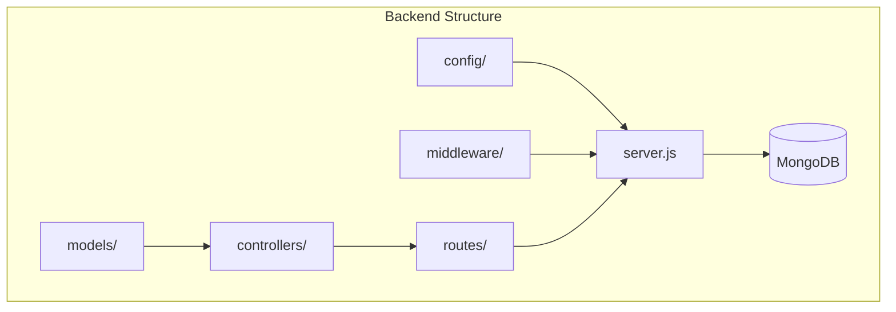
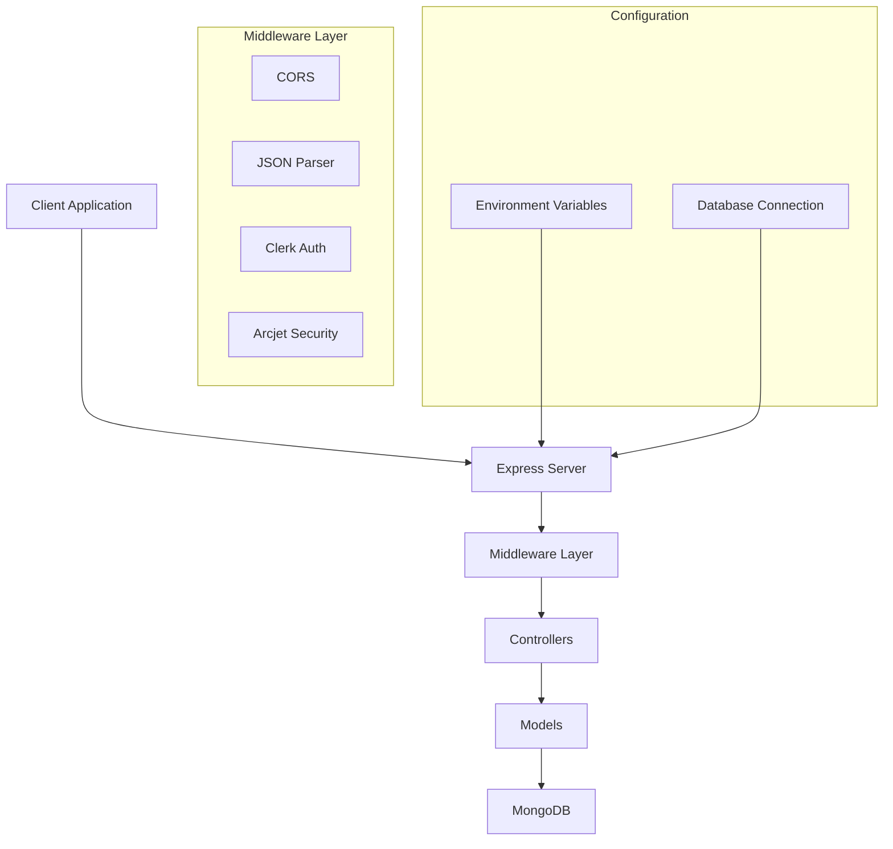
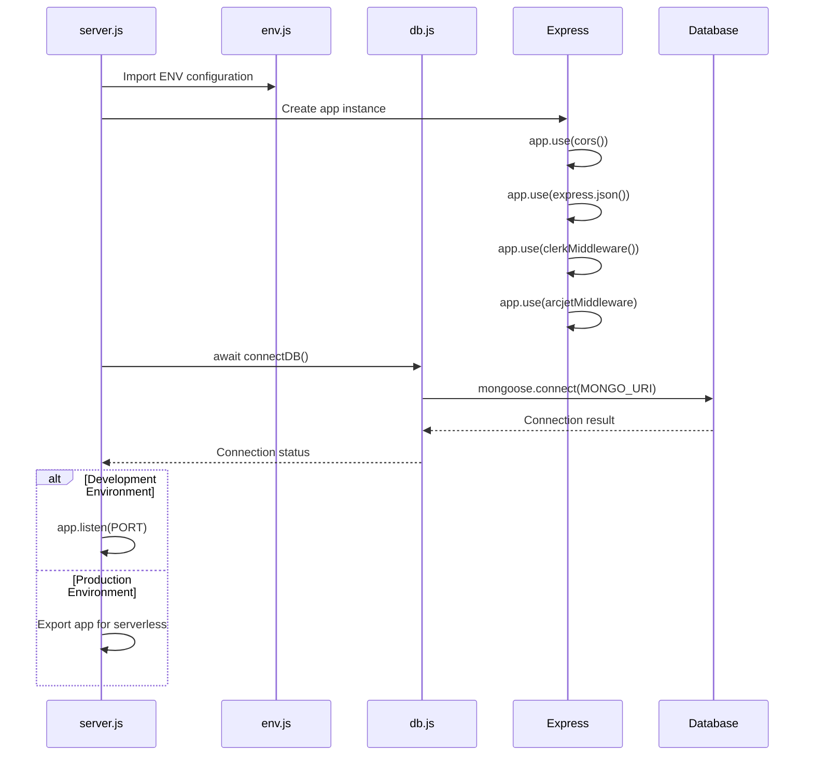
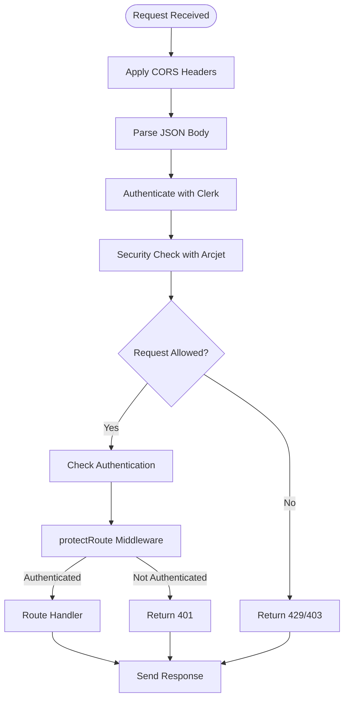
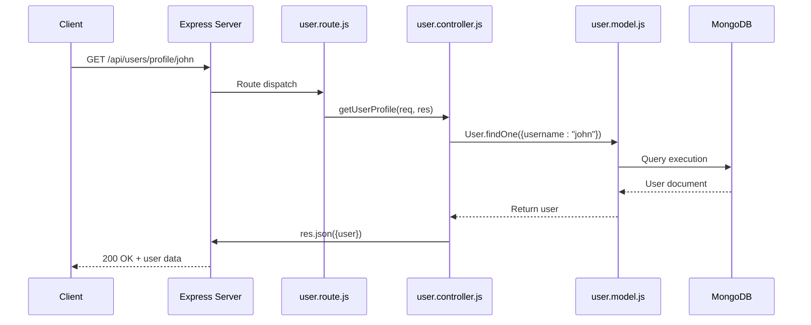
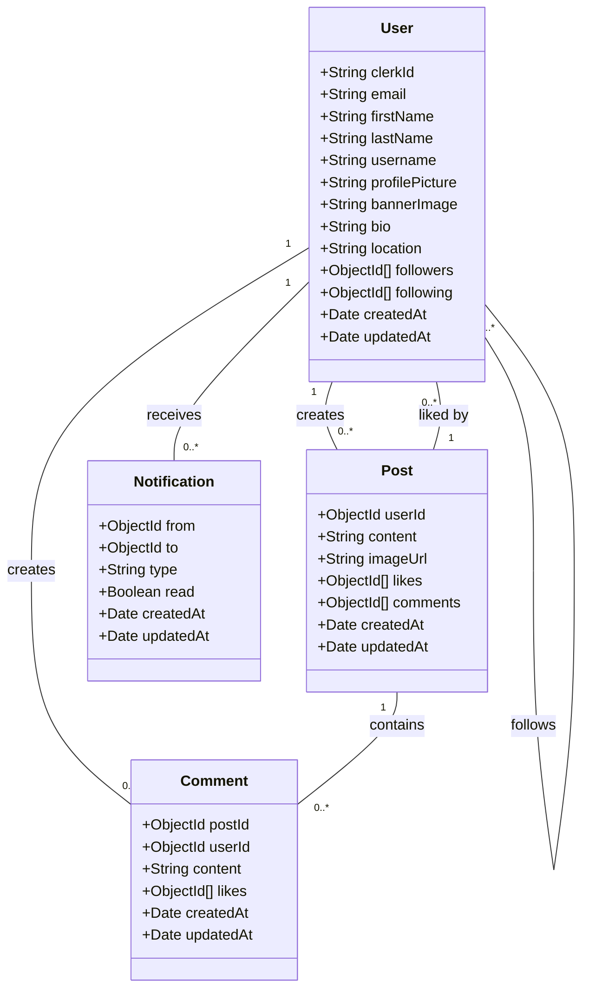
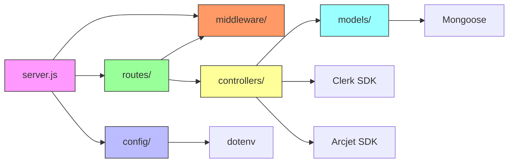
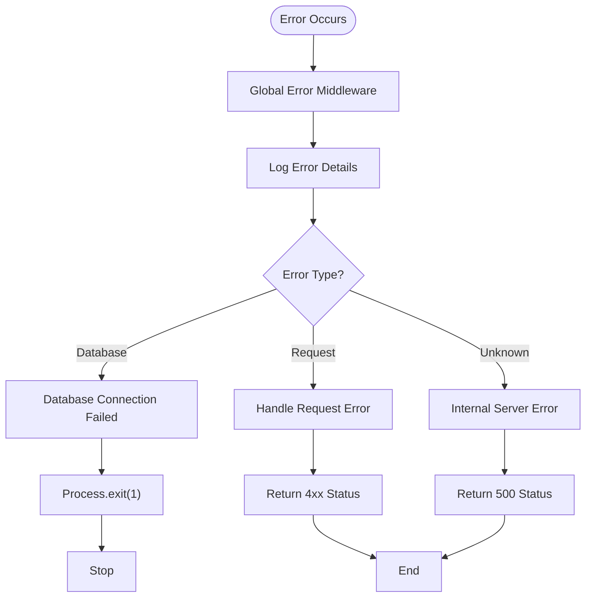

# Backend Architecture

<cite>
**Referenced Files in This Document**   
- [server.js](file://backend/src/server.js) - *Updated to support Vercel deployment*
- [vercel.json](file://backend/vercel.json) - *Added for Vercel configuration*
- [db.js](file://backend/src/config/db.js)
- [env.js](file://backend/src/config/env.js)
- [arcjet.middleware.js](file://backend/src/middleware/arcjet.middleware.js)
- [auth.middleware.js](file://backend/src/middleware/auth.middleware.js)
- [user.controller.js](file://backend/src/controllers/user.controller.js)
- [user.model.js](file://backend/src/models/user.model.js)
- [user.route.js](file://backend/src/routes/user.route.js)
</cite>

## Update Summary
**Changes Made**   
- Updated server initialization logic to reflect conditional port binding based on environment
- Added documentation for Vercel deployment configuration via `vercel.json`
- Enhanced environment configuration section to clarify production vs development behavior
- Updated performance considerations and troubleshooting sections to reflect new deployment model
- Added export statement in `server.js` for serverless compatibility

## Table of Contents
1. [Introduction](#introduction)
2. [Project Structure](#project-structure)
3. [Core Components](#core-components)
4. [Architecture Overview](#architecture-overview)
5. [Detailed Component Analysis](#detailed-component-analysis)
6. [Dependency Analysis](#dependency-analysis)
7. [Performance Considerations](#performance-considerations)
8. [Troubleshooting Guide](#troubleshooting-guide)
9. [Conclusion](#conclusion)

## Introduction
This document provides comprehensive architectural documentation for the xClone backend server, an Express.js application built using the Model-View-Controller (MVC) pattern. The backend serves as the API layer for a social media application, handling user management, posts, comments, and notifications. The system leverages MongoDB via Mongoose for data persistence, integrates with third-party services like Clerk for authentication and Arcjet for security, and follows modern Node.js practices with ES modules. This documentation details the application's structure, initialization process, middleware pipeline, request flow, and key implementation strategies, including recent updates for Vercel deployment.

## Project Structure
The backend follows a clean, modular structure based on the MVC architectural pattern, with clear separation of concerns between configuration, controllers, middleware, models, and routes. The source code is organized under the `backend/src` directory, which contains dedicated folders for each component type, promoting maintainability and scalability.

**Diagram sources**
- [server.js](file://backend/src/server.js)
- [user.route.js](file://backend/src/routes/user.route.js)
- [user.controller.js](file://backend/src/controllers/user.controller.js)
- [user.model.js](file://backend/src/models/user.model.js)

**Section sources**
- [server.js](file://backend/src/server.js)
- [user.route.js](file://backend/src/routes/user.route.js)

## Core Components
The xClone backend consists of several core components that work together to provide a robust API service. The entry point is `server.js`, which initializes the Express application, configures middleware, sets up routes, and starts the server. The application uses Mongoose to interact with MongoDB, with each data entity represented by a model in the `models` directory. Business logic is encapsulated in controllers within the `controllers` directory, while route definitions in the `routes` directory map HTTP requests to controller methods. Middleware functions handle cross-cutting concerns such as authentication, security, and request parsing.

**Section sources**
- [server.js](file://backend/src/server.js#L1-L47)
- [db.js](file://backend/src/config/db.js#L1-L11)
- [env.js](file://backend/src/config/env.js#L1-L15)

## Architecture Overview
The xClone backend follows a layered architecture with clear separation between the presentation layer (routes), business logic layer (controllers), and data access layer (models). The application is initialized in `server.js`, where Express is configured with essential middleware including CORS, JSON parsing, authentication via Clerk, and security via Arcjet. Environment variables are loaded using dotenv and centralized in the `env.js` configuration file. The database connection is established through Mongoose, with connection management handled by the `connectDB` function in `db.js`. This architecture promotes maintainability, testability, and scalability.

**Diagram sources**
- [server.js](file://backend/src/server.js#L1-L47)
- [db.js](file://backend/src/config/db.js#L1-L11)
- [env.js](file://backend/src/config/env.js#L1-L15)

## Detailed Component Analysis

### Server Initialization and Configuration
The server initialization process begins in `server.js`, where the Express application is created and configured with essential middleware. The application sets up CORS to allow cross-origin requests, enables JSON parsing for request bodies, and integrates authentication via Clerk and security via Arcjet. Routes are mounted under specific API prefixes, and a global error handling middleware is defined to catch unhandled exceptions. The `startServer` function asynchronously connects to the database and starts the HTTP server on the specified port. Notably, the server only calls `app.listen()` in non-production environments, as indicated by the `NODE_ENV` check. In production (specifically on Vercel), the server exports the Express app instance for serverless function handling.

**Diagram sources**
- [server.js](file://backend/src/server.js#L1-L47)
- [db.js](file://backend/src/config/db.js#L1-L11)
- [env.js](file://backend/src/config/env.js#L1-L15)

**Section sources**
- [server.js](file://backend/src/server.js#L1-L47)
- [db.js](file://backend/src/config/db.js#L1-L11)

### Middleware Pipeline
The middleware pipeline in xClone consists of several layers that process requests before they reach the route handlers. The pipeline includes CORS middleware to handle cross-origin resource sharing, JSON parsing middleware to process request bodies, Clerk middleware for authentication, and Arcjet middleware for security and rate limiting. Custom middleware such as `protectRoute` ensures that only authenticated users can access protected endpoints. The Arcjet middleware implements rate limiting and bot protection, denying requests that exceed defined thresholds or are identified as automated traffic.

**Diagram sources**
- [server.js](file://backend/src/server.js#L1-L47)
- [arcjet.middleware.js](file://backend/src/middleware/arcjet.middleware.js#L1-L45)
- [auth.middleware.js](file://backend/src/middleware/auth.middleware.js#L1-L8)

**Section sources**
- [server.js](file://backend/src/server.js#L1-L47)
- [arcjet.middleware.js](file://backend/src/middleware/arcjet.middleware.js#L1-L45)
- [auth.middleware.js](file://backend/src/middleware/auth.middleware.js#L1-L8)

### Request Flow and MVC Pattern
The request flow in xClone follows the MVC pattern, with clear separation between routes, controllers, and models. When a request is received, it passes through the middleware pipeline and is routed to the appropriate controller method based on the URL and HTTP method. The controller interacts with the model to perform database operations and returns a response to the client. For example, a request to GET `/api/users/profile/username` is handled by the `getUserProfile` controller method, which queries the User model and returns the user data.

**Diagram sources**
- [user.route.js](file://backend/src/routes/user.route.js#L1-L18)
- [user.controller.js](file://backend/src/controllers/user.controller.js#L1-L96)
- [user.model.js](file://backend/src/models/user.model.js#L1-L63)

**Section sources**
- [user.route.js](file://backend/src/routes/user.route.js#L1-L18)
- [user.controller.js](file://backend/src/controllers/user.controller.js#L1-L96)
- [user.model.js](file://backend/src/models/user.model.js#L1-L63)

### Data Models and Schema Design
The data models in xClone define the structure of documents in MongoDB collections. Each model is created using Mongoose schemas that specify field types, validation rules, and relationships. The User model, for example, includes fields for user profile information, authentication identifiers, and social connections (followers and following). The schema uses ObjectId references to establish relationships between users, enabling efficient querying of social networks. Timestamps are automatically added to track document creation and modification times.

**Diagram sources**
- [user.model.js](file://backend/src/models/user.model.js#L1-L63)
- [post.model.js](file://backend/src/models/post.model.js)
- [comment.model.js](file://backend/src/models/comment.model.js)
- [notification.model.js](file://backend/src/models/notification.model.js)

**Section sources**
- [user.model.js](file://backend/src/models/user.model.js#L1-L63)

## Dependency Analysis
The xClone backend has a well-defined dependency structure with minimal circular dependencies. The server depends on configuration files, middleware, and routes. Routes depend on controllers and middleware, while controllers depend on models and external services. Models depend only on Mongoose and have no dependencies on other application layers. This unidirectional dependency flow ensures that the application remains maintainable and testable. External dependencies include Express for the web framework, Mongoose for MongoDB object modeling, Clerk for authentication, and Arcjet for security.

**Diagram sources**
- [server.js](file://backend/src/server.js)
- [package.json](file://backend/package.json)

**Section sources**
- [server.js](file://backend/src/server.js)
- [package.json](file://backend/package.json)

## Performance Considerations
The xClone backend implements several performance considerations to ensure responsiveness and scalability. Database queries are optimized through proper indexing, though specific indexes are not visible in the provided code. The use of Mongoose provides built-in query optimization features. The Arcjet middleware helps prevent abuse by implementing rate limiting, protecting the application from denial-of-service attacks. The application uses environment-specific configuration to differentiate between development and production settings. For production deployment, the application is configured to run on Vercel, as indicated by the `vercel.json` configuration file, which routes all requests to the server entry point. The `vercel.json` file specifies that all routes should be directed to `src/server.js`, enabling serverless function execution in the Vercel environment.

**Section sources**
- [server.js](file://backend/src/server.js#L1-L47)
- [vercel.json](file://backend/vercel.json)

## Troubleshooting Guide
The xClone backend includes basic error handling and logging mechanisms to aid troubleshooting. The global error handler in `server.js` catches unhandled exceptions and returns a 500 status with an error message. The database connection function includes error handling that logs connection failures and exits the process. Middleware functions include error handling, with the Arcjet middleware logging errors but allowing requests to continue if Arcjet fails. During development, the server logs startup messages to indicate successful initialization. For production troubleshooting, additional logging would be beneficial, as the current implementation relies primarily on console.log statements for critical operations. The Vercel deployment configuration ensures that environment variables are properly set in production, including `NODE_ENV=production`, which affects server behavior.

**Diagram sources**
- [server.js](file://backend/src/server.js#L1-L47)
- [db.js](file://backend/src/config/db.js#L1-L11)

**Section sources**
- [server.js](file://backend/src/server.js#L1-L47)
- [db.js](file://backend/src/config/db.js#L1-L11)

## Conclusion
The xClone backend presents a well-structured Express.js application following the MVC pattern with clear separation of concerns. The architecture demonstrates best practices in modern Node.js development, including modular organization, environment configuration, and integration with third-party services for authentication and security. The application effectively leverages Mongoose for MongoDB interactions and implements a robust middleware pipeline for cross-cutting concerns. Recent updates have enhanced the deployment model by adding Vercel configuration through `vercel.json` and modifying `server.js` to export the Express app for serverless compatibility. While the current logging approach is minimal, relying primarily on console.log statements, the foundation is solid for a scalable social media API. Future improvements could include more comprehensive logging, detailed database indexing, and enhanced error handling with structured logging.