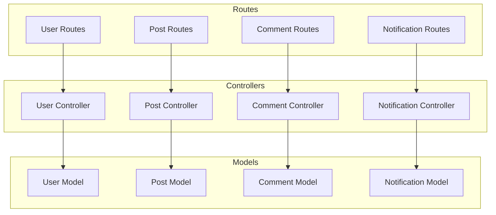
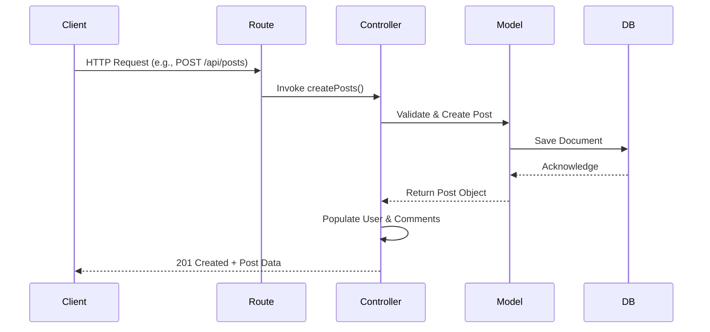
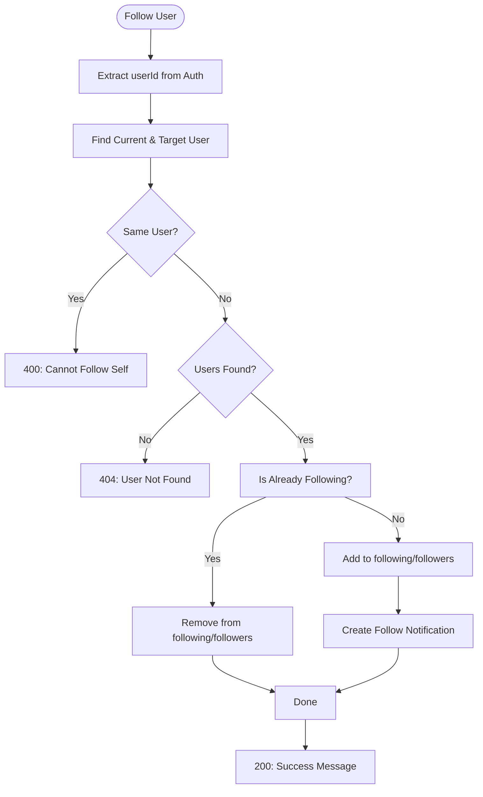
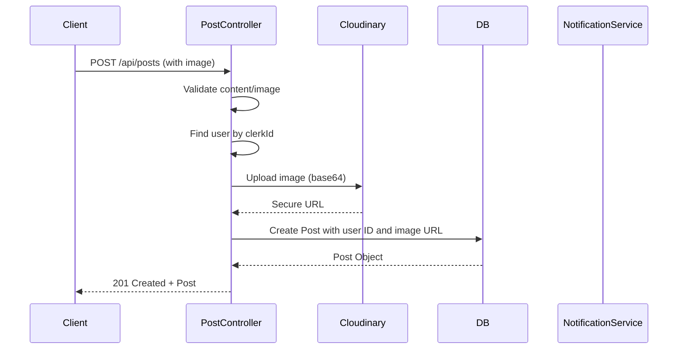
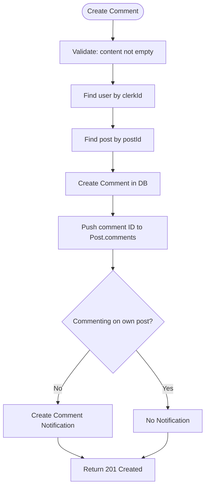
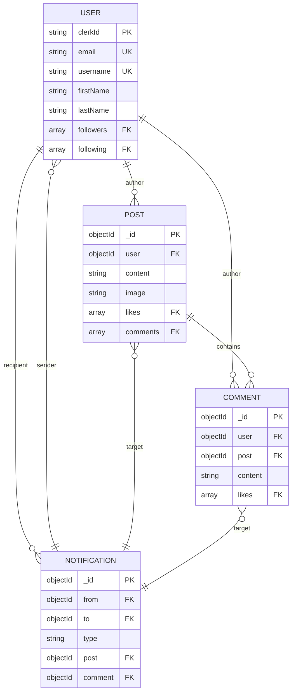

# Business Logic Layer

<cite>
**Referenced Files in This Document**   
- [user.controller.js](file://backend/src/controllers/user.controller.js)
- [post.controller.js](file://backend/src/controllers/post.controller.js)
- [comment.controller.js](file://backend/src/controllers/comment.controller.js)
- [notification.controller.js](file://backend/src/controllers/notification.controller.js)
- [user.model.js](file://backend/src/models/user.model.js)
- [post.model.js](file://backend/src/models/post.model.js)
- [comment.model.js](file://backend/src/models/comment.model.js)
- [notification.model.js](file://backend/src/models/notification.model.js)
- [user.route.js](file://backend/src/routes/user.route.js)
- [post.route.js](file://backend/src/routes/post.route.js)
- [comment.route.js](file://backend/src/routes/comment.route.js)
- [notification.route.js](file://backend/src/routes/notification.route.js)
</cite>

## Table of Contents
1. [Introduction](#introduction)
2. [Project Structure](#project-structure)
3. [Core Components](#core-components)
4. [Architecture Overview](#architecture-overview)
5. [Detailed Component Analysis](#detailed-component-analysis)
6. [Dependency Analysis](#dependency-analysis)
7. [Performance Considerations](#performance-considerations)
8. [Troubleshooting Guide](#troubleshooting-guide)
9. [Conclusion](#conclusion)

## Introduction
This document provides a comprehensive analysis of the business logic layer in the xClone backend application. It details the implementation of core controllers responsible for user, post, comment, and notification management. The analysis includes method-level breakdowns, route-controller invocation relationships, domain model interactions, error handling strategies, and solutions to common concurrency issues. The goal is to make the system accessible to beginners while offering technical depth for experienced developers on topics such as atomic updates, transactional integrity, and edge case handling.

## Project Structure
The xClone backend follows a clean, modular architecture organized by functional layers. The business logic resides in the `controllers` directory, which interacts with Mongoose models in the `models` directory and is exposed via Express routes defined in the `routes` directory. This separation ensures single responsibility and maintainability.

**Diagram sources**
- [user.controller.js](file://backend/src/controllers/user.controller.js)
- [post.controller.js](file://backend/src/controllers/post.controller.js)
- [comment.controller.js](file://backend/src/controllers/comment.controller.js)
- [notification.controller.js](file://backend/src/controllers/notification.controller.js)
- [user.model.js](file://backend/src/models/user.model.js)
- [post.model.js](file://backend/src/models/post.model.js)
- [comment.model.js](file://backend/src/models/comment.model.js)
- [notification.model.js](file://backend/src/models/notification.model.js)

**Section sources**
- [user.controller.js](file://backend/src/controllers/user.controller.js)
- [post.controller.js](file://backend/src/controllers/post.controller.js)
- [comment.controller.js](file://backend/src/controllers/comment.controller.js)
- [notification.controller.js](file://backend/src/controllers/notification.controller.js)

## Core Components
The core business logic is implemented across four primary controllers: User, Post, Comment, and Notification. Each controller encapsulates CRUD operations and custom actions related to its domain entity. These controllers use Mongoose models to interact with MongoDB, enforce validation rules, and maintain referential integrity. All asynchronous controller methods are wrapped with `express-async-handler` to streamline error handling and avoid repetitive try-catch blocks.

**Section sources**
- [user.controller.js](file://backend/src/controllers/user.controller.js#L1-L96)
- [post.controller.js](file://backend/src/controllers/post.controller.js#L1-L158)
- [comment.controller.js](file://backend/src/controllers/comment.controller.js#L1-L83)
- [notification.controller.js](file://backend/src/controllers/notification.controller.js#L1-L36)

## Architecture Overview
The business logic layer follows a RESTful service pattern where HTTP requests are routed to controller methods that process input, interact with data models, and return structured JSON responses. Authentication is managed externally via Clerk, and user identity is extracted using `getAuth()` middleware. Controllers maintain loose coupling by referencing other entities via ObjectIds, enabling efficient population of related data using Mongoose’s `populate()` method.

**Diagram sources**
- [post.controller.js](file://backend/src/controllers/post.controller.js#L50-L75)
- [post.route.js](file://backend/src/routes/post.route.js)
- [post.model.js](file://backend/src/models/post.model.js)

## Detailed Component Analysis

### User Controller Analysis
The `user.controller.js` file handles user-related operations including profile retrieval, updates, synchronization with Clerk, and social following logic.

#### Key Methods:
- **getUserProfile**: Retrieves a user by username from the database.
- **updateProfile**: Updates the authenticated user's profile data.
- **syncUser**: Creates a new user in MongoDB upon first login using Clerk identity data.
- **getCurrentUser**: Fetches the currently authenticated user.
- **followUser**: Toggles follow/unfollow state between users and generates notifications.

**Diagram sources**
- [user.controller.js](file://backend/src/controllers/user.controller.js#L60-L96)

**Section sources**
- [user.controller.js](file://backend/src/controllers/user.controller.js#L1-L96)
- [user.model.js](file://backend/src/models/user.model.js)

### Post Controller Analysis
The `post.controller.js` manages all post-related functionality including creation, retrieval, liking, and deletion.

#### Key Methods:
- **getPosts**: Returns all posts sorted by creation time with populated user and comments.
- **getPost**: Retrieves a single post by ID with full comment thread.
- **getUserPosts**: Gets all posts for a specific user by username.
- **createPosts**: Handles text/image posts, uploads images to Cloudinary, and saves to DB.
- **likePost**: Toggles like status and notifies post owner if not self-liking.
- **deletePost**: Deletes a post and all associated comments.

**Diagram sources**
- [post.controller.js](file://backend/src/controllers/post.controller.js#L77-L115)

**Section sources**
- [post.controller.js](file://backend/src/controllers/post.controller.js#L1-L158)
- [post.model.js](file://backend/src/models/post.model.js)
- [cloudinary.js](file://backend/src/config/cloudinary.js)

### Comment Controller Analysis
The `comment.controller.js` handles comment creation, retrieval, and deletion with proper ownership validation and notification logic.

#### Key Methods:
- **getComment**: Retrieves all comments for a given post.
- **createComment**: Validates non-empty content, creates comment, links to post, and notifies owner.
- **deleteComment**: Ensures user owns the comment before deletion and removes reference from post.

**Diagram sources**
- [comment.controller.js](file://backend/src/controllers/comment.controller.js#L15-L50)

**Section sources**
- [comment.controller.js](file://backend/src/controllers/comment.controller.js#L1-L83)
- [comment.model.js](file://backend/src/models/comment.model.js)

### Notification Controller Analysis
The `notification.controller.js` provides endpoints to retrieve and delete notifications for the authenticated user.

#### Key Methods:
- **getNotifications**: Fetches all notifications for the user, populating sender, post, and comment data.
- **deleteNotification**: Allows users to remove notifications they own.

Notifications are generated automatically during social interactions (follow, like, comment) and stored with references to involved entities.

**Section sources**
- [notification.controller.js](file://backend/src/controllers/notification.controller.js#L1-L36)
- [notification.model.js](file://backend/src/models/notification.model.js)

## Dependency Analysis
The controllers exhibit a clear dependency hierarchy where higher-level entities reference lower-level ones through Mongoose ObjectId relationships.

**Diagram sources**
- [user.model.js](file://backend/src/models/user.model.js)
- [post.model.js](file://backend/src/models/post.model.js)
- [comment.model.js](file://backend/src/models/comment.model.js)
- [notification.model.js](file://backend/src/models/notification.model.js)

**Section sources**
- [user.model.js](file://backend/src/models/user.model.js#L1-L63)
- [post.model.js](file://backend/src/models/post.model.js#L1-L36)
- [comment.model.js](file://backend/src/models/comment.model.js#L1-L32)
- [notification.model.js](file://backend/src/models/notification.model.js)

## Performance Considerations
The application uses Mongoose’s `populate()` method to resolve references, which can lead to N+1 query problems if not optimized. However, the current implementation limits nesting depth and sorts results efficiently using indexed fields like `createdAt`. Image uploads are offloaded to Cloudinary with automatic optimization (quality/format), reducing server load and bandwidth usage. For high-traffic scenarios, adding Redis caching for frequently accessed posts or user profiles could further improve response times.

## Troubleshooting Guide
Common issues and their solutions:

- **Duplicate Comments**: Prevented by validating non-empty content and enforcing ownership checks on deletion.
- **Race Conditions in Likes**: Avoided by using atomic MongoDB operations (`$push`, `$pull`) which are thread-safe.
- **Image Upload Failures**: Handled with try-catch around Cloudinary upload; returns 400 with error message.
- **Unauthorized Actions**: All update/delete operations verify ownership using `clerkId` and document references.
- **Missing Notifications**: Generated only when interacting with others (e.g., not liking own post), ensuring relevance.

Error responses follow a consistent format: `{ error: "message" }` or `{ message: "success" }`, with appropriate HTTP status codes (400, 403, 404, 200, 201).

**Section sources**
- [user.controller.js](file://backend/src/controllers/user.controller.js)
- [post.controller.js](file://backend/src/controllers/post.controller.js)
- [comment.controller.js](file://backend/src/controllers/comment.controller.js)
- [notification.controller.js](file://backend/src/controllers/notification.controller.js)

## Conclusion
The xClone business logic layer demonstrates a well-structured, maintainable design using Express.js with Mongoose. Controllers encapsulate domain-specific operations with clear separation of concerns. The use of `express-async-handler` simplifies error handling, while atomic database operations ensure data integrity. Social features like following, liking, and commenting are implemented with proper validation, ownership checks, and real-time notifications. Future improvements could include pagination, caching, and more sophisticated feed algorithms.