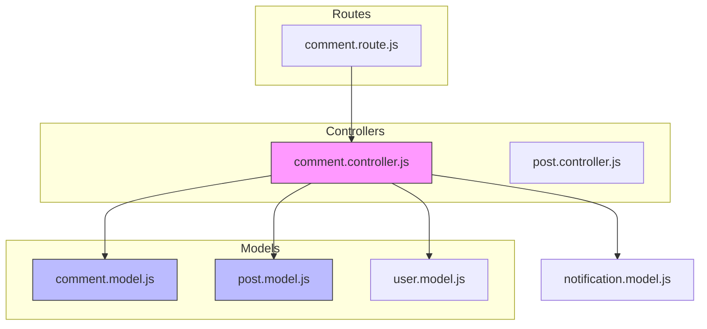
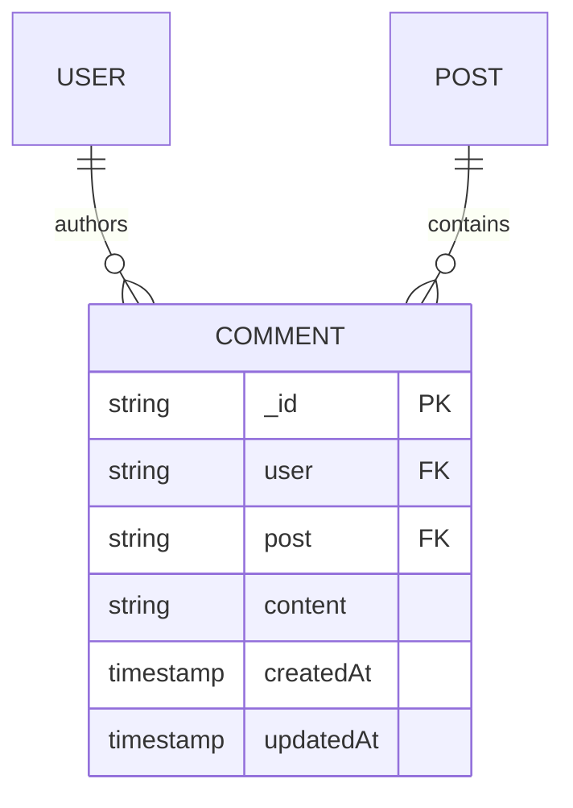
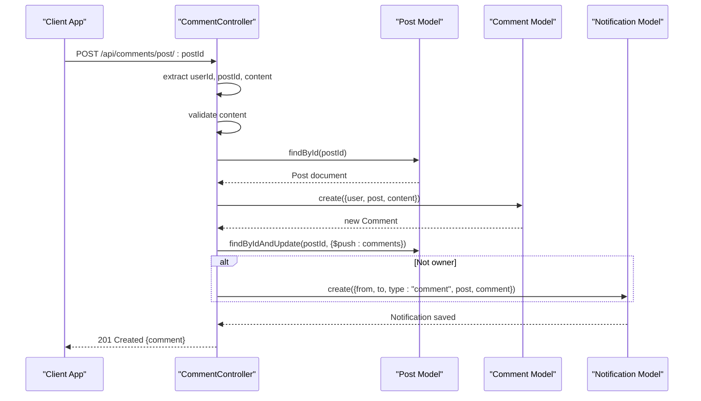
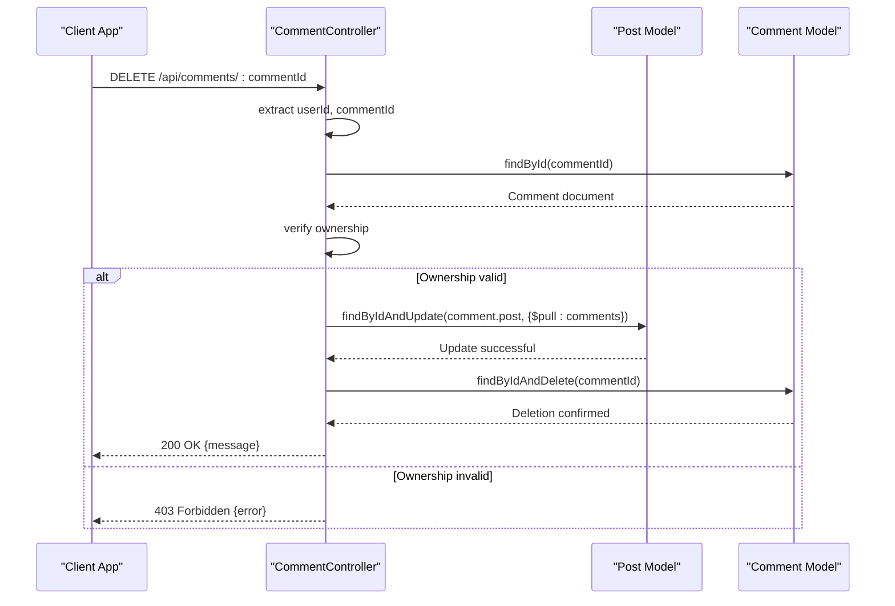

# Comment System Business Logic

<cite>
**Referenced Files in This Document**   
- [comment.controller.js](file://backend/src/controllers/comment.controller.js)
- [comment.model.js](file://backend/src/models/comment.model.js)
- [post.model.js](file://backend/src/models/post.model.js)
- [user.model.js](file://backend/src/models/user.model.js)
- [comment.route.js](file://backend/src/routes/comment.route.js)
- [post.controller.js](file://backend/src/controllers/post.controller.js)
- [notification.model.js](file://backend/src/models/notification.model.js)
</cite>

## Table of Contents
1. [Introduction](#introduction)
2. [Project Structure Overview](#project-structure-overview)
3. [Core Components](#core-components)
4. [Comment Controller Business Logic](#comment-controller-business-logic)
   - [createComment Method](#createcomment-method)
   - [getComment Method](#getcomment-method)
   - [deleteComment Method](#deletecomment-method)
5. [Data Models and Relationships](#data-models-and-relationships)
6. [Sequence Diagrams for Key Operations](#sequence-diagrams-for-key-operations)
7. [Error Handling and Security Checks](#error-handling-and-security-checks)
8. [Data Integrity and Cascading Effects](#data-integrity-and-cascading-effects)
9. [Conclusion](#conclusion)

## Introduction
This document provides a comprehensive analysis of the comment system business logic in the xClone application. It details how comments are created, retrieved, and deleted, with a focus on parent-child relationships between posts and comments, user associations, validation mechanisms, and data integrity considerations. The implementation uses MongoDB via Mongoose, integrates with Clerk for authentication, and supports real-time notifications.

**Section sources**
- [comment.controller.js](file://backend/src/controllers/comment.controller.js#L1-L83)
- [comment.model.js](file://backend/src/models/comment.model.js#L1-L33)

## Project Structure Overview
The xClone backend is organized into a modular structure with distinct directories for configuration, controllers, middleware, models, and routes. The comment system resides within the `controllers`, `models`, and `routes` folders, following a clean separation of concerns.



**Diagram sources**
- [comment.controller.js](file://backend/src/controllers/comment.controller.js)
- [comment.model.js](file://backend/src/models/comment.model.js)
- [post.model.js](file://backend/src/models/post.model.js)
- [comment.route.js](file://backend/src/routes/comment.route.js)

## Core Components
The comment system relies on several core components:
- **Comment Controller**: Handles HTTP requests for creating, retrieving, and deleting comments.
- **Comment Model**: Defines the schema for comment data, including references to User and Post.
- **Post Model**: Maintains a list of associated comment IDs to support parent-child relationships.
- **User Model**: Stores user metadata used to associate comments with authors.
- **Routes**: Define public and protected endpoints for comment operations.

These components work together to ensure data consistency, enforce access control, and maintain referential integrity.

**Section sources**
- [comment.controller.js](file://backend/src/controllers/comment.controller.js#L1-L83)
- [comment.model.js](file://backend/src/models/comment.model.js#L1-L33)
- [post.model.js](file://backend/src/models/post.model.js#L1-L37)
- [user.model.js](file://backend/src/models/user.model.js#L1-L64)
- [comment.route.js](file://backend/src/routes/comment.route.js#L1-L16)

## Comment Controller Business Logic

### createComment Method
The `createComment` method handles the creation of new comments on posts. It performs the following steps:

1. Extracts the authenticated user ID via Clerk's `getAuth(req)`.
2. Retrieves the target `postId` from URL parameters and comment `content` from request body.
3. Validates that the comment content is not empty or whitespace-only.
4. Fetches the corresponding User and Post documents from the database.
5. Creates a new Comment document with references to the author (User) and parent Post.
6. Updates the Post document by pushing the new comment's ID into its `comments` array using Mongoose's `findByIdAndUpdate` with the `$push` operator.
7. Generates a notification if the commenter is not the post owner.

**Key Implementation Details:**
- Uses `asyncHandler` wrapper for unified error handling.
- Performs atomic updates using MongoDB's `$push` operation to maintain data consistency.
- Returns a standardized JSON response with HTTP status 201 on success.

```javascript
// Example from actual code
await Post.findByIdAndUpdate(postId, {
  $push: { comments: comment._id },
});
```

**Section sources**
- [comment.controller.js](file://backend/src/controllers/comment.controller.js#L20-L45)

### getComment Method
The `getComment` method retrieves all comments associated with a specific post, sorted by creation time in descending order (newest first).

**Key Features:**
- Accepts `postId` as a route parameter.
- Queries the Comment collection with `.find({ post: postId })`.
- Sorts results by `createdAt: -1` to show newest comments first.
- Populates the `user` field to include author details (`username`, `firstName`, `lastName`, `profilePicture`) while excluding sensitive fields like password.
- Returns 404 if no comments exist (note: this may be reconsidered as an empty array might be more appropriate).

**Potential Issue:**  
The current implementation returns a 404 when no comments are found, which could be misleading. A better approach would be to return an empty array with 200 OK status.

```javascript
// Example from actual code
const comment = await Comment.find({ post: postId })
  .sort({ createdAt: -1 })
  .populate("user", "username firstName lastName profilePicture");
```

**Section sources**
- [comment.controller.js](file://backend/src/controllers/comment.controller.js#L1-L18)

### deleteComment Method
The `deleteComment` method allows users to delete their own comments. It includes strict ownership verification and maintains data integrity by removing the comment reference from the parent post.

**Workflow:**
1. Extracts authenticated `userId` and `commentId` from request.
2. Finds the corresponding User and Comment documents.
3. Verifies that the requesting user owns the comment (`comment.user.toString() === user._id.toString()`).
4. If ownership check passes, removes the comment ID from the parent Post's `comments` array using `$pull`.
5. Deletes the Comment document from the database.
6. Returns success message with HTTP 200.

**Security Consideration:**  
Only the comment author can delete it. Attempts to delete others' comments result in a 403 Forbidden response.

```javascript
// Example from actual code
if (comment.user.toString() !== user._id.toString()) {
  return res.status(403).json({ error: "You can only delete your own comments" });
}
```

**Section sources**
- [comment.controller.js](file://backend/src/controllers/comment.controller.js#L47-L83)

## Data Models and Relationships

### Comment Model Structure
The Comment model defines the core structure of a comment with the following fields:



**Schema Definition:**
```javascript
const commentSchema = new mongoose.Schema({
  user: { type: mongoose.Schema.Types.ObjectId, ref: "User", required: true },
  post: { type: mongoose.Schema.Types.ObjectId, ref: "Post", required: true },
  content: { type: String, required: true, maxLength: 280 },
  likes: [{ type: mongoose.Schema.Types.ObjectId, ref: "User" }]
}, { timestamps: true });
```

### Parent-Child Relationship with Posts
The Post model maintains a direct reference to its comments through the `comments` array:

```javascript
comments: [
  {
    type: mongoose.Schema.Types.ObjectId,
    ref: "Comment",
  },
]
```

This bidirectional linking ensures efficient querying in both directions:
- Find all comments for a post (via Post → Comments)
- Find the post of a comment (via Comment → Post)

**Section sources**
- [comment.model.js](file://backend/src/models/comment.model.js#L1-L33)
- [post.model.js](file://backend/src/models/post.model.js#L1-L37)

## Sequence Diagrams for Key Operations

### Comment Creation Flow


**Diagram sources**
- [comment.controller.js](file://backend/src/controllers/comment.controller.js#L20-L45)

### Comment Deletion Flow


**Diagram sources**
- [comment.controller.js](file://backend/src/controllers/comment.controller.js#L47-L83)

## Error Handling and Security Checks
The comment system implements robust error handling and security measures:

| Error Case | HTTP Status | Response Message | Handling Mechanism |
|------------|------------|------------------|---------------------|
| Empty comment content | 400 Bad Request | "Comment cannot be empty" | Pre-save validation |
| User or post not found | 404 Not Found | "user or post not found" | Existence check before creation |
| Comment not found | 404 Not Found | "User or comment not found" | Existence check before deletion |
| Unauthorized deletion | 403 Forbidden | "You can only delete your own comments" | Ownership verification |

**Security Principles Enforced:**
- **Authentication**: All write operations require authentication via `protectRoute` middleware.
- **Authorization**: Users can only delete their own comments.
- **Input Validation**: Content cannot be empty or whitespace-only.
- **Data Validation**: Ensures referenced User and Post exist before creating a comment.

**Section sources**
- [comment.controller.js](file://backend/src/controllers/comment.controller.js#L1-L83)
- [comment.route.js](file://backend/src/routes/comment.route.js#L1-L16)

## Data Integrity and Cascading Effects
The system maintains data integrity through several mechanisms:

### Bidirectional Referencing
Both Comment → Post and Post → Comment references ensure consistency:
- Comment has `post` field pointing to its parent
- Post has `comments` array containing child comment IDs

### Cascading Deletion
When a post is deleted, all associated comments are removed:
```javascript
// From post.controller.js
await Comment.deleteMany({ post: postId });
```

However, **comment deletion does not cascade to the post**—instead, it properly removes the comment ID from the post's `comments` array using `$pull`, preventing orphaned references.

### Potential Issue: Orphaned Comments
If post deletion were not properly cascaded (as shown in `deletePost`), orphaned comments could exist. The current implementation prevents this by explicitly deleting all comments when a post is removed.

**Section sources**
- [post.controller.js](file://backend/src/controllers/post.controller.js#L145-L158)
- [comment.controller.js](file://backend/src/controllers/comment.controller.js#L65-L70)

## Conclusion
The comment system in xClone demonstrates a well-structured implementation of nested content management with proper validation, security, and data integrity controls. Key strengths include:
- Clear separation of concerns between models, controllers, and routes
- Effective use of Mongoose for schema definition and population
- Robust ownership verification and error handling
- Proper cascading operations to prevent orphaned data
- Integration with notification system for social interactions

Areas for improvement include:
- Returning empty arrays instead of 404 for non-existent comments
- Adding rate limiting to prevent spam
- Implementing soft deletes or edit history for moderation
- Adding input sanitization for rich text support in the future

The system effectively supports the core social functionality of the application while maintaining data consistency and user security.

**Section sources**
- [comment.controller.js](file://backend/src/controllers/comment.controller.js#L1-L83)
- [post.controller.js](file://backend/src/controllers/post.controller.js#L145-L158)