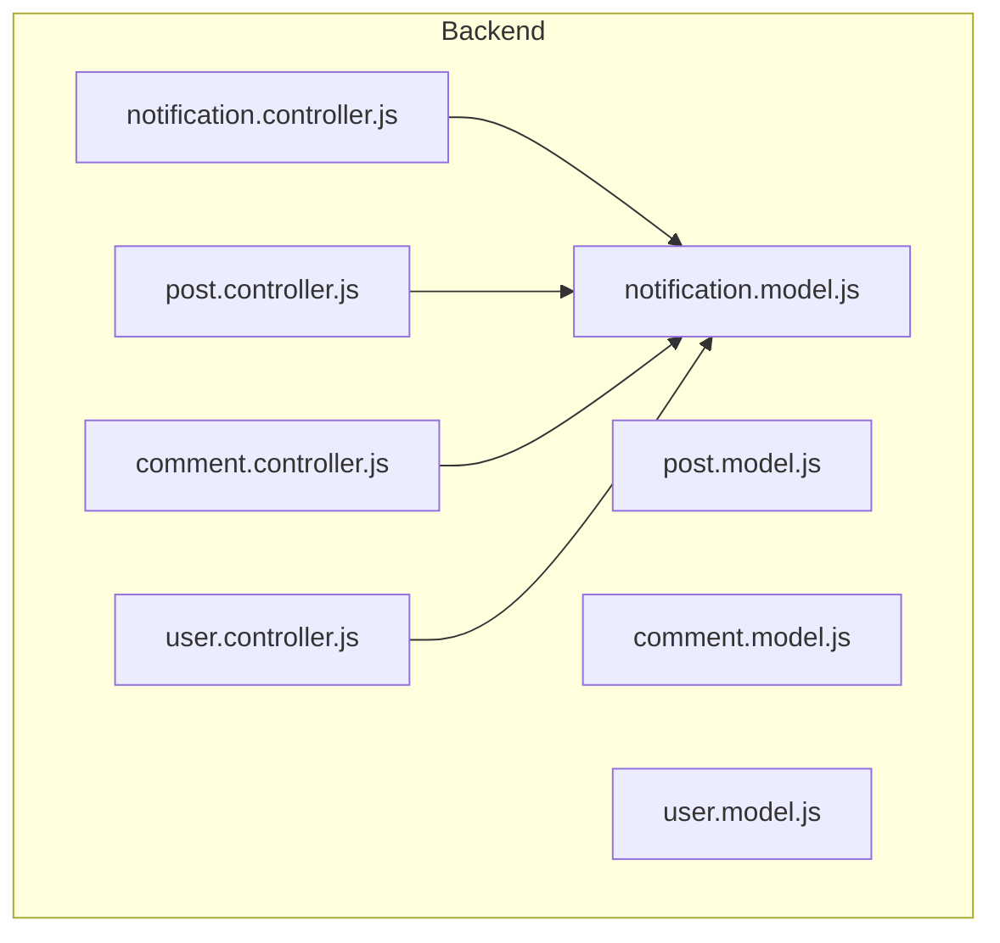
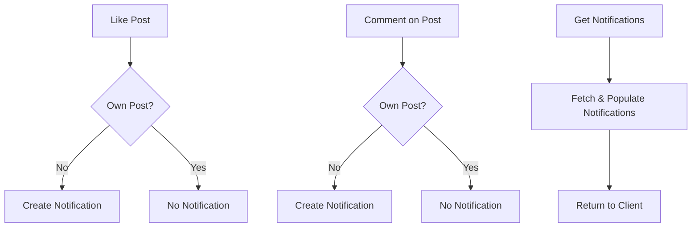
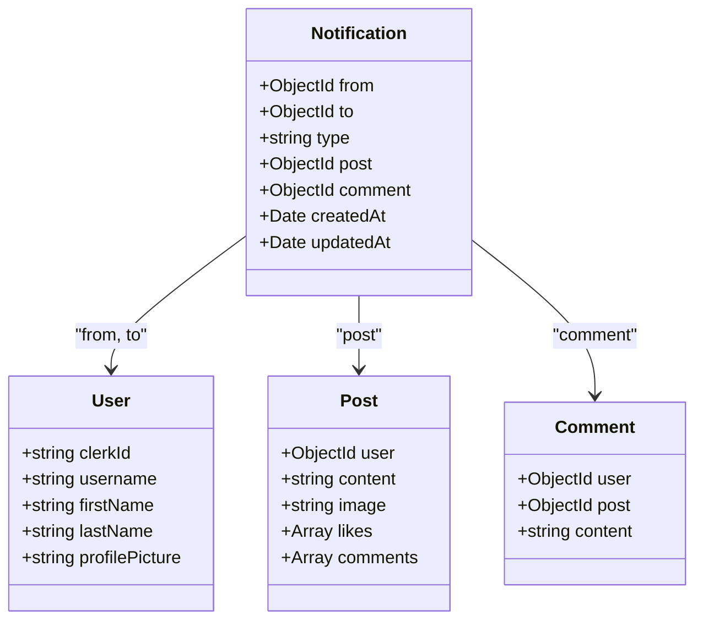
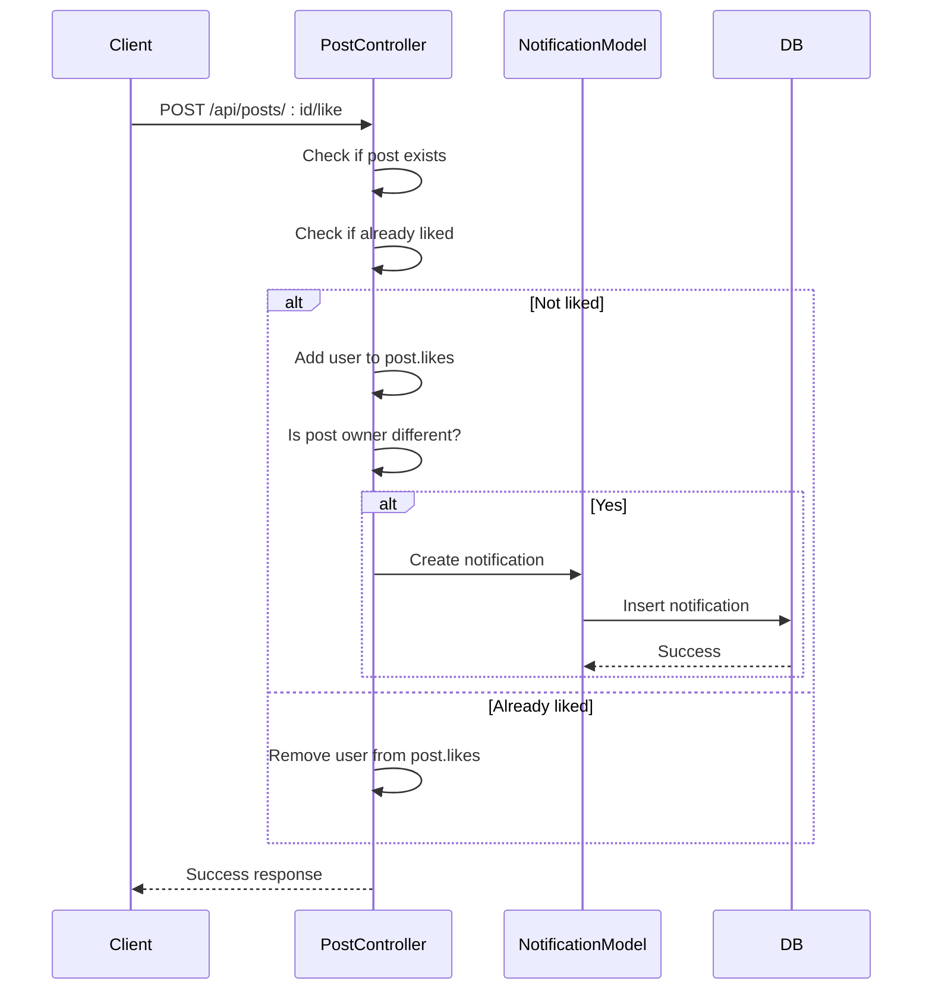
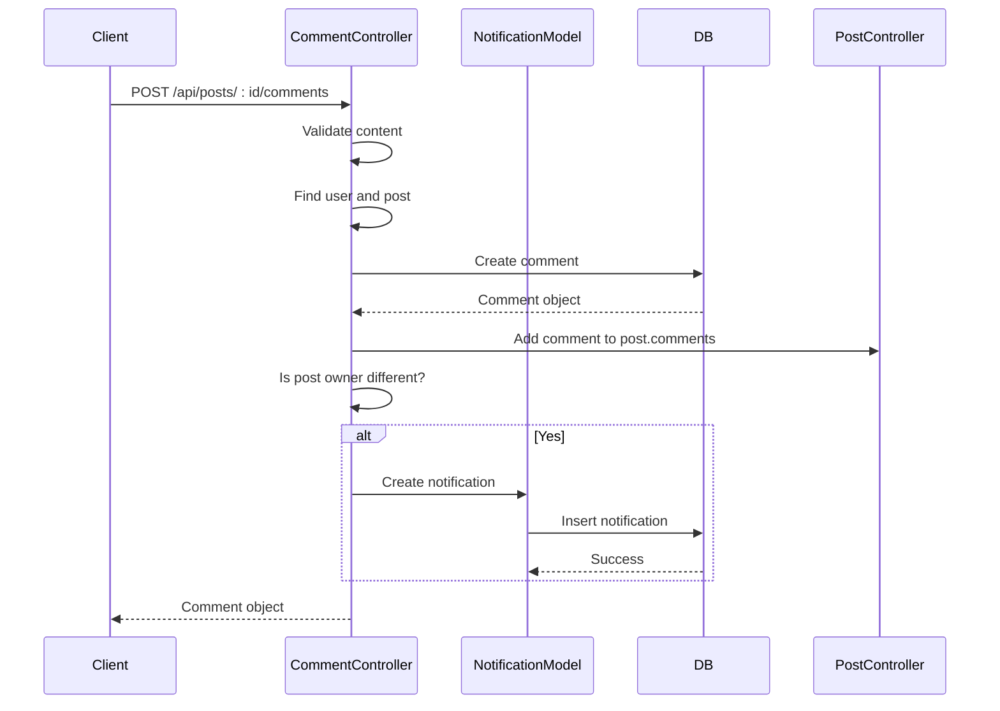
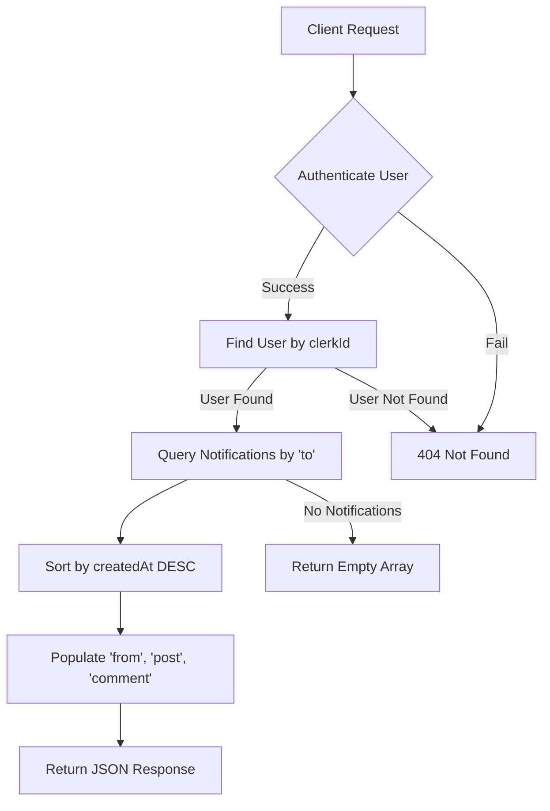
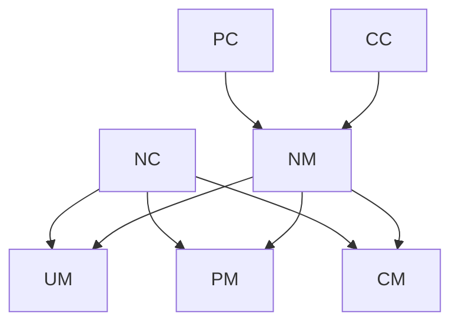

# Notification System Business Logic

<cite>
**Referenced Files in This Document**   
- [notification.controller.js](file://backend/src/controllers/notification.controller.js)
- [notification.model.js](file://backend/src/models/notification.model.js)
- [post.controller.js](file://backend/src/controllers/post.controller.js)
- [comment.controller.js](file://backend/src/controllers/comment.controller.js)
- [user.controller.js](file://backend/src/controllers/user.controller.js)
</cite>

## Table of Contents
1. [Introduction](#introduction)
2. [Project Structure](#project-structure)
3. [Core Components](#core-components)
4. [Architecture Overview](#architecture-overview)
5. [Detailed Component Analysis](#detailed-component-analysis)
6. [Dependency Analysis](#dependency-analysis)
7. [Performance Considerations](#performance-considerations)
8. [Troubleshooting Guide](#troubleshooting-guide)
9. [Conclusion](#conclusion)

## Introduction
The Notification System in xClone is designed to deliver real-time updates to users based on social interactions such as likes, comments, and follows. This document details the business logic behind notification creation and retrieval, focusing on event-driven triggers from other controllers, data population, state management, and scalability considerations. The system leverages MongoDB for persistence and Mongoose for schema modeling, with notifications being populated with relevant user and content data for display.

## Project Structure
The xClone backend is organized in a modular fashion, separating concerns into distinct directories: `controllers`, `models`, `routes`, `middleware`, and `config`. The notification functionality resides primarily in the `notification.controller.js` and `notification.model.js` files, with event triggers originating from `post.controller.js` and `comment.controller.js`. The frontend mobile application is built using React Native, but this document focuses exclusively on the backend notification logic.

**Diagram sources**
- [notification.controller.js](file://backend/src/controllers/notification.controller.js)
- [notification.model.js](file://backend/src/models/notification.model.js)
- [post.controller.js](file://backend/src/controllers/post.controller.js)
- [comment.controller.js](file://backend/src/controllers/comment.controller.js)

## Core Components
The core components of the notification system include the `Notification` model, which defines the structure of a notification, and the `notification.controller.js`, which handles retrieval and deletion. Notification creation is decentralized and occurs within other controllers—specifically when a user likes a post or comments on one. The system uses Clerk for authentication, ensuring that only valid users can generate or access notifications.

**Section sources**
- [notification.model.js](file://backend/src/models/notification.model.js#L1-L37)
- [notification.controller.js](file://backend/src/controllers/notification.controller.js#L1-L36)

## Architecture Overview
The notification architecture follows an event-driven pattern where social actions (like, comment) trigger the creation of a notification document in the database. The `Notification` model is linked to `User`, `Post`, and `Comment` models via ObjectIds. When a user accesses their notifications, the backend retrieves all notifications addressed to them, sorts them by creation time, and populates sender and content details for presentation.

**Diagram sources**
- [post.controller.js](file://backend/src/controllers/post.controller.js#L100-L130)
- [comment.controller.js](file://backend/src/controllers/comment.controller.js#L40-L60)
- [notification.controller.js](file://backend/src/controllers/notification.controller.js#L5-L20)

## Detailed Component Analysis

### Notification Model Analysis
The `Notification` model defines the schema for storing notifications. It includes references to the sender (`from`), recipient (`to`), type of interaction, and optional references to the associated post or comment.

**Diagram sources**
- [notification.model.js](file://backend/src/models/notification.model.js#L1-L37)
- [user.model.js](file://backend/src/models/user.model.js)
- [post.model.js](file://backend/src/models/post.model.js)
- [comment.model.js](file://backend/src/models/comment.model.js)

**Section sources**
- [notification.model.js](file://backend/src/models/notification.model.js#L1-L37)

### Notification Creation Workflow
Notifications are created as side effects of user actions in the `post.controller.js` and `comment.controller.js` files. The payload includes the sender, recipient, type, and references to the target content.

#### Like Action Flow
When a user likes a post, the system checks if the post belongs to someone else. If so, a notification of type `"like"` is created.

**Diagram sources**
- [post.controller.js](file://backend/src/controllers/post.controller.js#L100-L130)

#### Comment Action Flow
When a user comments on a post, a notification of type `"comment"` is created if the commenter is not the post owner.

**Diagram sources**
- [comment.controller.js](file://backend/src/controllers/comment.controller.js#L40-L60)

### Notification Retrieval and State Management
The `getNotifications` controller method retrieves all notifications for the authenticated user, sorted in descending order by creation time. It populates sender and content details for display.

**Diagram sources**
- [notification.controller.js](file://backend/src/controllers/notification.controller.js#L5-L20)

**Section sources**
- [notification.controller.js](file://backend/src/controllers/notification.controller.js#L5-L20)

## Dependency Analysis
The notification system is tightly integrated with user, post, and comment models. It depends on authentication via Clerk and uses Mongoose for database operations. There are no circular dependencies, and the system maintains loose coupling by referencing other entities via ObjectIds.

**Diagram sources**
- [notification.controller.js](file://backend/src/controllers/notification.controller.js)
- [post.controller.js](file://backend/src/controllers/post.controller.js)
- [comment.controller.js](file://backend/src/controllers/comment.controller.js)

**Section sources**
- [notification.controller.js](file://backend/src/controllers/notification.controller.js#L1-L36)
- [post.controller.js](file://backend/src/controllers/post.controller.js#L1-L159)
- [comment.controller.js](file://backend/src/controllers/comment.controller.js#L1-L84)

## Performance Considerations
- **Indexing**: Ensure indexes on `to`, `from`, and `createdAt` fields in the `Notification` collection to optimize query performance.
- **TTL Index**: Consider adding a TTL index on `createdAt` to automatically archive old notifications (e.g., older than 90 days).
- **Pagination**: The current implementation lacks pagination. For scalability, implement offset/limit or cursor-based pagination to handle high notification volumes.
- **Read State Management**: Currently, the system does not track read/unread status. Adding a `read` boolean field with atomic updates can prevent race conditions during mark-as-read operations.
- **Error Handling**: The system handles invalid user and notification access with appropriate HTTP status codes (404, 403), but unauthorized operations are implicitly prevented by Clerk authentication.

## Troubleshooting Guide
- **Notification Not Created**: Verify that the action (like/comment) is not performed by the post owner.
- **Notifications Not Appearing**: Check if the user exists in the database and the `clerkId` matches.
- **Population Issues**: Ensure that `populate()` fields match the actual model references and that referenced documents exist.
- **Authentication Errors**: Confirm that the Clerk middleware is correctly attached and the `userId` is available in the request.

**Section sources**
- [notification.controller.js](file://backend/src/controllers/notification.controller.js#L5-L36)
- [post.controller.js](file://backend/src/controllers/post.controller.js#L100-L130)
- [comment.controller.js](file://backend/src/controllers/comment.controller.js#L40-L60)

## Conclusion
The xClone notification system effectively captures social interactions and delivers them to users through a clean, event-driven architecture. While the current implementation supports core functionality, future enhancements such as read state tracking, pagination, and archival policies will improve scalability and user experience. The use of Mongoose population ensures rich data delivery, and the modular controller design promotes maintainability.