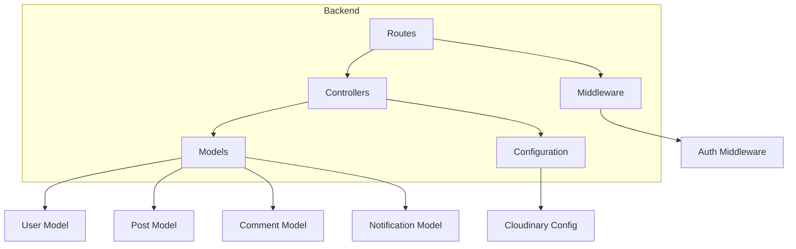
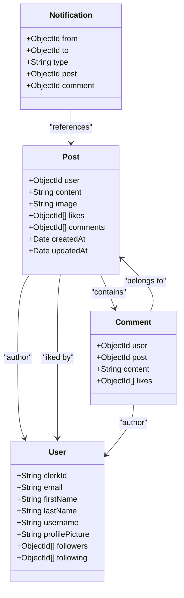
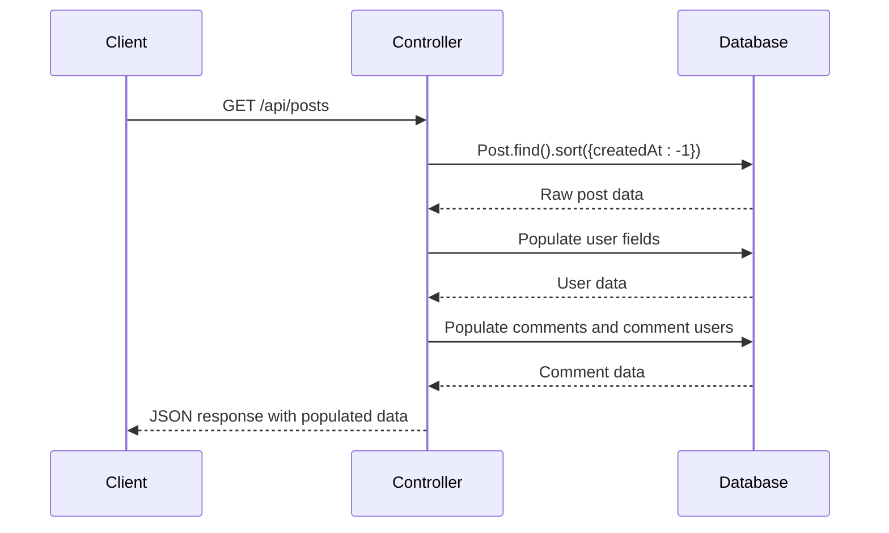
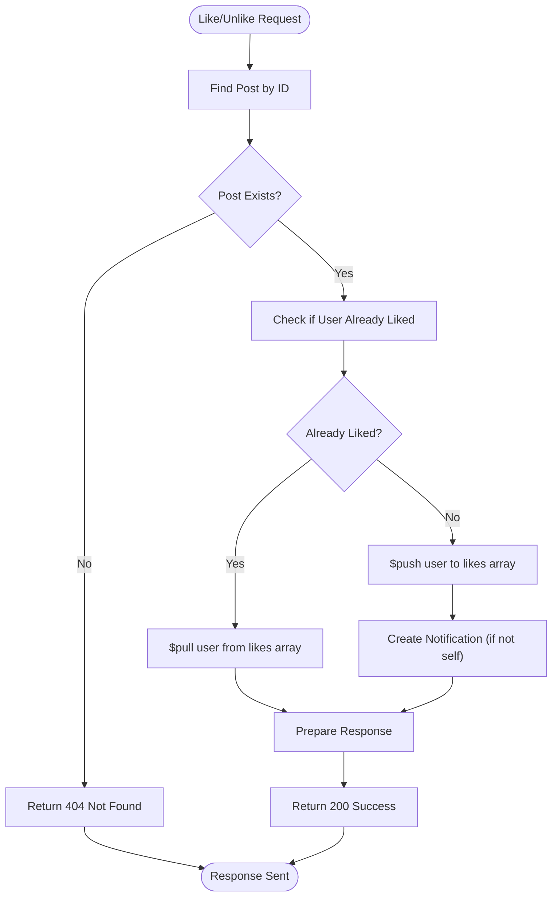
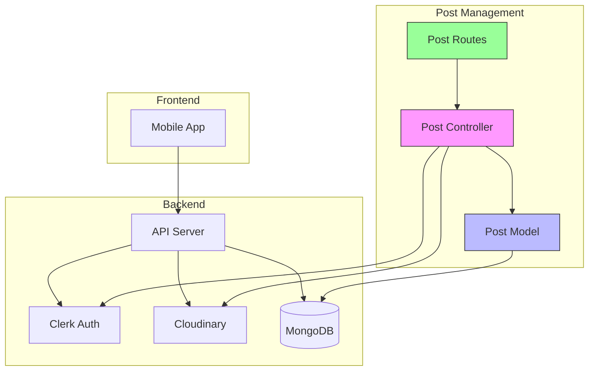

# Post Management Business Logic

<cite>
**Referenced Files in This Document**   
- [post.controller.js](file://backend/src/controllers/post.controller.js)
- [post.model.js](file://backend/src/models/post.model.js)
- [post.route.js](file://backend/src/routes/post.route.js)
- [cloudinary.js](file://backend/src/config/cloudinary.js)
- [user.model.js](file://backend/src/models/user.model.js)
- [comment.model.js](file://backend/src/models/comment.model.js)
- [notification.model.js](file://backend/src/models/notification.model.js)
</cite>

## Table of Contents
1. [Introduction](#introduction)
2. [Project Structure](#project-structure)
3. [Core Components](#core-components)
4. [Post Creation Pipeline](#post-creation-pipeline)
5. [Feed and Post Retrieval Logic](#feed-and-post-retrieval-logic)
6. [Like and Unlike Operations](#like-and-unlike-operations)
7. [Post Deletion Process](#post-deletion-process)
8. [Error Handling and Security](#error-handling-and-security)
9. [Performance Optimization Strategies](#performance-optimization-strategies)
10. [Architecture Overview](#architecture-overview)

## Introduction
This document provides a comprehensive analysis of the post management business logic in the xClone application. It details the implementation of core functionalities including post creation, retrieval, liking, and deletion. The system leverages MongoDB with Mongoose for data modeling, Cloudinary for image storage, and Clerk for authentication. The controller layer uses express-async-handler for error handling and follows RESTful API design principles.

## Project Structure
The xClone project follows a modular backend architecture with clear separation of concerns. The backend is organized into configuration, controllers, middleware, models, and routes directories. The post management functionality is primarily contained within the controllers, models, and routes directories, with dependencies on user, comment, and notification models.



**Diagram sources**
- [post.controller.js](file://backend/src/controllers/post.controller.js)
- [post.model.js](file://backend/src/models/post.model.js)
- [post.route.js](file://backend/src/routes/post.route.js)

**Section sources**
- [post.controller.js](file://backend/src/controllers/post.controller.js)
- [post.model.js](file://backend/src/models/post.model.js)

## Core Components

### Post Model Structure
The Post model defines the core data structure for posts in the xClone application. It includes references to users, content, images, likes, and comments.



**Diagram sources**
- [post.model.js](file://backend/src/models/post.model.js#L1-L35)
- [user.model.js](file://backend/src/models/user.model.js#L1-L62)
- [comment.model.js](file://backend/src/models/comment.model.js#L1-L31)
- [notification.model.js](file://backend/src/models/notification.model.js#L1-L35)

**Section sources**
- [post.model.js](file://backend/src/models/post.model.js#L1-L35)

## Post Creation Pipeline

### createPosts Method Analysis
The `createPosts` method handles the complete post creation workflow, including text content, image upload, and author association.

**Key Process Steps:**
1. Extract authentication data from request
2. Validate input (content or image required)
3. Find authenticated user by Clerk ID
4. Upload image to Cloudinary if provided
5. Create post record in database

```javascript
export const createPosts = asyncHandler(async (req, res) => {
  const { userId } = getAuth(req);
  const { content } = req.body;
  const imageFile = req.file;
  
  if (!content && !imageFile) {
    return res.status(400).json({ message: "Please provide content or image" });
  }
  
  const user = await User.findOne({ clerkId: userId });
  if (!user) return res.status(404).json({ message: "User not found" });

  let imageUrl = "";

  if (imageFile) {
    try {
      const base64Image = `data:${imageFile.mimetype};base64,${imageFile.buffer.toString("base64")}`;
      const uploadResponse = await cloudinary.uploader.upload(base64Image, {
        folder: "social_media_posts",
        resource_type: "image",
        transformation: [
          { width: 800, height: 600, crop: "limit" },
          { quality: "auto" },
          { format: "auto" },
        ],
      });
      imageUrl = uploadResponse.secure_url;
    } catch (uploadError) {
      console.error("Cloudinary upload error:", uploadError);
      return res.status(400).json({ error: "Failed to upload image" });
    }
  }
  
  const post = await Post.create({
    user: user._id,
    content: content || "",
    image: imageUrl,
  });

  res.status(201).json({ post });
});
```

**Key Features:**
- **Default Field Initialization**: Content defaults to empty string, image defaults to empty string in schema
- **Cloudinary Integration**: Images are uploaded with optimization (auto quality, format) and size limiting
- **Authentication**: User association via Clerk authentication system
- **Validation**: Ensures at least content or image is provided

**Section sources**
- [post.controller.js](file://backend/src/controllers/post.controller.js#L79-L123)
- [post.model.js](file://backend/src/models/post.model.js#L1-L35)
- [cloudinary.js](file://backend/src/config/cloudinary.js)

## Feed and Post Retrieval Logic

### Feed Generation with Population
The feed generation logic retrieves posts with populated user and comment data for efficient client-side rendering.



**Diagram sources**
- [post.controller.js](file://backend/src/controllers/post.controller.js#L1-L15)
- [post.model.js](file://backend/src/models/post.model.js#L1-L35)

**Section sources**
- [post.controller.js](file://backend/src/controllers/post.controller.js#L1-L15)

### getPosts and getPost Methods
The retrieval methods implement deep population to minimize client requests:

```javascript
export const getPosts = asyncHandler(async (req, res) => {
  const posts = await Post.find()
    .sort({ createdAt: -1 })
    .populate("user", "username firstName lastName profilePicture")
    .populate({
      path: "comments",
      populate: {
        path: "user",
        select: "username firstName lastName profilePicture",
      },
    });

  res.status(200).json({ posts });
});

export const getPost = asyncHandler(async (req, res) => {
  const { postId } = req.params;
  const post = await Post.findById(postId)
    .populate("user", "username firstName lastName profilePicture")
    .populate({
      path: "comments",
      populate: {
        path: "user",
        select: "username firstName lastName profilePicture",
      },
    });
  if (!post) return res.status(404).json({ message: "Post not found" });
  res.status(200).json({ post });
});
```

**Performance Implications:**
- **Deep Population**: Reduces client requests but increases database load
- **Sorting**: Posts are sorted by createdAt in descending order (newest first)
- **Field Selection**: Only necessary user fields are populated to reduce payload size

**Section sources**
- [post.controller.js](file://backend/src/controllers/post.controller.js#L1-L37)

## Like and Unlike Operations

### Atomic Update Implementation
The like/unlike operations use MongoDB's atomic update operations to prevent race conditions.



**Diagram sources**
- [post.controller.js](file://backend/src/controllers/post.controller.js#L124-L158)

**Section sources**
- [post.controller.js](file://backend/src/controllers/post.controller.js#L124-L158)

### likePost Method Analysis
The likePost method handles both liking and unliking in a single endpoint:

```javascript
export const likePost = asyncHandler(async (req, res) => {
  const { postId } = req.params;
  const { userId } = getAuth(req);
  const user = await User.findOne({ clerkId: userId });
  const post = await Post.findById(postId);
  
  if (!user || !post)
    return res.status(404).json({ message: "User or post Not found" });

  const isLiked = post.likes.includes(user._id);

  if (isLiked) {
    // unlike
    await Post.findByIdAndUpdate(postId, {
      $pull: { likes: user._id },
    });
  } else {
    // like
    await Post.findByIdAndUpdate(postId, {
      $push: { likes: user._id },
    });

    // create notification if not liking own post
    if (post.user.toString() !== user._id.toString()) {
      await Notification.create({
        from: user._id,
        to: post.user,
        type: "like",
        post: postId,
      });
    }
  }

  res.status(200).json({
    message: isLiked ? "Post unliked successfully" : "Post liked successfully",
  });
});
```

**Key Features:**
- **Atomic Operations**: Uses $pull and $push for thread-safe array manipulation
- **Notification System**: Creates notifications when users like others' posts
- **Self-Like Prevention**: Checks if user is liking their own post before creating notification

**Section sources**
- [post.controller.js](file://backend/src/controllers/post.controller.js#L124-L158)
- [notification.model.js](file://backend/src/models/notification.model.js#L1-L35)

## Post Deletion Process

### deletePost Method Analysis
The deletePost method implements a comprehensive deletion process that maintains data integrity.

```javascript
export const deletePost = asyncHandler(async (req, res) => {
  const { userId } = getAuth(req);
  const { postId } = req.params;

  const user = await User.findOne({ clerkId: userId });
  const post = await Post.findById(postId);

  if (!user || !post) return res.status(404).json({ error: "User or post not found" });

  if (post.user.toString() !== user._id.toString()) {
    return res.status(403).json({ error: "You can only delete your own posts" });
  }

  // delete all comments on this post
  await Comment.deleteMany({ post: postId });

  // delete the post
  await Post.findByIdAndDelete(postId);

  res.status(200).json({ message: "Post deleted successfully" });
});
```

**Deletion Workflow:**
1. Authentication and authorization check
2. Verification that user owns the post
3. Cascading deletion of associated comments
4. Removal of the post document

**Section sources**
- [post.controller.js](file://backend/src/controllers/post.controller.js#L150-L158)
- [comment.model.js](file://backend/src/models/comment.model.js#L1-L31)

## Error Handling and Security

### Comprehensive Error Handling
The post controller implements robust error handling for various scenarios:

**Error Cases Handled:**
- **400 Bad Request**: Missing content/image in creation, Cloudinary upload failure
- **403 Forbidden**: Unauthorized post deletion
- **404 Not Found**: Non-existent posts, users, or comments
- **500 Internal Server Error**: Unhandled exceptions (via express-async-handler)

**Security Measures:**
- **Authentication**: All write operations require authentication (protectRoute middleware)
- **Authorization**: Users can only delete their own posts
- **Input Validation**: Content and image validation in createPosts
- **Data Integrity**: Cascading comment deletion when posts are removed

**Section sources**
- [post.controller.js](file://backend/src/controllers/post.controller.js)
- [auth.middleware.js](file://backend/src/middleware/auth.middleware.js)

## Performance Optimization Strategies

### Selective Field Projection
The system uses field selection to optimize data transfer:

```javascript
.populate("user", "username firstName lastName profilePicture")
```

This limits user data to only essential fields, reducing response payload size.

### Route-Level Optimization
The routing configuration implements appropriate middleware:

```javascript
//protected routes
router.post("/", protectRoute, upload.single("image"), createPosts);
router.post("/:postId/like",protectRoute,likePost)
router.delete("/:postId", protectRoute, deletePost)
```

**Optimization Techniques:**
- **Selective Population**: Only populate necessary nested documents
- **Efficient Sorting**: Index-based sorting by createdAt
- **Middleware Chaining**: Apply only necessary middleware per route
- **File Upload Handling**: Process images asynchronously

**Section sources**
- [post.route.js](file://backend/src/routes/post.route.js#L15-L21)
- [post.controller.js](file://backend/src/controllers/post.controller.js)

## Architecture Overview



**Diagram sources**
- [post.controller.js](file://backend/src/controllers/post.controller.js)
- [post.model.js](file://backend/src/models/post.model.js)
- [post.route.js](file://backend/src/routes/post.route.js)
- [server.js](file://backend/src/server.js)