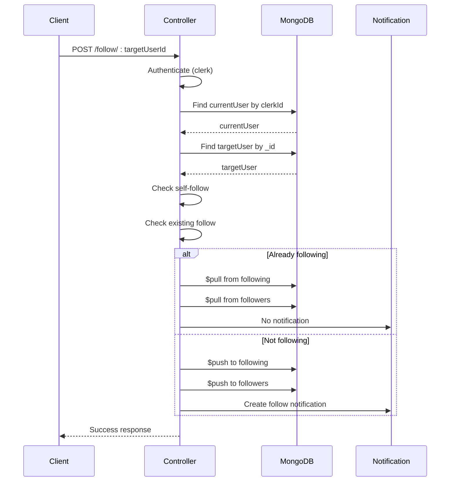

# User Management Business Logic

<cite>
**Referenced Files in This Document**   
- [user.controller.js](file://backend/src/controllers/user.controller.js#L1-L97)
- [user.model.js](file://backend/src/models/user.model.js#L1-L64)
- [notification.model.js](file://backend/src/models/notification.model.js#L1-L37)
- [auth.middleware.js](file://backend/src/middleware/auth.middleware.js#L1-L9)
- [user.route.js](file://backend/src/routes/user.route.js#L1-L19)
</cite>

## Table of Contents
1. [User Management Business Logic](#user-management-business-logic)
2. [Core User Controller Methods](#core-user-controller-methods)
3. [User Data Synchronization from Clerk to MongoDB](#user-data-synchronization-from-clerk-to-mongodb)
4. [Follow/Unfollow Business Logic](#followunfollow-business-logic)
5. [Error Handling and Validation](#error-handling-and-validation)
6. [Performance and Scalability Considerations](#performance-and-scalability-considerations)

## Core User Controller Methods

The `user.controller.js` file implements key user management operations in xClone, including profile retrieval, updates, user synchronization, and social interactions like following. Each method uses `asyncHandler` to simplify error handling in Express.

### getUserProfile
Retrieves a user's public profile by username.

```javascript
export const getUserProfile = asyncHandler(async (req, res) => {
  const { username } = req.params;
  const user = await User.findOne({ username });
  if (!user) {
    return res.status(404).json({ message: "User not found" });
  }
  res.status(200).json({ user });
});
```

This method queries MongoDB for a user with the specified `username`. It returns a 404 status if no user is found.

**Section sources**
- [user.controller.js](file://backend/src/controllers/user.controller.js#L2-L10)

### updateProfile
Allows authenticated users to update their profile information.

```javascript
export const updateProfile = asyncHandler(async (req, res) => {
  const { userId } = getAuth(req);
  const user = await User.findOneAndUpdate({ clerkId: userId }, req.body, {
    new: true,
  });
  if (!user) return res.status(404).json({ message: "User not found" });
  res.status(200).json({ user });
});
```

The method uses Clerk's `getAuth()` to retrieve the authenticated user's `userId`, then updates the corresponding user document in MongoDB using `findOneAndUpdate`. The `new: true` option ensures the updated document is returned.

Supports partial updates, allowing clients to send only the fields they wish to modify (e.g., bio, location, profilePicture).

**Section sources**
- [user.controller.js](file://backend/src/controllers/user.controller.js#L12-L20)

### getCurrentUser
Fetches the currently authenticated user's full profile.

```javascript
export const getCurrentUser = asyncHandler(async (req, res) => {
  const { userId } = getAuth(req);
  const user = await User.findOne({ clerkId: userId });
  if (!user) return res.status(404).json({ message: "User not found" });
  res.status(200).json({ user });
});
```

This endpoint is protected by `protectRoute` middleware and is used to load the logged-in user's data upon application initialization.

**Section sources**
- [user.controller.js](file://backend/src/controllers/user.controller.js#L34-L40)

## User Data Synchronization from Clerk to MongoDB

The `syncUser` function bridges authentication (Clerk) with application data (MongoDB), ensuring user records are created upon first login.

```javascript
export const syncUser = asyncHandler(async (req, res) => {
  const { userId } = getAuth(req);
  const existingUser = await User.findOne({ clerkId: userId });
  if (existingUser) res.status(200).json({ message: "User already exists" });

  const clerkUser = await clerkClient.users.getUser(userId);
  const userData = {
    clerkId: userId,
    email: clerkUser.emailAddresses[0].emailAddress,
    firstName: clerkUser.firstName || "",
    lastName: clerkUser.lastName || "",
    username: clerkUser.emailAddresses[0].emailAddress.split("@")[0],
    profilePicture: clerkUser.imageUrl || "",
  };
  const user = await User.create(userData);
  res.status(201).json({ user, message: "User created successfully" });
});
```

### Field Mapping
| Clerk Field | MongoDB Field | Notes |
|-----------|---------------|-------|
| `userId` | `clerkId` | Primary external ID |
| `emailAddresses[0].emailAddress` | `email` | First email used |
| `firstName` | `firstName` | Optional in Clerk, required in MongoDB |
| `lastName` | `lastName` | Optional in Clerk, required in MongoDB |
| `imageUrl` | `profilePicture` | Profile image URL |
| Derived | `username` | Auto-generated from email prefix |

The system prevents duplicate creation by checking `clerkId` before creating a new user. Username is derived from the email address (e.g., `john@example.com` → `john`).

**Section sources**
- [user.controller.js](file://backend/src/controllers/user.controller.js#L22-L32)
- [user.model.js](file://backend/src/models/user.model.js#L1-L64)

## Follow/Unfollow Business Logic

The `followUser` method implements bidirectional relationship management with atomic updates and notification generation.



**Diagram sources**
- [user.controller.js](file://backend/src/controllers/user.controller.js#L42-L70)
- [notification.model.js](file://backend/src/models/notification.model.js#L1-L37)

### Implementation Details
```javascript
export const followUser = asyncHandler(async (req, res) => {
  const { userId } = getAuth(req);
  const { targetUserId } = req.params;

  if (userId === targetUserId)
    return res.status(400).json({ error: "You cannot follow yourself" });

  const currentUser = await User.findOne({ clerkId: userId });
  const targetUser = await User.findById(targetUserId);

  if (!currentUser || !targetUser)
    return res.status(404).json({ error: "User not found" });

  const isFollowing = currentUser.following.includes(targetUserId);

  if (isFollowing) {
    // Unfollow
    await User.findByIdAndUpdate(currentUser._id, {
      $pull: { following: targetUserId },
    });
    await User.findByIdAndUpdate(targetUserId, {
      $pull: { followers: currentUser._id },
    });
  } else {
    // Follow
    await User.findByIdAndUpdate(currentUser._id, {
      $push: { following: targetUserId },
    });
    await User.findByIdAndUpdate(targetUserId, {
      $push: { followers: currentUser._id },
    });

    // Create notification
    await Notification.create({
      from: currentUser._id,
      to: targetUserId,
      type: "follow",
    });
  }

  res.status(200).json({
    message: isFollowing
      ? "User unfollowed successfully"
      : "User followed successfully",
  });
});
```

The operation is idempotent: calling it twice toggles the follow state. It maintains referential integrity by updating both `following` (on the follower) and `followers` (on the followed) arrays.

**Section sources**
- [user.controller.js](file://backend/src/controllers/user.controller.js#L42-L70)
- [user.model.js](file://backend/src/models/user.model.js#L1-L64)

## Error Handling and Validation

The system implements comprehensive validation and error handling:

### Authentication Validation
Uses `protectRoute` middleware to ensure only authenticated users can access protected endpoints:

```javascript
export const protectRoute = async (req, res, next) => {
  if (!req.auth().isAuthenticated) {
    return res.status(401).json({
      message: "Unauthorized-you must be logged in",
    });
  }
  next();
};
```

**Section sources**
- [auth.middleware.js](file://backend/src/middleware/auth.middleware.js#L1-L9)

### Input and Business Logic Validation
- **Self-follow prevention**: Explicit check to prevent users from following themselves
- **User existence**: Validates both source and target users exist
- **Duplicate handling**: Uses array inclusion checks to determine follow state
- **404 responses**: Returned when users are not found in MongoDB

### Route-Level Protection
All sensitive operations are protected:

```javascript
router.post("/sync", protectRoute, syncUser);
router.post("/me", protectRoute, getCurrentUser);
router.put("/profile", protectRoute, updateProfile);
router.post("/follow/:targetUserId", protectRoute, followUser);
```

**Section sources**
- [user.route.js](file://backend/src/routes/user.route.js#L1-L19)

## Performance and Scalability Considerations

### Indexing Strategy
The `user.model.js` schema includes critical indexes:
- `clerkId`: Unique index for authentication lookups
- `username`: Unique index for profile lookups
- `email`: Unique index for identity management

These ensure O(log n) lookup performance for common operations.

```javascript
clerkId: { type: String, required: true, unique: true },
username: { type: String, required: true, unique: true },
email: { type: String, required: true, unique: true }
```

**Section sources**
- [user.model.js](file://backend/src/models/user.model.js#L1-L64)

### Array-Based Relationships
Follow relationships are stored as arrays of ObjectIds:
```javascript
followers: [{ type: mongoose.Schema.Types.ObjectId, ref: "User" }],
following: [{ type: mongoose.Schema.Types.ObjectId, ref: "User" }]
```

#### Advantages
- Fast reads for follower/following lists
- Simple queries for relationship checks
- Native MongoDB array operations ($push, $pull)

#### Limitations
- Array size limits (MongoDB document size cap: 16MB)
- Potential performance degradation at scale (>100K followers)

### Race Condition Mitigation
Currently, follow operations are not wrapped in transactions. In high-concurrency scenarios, this could lead to race conditions. Recommended enhancement:

```javascript
// Future improvement: Use MongoDB transactions
const session = await mongoose.startSession();
await session.withTransaction(async () => {
  await User.findByIdAndUpdate(..., { session });
  await User.findByIdAndUpdate(..., { session });
  await Notification.create(..., { session });
});
```

### Notification System
Follow actions generate notifications stored in a separate collection, enabling:
- Activity feeds
- Push notifications
- Analytics
- Decoupled processing

**Section sources**
- [user.model.js](file://backend/src/models/user.model.js#L1-L64)
- [notification.model.js](file://backend/src/models/notification.model.js#L1-L37)