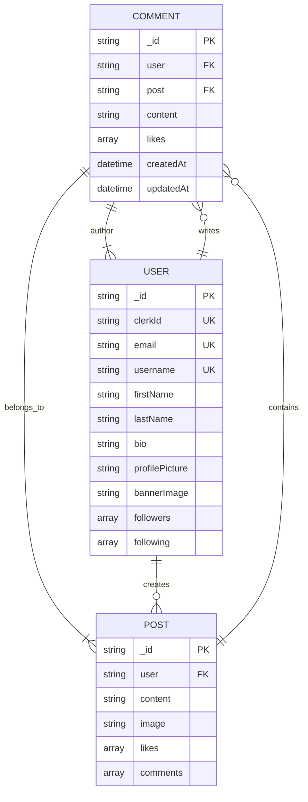
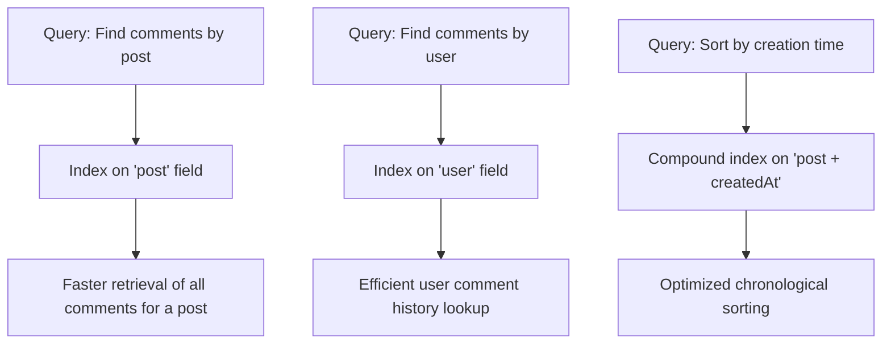
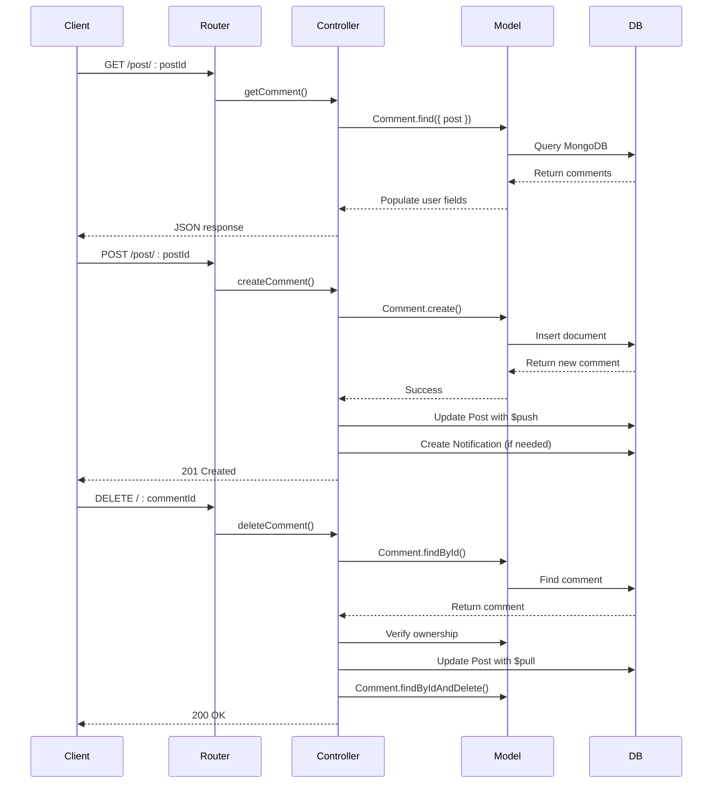

# Comment Model

<cite>
**Referenced Files in This Document**   
- [comment.model.js](file://backend/src/models/comment.model.js)
- [user.model.js](file://backend/src/models/user.model.js)
- [post.model.js](file://backend/src/models/post.model.js)
- [comment.controller.js](file://backend/src/controllers/comment.controller.js)
- [comment.route.js](file://backend/src/routes/comment.route.js)
</cite>

## Table of Contents
1. [Comment Model](#comment-model)
2. [Schema Definition](#schema-definition)
3. [Field Specifications](#field-specifications)
4. [Indexing and Performance](#indexing-and-performance)
5. [Business Rules and Constraints](#business-rules-and-constraints)
6. [Common Queries and Operations](#common-queries-and-operations)
7. [Integration with Controllers and Routes](#integration-with-controllers-and-routes)
8. [Performance Considerations](#performance-considerations)

## Schema Definition

The Comment model is implemented using Mongoose ODM in the xClone application to represent user comments on posts. It defines a structured schema with references to related entities such as users and posts, ensuring data integrity and relational consistency.



**Diagram sources**
- [comment.model.js](file://backend/src/models/comment.model.js#L1-L31)
- [user.model.js](file://backend/src/models/user.model.js#L1-L63)
- [post.model.js](file://backend/src/models/post.model.js#L1-L36)

**Section sources**
- [comment.model.js](file://backend/src/models/comment.model.js#L1-L31)

## Field Specifications

The Comment schema includes the following fields, each with specific data types, constraints, and relationships:

### _id
- **Type**: ObjectId
- **Default**: Automatically generated by MongoDB
- **Description**: Unique identifier for each comment document

### user
- **Type**: ObjectId
- **Reference**: User model
- **Required**: Yes
- **Description**: References the author of the comment. Establishes ownership and enables population of user details such as username and profile picture.

### post
- **Type**: ObjectId
- **Reference**: Post model
- **Required**: Yes
- **Description**: Links the comment to a specific post. Ensures every comment is associated with a valid post in the system.

### content
- **Type**: String
- **Required**: Yes
- **Validation**: Maximum length of 280 characters
- **Description**: The actual text content of the comment. Cannot be empty or consist only of whitespace.

### likes
- **Type**: Array of ObjectId
- **Reference**: User model
- **Default**: Empty array
- **Description**: Stores references to users who have liked this comment. Enables social interaction tracking.

### timestamps
- **Enabled**: Yes (`{ timestamps: true }`)
- **Fields**: `createdAt` and `updatedAt`
- **Description**: Automatically managed by Mongoose to track creation and modification times of comment records.

**Section sources**
- [comment.model.js](file://backend/src/models/comment.model.js#L1-L31)

## Indexing and Performance

To optimize query performance, especially for retrieving comments by post or user, appropriate indexing strategies should be applied:



Although explicit index definitions are not present in the current schema, the frequent use of `.find({ post: postId })` in the controller logic implies that an index on the `post` field would significantly improve read performance. Similarly, queries involving user-based filtering would benefit from an index on the `user` field.

**Diagram sources**
- [comment.model.js](file://backend/src/models/comment.model.js#L1-L31)
- [comment.controller.js](file://backend/src/controllers/comment.controller.js#L3-L10)

**Section sources**
- [comment.model.js](file://backend/src/models/comment.model.js#L1-L31)
- [comment.controller.js](file://backend/src/controllers/comment.controller.js#L3-L10)

## Business Rules and Constraints

Several business rules are enforced at both the model and controller levels to maintain data integrity and application logic:

### Author Immutability
Once a comment is created, its author (`user` field) cannot be changed. This immutability is ensured by only setting the `user` field during creation and not exposing update endpoints that modify ownership.

### No Self-Referential Comments
The system prevents users from commenting on their own posts in a way that triggers notifications to themselves. This is implemented in the `createComment` controller function:
```javascript
if (post.user.toString() !== user._id.toString()) {
  await Notification.create({ /* ... */ });
}
```

### Content Validation
Comments must contain non-empty content. The controller enforces this rule before model creation:
```javascript
if (!content || content.trim() === "") {
  return res.status(400).json({ error: "Comment cannot be empty" });
}
```

Additionally, the schema enforces a maximum length of 280 characters via the `maxLength` validator.

### Ownership-Based Deletion
Users can only delete their own comments. This is verified in the `deleteComment` controller:
```javascript
if (comment.user.toString() !== user._id.toString()) {
  return res.status(403).json({ error: "You can only delete your own comments" });
}
```

**Section sources**
- [comment.controller.js](file://backend/src/controllers/comment.controller.js#L25-L82)

## Common Queries and Operations

### Fetch All Comments for a Post
Retrieves all comments associated with a specific post, sorted by creation time (newest first), with author details populated:

```javascript
const comments = await Comment.find({ post: postId })
  .sort({ createdAt: -1 })
  .populate("user", "username firstName lastName profilePicture");
```

This query is used in the `getComment` controller and benefits from indexing on the `post` field.

### Create a New Comment
Creates a comment after validating content and verifying user/post existence:

```javascript
const comment = await Comment.create({
  user: user._id,
  post: post._id,
  content,
});
```

After creation, the comment ID is added to the parent post's `comments` array using `$push`.

### Delete a Comment by ID and Author
Deletes a comment only if the requesting user is the owner:

```javascript
await Comment.findByIdAndDelete(commentId);
```

Before deletion, the comment is removed from the post's comments array using `$pull`.

**Section sources**
- [comment.controller.js](file://backend/src/controllers/comment.controller.js#L3-L82)

## Integration with Controllers and Routes

The Comment model is integrated into the application through the `comment.controller.js` and exposed via `comment.route.js`:



**Diagram sources**
- [comment.route.js](file://backend/src/routes/comment.route.js#L1-L15)
- [comment.controller.js](file://backend/src/controllers/comment.controller.js#L1-L82)

**Section sources**
- [comment.route.js](file://backend/src/routes/comment.route.js#L1-L15)
- [comment.controller.js](file://backend/src/controllers/comment.controller.js#L1-L82)

## Performance Considerations

### Efficient Pagination
For large comment threads, implement pagination to avoid performance degradation:
```javascript
Comment.find({ post: postId })
  .sort({ createdAt: -1 })
  .skip(page * limit)
  .limit(limit)
  .populate("user", "username profilePicture");
```

### Population Strategies
Use selective population to minimize payload size:
```javascript
.populate("user", "username firstName lastName profilePicture")
```
Only retrieve necessary user fields rather than the entire user document.

### Denormalization for High-Read Scenarios
In high-traffic scenarios, consider denormalizing comment counts on the Post model:
```javascript
postSchema.add({ commentCount: { type: Number, default: 0 } });
```
Update this counter atomically when comments are created or deleted to avoid counting operations on read.

### Index Optimization
Recommended indexes:
- `{ post: 1, createdAt: -1 }` for chronological post comments
- `{ user: 1, createdAt: -1 }` for user comment history
- `{ post: 1 }` for basic post-based lookups

These indexes will significantly improve query performance for common access patterns.

**Section sources**
- [comment.model.js](file://backend/src/models/comment.model.js#L1-L31)
- [comment.controller.js](file://backend/src/controllers/comment.controller.js#L3-L82)