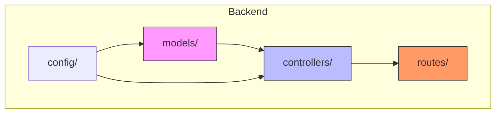
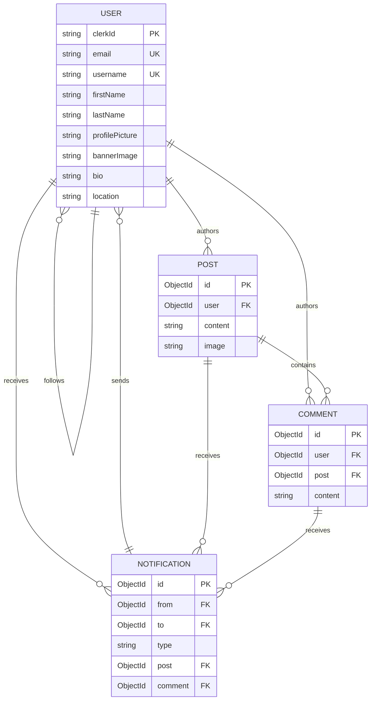

# Data Models & ORM Mapping

<cite>
**Referenced Files in This Document**   
- [user.model.js](file://backend/src/models/user.model.js)
- [post.model.js](file://backend/src/models/post.model.js)
- [comment.model.js](file://backend/src/models/comment.model.js)
- [notification.model.js](file://backend/src/models/notification.model.js)
- [post.controller.js](file://backend/src/controllers/post.controller.js)
- [comment.controller.js](file://backend/src/controllers/comment.controller.js)
- [notification.controller.js](file://backend/src/controllers/notification.controller.js)
</cite>

## Table of Contents
1. [Introduction](#introduction)
2. [Project Structure](#project-structure)
3. [Core Data Models](#core-data-models)
4. [Entity Relationships](#entity-relationships)
5. [Data Access Patterns](#data-access-patterns)
6. [Business Rules and Validation](#business-rules-and-validation)
7. [Performance and Indexing](#performance-and-indexing)
8. [Data Lifecycle and Deletion](#data-lifecycle-and-deletion)

## Introduction
This document provides comprehensive documentation for the xClone application's MongoDB data models implemented using Mongoose ODM. The system consists of four primary entities: User, Post, Comment, and Notification. These models define the structure, relationships, constraints, and business rules governing the social media platform's core functionality. The documentation details field definitions, data types, validation rules, and relationship mappings, along with performance considerations and data access patterns.

## Project Structure
The xClone repository follows a standard backend-mobile monorepo structure. The backend component, located in `backend`, contains the Mongoose models within the `src/models` directory. Each model corresponds to a MongoDB collection and is implemented as a Mongoose schema with associated methods and middleware. The models are consumed by controllers in the `src/controllers` directory, which handle business logic and interact with the database through these models.



**Diagram sources**
- [user.model.js](file://backend/src/models/user.model.js)
- [post.model.js](file://backend/src/models/post.model.js)
- [comment.model.js](file://backend/src/models/comment.model.js)
- [notification.model.js](file://backend/src/models/notification.model.js)

**Section sources**
- [user.model.js](file://backend/src/models/user.model.js)
- [post.model.js](file://backend/src/models/post.model.js)

## Core Data Models

### User Model
The User model represents platform users with personal information and social connections.

**Schema Definition**
```javascript
{
  clerkId: {
    type: String,
    required: true,
    unique: true
  },
  email: {
    type: String,
    required: true,
    unique: true
  },
  firstName: {
    type: String,
    required: true
  },
  lastName: {
    type: String,
    required: true
  },
  username: {
    type: String,
    required: true,
    unique: true
  },
  profilePicture: {
    type: String,
    default: ""
  },
  bannerImage: {
    type: String,
    default: ""
  },
  bio: {
    type: String,
    default: "",
    maxLength: 160
  },
  location: {
    type: String,
    default: ""
  },
  followers: [
    {
      type: mongoose.Schema.Types.ObjectId,
      ref: "User"
    }
  ],
  following: [
    {
      type: mongoose.Schema.Types.ObjectId,
      ref: "User"
    }
  ]
}
```

**Field Descriptions**
- **clerkId**: External authentication ID from Clerk, serves as primary identifier
- **email**: Unique email address, required for login and identification
- **firstName, lastName**: User's personal names, both required
- **username**: Unique handle for profile access, required and unique
- **profilePicture, bannerImage**: URLs to user's profile and banner images
- **bio**: User biography with 160-character limit
- **location**: Geographic location string
- **followers, following**: Arrays of User ObjectIds representing social connections
- **timestamps**: Automatically generated `createdAt` and `updatedAt` fields

**Constraints**
- Unique constraints on: `clerkId`, `email`, `username`
- Required fields: `clerkId`, `email`, `firstName`, `lastName`, `username`
- Maximum length: `bio` (160 characters)

**Section sources**
- [user.model.js](file://backend/src/models/user.model.js#L1-L63)

### Post Model
The Post model represents user-generated content with optional media and engagement metrics.

**Schema Definition**
```javascript
{
  user: {
    type: mongoose.Schema.Types.ObjectId,
    ref: "User",
    required: true
  },
  content: {
    type: String,
    maxLength: 280
  },
  image: {
    type: String,
    default: ""
  },
  likes: [
    {
      type: mongoose.Schema.Types.ObjectId,
      ref: "User"
    }
  ],
  comments: [
    {
      type: mongoose.Schema.Types.ObjectId,
      ref: "Comment"
    }
  ]
}
```

**Field Descriptions**
- **user**: Reference to the authoring User ObjectId, required
- **content**: Text content with 280-character limit
- **image**: URL to attached image, empty string by default
- **likes**: Array of User ObjectIds who liked the post
- **comments**: Array of Comment ObjectIds associated with the post
- **timestamps**: Automatically generated `createdAt` and `updatedAt` fields

**Constraints**
- Required field: `user`
- Maximum length: `content` (280 characters)
- Default value: `image` (empty string)

**Section sources**
- [post.model.js](file://backend/src/models/post.model.js#L1-L36)

### Comment Model
The Comment model represents user responses to posts with engagement tracking.

**Schema Definition**
```javascript
{
  user: {
    type: mongoose.Schema.Types.ObjectId,
    ref: "User",
    required: true
  },
  post: {
    type: mongoose.Schema.Types.ObjectId,
    ref: "Post",
    required: true
  },
  content: {
    type: String,
    required: true,
    maxLength: 280
  },
  likes: [
    {
      type: mongoose.Schema.Types.ObjectId,
      ref: "User"
    }
  ]
}
```

**Field Descriptions**
- **user**: Reference to the authoring User ObjectId, required
- **post**: Reference to the parent Post ObjectId, required
- **content**: Text content, required with 280-character limit
- **likes**: Array of User ObjectIds who liked the comment
- **timestamps**: Automatically generated `createdAt` and `updatedAt` fields

**Constraints**
- Required fields: `user`, `post`, `content`
- Maximum length: `content` (280 characters)

**Section sources**
- [comment.model.js](file://backend/src/models/comment.model.js#L1-L32)

### Notification Model
The Notification model tracks user engagement events for activity feeds.

**Schema Definition**
```javascript
{
  from: {
    type: mongoose.Schema.Types.ObjectId,
    ref: "User",
    required: true
  },
  to: {
    type: mongoose.Schema.Types.ObjectId,
    ref: "User",
    required: true
  },
  type: {
    type: String,
    required: true,
    enum: ["follow", "like", "comment"]
  },
  post: {
    type: mongoose.Schema.Types.ObjectId,
    ref: "Post",
    default: null
  },
  comment: {
    type: mongoose.Schema.Types.ObjectId,
    ref: "Comment",
    default: null
  }
}
```

**Field Descriptions**
- **from**: Reference to the initiating User ObjectId, required
- **to**: Reference to the target User ObjectId, required
- **type**: Notification category with enum values: "follow", "like", "comment"
- **post**: Optional reference to associated Post ObjectId
- **comment**: Optional reference to associated Comment ObjectId
- **timestamps**: Automatically generated `createdAt` and `updatedAt` fields

**Constraints**
- Required fields: `from`, `to`, `type`
- Enum constraint: `type` must be one of ["follow", "like", "comment"]
- Default values: `post`, `comment` (null)

**Section sources**
- [notification.model.js](file://backend/src/models/notification.model.js#L1-L36)

## Entity Relationships

### Relationship Overview
The xClone data model implements several key relationships that enable social networking functionality. These relationships are represented through Mongoose references and populated during queries to reconstruct connected data.



**Diagram sources**
- [user.model.js](file://backend/src/models/user.model.js)
- [post.model.js](file://backend/src/models/post.model.js)
- [comment.model.js](file://backend/src/models/comment.model.js)
- [notification.model.js](file://backend/src/models/notification.model.js)

### Relationship Details

#### User-Post (One-to-Many)
Each User can create multiple Posts, but each Post has exactly one author. This relationship is implemented through the `user` field in the Post model, which references the User ObjectId.

**Data Flow Example**
```javascript
// Creating a post for a user
const post = await Post.create({
  user: user._id,
  content: "Hello world!"
});
```

**Section sources**
- [post.model.js](file://backend/src/models/post.model.js#L6-L8)
- [user.model.js](file://backend/src/models/user.model.js)

#### Post-Comment (One-to-Many)
Each Post can have multiple Comments, but each Comment belongs to exactly one Post. This bidirectional relationship uses the `post` field in Comment and the `comments` array in Post.

**Implementation Details**
- Comment model contains `post` field referencing Post ObjectId
- Post model contains `comments` array storing Comment ObjectIds
- When a comment is created, its ID is pushed to the parent post's comments array

**Section sources**
- [comment.model.js](file://backend/src/models/comment.model.js#L8-L10)
- [post.model.js](file://backend/src/models/post.model.js#L18-L21)

#### User-Followers (Many-to-Many)
Users can follow other users, creating a symmetric many-to-many relationship. This is implemented using two arrays in the User model: `followers` and `following`.

**Relationship Management**
- When User A follows User B:
  - User A's `following` array gains User B's ObjectId
  - User B's `followers` array gains User A's ObjectId

**Section sources**
- [user.model.js](file://backend/src/models/user.model.js#L33-L42)

#### Notification-Target (Many-to-One)
Notifications are sent from one user to another, with optional associations to posts or comments. This relationship connects Notification entities to User, Post, and Comment models.

**Notification Types**
- **follow**: User A follows User B (no post/comment reference)
- **like**: User A likes User B's post (post reference, no comment)
- **comment**: User A comments on User B's post (post and comment references)

**Section sources**
- [notification.model.js](file://backend/src/models/notification.model.js#L4-L19)

## Data Access Patterns

### Feed Generation
The main feed displays posts from followed users in reverse chronological order. While not explicitly implemented in the provided code, this would involve:

```javascript
// Conceptual feed query
const feed = await Post.find({ 
  user: { $in: currentUser.following } 
})
.sort({ createdAt: -1 })
.populate("user", "username firstName lastName profilePicture")
.populate("comments");
```

### Profile Queries
User profile data is retrieved by username, including their posts:

```javascript
// From user.controller.js and post.controller.js
const user = await User.findOne({ username });
const posts = await Post.find({ user: user._id })
  .sort({ createdAt: -1 })
  .populate("user", "username firstName lastName profilePicture")
  .populate({
    path: "comments",
    populate: {
      path: "user",
      select: "username firstName lastName profilePicture",
    },
  });
```

**Section sources**
- [user.controller.js](file://backend/src/controllers/user.controller.js#L5-L12)
- [post.controller.js](file://backend/src/controllers/post.controller.js#L40-L50)

### Notification Fetching
Notifications are retrieved for a specific user, with population of related entities:

```javascript
// From notification.controller.js
const notifications = await Notification.find({ to: user._id })
  .sort({ createdAt: -1 })
  .populate("from", "username firstName lastName profilePicture")
  .populate("post", "content image")
  .populate("comment", "content");
```

**Section sources**
- [notification.controller.js](file://backend/src/controllers/notification.controller.js#L8-L15)

### Comment Retrieval
Comments are fetched by post ID with user information populated:

```javascript
// From comment.controller.js
const comment = await Comment.find({ post: postId })
  .sort({ createdAt: -1 })
  .populate("user", "username firstName lastName profilePicture");
```

**Section sources**
- [comment.controller.js](file://backend/src/controllers/comment.controller.js#L5-L10)

## Business Rules and Validation

### Comment Ownership
Users can only delete their own comments, enforced in the controller:

```javascript
// From comment.controller.js
if (comment.user.toString() !== user._id.toString()) {
  return res.status(403).json({ 
    error: "You can only delete your own comments" 
  });
}
```

**Section sources**
- [comment.controller.js](file://backend/src/controllers/comment.controller.js#L55-L59)

### Post Author Immutability
The post author is set at creation and cannot be changed, enforced by not exposing the user field in update operations.

### Notification Creation Rules
Notifications are created for engagement events but not when users interact with their own content:

```javascript
// From comment.controller.js - prevent self-notification
if (post.user.toString() !== user._id.toString()) {
  await Notification.create({
    from: user._id,
    to: post.user,
    type: "comment",
    post: postId,
    comment: comment._id,
  });
}
```

Similar logic applies to post likes in `post.controller.js`.

**Section sources**
- [comment.controller.js](file://backend/src/controllers/comment.controller.js#L38-L45)
- [post.controller.js](file://backend/src/controllers/post.controller.js#L132-L138)

### Input Validation
Required fields and content constraints are enforced at both model and controller levels:

- Comment content must not be empty (controller validation)
- Maximum lengths enforced: bio (160), content (280)
- Required fields across all models

**Section sources**
- [comment.controller.js](file://backend/src/controllers/comment.controller.js#L7-L9)
- [comment.model.js](file://backend/src/models/comment.model.js#L14-L16)

## Performance and Indexing

### Indexing Strategy
While explicit indexes are not defined in the schema files, Mongoose automatically creates indexes for:

- **Primary Key**: `_id` field in all collections
- **Unique Fields**: `clerkId`, `email`, and `username` in User collection
- **Foreign Keys**: Referenced fields used in population

### Query Optimization
The application uses population to efficiently retrieve related data in single queries:

```javascript
// Nested population for posts with comments and comment authors
Post.find()
  .populate("user")
  .populate({
    path: "comments",
    populate: {
      path: "user",
      select: "username firstName lastName profilePicture",
    },
  });
```

### Population Patterns
The application employs strategic population to minimize database queries:

- User references populated with essential profile fields only
- Nested population used for comment threads
- Selective field projection to reduce payload size

**Section sources**
- [post.controller.js](file://backend/src/controllers/post.controller.js#L3-L7)
- [post.controller.js](file://backend/src/controllers/post.controller.js#L14-L20)

## Data Lifecycle and Deletion

### Soft Delete Pattern
The system does not implement soft deletes; instead, it uses hard deletion with cascade cleanup:

### Cascade Deletion
When a post is deleted, all associated comments are also removed:

```javascript
// From post.controller.js
await Comment.deleteMany({ post: postId });
await Post.findByIdAndDelete(postId);
```

This ensures data consistency by preventing orphaned comments.

**Section sources**
- [post.controller.js](file://backend/src/controllers/post.controller.js#L150-L154)

### Notification Management
Notifications can be individually deleted by the recipient:

```javascript
// From notification.controller.js
const notification = await Notification.findOneAndDelete({
  _id: notificationId,
  to: user._id,
});
```

This implements a user-controlled notification clearance system.

**Section sources**
- [notification.controller.js](file://backend/src/controllers/notification.controller.js#L20-L25)