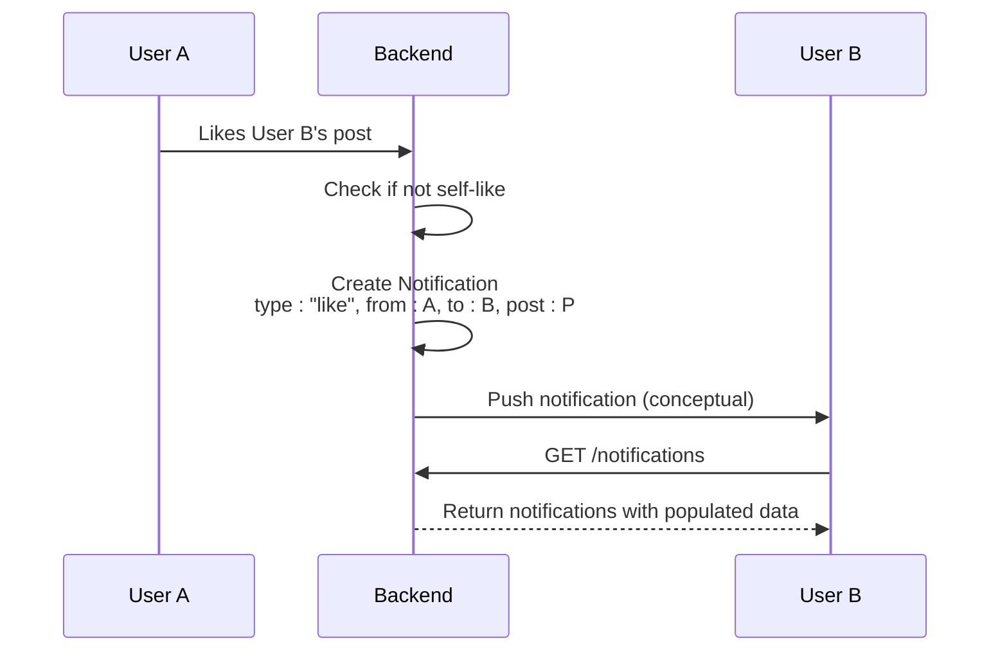

# Notification Model

<cite>
**Referenced Files in This Document**   
- [notification.model.js](file://backend/src/models/notification.model.js)
- [notification.controller.js](file://backend/src/controllers/notification.controller.js)
- [notification.route.js](file://backend/src/routes/notification.route.js)
- [comment.controller.js](file://backend/src/controllers/comment.controller.js)
- [post.controller.js](file://backend/src/controllers/post.controller.js)
- [user.controller.js](file://backend/src/controllers/user.controller.js)
</cite>

## Table of Contents
1. [Notification Model](#notification-model)
2. [Schema Definition](#schema-definition)
3. [Field Specifications](#field-specifications)
4. [Indexing and Query Optimization](#indexing-and-query-optimization)
5. [Business Rules and Constraints](#business-rules-and-constraints)
6. [Common Operations](#common-operations)
7. [Integration with Social Features](#integration-with-social-features)
8. [Performance Considerations](#performance-considerations)

## Schema Definition

The Notification model in xClone is implemented using Mongoose ODM and serves as the backbone for real-time social interaction tracking. It captures events such as likes, comments, and follows, enabling user engagement through a centralized notification system.

```javascript
const notificationSchema = new mongoose.Schema(
  {
    from: {
      type: mongoose.Schema.Types.ObjectId,
      ref: "User",
      required: true,
    },
    to: {
      type: mongoose.Schema.Types.ObjectId,
      ref: "User",
      required: true,
    },
    type: {
      type: String,
      required: true,
      enum: ["follow", "like", "comment"],
    },
    post: {
      type: mongoose.Schema.Types.ObjectId,
      ref: "Post",
      default: null,
    },
    comment: {
      type: mongoose.Schema.Types.ObjectId,
      ref: "Comment",
      default: null,
    },
  },
  { timestamps: true }
);
```

The schema leverages Mongoose's built-in `timestamps` option, automatically generating `createdAt` and `updatedAt` fields for each document. This eliminates the need for manual timestamp management and ensures consistency across all notifications.

**Section sources**
- [notification.model.js](file://backend/src/models/notification.model.js#L1-L36)

## Field Specifications

Each field in the Notification schema plays a critical role in representing social interactions accurately.

### _id
- **Type**: ObjectId (automatically generated by MongoDB)
- **Purpose**: Unique identifier for each notification
- **Default**: Auto-generated upon document creation
- **Validation**: Enforced by MongoDB

### from
- **Type**: ObjectId
- **Reference**: User model
- **Required**: Yes
- **Purpose**: Identifies the user who triggered the notification (e.g., the user who liked a post or sent a follow request)
- **Validation**: Must reference a valid User document

### to
- **Type**: ObjectId
- **Reference**: User model
- **Required**: Yes
- **Purpose**: Specifies the recipient of the notification
- **Validation**: Must reference a valid User document

### type
- **Type**: String
- **Required**: Yes
- **Enum Values**: "follow", "like", "comment"
- **Purpose**: Categorizes the nature of the social interaction
- **Validation**: Restricted to predefined types to ensure data integrity

### post
- **Type**: ObjectId
- **Reference**: Post model
- **Default**: null
- **Purpose**: Optional reference to the post involved in the interaction (e.g., a liked or commented post)
- **Usage**: Populated when the notification is related to a specific post

### comment
- **Type**: ObjectId
- **Reference**: Comment model
- **Default**: null
- **Purpose**: Optional reference to a specific comment (e.g., when a user comments on a post)
- **Usage**: Used in conjunction with `type: "comment"` to provide context

### createdAt and updatedAt
- **Type**: Date
- **Purpose**: Automatically managed timestamps indicating when the notification was created and last modified
- **Source**: Enabled via `{ timestamps: true }` in schema options

**Section sources**
- [notification.model.js](file://backend/src/models/notification.model.js#L1-L36)

## Indexing and Query Optimization

While explicit indexes are not defined in the current schema, MongoDB automatically creates an index on the `_id` field. For optimal performance in retrieving user notifications, queries are executed against the `to` field.

The primary query pattern involves fetching all notifications for a specific user, sorted by creation time:

```javascript
Notification.find({ to: user._id }).sort({ createdAt: -1 });
```

This query benefits from a potential compound index on `{ to: 1, createdAt: -1 }`, which would significantly improve performance as the notification dataset grows. Although not currently implemented, adding this index is recommended for production environments with high user activity.

Additionally, the use of `.populate()` in queries allows efficient joining of related data:
- `from` is populated with basic user info (username, name, profile picture)
- `post` is populated with content and image
- `comment` is populated with its content

These population operations rely on MongoDB's referencing system and should be monitored for performance impact at scale.

**Section sources**
- [notification.controller.js](file://backend/src/controllers/notification.controller.js#L10-L20)

## Business Rules and Constraints

The Notification model enforces several business rules to maintain data integrity and user experience:

### Prevention of Self-Notifications
The system avoids sending notifications to users about their own actions. This is enforced in the logic that creates notifications:
- In `likePost`: Checks `post.user.toString() !== user._id.toString()` before creating a "like" notification
- In `createComment`: Applies the same check before creating a "comment" notification
- In follow functionality: Only creates a notification when one user follows another (not self-follow)

### Atomic Operations
All notification creation and deletion operations are performed atomically using Mongoose methods:
- Creation uses `Notification.create()`
- Deletion uses `Notification.findOneAndDelete()` with ownership verification

This ensures that either the entire operation succeeds or fails, maintaining consistency in the notification state.

### Referential Integrity
By using Mongoose references (`ref: "User"`, `ref: "Post"`, etc.), the schema maintains referential integrity. However, it's important to note that MongoDB does not enforce foreign key constraints at the database level, so application-level checks are essential.

**Section sources**
- [post.controller.js](file://backend/src/controllers/post.controller.js#L120-L140)
- [comment.controller.js](file://backend/src/controllers/comment.controller.js#L40-L50)
- [user.controller.js](file://backend/src/controllers/user.controller.js#L68-L95)

## Common Operations

### Creating a Notification
A new notification is created whenever a social action occurs:

```javascript
await Notification.create({
  from: user._id,
  to: targetUser._id,
  type: "follow",
});
```

This pattern is consistently used across different controllers:
- **Follow**: Triggered in `user.controller.js` when one user follows another
- **Like**: Created in `post.controller.js` when a user likes someone else's post
- **Comment**: Generated in `comment.controller.js` when a user comments on another's post

### Fetching Notifications
Users retrieve their notifications via the `getNotifications` controller:

```javascript
const notifications = await Notification.find({ to: user._id })
  .sort({ createdAt: -1 })
  .populate("from", "username firstName lastName profilePicture")
  .populate("post", "content image")
  .populate("comment", "content");
```

This operation returns a fully enriched list of notifications ordered from newest to oldest.

### Deleting a Notification
Notifications can be removed individually:

```javascript
await Notification.findOneAndDelete({
  _id: notificationId,
  to: user._id,
});
```

The deletion requires both the notification ID and ownership verification (`to: user._id`) to prevent unauthorized deletions.

**Section sources**
- [notification.controller.js](file://backend/src/controllers/notification.controller.js#L5-L35)
- [post.controller.js](file://backend/src/controllers/post.controller.js#L120-L140)
- [comment.controller.js](file://backend/src/controllers/comment.controller.js#L40-L50)

## Integration with Social Features

The Notification model is tightly integrated with xClone's core social features, serving as the communication layer between users.

### Follow System
When a user follows another, a "follow" type notification is created:
```javascript
await Notification.create({
  from: currentUser._id,
  to: targetUserId,
  type: "follow",
});
```
This enables the followed user to see who has started following them.

### Post Interactions
Both likes and comments on posts generate notifications:
- **Like**: Includes reference to the post but not the user (since the action is on the post itself)
- **Comment**: Includes both post and comment references, providing full context

These notifications drive engagement by informing users about interactions with their content.

### Real-Time Engagement
Although real-time delivery (e.g., via WebSockets) is not shown in the current implementation, the model structure supports it. The `to` field enables targeted delivery, while the `type` field allows clients to render appropriate UI elements.



**Diagram sources**
- [post.controller.js](file://backend/src/controllers/post.controller.js#L120-L140)
- [notification.controller.js](file://backend/src/controllers/notification.controller.js#L5-L20)

## Performance Considerations

### Query Efficiency
The current implementation lacks explicit indexing on frequently queried fields. Recommended optimizations include:
- Creating a compound index on `{ to: 1, createdAt: -1 }` for faster notification feed retrieval
- Considering partial indexes for unread notifications if such a feature is added

### Data Retention
No TTL (Time-to-Live) index is currently implemented. For long-term scalability, consider:
- Adding a TTL index to automatically expire old notifications
- Implementing archival strategies for historical data

### Population Overhead
The use of multiple `.populate()` calls in `getNotifications` may impact performance as relationships grow. Potential improvements:
- Selective population based on client needs
- Denormalization of frequently accessed user fields
- Implementing pagination to limit result size

### Scalability
As user activity increases, consider:
- Caching notification counts in the User model
- Using aggregation pipelines for analytics
- Implementing batch processing for bulk operations

While the current implementation effectively supports core functionality, these considerations will be crucial for maintaining performance at scale.

**Section sources**
- [notification.controller.js](file://backend/src/controllers/notification.controller.js#L10-L20)
- [notification.model.js](file://backend/src/models/notification.model.js#L1-L36)