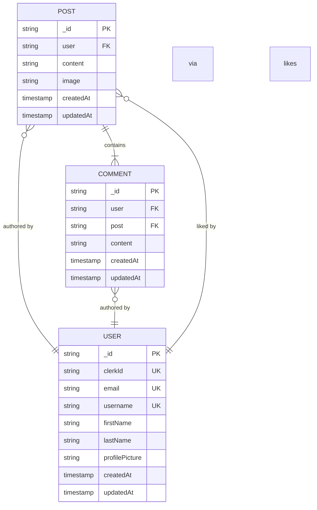

# Post Model

<cite>
**Referenced Files in This Document**   
- [post.model.js](file://backend/src/models/post.model.js)
- [user.model.js](file://backend/src/models/user.model.js)
- [comment.model.js](file://backend/src/models/comment.model.js)
- [post.controller.js](file://backend/src/controllers/post.controller.js)
- [post.route.js](file://backend/src/routes/post.route.js)
</cite>

## Table of Contents
1. [Post Model](#post-model)
2. [Schema Definition](#schema-definition)
3. [Field Details](#field-details)
4. [Relationships and References](#relationships-and-references)
5. [Indexing and Performance](#indexing-and-performance)
6. [Business Rules and Immutability](#business-rules-and-immutability)
7. [Common Operations](#common-operations)
8. [Performance Considerations](#performance-considerations)
9. [Data Model Diagram](#data-model-diagram)

## Schema Definition

The Post model in xClone is implemented using Mongoose ODM for MongoDB, defining the structure of social media posts within the application. The schema captures essential post attributes including content, media, authorship, engagement metrics, and timestamps.

```javascript
// post.model.js
import mongoose from "mongoose";

const postSchema = new mongoose.Schema(
  {
    user: {
      type: mongoose.Schema.Types.ObjectId,
      ref: "User",
      required: true,
    },
    content: {
      type: String,
      maxLength: 280,
    },
    image: {
      type: String,
      default: "",
    },
    likes: [
      {
        type: mongoose.Schema.Types.ObjectId,
        ref: "User",
      },
    ],
    comments: [
      {
        type: mongoose.Schema.Types.ObjectId,
        ref: "Comment",
      },
    ],
  },
  { timestamps: true }
);

const Post = mongoose.model("Post", postSchema);

export default Post;
```

The schema includes automatic timestamp generation for `createdAt` and `updatedAt` fields through the `{ timestamps: true }` option, ensuring temporal tracking of post creation and modification.

**Section sources**
- [post.model.js](file://backend/src/models/post.model.js#L1-L36)

## Field Details

### _id
- **Type**: ObjectId (automatically generated by MongoDB)
- **Description**: Unique identifier for each post
- **Default**: Automatically generated upon document creation
- **Validation**: Enforced by MongoDB as primary key

### user
- **Type**: ObjectId
- **Reference**: User model
- **Required**: Yes
- **Description**: Establishes ownership of the post by linking to the User document
- **Role**: Critical for access control, feed generation, and profile filtering

### content
- **Type**: String
- **Maximum Length**: 280 characters
- **Default**: undefined (nullable)
- **Description**: Text content of the post, similar to a tweet or status update
- **Validation**: Enforced at schema level with maxLength constraint

### image
- **Type**: String
- **Default**: Empty string ("")
- **Description**: URL reference to an uploaded image associated with the post
- **Usage**: Populated when users upload media; stored via Cloudinary integration

### likes
- **Type**: Array of ObjectId
- **Reference**: User model
- **Description**: Stores references to users who have liked the post
- **Functionality**: Enables like/unlike operations and prevents duplicate likes through array operations

### comments
- **Type**: Array of ObjectId
- **Reference**: Comment model
- **Description**: References to comments associated with the post
- **Management**: Maintained through bidirectional linking with Comment documents

### createdAt and updatedAt
- **Type**: Date
- **Generated by**: Mongoose timestamps option
- **Description**: Automatic tracking of creation and last modification times
- **Immutability**: `createdAt` is immutable after document creation

**Section sources**
- [post.model.js](file://backend/src/models/post.model.js#L1-L36)

## Relationships and References

### Author Reference (user)
The `user` field creates a required reference to the User model, establishing ownership of the post. This relationship enables:
- **Access Control**: Ensures only the author can delete or modify their posts
- **Feed Generation**: Allows retrieval of posts by user for profile timelines
- **Data Population**: Supports populating user details (username, profile picture) when displaying posts

Example from controller:
```javascript
// Populate user data when retrieving posts
const posts = await Post.find()
  .populate("user", "username firstName lastName profilePicture");
```

### Likes Relationship
The `likes` array contains ObjectIds referencing User documents, representing users who have liked the post. This design:
- Prevents duplicate likes through MongoDB's array operations
- Enables efficient like/unlike functionality using `$push` and `$pull`
- Supports notification generation when users like others' posts

### Comments Relationship
The `comments` array references Comment documents, creating a one-to-many relationship between posts and comments. This is maintained bidirectionally:
- Post document contains array of comment IDs
- Each Comment document references its parent Post
- Synchronized through application logic in controllers

**Section sources**
- [post.model.js](file://backend/src/models/post.model.js#L1-L36)
- [comment.model.js](file://backend/src/models/comment.model.js#L1-L32)
- [post.controller.js](file://backend/src/controllers/post.controller.js#L77-L123)

## Indexing and Performance

### Author Index
An implicit index is created on the `user` field due to its frequent use in queries:
- **Purpose**: Optimize retrieval of user-specific posts
- **Query Pattern**: `Post.find({ user: userId })`
- **Use Case**: Profile page loading and user feed generation

### Creation Timestamp Index
The `createdAt` field benefits from indexing through Mongoose timestamps:
- **Purpose**: Enable efficient chronological sorting
- **Query Pattern**: `.sort({ createdAt: -1 })`
- **Use Case**: Timeline views and recent posts display

These indexes significantly improve performance for common operations such as:
- Loading a user's timeline
- Displaying recent posts in reverse chronological order
- Filtering posts by author

While explicit index definitions are not shown in the schema, MongoDB automatically creates indexes for fields used in queries, and these access patterns suggest the importance of maintaining proper indexing strategies in production.

**Section sources**
- [post.model.js](file://backend/src/models/post.model.js#L1-L36)
- [post.controller.js](file://backend/src/controllers/post.controller.js#L38-L79)

## Business Rules and Immutability

### Author Immutability
Once a post is created, the author (`user` field) cannot be changed:
- **Enforcement**: Handled at application level
- **Rationale**: Maintains data integrity and prevents ownership spoofing
- **Implementation**: No update operations modify the user field

### Creation Timestamp Immutability
The `createdAt` timestamp is set once upon document creation:
- **Enforcement**: Managed by Mongoose `timestamps` option
- **Behavior**: Value remains constant even if the post is updated
- **Purpose**: Provides reliable chronological ordering

### Access Control Rules
Business logic enforces ownership-based access:
- Users can only delete their own posts
- Like notifications are not generated when liking one's own post
- Comment deletion restricted to comment authors

These rules are implemented in the post controller:
```javascript
if (post.user.toString() !== user._id.toString()) {
  return res.status(403).json({ error: "You can only delete your own posts" });
}
```

**Section sources**
- [post.model.js](file://backend/src/models/post.model.js#L1-L36)
- [post.controller.js](file://backend/src/controllers/post.controller.js#L121-L158)

## Common Operations

### Creating a New Post
```javascript
const post = await Post.create({
  user: user._id,
  content: content || "",
  image: imageUrl,
});
```
- Requires authenticated user
- Accepts optional content and image
- Image uploaded to Cloudinary before persistence

### Checking User Like Status
```javascript
const isLiked = post.likes.includes(user._id);
```
- Used to determine like/unlike state in UI
- Prevents duplicate likes through array membership check

### Populating Author Data
```javascript
const posts = await Post.find()
  .populate("user", "username firstName lastName profilePicture");
```
- Enhances post objects with user information
- Selective field population optimizes payload size

### Like/Unlike Functionality
```javascript
if (isLiked) {
  await Post.findByIdAndUpdate(postId, { $pull: { likes: user._id } });
} else {
  await Post.findByIdAndUpdate(postId, { $push: { likes: user._id } });
}
```
- Uses atomic MongoDB operations for data consistency
- Triggers notifications when liking others' posts

**Section sources**
- [post.controller.js](file://backend/src/controllers/post.controller.js#L77-L123)
- [post.model.js](file://backend/src/models/post.model.js#L1-L36)

## Performance Considerations

### Selective Population
The application uses selective field population to minimize data transfer:
```javascript
.populate("user", "username firstName lastName profilePicture")
```
- Reduces response payload size
- Improves network performance
- Limits exposed user data

### Potential Counter Caching
Currently, like counts are derived by array length:
- **Pros**: Always accurate, no synchronization needed
- **Cons**: Requires loading entire likes array for count
- **Optimization Opportunity**: Consider adding `likeCount` field for frequently accessed counts

### Embedding vs. Referencing
The current design uses referencing for likes and comments:
- **Advantages**: 
  - Enables independent querying of comments
  - Supports rich comment functionality
  - Facilitates notification system
- **Considerations**:
  - Multiple round trips for full post data
  - Join operations through populate

### Scalability Implications
For high-engagement posts:
- Large likes arrays may impact performance
- Consider pagination for likes on popular posts
- Monitor document size limits (16MB in MongoDB)

The bidirectional linking strategy (post→comments and comment→post) ensures data integrity while enabling efficient queries from both directions.

**Section sources**
- [post.model.js](file://backend/src/models/post.model.js#L1-L36)
- [post.controller.js](file://backend/src/controllers/post.controller.js#L38-L79)
- [comment.model.js](file://backend/src/models/comment.model.js#L1-L32)

## Data Model Diagram



**Diagram sources**
- [post.model.js](file://backend/src/models/post.model.js#L1-L36)
- [user.model.js](file://backend/src/models/user.model.js#L1-L63)
- [comment.model.js](file://backend/src/models/comment.model.js#L1-L32)