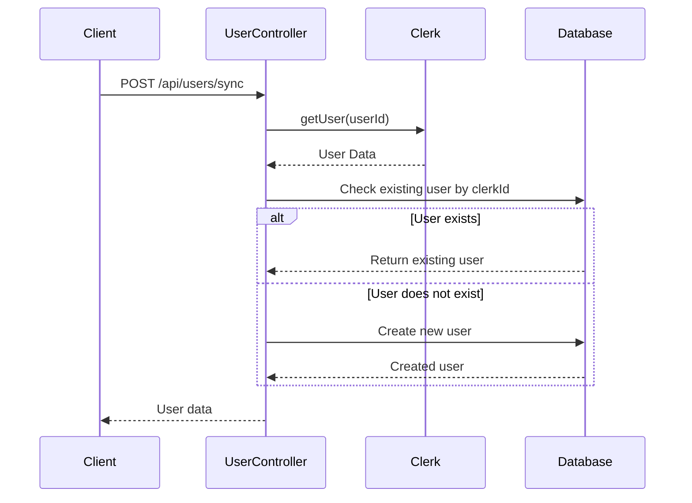
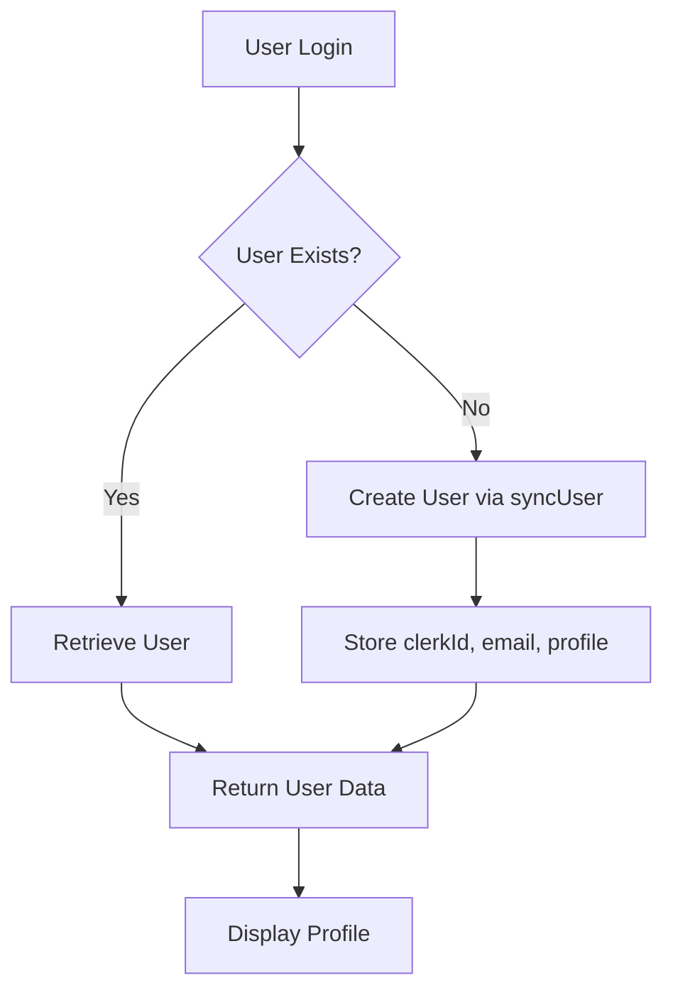

# User Model

<cite>
**Referenced Files in This Document**   
- [user.model.js](file://backend/src/models/user.model.js)
- [user.controller.js](file://backend/src/controllers/user.controller.js)
- [user.route.js](file://backend/src/routes/user.route.js)
</cite>

## Table of Contents
1. [User Model](#user-model)
2. [Schema Fields](#schema-fields)
3. [Unique Constraints and Indexing](#unique-constraints-and-indexing)
4. [Self-Referential Relationships](#self-referential-relationships)
5. [Middleware and Business Logic](#middleware-and-business-logic)
6. [Authentication and Profile Management](#authentication-and-profile-management)
7. [Common Queries and Examples](#common-queries-and-examples)
8. [Performance Considerations](#performance-considerations)

## Schema Fields

The User model in xClone is defined using Mongoose ODM and contains the following fields:

- **clerkId**: 
  - Type: `String`
  - Required: `true`
  - Unique: `true`
  - Purpose: Stores the unique identifier from Clerk authentication service for secure user mapping.

- **email**: 
  - Type: `String`
  - Required: `true`
  - Unique: `true`
  - Purpose: Stores the user's email address, used for identification and communication.

- **firstName**: 
  - Type: `String`
  - Required: `true`
  - Purpose: Stores the user's first name for display and personalization.

- **lastName**: 
  - Type: `String`
  - Required: `true`
  - Purpose: Stores the user's last name for display and personalization.

- **username**: 
  - Type: `String`
  - Required: `true`
  - Unique: `true`
  - Purpose: A unique handle for the user, used in profile URLs and mentions.

- **profilePicture**: 
  - Type: `String`
  - Default: `""`
  - Purpose: URL to the user's profile image, typically hosted on a CDN like Cloudinary.

- **bannerImage**: 
  - Type: `String`
  - Default: `""`
  - Purpose: URL to the user's profile banner image.

- **bio**: 
  - Type: `String`
  - Default: `""`
  - Max Length: `160`
  - Purpose: Short biography or description of the user.

- **location**: 
  - Type: `String`
  - Default: `""`
  - Purpose: Geographic location provided by the user.

- **followers**: 
  - Type: `[ObjectId]`
  - Reference: `User`
  - Purpose: Array of ObjectIds referencing users who follow this user.

- **following**: 
  - Type: `[ObjectId]`
  - Reference: `User`
  - Purpose: Array of ObjectIds referencing users this user follows.

- **timestamps**: 
  - Enabled: `true`
  - Adds: `createdAt` and `updatedAt` fields automatically.

**Section sources**
- [user.model.js](file://backend/src/models/user.model.js#L1-L62)

## Unique Constraints and Indexing

The User schema enforces uniqueness on three key fields: `clerkId`, `email`, and `username`. These constraints ensure that:
- Each user has a unique Clerk identifier for secure authentication integration.
- Email addresses are globally unique to prevent impersonation and support account recovery.
- Usernames are unique across the platform to enable unambiguous user mentions and profile access.

These fields are implicitly indexed by MongoDB due to the `unique: true` constraint, which significantly improves query performance for operations such as:
- Authenticating users by `clerkId`
- Looking up users by `email` or `username`
- Preventing duplicate account creation

This indexing strategy ensures O(log n) lookup time for these critical operations.

**Section sources**
- [user.model.js](file://backend/src/models/user.model.js#L5-L62)

## Self-Referential Relationships

The User model implements a self-referential many-to-many relationship through two array fields:
- `followers`: Array of ObjectIds referencing other User documents
- `following`: Array of ObjectIds referencing other User documents

This design enables the social graph functionality where users can follow each other. The relationship is symmetric — when User A follows User B:
- User A's `_id` is added to User B's `followers` array
- User B's `_id` is added to User A's `following` array

This implementation allows for efficient retrieval of:
- Who a user follows (`User.findById(id).populate('following')`)
- Who follows a user (`User.findById(id).populate('followers')`)

However, this array-based approach may face scalability challenges with very large follower counts due to document size limits in MongoDB.

**Section sources**
- [user.model.js](file://backend/src/models/user.model.js#L45-L62)

## Middleware and Business Logic

While the User model itself does not define pre-save hooks in the provided code, business logic is enforced in the controller layer:

- **Username Generation**: In `syncUser`, the username is automatically generated from the email address by taking the part before the `@` symbol.
- **Photo URL Handling**: The `profilePicture` is set from Clerk's `imageUrl`, with a fallback to an empty string if not provided.
- **Data Sanitization**: Default values are applied for optional fields like `bio`, `location`, and `bannerImage`.

The `syncUser` function ensures that users are created with complete data upon first login via Clerk authentication.



**Diagram sources**
- [user.controller.js](file://backend/src/controllers/user.controller.js#L15-L35)
- [user.model.js](file://backend/src/models/user.model.js#L1-L62)

**Section sources**
- [user.controller.js](file://backend/src/controllers/user.controller.js#L15-L70)

## Authentication and Profile Management

The User model serves as the foundation for:
- **Authentication**: Integrated with Clerk via the `clerkId` field, enabling secure, passwordless login.
- **Profile Management**: Users can update their profile information through the `updateProfile` endpoint.
- **Social Interactions**: Followers/following relationships enable social networking features.

Key endpoints include:
- `POST /api/users/sync`: Creates a new user from Clerk authentication data
- `PUT /api/users/profile`: Updates user profile information
- `GET /api/users/profile/:username`: Retrieves a user's public profile



**Diagram sources**
- [user.controller.js](file://backend/src/controllers/user.controller.js#L15-L70)
- [user.route.js](file://backend/src/routes/user.route.js#L1-L17)

**Section sources**
- [user.controller.js](file://backend/src/controllers/user.controller.js#L15-L96)
- [user.route.js](file://backend/src/routes/user.route.js#L1-L17)

## Common Queries and Examples

### Fetch User by Clerk ID
```javascript
const user = await User.findOne({ clerkId: userId });
```

### Populate Followers and Following
```javascript
const userWithRelationships = await User.findById(userId)
  .populate('followers', 'username firstName lastName profilePicture')
  .populate('following', 'username firstName lastName profilePicture');
```

### Update User Bio
```javascript
const updatedUser = await User.findOneAndUpdate(
  { clerkId: userId },
  { bio: "New bio text" },
  { new: true }
);
```

### Get User by Username
```javascript
const user = await User.findOne({ username: "john_doe" });
```

**Section sources**
- [user.controller.js](file://backend/src/controllers/user.controller.js#L5-L70)

## Performance Considerations

### Index Usage
The `clerkId`, `email`, and `username` fields are indexed due to their unique constraints, ensuring fast lookups for authentication and profile access.

### Array Relationship Limitations
The array-based followers/following implementation has the following limitations:
- **Document Size**: Large follow counts could approach MongoDB's 16MB document limit
- **Update Performance**: `$push` and `$pull` operations on large arrays become slower
- **Memory Usage**: Loading users with thousands of followers consumes significant memory

### Optimization Recommendations
- Consider a separate `Follow` collection for very large-scale applications
- Implement pagination for followers/following lists
- Use projection to limit returned fields in queries
- Cache frequently accessed user data

**Section sources**
- [user.model.js](file://backend/src/models/user.model.js#L1-L62)
- [user.controller.js](file://backend/src/controllers/user.controller.js#L70-L96)