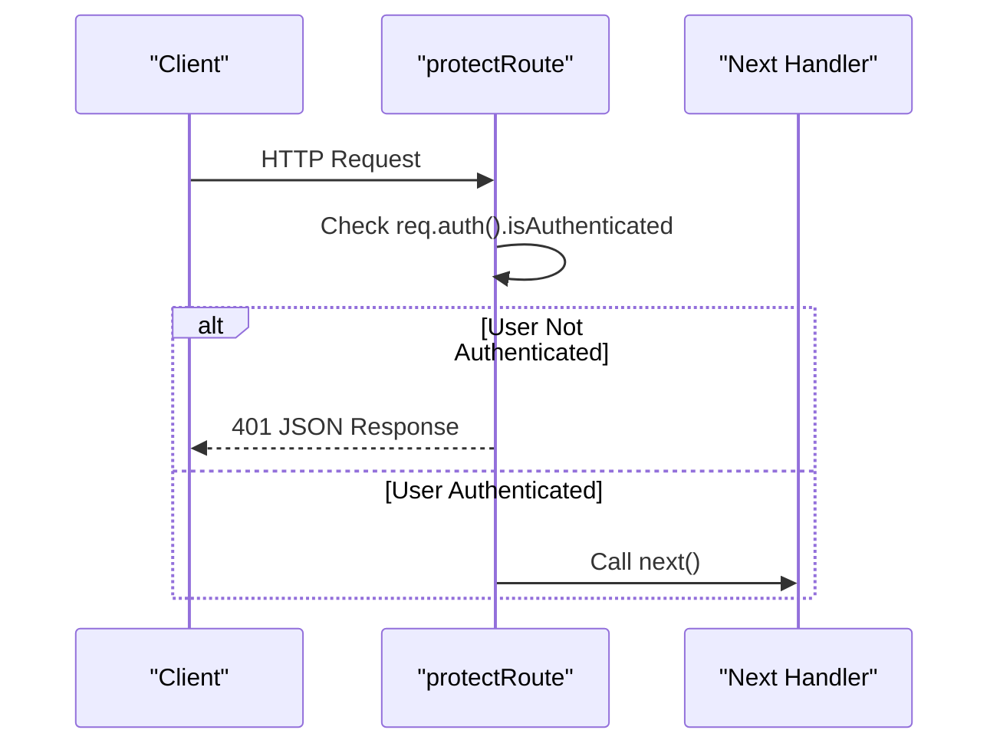
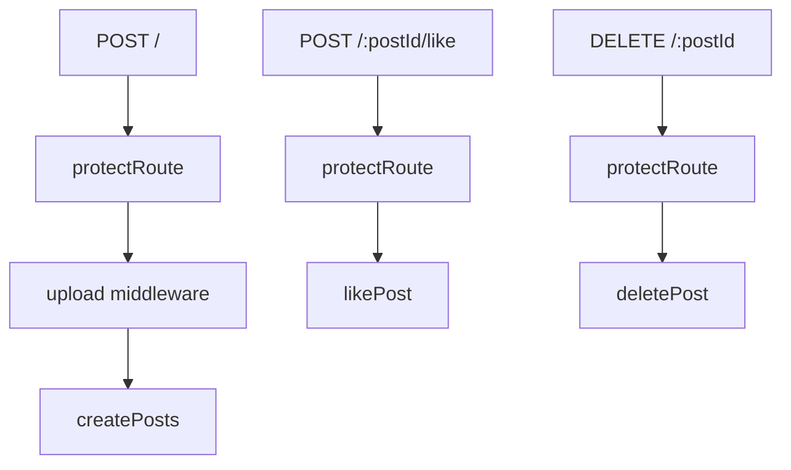
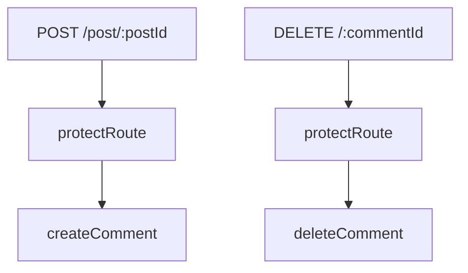

# Authentication Middleware

<cite>
**Referenced Files in This Document**   
- [auth.middleware.js](file://backend/src/middleware/auth.middleware.js#L1-L9)
- [user.route.js](file://backend/src/routes/user.route.js#L1-L19)
- [post.route.js](file://backend/src/routes/post.route.js#L1-L22)
- [comment.route.js](file://backend/src/routes/comment.route.js#L1-L16)
</cite>

## Table of Contents
1. [Introduction](#introduction)
2. [Project Structure](#project-structure)
3. [Core Components](#core-components)
4. [Architecture Overview](#architecture-overview)
5. [Detailed Component Analysis](#detailed-component-analysis)
6. [Dependency Analysis](#dependency-analysis)
7. [Performance Considerations](#performance-considerations)
8. [Troubleshooting Guide](#troubleshooting-guide)
9. [Conclusion](#conclusion)

## Introduction
This document provides a comprehensive analysis of the authentication middleware implementation in the xClone backend system. It details how the `auth.middleware.js` file integrates with Clerk to secure API endpoints by validating user authentication status through JWT tokens. The middleware ensures that only authenticated users can access protected routes, attaching user context to requests and returning appropriate error responses when authentication fails. This documentation explains the middleware’s integration with Express.js, its application across various route files, and its role in maintaining secure, scalable API access control.

## Project Structure
The xClone project follows a modular backend architecture organized under the `backend/src` directory. Key components relevant to authentication are grouped into logical folders:
- **middleware**: Contains reusable middleware functions like `auth.middleware.js`
- **routes**: Defines API endpoints for different resources (users, posts, comments)
- **controllers**: Implements business logic for each route
- **models**: Manages data structures and database interactions

Authentication is centralized in the middleware layer and applied selectively to routes requiring protection.

```mermaid
graph TB
subgraph "Backend"
Middleware[Middleware]
Routes[Routes]
Controllers[Controllers]
Models[Models]
end
Middleware --> Routes : "Applied to"
Routes --> Controllers : "Delegates logic"
Controllers --> Models : "Interacts with"
```

**Diagram sources**
- [auth.middleware.js](file://backend/src/middleware/auth.middleware.js#L1-L9)
- [user.route.js](file://backend/src/routes/user.route.js#L1-L19)

## Core Components
The core component for authentication is the `protectRoute` middleware function defined in `auth.middleware.js`. This function intercepts incoming HTTP requests and verifies whether the user is authenticated using Clerk’s authentication mechanism. If authentication fails, it returns a 401 Unauthorized response; otherwise, it allows the request to proceed to the next handler.

Key responsibilities include:
- Checking `req.auth().isAuthenticated` status
- Rejecting unauthenticated requests with proper error messages
- Passing control to the next middleware or route handler upon successful authentication

```javascript
export const protectRoute = async (req, res, next) => {
  if (!req.auth().isAuthenticated) {
    return res.status(401).json({
      message: "Unauthorized - you must be logged in",
    });
  }
  next();
};
```

**Section sources**
- [auth.middleware.js](file://backend/src/middleware/auth.middleware.js#L1-L9)

## Architecture Overview
The authentication architecture leverages Clerk’s integration with Express.js to provide session-aware request handling. Upon each incoming request, Clerk populates the `req.auth()` method with user session data derived from JWT tokens. The `protectRoute` middleware uses this information to enforce access control before any business logic executes.

```mermaid
graph LR
A[Client Request] --> B{Clerk Auth<br/>Populates req.auth()}
B --> C[protectRoute Middleware]
C --> D{Is Authenticated?}
D --> |Yes| E[Proceed to Controller]
D --> |No| F[Return 401 Response]
```

**Diagram sources**
- [auth.middleware.js](file://backend/src/middleware/auth.middleware.js#L1-L9)
- [user.route.js](file://backend/src/routes/user.route.js#L1-L19)

## Detailed Component Analysis

### protectRoute Middleware Analysis
The `protectRoute` function is a critical security gatekeeper in the xClone application. It operates as an Express middleware, meaning it sits between the incoming request and the final route handler.

#### Function Signature and Flow


**Diagram sources**
- [auth.middleware.js](file://backend/src/middleware/auth.middleware.js#L1-L9)

#### Code-Level Breakdown
- **Authentication Check**: Uses `req.auth().isAuthenticated` provided by Clerk to determine login status
- **Error Response**: Returns a structured JSON response with HTTP status 401 if not authenticated
- **Control Flow**: Calls `next()` only when authentication succeeds, allowing request processing to continue

This pattern ensures consistent security enforcement across all protected routes without duplicating logic.

**Section sources**
- [auth.middleware.js](file://backend/src/middleware/auth.middleware.js#L1-L9)

### Route Integration Analysis
The `protectRoute` middleware is imported and applied directly within route definitions to protect specific endpoints.

#### User Routes Protection
In `user.route.js`, several sensitive operations require authentication:
- `/sync`: Sync user data
- `/me`: Retrieve current user
- `/profile`: Update profile
- `/follow/:targetUserId`: Follow another user

Each of these routes applies `protectRoute` before the controller function.

```mermaid
flowchart TD
A[/sync] --> B[protectRoute]
B --> C[syncUser]
D[/me] --> E[protectRoute]
E --> F[getCurrentUser]
G[/profile] --> H[protectRoute]
H --> I[updateProfile]
```

**Diagram sources**
- [user.route.js](file://backend/src/routes/user.route.js#L1-L19)

#### Post Routes Protection
In `post.route.js`, write operations are protected:
- `POST /`: Create new post
- `POST /:postId/like`: Like a post
- `DELETE /:postId`: Delete a post

Read operations remain public.



**Diagram sources**
- [post.route.js](file://backend/src/routes/post.route.js#L1-L22)

#### Comment Routes Protection
In `comment.route.js`, only mutation operations are secured:
- `POST /post/:postId`: Create comment
- `DELETE /:commentId`: Delete comment

Retrieval (`GET`) is publicly accessible.



**Diagram sources**
- [comment.route.js](file://backend/src/routes/comment.route.js#L1-L16)

**Section sources**
- [user.route.js](file://backend/src/routes/user.route.js#L1-L19)
- [post.route.js](file://backend/src/routes/post.route.js#L1-L22)
- [comment.route.js](file://backend/src/routes/comment.route.js#L1-L16)

## Dependency Analysis
The authentication middleware depends on Clerk’s Express integration to populate the `req.auth()` method. It has no direct dependencies on models or databases, making it lightweight and reusable.

```mermaid
graph TD
Clerk[Clerk SDK] --> |Provides| ReqAuth[req.auth()]
ReqAuth --> AuthMiddleware[protectRoute]
AuthMiddleware --> UserRoutes[user.route.js]
AuthMiddleware --> PostRoutes[post.route.js]
AuthMiddleware --> CommentRoutes[comment.route.js]
```

**Diagram sources**
- [auth.middleware.js](file://backend/src/middleware/auth.middleware.js#L1-L9)
- [user.route.js](file://backend/src/routes/user.route.js#L1-L19)
- [post.route.js](file://backend/src/routes/post.route.js#L1-L22)
- [comment.route.js](file://backend/src/routes/comment.route.js#L1-L16)

## Performance Considerations
The `protectRoute` middleware introduces minimal overhead since it only performs a boolean check on an already-parsed authentication object (`req.auth().isAuthenticated`). Clerk handles JWT verification asynchronously during request initialization, so the middleware itself does not perform cryptographic operations.

Best practices observed:
- Synchronous check avoids blocking I/O
- Early return prevents unnecessary processing
- Stateless design scales well with load balancers

No performance bottlenecks are expected under normal usage.

## Troubleshooting Guide
Common issues and solutions when working with the authentication middleware:

### Issue: Always Returns 401 Unauthorized
**Cause**: Missing or invalid JWT token in request  
**Solution**: Ensure requests include valid authentication headers. For browser clients, verify Clerk session is active.

### Issue: req.auth is not a function
**Cause**: Clerk middleware not applied globally  
**Solution**: Confirm Clerk’s Express middleware is registered in `server.js` before any routes.

### Issue: CORS Conflicts with Authentication
**Cause**: Preflight requests blocked by middleware  
**Solution**: Apply CORS middleware before authentication, or exclude preflight (`OPTIONS`) from protection.

### Issue: Token Expiration Not Handled Gracefully
**Cause**: Client-side token refresh not implemented  
**Solution**: Implement token refresh logic in frontend using Clerk hooks.

### Debugging Tips
- Log `req.auth()` output during development to inspect session state
- Use Postman or curl to test endpoints with and without authentication headers
- Verify middleware order in Express app setup

**Section sources**
- [auth.middleware.js](file://backend/src/middleware/auth.middleware.js#L1-L9)

## Conclusion
The `protectRoute` middleware in xClone provides a clean, reusable mechanism for securing API endpoints using Clerk’s authentication system. By centralizing access control logic, it ensures consistency across user, post, and comment routes while keeping implementation simple and maintainable. Its integration with Express.js follows standard middleware patterns, making it easy to extend for advanced use cases such as role-based access control or custom claim validation. With proper error handling and minimal performance impact, this middleware forms a robust foundation for secure API design in the xClone application.