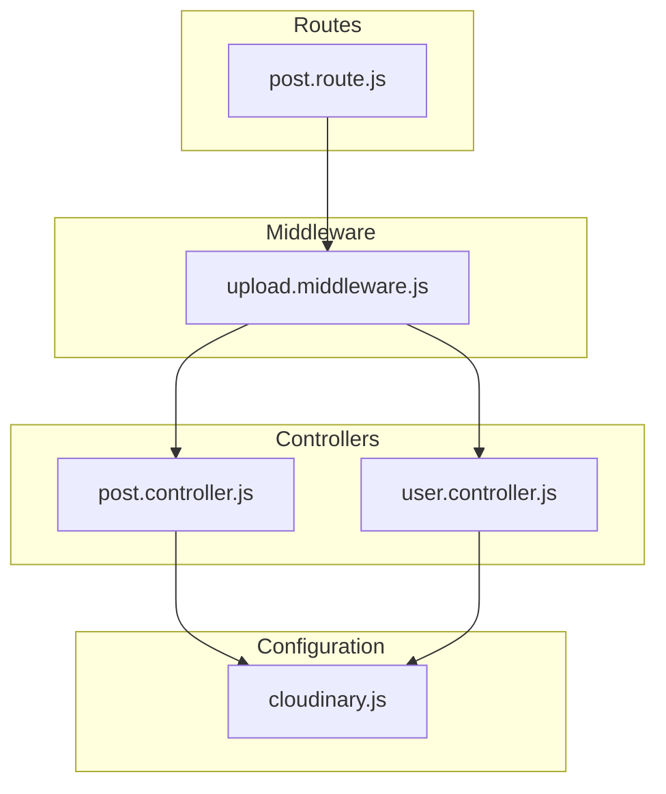
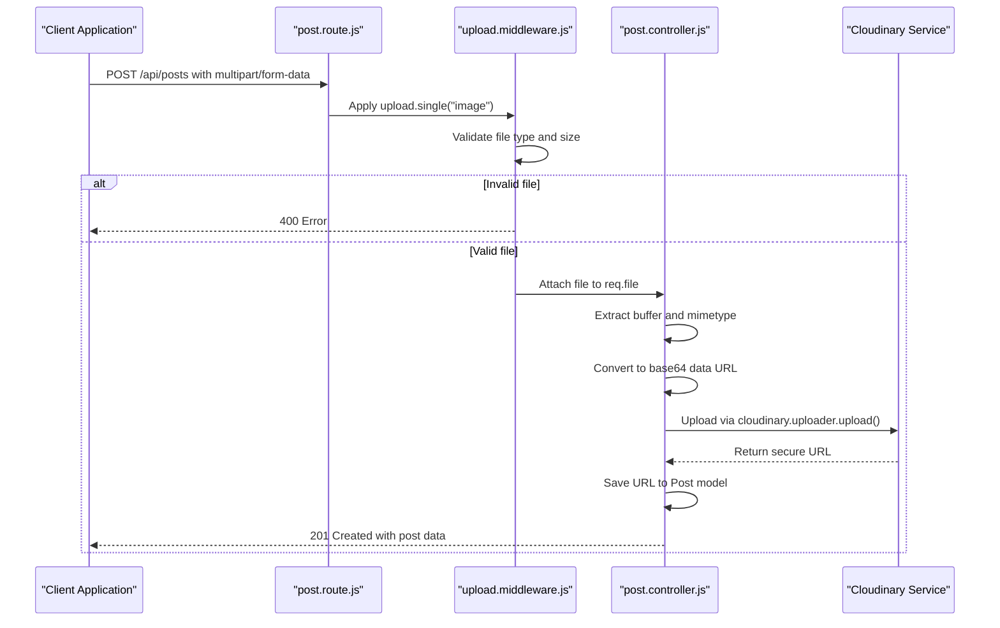
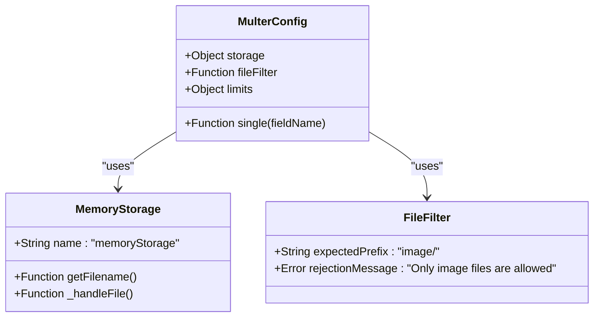
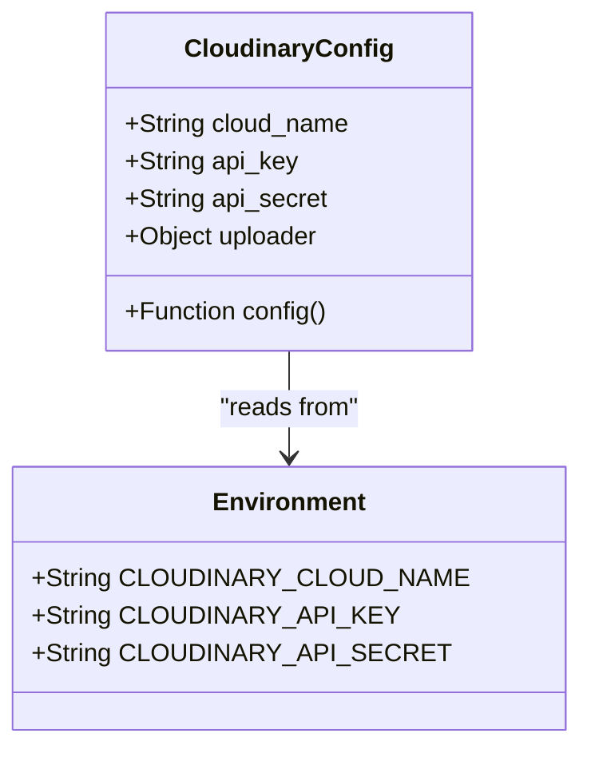
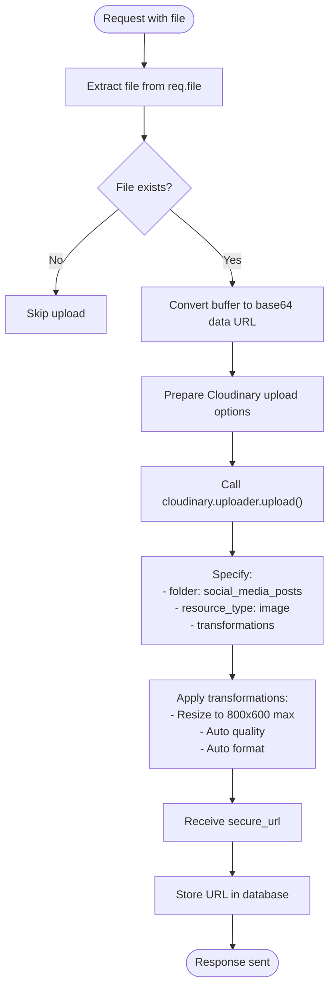
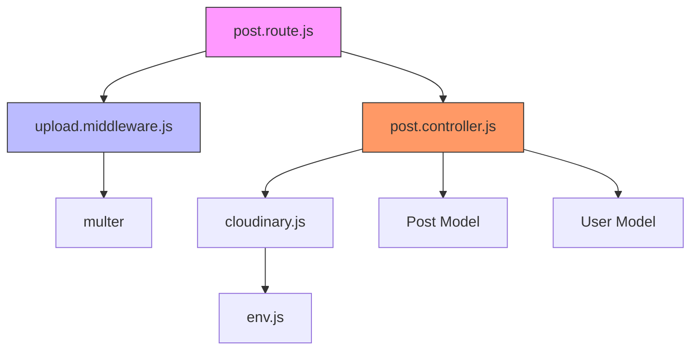

# File Upload Middleware

<cite>
**Referenced Files in This Document**   
- [upload.middleware.js](file://backend/src/middleware/upload.middleware.js#L1-L22)
- [cloudinary.js](file://backend/src/config/cloudinary.js#L1-L11)
- [post.controller.js](file://backend/src/controllers/post.controller.js#L1-L159)
- [user.controller.js](file://backend/src/controllers/user.controller.js#L1-L97)
- [post.route.js](file://backend/src/routes/post.route.js#L1-L20)
</cite>

## Table of Contents
1. [Introduction](#introduction)
2. [Project Structure](#project-structure)
3. [Core Components](#core-components)
4. [Architecture Overview](#architecture-overview)
5. [Detailed Component Analysis](#detailed-component-analysis)
6. [Dependency Analysis](#dependency-analysis)
7. [Performance Considerations](#performance-considerations)
8. [Troubleshooting Guide](#troubleshooting-guide)
9. [Conclusion](#conclusion)

## Introduction
This document provides a comprehensive analysis of the file upload middleware implementation in the xClone backend system. It details how the `upload.middleware.js` file configures Multer to securely handle image uploads, enforces size and MIME type restrictions, and integrates with Cloudinary for cloud storage. The document also explains how this middleware is used in both post and user controllers, and outlines best practices for secure and efficient file handling.

## Project Structure
The xClone project follows a modular backend architecture with clear separation of concerns. The file upload functionality is centralized in the middleware layer and leveraged by controllers handling user and post data. The relevant components are organized as follows:



**Diagram sources**
- [upload.middleware.js](file://backend/src/middleware/upload.middleware.js#L1-L22)
- [post.controller.js](file://backend/src/controllers/post.controller.js#L1-L159)
- [user.controller.js](file://backend/src/controllers/user.controller.js#L1-L97)
- [cloudinary.js](file://backend/src/config/cloudinary.js#L1-L11)
- [post.route.js](file://backend/src/routes/post.route.js#L1-L20)

**Section sources**
- [upload.middleware.js](file://backend/src/middleware/upload.middleware.js#L1-L22)
- [post.route.js](file://backend/src/routes/post.route.js#L1-L20)

## Core Components
The file upload system in xClone consists of three core components:
- **Multer Middleware**: Handles parsing of multipart form data and initial file validation
- **Cloudinary Configuration**: Manages credentials and connection to the cloud storage service
- **Controller Integration**: Processes uploaded files and manages their lifecycle

The middleware uses memory storage to buffer files before uploading to Cloudinary, ensuring no temporary files are left on the server. It enforces a 5MB file size limit and restricts uploads to image files only.

**Section sources**
- [upload.middleware.js](file://backend/src/middleware/upload.middleware.js#L1-L22)
- [cloudinary.js](file://backend/src/config/cloudinary.js#L1-L11)
- [post.controller.js](file://backend/src/controllers/post.controller.js#L1-L159)

## Architecture Overview
The file upload architecture follows a clean flow from client request to cloud storage:



**Diagram sources**
- [upload.middleware.js](file://backend/src/middleware/upload.middleware.js#L1-L22)
- [post.controller.js](file://backend/src/controllers/post.controller.js#L38-L79)
- [post.route.js](file://backend/src/routes/post.route.js#L1-L20)

## Detailed Component Analysis

### Upload Middleware Analysis
The `upload.middleware.js` file implements a specialized Multer configuration for handling image uploads with strict security controls.

#### Configuration Details


**Diagram sources**
- [upload.middleware.js](file://backend/src/middleware/upload.middleware.js#L1-L22)

#### Key Implementation Features
- **Memory Storage Strategy**: Files are stored in memory as Buffer objects rather than on disk, eliminating risks associated with temporary file management and cleanup
- **MIME Type Filtering**: The `fileFilter` function only accepts files with MIME types starting with "image/" (e.g., image/jpeg, image/png, image/gif)
- **Size Limitation**: Enforces a 5MB (5,242,880 bytes) maximum file size to prevent denial-of-service attacks
- **Field Name Expectation**: Configured to handle single file uploads via the "image" field name using `upload.single("image")`

**Section sources**
- [upload.middleware.js](file://backend/src/middleware/upload.middleware.js#L1-L22)

### Cloudinary Integration Analysis
The system integrates with Cloudinary for reliable, scalable image storage with automatic optimization.

#### Configuration Implementation


**Diagram sources**
- [cloudinary.js](file://backend/src/config/cloudinary.js#L1-L11)

#### Upload Process Flow


**Diagram sources**
- [post.controller.js](file://backend/src/controllers/post.controller.js#L38-L79)

### Controller Integration Analysis
The file upload middleware is integrated into both post and user functionality, though currently only post creation uses file uploads.

#### Post Controller Implementation
The `createPosts` function in `post.controller.js` demonstrates the complete upload workflow:

```javascript
const createPosts = asyncHandler(async (req, res) => {
  const { userId } = getAuth(req);
  const { content } = req.body;
  const imageFile = req.file; // File attached by middleware
  
  // Validation: require content or image
  if (!content && !imageFile) {
    return res.status(400).json({ message: "Please provide content or image" });
  }
  
  // Process image if provided
  if (imageFile) {
    try {
      const base64Image = `data:${imageFile.mimetype};base64,${imageFile.buffer.toString("base64")}`;
      const uploadResponse = await cloudinary.uploader.upload(base64Image, {
        folder: "social_media_posts",
        resource_type: "image",
        transformation: [
          { width: 800, height: 600, crop: "limit" },
          { quality: "auto" },
          { format: "auto" }
        ]
      });
      imageUrl = uploadResponse.secure_url;
    } catch (uploadError) {
      console.error("Cloudinary upload error:", uploadError);
      return res.status(400).json({ error: "Failed to upload image" });
    }
  }
  
  // Create post with image URL
  const post = await Post.create({
    user: user._id,
    content: content || "",
    image: imageUrl
  });
  
  res.status(201).json({ post });
});
```

**Section sources**
- [post.controller.js](file://backend/src/controllers/post.controller.js#L38-L79)

#### Route Configuration
The `post.route.js` file configures the middleware chain for the post creation endpoint:

```javascript
router.post("/", protectRoute, upload.single("image"), createPosts);
```

This establishes the execution order:
1. `protectRoute`: Ensures user authentication
2. `upload.single("image")`: Processes multipart form data and attaches file to `req.file`
3. `createPosts`: Handles business logic and database operations

**Section sources**
- [post.route.js](file://backend/src/routes/post.route.js#L1-L20)

## Dependency Analysis
The file upload system has a clear dependency hierarchy:



**Diagram sources**
- [post.route.js](file://backend/src/routes/post.route.js#L1-L20)
- [upload.middleware.js](file://backend/src/middleware/upload.middleware.js#L1-L22)
- [post.controller.js](file://backend/src/controllers/post.controller.js#L1-L159)
- [cloudinary.js](file://backend/src/config/cloudinary.js#L1-L11)

## Performance Considerations
The current implementation has several performance characteristics to consider:

- **Memory Usage**: Storing files in memory means large uploads consume server RAM. A 5MB image uses 5MB of memory plus additional overhead for the base64 encoding (approximately 33% increase)
- **Base64 Encoding Overhead**: Converting binary buffers to base64 increases data size by ~33%, which affects both memory usage and upload time to Cloudinary
- **Synchronous Operations**: The `toString("base64")` operation blocks the event loop, potentially affecting responsiveness under heavy load
- **Network Efficiency**: Uploading via base64 data URLs is less efficient than direct stream uploads, but is required by the Cloudinary SDK

For high-traffic scenarios, consider:
- Implementing streaming uploads directly to Cloudinary
- Using a queue system for image processing
- Adding client-side image compression
- Monitoring memory usage during peak upload periods

## Troubleshooting Guide
Common issues and their solutions:

### File Upload Rejected
**Symptoms**: 400 error with "Only image files are allowed" message
**Causes**:
- Uploading non-image files (PDF, DOC, etc.)
- Corrupted image files with incorrect MIME types
- Missing or incorrect Content-Type headers

**Solution**: Ensure clients send valid image files and use the correct field name ("image")

### Large File Uploads Failing
**Symptoms**: Request timeout or 413-like errors (though Multer returns 400)
**Causes**:
- Files exceeding 5MB limit
- Slow network connections causing timeouts

**Solution**: Implement client-side validation and compression, or increase limits cautiously

### Cloudinary Upload Failures
**Symptoms**: 400 error with "Failed to upload image" message
**Causes**:
- Invalid Cloudinary credentials
- Network connectivity issues
- Cloudinary service outages

**Solution**: Check environment variables, implement retry logic, and monitor Cloudinary status

### Memory Issues
**Symptoms**: Server crashes or slowdowns during multiple uploads
**Causes**: High memory consumption from base64 encoding and storage
**Solution**: Monitor memory usage, consider alternative storage strategies for high-volume scenarios

**Section sources**
- [upload.middleware.js](file://backend/src/middleware/upload.middleware.js#L1-L22)
- [post.controller.js](file://backend/src/controllers/post.controller.js#L38-L79)

## Conclusion
The file upload middleware in xClone provides a secure and efficient solution for handling image uploads. By leveraging Multer's memory storage and strict validation, combined with Cloudinary's robust cloud storage, the system effectively balances security, performance, and functionality. The 5MB size limit and image-only restriction prevent common abuse vectors, while the base64 upload pattern ensures reliable delivery to Cloudinary. For future improvements, consider implementing streaming uploads and client-side optimization to enhance performance and reduce server load.