# Middleware & Security

<cite>
**Referenced Files in This Document**   
- [auth.middleware.js](file://backend/src/middleware/auth.middleware.js)
- [upload.middleware.js](file://backend/src/middleware/upload.middleware.js)
- [arcjet.middleware.js](file://backend/src/middleware/arcjet.middleware.js)
- [arcjet.js](file://backend/src/config/arcjet.js)
</cite>

## Table of Contents
1. [Introduction](#introduction)
2. [Project Structure](#project-structure)
3. [Core Components](#core-components)
4. [Architecture Overview](#architecture-overview)
5. [Detailed Component Analysis](#detailed-component-analysis)
6. [Dependency Analysis](#dependency-analysis)
7. [Performance Considerations](#performance-considerations)
8. [Troubleshooting Guide](#troubleshooting-guide)
9. [Conclusion](#conclusion)

## Introduction
This document provides a comprehensive overview of the middleware and security infrastructure in the xClone backend application. It details the implementation and integration of key middleware components including authentication, file upload handling, and bot protection with rate limiting using Arcjet. The analysis focuses on Express.js middleware pipeline composition, execution order, error handling, and security best practices.

## Project Structure
The backend directory contains the core server logic, organized into modular components:
- `config/`: Configuration files for external services (Arcjet, Cloudinary, database)
- `controllers/`: Business logic handlers for API routes
- `middleware/`: Reusable Express middleware functions for security and processing
- `models/`: Mongoose schemas defining data structures
- `routes/`: API endpoint definitions with route-specific middleware
- `server.js`: Entry point initializing the Express application

The middleware layer is centralized in the `middleware/` directory, enabling consistent security and processing policies across all routes.


**Diagram sources**
- [backend/src/middleware/auth.middleware.js](file://backend/src/middleware/auth.middleware.js)
- [backend/src/middleware/upload.middleware.js](file://backend/src/middleware/upload.middleware.js)
- [backend/src/middleware/arcjet.middleware.js](file://backend/src/middleware/arcjet.middleware.js)
- [backend/src/config/arcjet.js](file://backend/src/config/arcjet.js)

**Section sources**
- [backend/src/middleware](file://backend/src/middleware)
- [backend/src/config](file://backend/src/config)

## Core Components
The xClone middleware system consists of three primary components:
- **Authentication Middleware**: Verifies user session state using Clerk JWT
- **File Upload Middleware**: Processes image uploads with size and type restrictions
- **Security Middleware**: Implements rate limiting, bot detection, and attack protection via Arcjet

These components are designed to be composable, allowing developers to chain them in various combinations based on route requirements.

**Section sources**
- [backend/src/middleware/auth.middleware.js](file://backend/src/middleware/auth.middleware.js#L1-L8)
- [backend/src/middleware/upload.middleware.js](file://backend/src/middleware/upload.middleware.js#L1-L21)
- [backend/src/middleware/arcjet.middleware.js](file://backend/src/middleware/arcjet.middleware.js#L1-L45)

## Architecture Overview
The middleware pipeline follows a layered security approach where requests pass through multiple validation and processing stages before reaching business logic. Each middleware function has a specific responsibility and executes in a defined order.


**Diagram sources**
- [backend/src/middleware/arcjet.middleware.js](file://backend/src/middleware/arcjet.middleware.js#L1-L45)
- [backend/src/middleware/auth.middleware.js](file://backend/src/middleware/auth.middleware.js#L1-L8)
- [backend/src/middleware/upload.middleware.js](file://backend/src/middleware/upload.middleware.js#L1-L21)

## Detailed Component Analysis

### Authentication Middleware Analysis
The `protectRoute` middleware ensures that only authenticated users can access protected endpoints by validating the Clerk JWT token attached to the request.


**Code Implementation:**
```javascript
export const protectRoute = async (req, res, next) => {
  if (!req.auth().isAuthenticated) {
    return res.status(401).json({
      message: "Unauthorized-you must be logged in",
    });
  }
  next();
};
```

The middleware integrates with Clerk's authentication system through the `req.auth()` method, which parses and validates the JWT token. If authentication fails, it immediately terminates the request with a 401 status code.

**Diagram sources**
- [backend/src/middleware/auth.middleware.js](file://backend/src/middleware/auth.middleware.js#L1-L8)

**Section sources**
- [backend/src/middleware/auth.middleware.js](file://backend/src/middleware/auth.middleware.js#L1-L8)

### File Upload Middleware Analysis
The upload middleware uses Multer to handle multipart form data for image uploads, with strict security controls to prevent malicious file uploads.

```mermaid
flowchart TD
Start([Upload Request]) --> Multer["Multer Middleware"]
Multer --> Memory["Store in Memory"]
Multer --> Filter["Apply fileFilter"]
Filter --> TypeCheck{"MIME type starts with image/?"}
TypeCheck --> |No| ReturnError["Return 'Only image files are allowed'"]
TypeCheck --> |Yes| SizeCheck["Check file size ≤ 5MB"]
SizeCheck --> |Exceeds| ReturnError
SizeCheck --> |Within limit| Proceed["Call next()"]
ReturnError --> End([Send 400 Response])
Proceed --> End
```



**Key Configuration:**
- **Storage**: Memory storage (files stored in buffer, not disk)
- **File Filter**: Only allows MIME types starting with "image/"
- **Limits**: 5MB maximum file size (5 * 1024 * 1024 bytes)

This configuration prevents server-side file storage vulnerabilities while enabling efficient processing of images by Cloudinary.

**Diagram sources**
- [backend/src/middleware/upload.middleware.js](file://backend/src/middleware/upload.middleware.js#L1-L21)

**Section sources**
- [backend/src/middleware/upload.middleware.js](file://backend/src/middleware/upload.middleware.js#L1-L21)

### Security Middleware Analysis
The Arcjet middleware provides comprehensive protection against automated traffic, rate abuse, and common web attacks through a multi-layered security approach.


**Configuration Details:**
- **Shield**: Protects against OWASP Top 10 vulnerabilities including SQL injection, XSS, and CSRF
- **Bot Detection**: Blocks automated requests while allowing search engine crawlers
- **Rate Limiting**: Token bucket algorithm with 10 tokens replenished every 10 seconds, maximum 15 tokens

The middleware gracefully handles errors by logging them and allowing the request to proceed, ensuring application availability even if the security service experiences issues.

**Diagram sources**
- [backend/src/config/arcjet.js](file://backend/src/config/arcjet.js#L1-L30)
- [backend/src/middleware/arcjet.middleware.js](file://backend/src/middleware/arcjet.middleware.js#L1-L45)

**Section sources**
- [backend/src/config/arcjet.js](file://backend/src/config/arcjet.js#L1-L30)
- [backend/src/middleware/arcjet.middleware.js](file://backend/src/middleware/arcjet.middleware.js#L1-L45)

## Dependency Analysis
The middleware components have well-defined dependencies that follow the inversion of control principle, with configuration separated from implementation.

```mermaid
graph LR
A[arcjet.middleware.js] --> B[arcjet.js]
C[upload.middleware.js] --> D[cloudinary.js]
A --> E[@arcjet/node]
C --> F[multer]
B --> G[env.js]
D --> G
```

**Key Dependencies:**
- **Arcjet Configuration**: Centralized in `arcjet.js` and imported by middleware
- **Environment Variables**: Sourced from `env.js` for all external service credentials
- **External Libraries**: Multer for file processing, Cloudinary for image storage, Arcjet for security

This dependency structure enables easy configuration management and testing, as the core logic is decoupled from specific service implementations.

**Diagram sources**
- [backend/src/config/arcjet.js](file://backend/src/config/arcjet.js#L1-L30)
- [backend/src/config/cloudinary.js](file://backend/src/config/cloudinary.js#L1-L10)
- [backend/src/middleware/arcjet.middleware.js](file://backend/src/middleware/arcjet.middleware.js#L1-L45)
- [backend/src/middleware/upload.middleware.js](file://backend/src/middleware/upload.middleware.js#L1-L21)

**Section sources**
- [backend/src/config/env.js](file://backend/src/config/env.js)
- [backend/src/config/arcjet.js](file://backend/src/config/arcjet.js)
- [backend/src/config/cloudinary.js](file://backend/src/config/cloudinary.js)

## Performance Considerations
The middleware design prioritizes both security and performance through several optimization strategies:
- **Memory Storage**: Multer stores files in memory rather than disk, reducing I/O overhead
- **Early Request Termination**: Security checks occur early in the pipeline, preventing unnecessary processing of blocked requests
- **Graceful Failure**: Arcjet errors don't block requests, maintaining application availability
- **Efficient Algorithms**: Token bucket rate limiting provides smooth traffic shaping without abrupt cutoffs

The 5MB file size limit balances user experience with server resource constraints, while the 10/10 token bucket configuration allows burst traffic while preventing sustained abuse.

## Troubleshooting Guide
Common issues and their solutions:

**Authentication Failures:**
- **Symptom**: 401 Unauthorized responses
- **Cause**: Missing or invalid JWT token
- **Solution**: Ensure Clerk authentication is properly initialized on the client

**File Upload Errors:**
- **Symptom**: "Only image files are allowed" error
- **Cause**: Non-image file type or incorrect MIME type
- **Solution**: Verify file extension and MIME type; use image files only

**Rate Limiting Issues:**
- **Symptom**: 429 Too Many Requests
- **Cause**: Exceeding 15 requests per 10 seconds
- **Solution**: Implement client-side request throttling or increase limits in Arcjet configuration

**Bot Detection False Positives:**
- **Symptom**: Legitimate users blocked as bots
- **Cause**: Overly aggressive bot detection
- **Solution**: Adjust `detectBot` configuration or add user agents to allow list

**Section sources**
- [backend/src/middleware/auth.middleware.js](file://backend/src/middleware/auth.middleware.js#L1-L8)
- [backend/src/middleware/upload.middleware.js](file://backend/src/middleware/upload.middleware.js#L1-L21)
- [backend/src/middleware/arcjet.middleware.js](file://backend/src/middleware/arcjet.middleware.js#L1-L45)

## Conclusion
The xClone middleware and security infrastructure demonstrates a robust, layered approach to application security. By combining authentication validation, file upload restrictions, and comprehensive bot protection, the system effectively mitigates common web vulnerabilities while maintaining good performance characteristics. The modular design allows for flexible composition of middleware based on route requirements, and the clear separation of configuration from implementation enables easy maintenance and updates. This architecture serves as a strong foundation for building secure, scalable web applications.