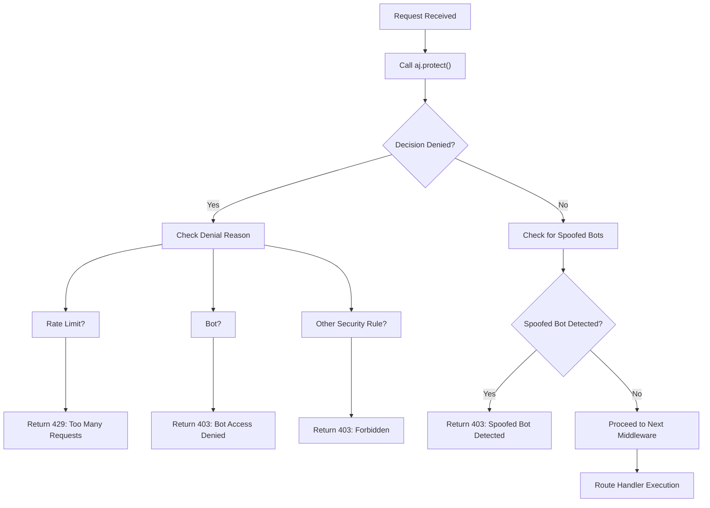

# Rate Limiting & Bot Protection

<cite>
**Referenced Files in This Document**   
- [arcjet.js](file://backend/src/config/arcjet.js#L1-L30)
- [arcjet.middleware.js](file://backend/src/middleware/arcjet.middleware.js#L1-L45)
- [post.route.js](file://backend/src/routes/post.route.js#L1-L22)
- [user.route.js](file://backend/src/routes/user.route.js#L1-L19)
</cite>

## Table of Contents
1. [Introduction](#introduction)
2. [Core Configuration](#core-configuration)
3. [Middleware Implementation](#middleware-implementation)
4. [Request Interception Flow](#request-interception-flow)
5. [Selective Application to Endpoints](#selective-application-to-endpoints)
6. [Security Rule Types](#security-rule-types)
7. [Response Handling](#response-handling)
8. [Error Resilience and Debugging](#error-resilience-and-debugging)
9. [Tuning and Optimization](#tuning-and-optimization)
10. [Monitoring and Incident Reporting](#monitoring-and-incident-reporting)

## Introduction
The xClone application implements a robust rate limiting and bot protection system using Arcjet, a modern security framework designed to defend against automated traffic, abuse, and common web attacks. This document details how Arcjet is configured and integrated into the Express.js backend to protect critical endpoints from malicious behavior while maintaining usability for legitimate users. The implementation combines rate limiting, bot detection, and attack shielding to create a layered defense strategy.

## Core Configuration

The Arcjet configuration is centralized in `arcjet.js`, where security rules are defined and initialized with the application key. The configuration uses a declarative approach to specify multiple protection layers.

**Section sources**
- [arcjet.js](file://backend/src/config/arcjet.js#L1-L30)

```javascript
import arcjet, { tokenBucket, shield, detectBot } from "@arcjet/node";
import { ENV } from "./env.js";

export const aj = arcjet({
  key: ENV.ARCJET_KEY,
  characteristics: ["ip.src"],
  rules: [
    shield({ mode: "LIVE" }),
    detectBot({
      mode: "LIVE",
      allow: ["CATEGORY:SEARCH_ENGINE"],
    }),
    tokenBucket({
      mode: "LIVE",
      refillRate: 10,
      interval: 10,
      capacity: 15,
    }),
  ],
});
```

### Configuration Parameters
- **key**: Secret API key loaded from environment variables via `ENV.ARCJET_KEY`
- **characteristics**: Data sources used for decision-making, currently only `ip.src` (source IP address)
- **rules**: Array of active security rules applied in sequence

### Rule Definitions
- **shield**: Protects against common OWASP threats like SQL injection, XSS, and CSRF
- **detectBot**: Identifies automated clients, allowing only verified search engine crawlers
- **tokenBucket**: Implements rate limiting using the token bucket algorithm with configurable refill rate, interval, and capacity

## Middleware Implementation

The `arcjet.middleware.js` file exports a reusable Express middleware that wraps incoming requests with Arcjet protection. It evaluates each request against the configured rules and makes allow/deny decisions.

**Section sources**
- [arcjet.middleware.js](file://backend/src/middleware/arcjet.middleware.js#L1-L45)

```javascript
import { aj } from "../config/arcjet.js";

export const arcjetMiddleware = async (req, res, next) => {
  try {
    const decision = await aj.protect(req, {
      requested: 1,
    });

    if (decision.isDenied()) {
      // Handle different denial reasons
    }

    // Check for spoofed bots
    if (decision.results.some(result => result.reason.isBot() && result.reason.isSpoofed())) {
      return res.status(403).json({
        error: "Spoofed bot detected",
        message: "Malicious bot activity detected.",
      });
    }

    next();
  } catch (error) {
    console.error("Arcjet middleware error:", error);
    next();
  }
};
```

### Key Implementation Details
- **Asynchronous Processing**: Uses `async/await` to handle the asynchronous nature of Arcjet's decision engine
- **Token Consumption**: Each request consumes exactly 1 token (`requested: 1`)
- **Comprehensive Denial Handling**: Differentiates between rate limit, bot, and general security denials
- **Spoofed Bot Detection**: Additional check for bots that attempt to impersonate legitimate clients
- **Error Resilience**: Falls back to allowing the request if Arcjet fails internally

## Request Interception Flow

The middleware follows a structured decision-making process for every protected request.



**Diagram sources**
- [arcjet.middleware.js](file://backend/src/middleware/arcjet.middleware.js#L1-L45)

### Decision Logic Breakdown
1. **Protection Evaluation**: `aj.protect()` analyzes the request against all configured rules
2. **Denial Assessment**: Checks if any rule resulted in a denied decision
3. **Reason Classification**: Determines the specific reason for denial (rate limit, bot, etc.)
4. **Spoofing Verification**: Additional check for sophisticated bots attempting to bypass detection
5. **Response Generation**: Returns appropriate HTTP status and JSON error message
6. **Request Continuation**: Calls `next()` to proceed if the request is allowed

## Selective Application to Endpoints

The Arcjet middleware is selectively applied to high-risk endpoints through route configuration. It is not applied globally to avoid unnecessary processing on low-risk public routes.

**Section sources**
- [post.route.js](file://backend/src/routes/post.route.js#L1-L22)
- [user.route.js](file://backend/src/routes/user.route.js#L1-L19)

### Protected Endpoints Examples

#### Post Creation and Interaction
```javascript
// Protected routes requiring authentication and rate limiting
router.post("/", protectRoute, upload.single("image"), createPosts);
router.post("/:postId/like", protectRoute, likePost);
router.delete("/:postId", protectRoute, deletePost);
```

#### User Profile and Social Actions
```javascript
// Protected user actions
router.post("/sync", protectRoute, syncUser);
router.post("/me", protectRoute, getCurrentUser);
router.put("/profile", protectRoute, updateProfile);
router.post("/follow/:targetUserId", protectRoute, followUser);
```

### Application Strategy
- **Layered Security**: Combines `protectRoute` (authentication) with `arcjetMiddleware` (rate limiting/bot protection)
- **Public vs. Private**: Public read-only routes (e.g., `GET /posts`) are not rate-limited, while write operations are protected
- **High-Risk Targeting**: Focuses protection on endpoints vulnerable to abuse (posting, liking, following, profile updates)

## Security Rule Types

The system employs three primary security rules, each addressing a specific threat vector.

### Shield Rule
- **Purpose**: Protects against common web application attacks
- **Threats Mitigated**: 
  - SQL Injection
  - Cross-Site Scripting (XSS)
  - Cross-Site Request Forgery (CSRF)
- **Mode**: `LIVE` - Actively blocks malicious requests

### Bot Detection Rule
- **Purpose**: Identifies and blocks automated traffic
- **Detection Method**: Analyzes request patterns, headers, and behavior
- **Allow List**: Permits only `CATEGORY:SEARCH_ENGINE` bots
- **Spoofing Detection**: Flags bots that attempt to impersonate browsers
- **Mode**: `LIVE` - Actively blocks detected bots

### Rate Limiting Rule (Token Bucket)
- **Algorithm**: Token bucket with configurable parameters
- **Configuration**:
  - **refillRate**: 10 tokens per interval
  - **interval**: 10 seconds
  - **capacity**: 15 tokens maximum
- **Behavior**: 
  - 1 token consumed per request
  - Requests denied when bucket is empty
  - Tokens replenished at configured rate
- **Mode**: `LIVE` - Actively enforces limits

## Response Handling

The middleware provides clear, standardized responses for different types of blocked requests.

**Section sources**
- [arcjet.middleware.js](file://backend/src/middleware/arcjet.middleware.js#L1-L45)

### HTTP Status Codes and Messages
- **429 Too Many Requests**: Rate limit exceeded
  - JSON Response: `{ error: "Too Many Requests", message: "Rate limit exceeded. Please try again later." }`
- **403 Forbidden**: General security denial
  - JSON Response: `{ error: "Forbidden", message: "Access denied by security policy." }`
- **403 Bot Access Denied**: Automated traffic detected
  - JSON Response: `{ error: "Bot access denied", message: "Automated requests are not allowed." }`
- **403 Spoofed Bot Detected**: Malicious bot impersonation
  - JSON Response: `{ error: "Spoofed bot detected", message: "Malicious bot activity detected." }`

### Client-Friendly Error Design
- **Consistent Format**: All errors follow the same JSON structure
- **Descriptive Messages**: Clear explanations help legitimate users understand why access was denied
- **Actionable Guidance**: Suggests waiting for rate limit recovery
- **Security Without Obscurity**: Provides enough information for debugging while not revealing system internals

## Error Resilience and Debugging

The implementation includes safeguards to prevent security middleware from disrupting application availability.

### Failure Mode Handling
```javascript
catch (error) {
  console.error("Arcjet middleware error:", error);
  next();
}
```

- **Graceful Degradation**: If Arcjet fails (network issues, internal errors), the request proceeds
- **Error Logging**: All failures are logged for monitoring and debugging
- **No Single Point of Failure**: Security checks do not block application functionality

### Debugging Blocked Requests
- **Check Logs**: Look for "Arcjet middleware error" messages in server logs
- **Verify Environment**: Ensure `ARCJET_KEY` is correctly set in environment variables
- **Test Configuration**: Use Arcjet dashboard to review decision logs and rule triggers
- **Monitor Denial Reasons**: Differentiate between rate limit, bot, and spoofing denials for targeted troubleshooting

## Tuning and Optimization

The rate limiting and bot protection system can be adjusted based on application needs and traffic patterns.

### Rate Limit Configuration Guidelines
- **High-Traffic Endpoints**: Consider increasing `capacity` and `refillRate`
- **Sensitive Operations**: Apply stricter limits (lower capacity, slower refill)
- **User Experience**: Balance security with usability - avoid overly aggressive limits
- **Monitoring**: Track denial rates to identify optimal thresholds

### Recommended Adjustments
- **Login Endpoints**: More restrictive limits to prevent brute force attacks
- **API Endpoints**: Higher limits for legitimate API consumers
- **Public Endpoints**: Minimal or no rate limiting for read-only operations
- **Admin Endpoints**: Stricter limits and additional bot detection

### Performance Considerations
- **Caching**: Arcjet likely implements internal caching to minimize latency
- **WASM Integration**: Uses WebAssembly (`@arcjet/analyze-wasm`) for high-performance analysis
- **Asynchronous Processing**: Non-blocking design prevents request queuing
- **Resource Efficiency**: Lightweight middleware with minimal overhead

## Monitoring and Incident Reporting

Effective security requires visibility into protection events and attack patterns.

### Built-in Monitoring Features
- **Decision Logging**: Arcjet automatically logs allow/deny decisions
- **Reason Tracking**: Detailed reasons for denials (rate limit, bot type, etc.)
- **IP Address Monitoring**: Tracks source IPs for pattern analysis
- **Dashboard Integration**: Arcjet provides a web dashboard for real-time monitoring

### Security Event Categories
- **Rate Limit Incidents**: Frequent requests from single IP/user
- **Bot Activity**: Automated traffic patterns
- **Spoofing Attempts**: Bots masquerading as legitimate clients
- **Attack Patterns**: Shield rule triggers indicating potential exploitation attempts

### Best Practices for Monitoring
- **Regular Review**: Monitor the Arcjet dashboard for unusual activity
- **Alert Configuration**: Set up alerts for high-volume denial events
- **Incident Response**: Have procedures for investigating and responding to attacks
- **Rule Adjustment**: Refine rules based on observed traffic patterns and false positives