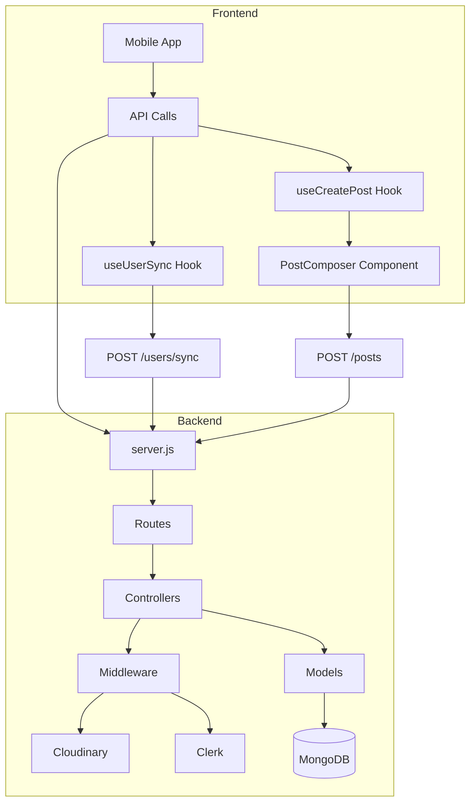
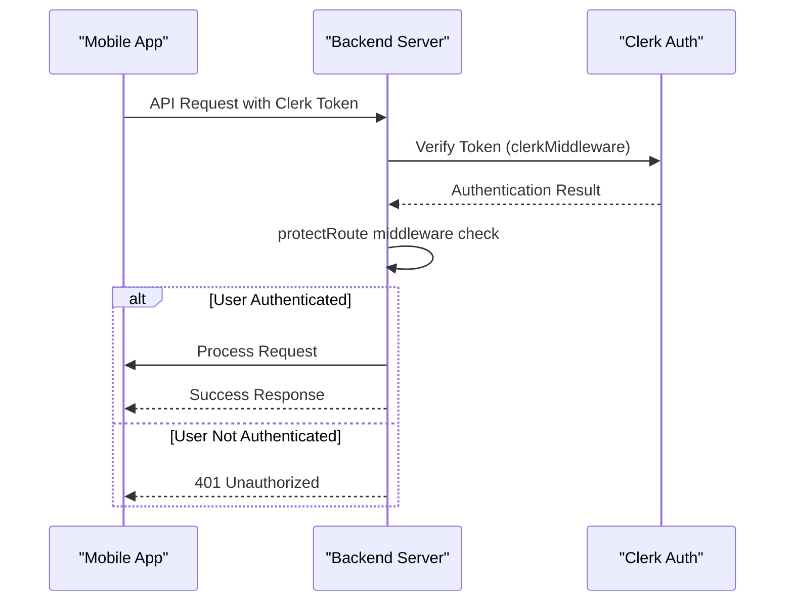
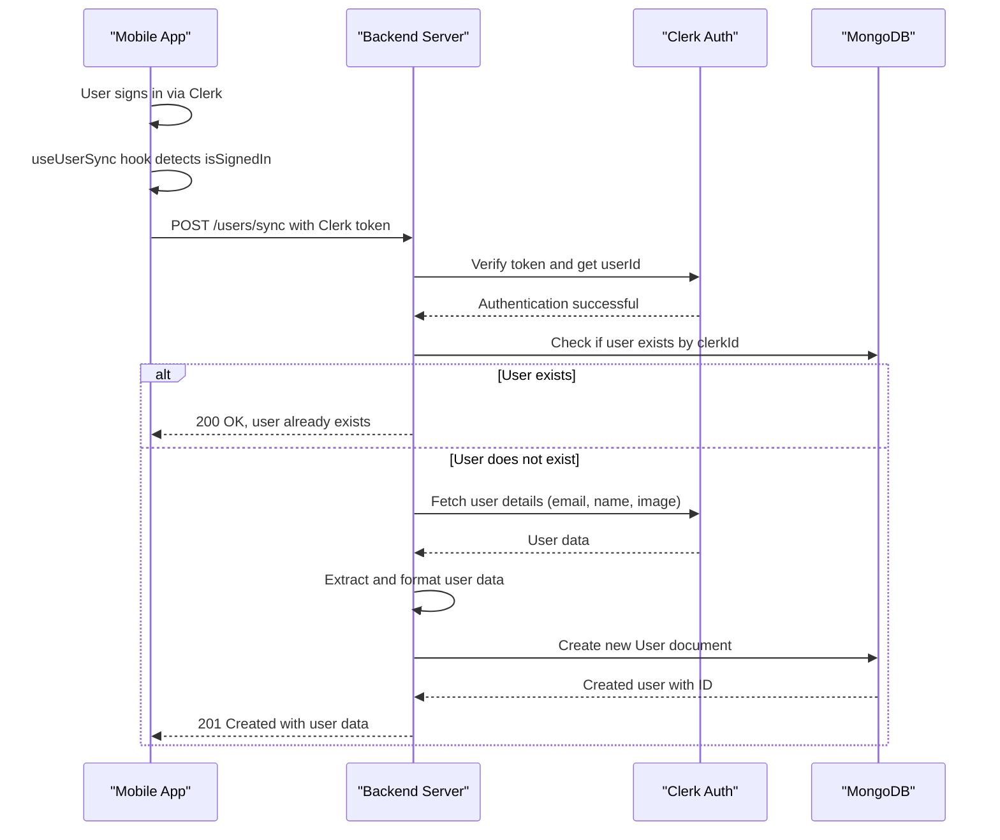
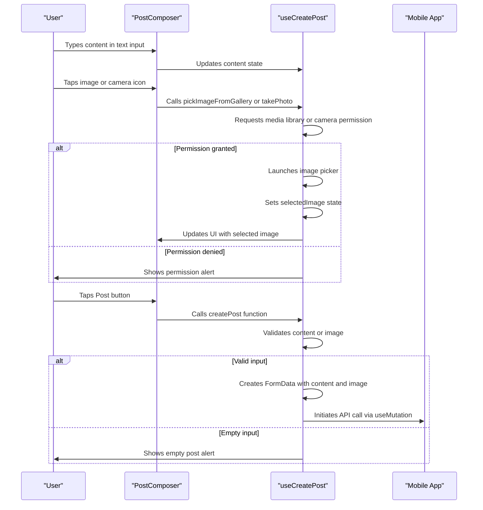
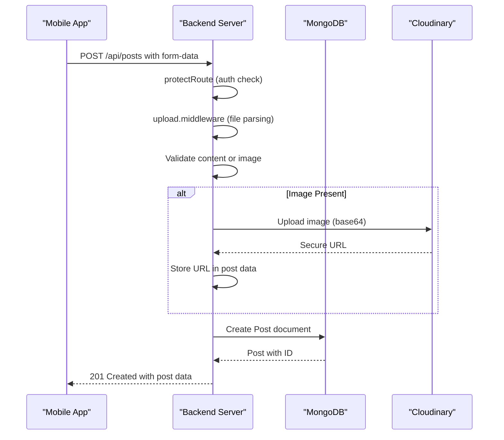
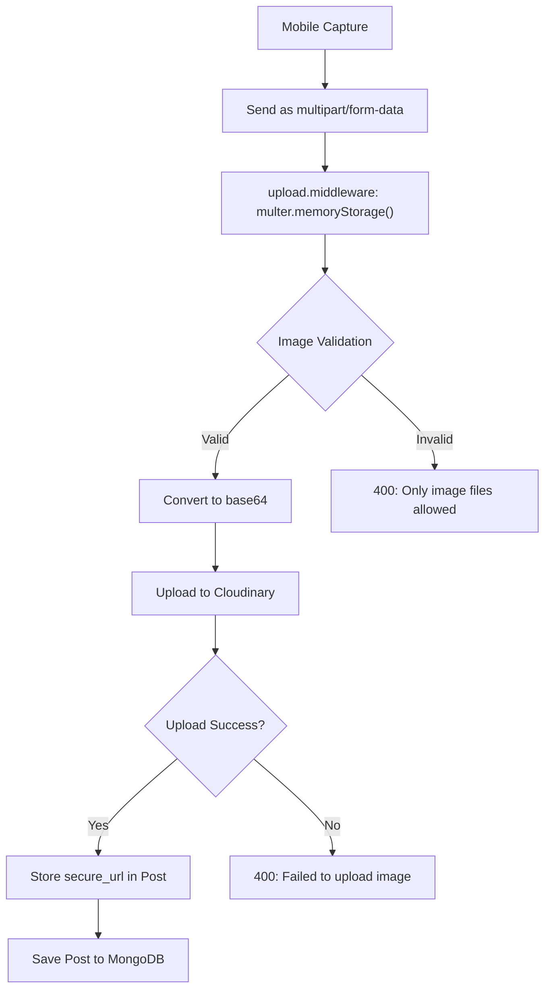
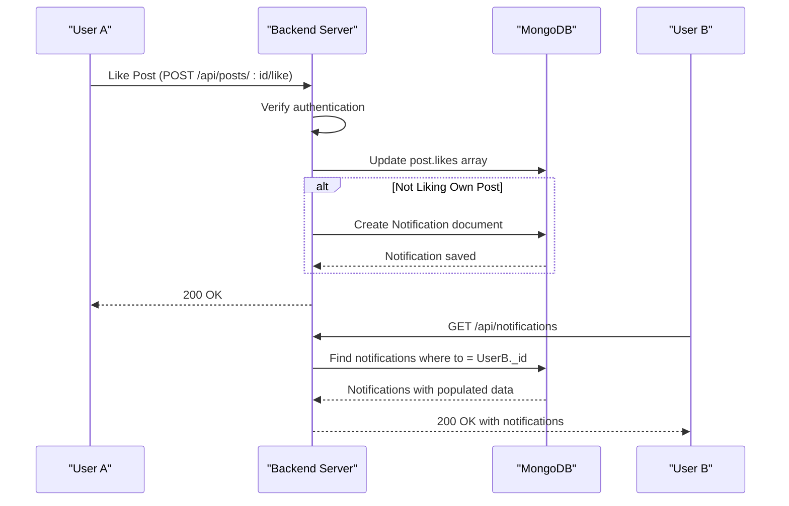
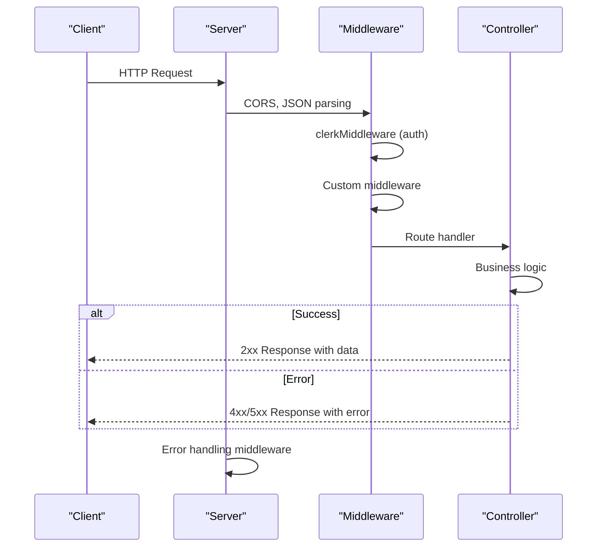
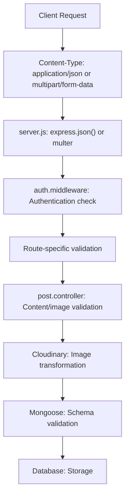
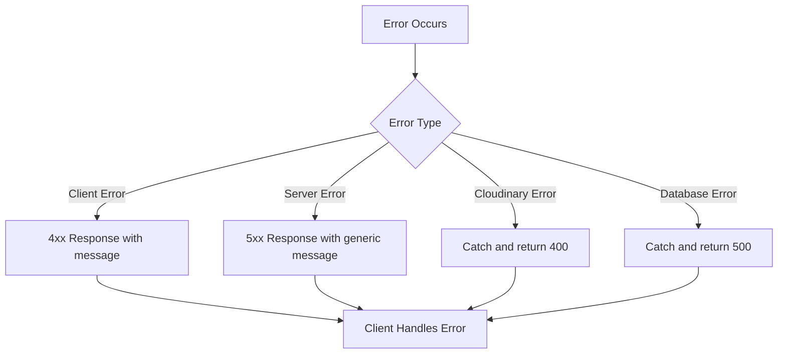

# Data Flow Between Layers

<cite>
**Referenced Files in This Document**   
- [post.route.js](file://backend/src/routes/post.route.js#L1-L21)
- [post.controller.js](file://backend/src/controllers/post.controller.js#L1-L159)
- [upload.middleware.js](file://backend/src/middleware/upload.middleware.js#L1-L22)
- [cloudinary.js](file://backend/src/config/cloudinary.js#L1-L11)
- [auth.middleware.js](file://backend/src/middleware/auth.middleware.js#L1-L9)
- [post.model.js](file://backend/src/models/post.model.js#L1-L37)
- [notification.controller.js](file://backend/src/controllers/notification.controller.js#L1-L37)
- [notification.model.js](file://backend/src/models/notification.model.js#L1-L37)
- [server.js](file://backend/src/server.js#L1-L48)
- [db.js](file://backend/src/config/db.js#L1-L12)
- [env.js](file://backend/src/config/env.js#L1-L16)
- [user.controller.js](file://backend/src/controllers/user.controller.js#L1-L97) - *Updated in recent commit*
- [user.route.js](file://backend/src/routes/user.route.js#L1-L19) - *Updated in recent commit*
- [useUserSync.ts](file://mobile/hooks/useUserSync.ts#L1-L26) - *Added in recent commit*
- [user.model.js](file://backend/src/models/user.model.js#L1-L64) - *Updated in recent commit*
- [api.ts](file://mobile/utils/api.ts#L1-L74) - *Updated in recent commit*
- [useCreatePost.ts](file://mobile/hooks/useCreatePost.ts#L1-L104) - *Added in recent commit*
- [PostComposer.tsx](file://mobile/components/PostComposer.tsx#L1-L98) - *Added in recent commit*
</cite>

## Update Summary
**Changes Made**   
- Added new section: "Post Creation UI Flow" to document the new post composer functionality
- Updated "Post Creation Data Flow" with detailed frontend implementation
- Enhanced "Project Structure" with new UI components and hooks
- Updated sequence diagram for post creation to include frontend interactions
- Added section sources for newly added files in post creation flow
- Updated referenced files list to include new components and hooks

## Table of Contents
1. [Introduction](#introduction)
2. [Project Structure](#project-structure)
3. [Authentication Data Flow](#authentication-data-flow)
4. [User Synchronization Flow](#user-synchronization-flow)
5. [Post Creation UI Flow](#post-creation-ui-flow)
6. [Post Creation Data Flow](#post-creation-data-flow)
7. [Image Upload Pipeline](#image-upload-pipeline)
8. [Notification Generation and Propagation](#notification-generation-and-propagation)
9. [API Request-Response Cycle](#api-request-response-cycle)
10. [Data Transformation and Validation](#data-transformation-and-validation)
11. [Security and Error Handling](#security-and-error-handling)
12. [Performance Considerations](#performance-considerations)

## Introduction
This document provides a comprehensive analysis of the data flow between the frontend (mobile app) and backend layers in the xClone application. It traces key operations including user authentication, user synchronization, post creation with text and image data, and notification generation from social interactions. The analysis covers the complete journey of data across components, including request-response cycles, data transformation, validation, security checks, and error recovery mechanisms. The system leverages Clerk for authentication, Cloudinary for image storage, and MongoDB for persistent data storage.

## Project Structure
The xClone project follows a modular architecture with separate `backend` and `mobile` directories. The backend is built using Node.js with Express, while the mobile frontend uses React Native. The backend organizes code by concerns: configuration, controllers, middleware, models, and routes. A new user synchronization mechanism has been added to ensure user data is consistently maintained between Clerk and the application database. The frontend now includes a dedicated PostComposer component and useCreatePost hook for post creation functionality.

**Diagram sources**
- [server.js](file://backend/src/server.js#L1-L48)
- [post.route.js](file://backend/src/routes/post.route.js#L1-L21)
- [user.route.js](file://backend/src/routes/user.route.js#L1-L19)

**Section sources**
- [server.js](file://backend/src/server.js#L1-L48)
- [post.route.js](file://backend/src/routes/post.route.js#L1-L21)
- [user.route.js](file://backend/src/routes/user.route.js#L1-L19)

## Authentication Data Flow
The authentication flow begins in the mobile app where users log in via Clerk. The authentication token is then sent to the backend with each request. The backend verifies the token using Clerk's middleware and ensures the user is authenticated before processing any protected routes. After successful authentication, the user data is synchronized with the backend database to ensure consistency.

### Authentication Sequence

**Diagram sources**
- [auth.middleware.js](file://backend/src/middleware/auth.middleware.js#L1-L9)
- [server.js](file://backend/src/server.js#L1-L48)

**Section sources**
- [auth.middleware.js](file://backend/src/middleware/auth.middleware.js#L1-L9)
- [server.js](file://backend/src/server.js#L1-L48)

## User Synchronization Flow
A new user synchronization mechanism has been implemented to ensure that user data from Clerk is automatically synced with the application's MongoDB database upon sign-in. This process is triggered by a React Query mutation in the frontend and handled by a dedicated endpoint in the backend.

### User Synchronization Sequence

**Diagram sources**
- [useUserSync.ts](file://mobile/hooks/useUserSync.ts#L1-L26)
- [user.route.js](file://backend/src/routes/user.route.js#L1-L19)
- [user.controller.js](file://backend/src/controllers/user.controller.js#L1-L97)
- [user.model.js](file://backend/src/models/user.model.js#L1-L64)

**Section sources**
- [useUserSync.ts](file://mobile/hooks/useUserSync.ts#L1-L26) - *Added in recent commit*
- [user.controller.js](file://backend/src/controllers/user.controller.js#L1-L97) - *Updated in recent commit*
- [user.route.js](file://backend/src/routes/user.route.js#L1-L19) - *Updated in recent commit*
- [user.model.js](file://backend/src/models/user.model.js#L1-L64) - *Updated in recent commit*
- [api.ts](file://mobile/utils/api.ts#L1-L74) - *Updated in recent commit*

## Post Creation UI Flow
The post creation process begins with the PostComposer component in the mobile app, which provides a user interface for creating posts with text and images. The component uses the useCreatePost hook to manage state and handle the post creation logic.

### Post Creation UI Sequence

**Diagram sources**
- [PostComposer.tsx](file://mobile/components/PostComposer.tsx#L1-L98)
- [useCreatePost.ts](file://mobile/hooks/useCreatePost.ts#L1-L104)

**Section sources**
- [PostComposer.tsx](file://mobile/components/PostComposer.tsx#L1-L98) - *Added in recent commit*
- [useCreatePost.ts](file://mobile/hooks/useCreatePost.ts#L1-L104) - *Added in recent commit*

## Post Creation Data Flow
The post creation process involves sending text content and/or an image from the mobile app to the backend API, which then stores the data in MongoDB and uploads images to Cloudinary. The frontend uses the useCreatePost hook to manage the post creation process and communicate with the backend API.

### Post Creation Sequence

**Diagram sources**
- [post.route.js](file://backend/src/routes/post.route.js#L1-L21)
- [post.controller.js](file://backend/src/controllers/post.controller.js#L1-L159)
- [upload.middleware.js](file://backend/src/middleware/upload.middleware.js#L1-L22)
- [useCreatePost.ts](file://mobile/hooks/useCreatePost.ts#L1-L104)

**Section sources**
- [post.route.js](file://backend/src/routes/post.route.js#L1-L21)
- [post.controller.js](file://backend/src/controllers/post.controller.js#L1-L159)
- [useCreatePost.ts](file://mobile/hooks/useCreatePost.ts#L1-L104) - *Added in recent commit*
- [PostComposer.tsx](file://mobile/components/PostComposer.tsx#L1-L98) - *Added in recent commit*

## Image Upload Pipeline
The image upload pipeline handles the journey from mobile capture to Cloudinary storage and database reference.

### Image Upload Flow

**Diagram sources**
- [upload.middleware.js](file://backend/src/middleware/upload.middleware.js#L1-L22)
- [cloudinary.js](file://backend/src/config/cloudinary.js#L1-L11)
- [post.controller.js](file://backend/src/controllers/post.controller.js#L1-L159)

**Section sources**
- [upload.middleware.js](file://backend/src/middleware/upload.middleware.js#L1-L22)
- [cloudinary.js](file://backend/src/config/cloudinary.js#L1-L11)

## Notification Generation and Propagation
Notifications are generated when users interact with posts (likes, comments) and are stored in the database for retrieval by recipients.

### Notification Sequence

**Diagram sources**
- [post.controller.js](file://backend/src/controllers/post.controller.js#L1-L159)
- [notification.controller.js](file://backend/src/controllers/notification.controller.js#L1-L37)
- [notification.model.js](file://backend/src/models/notification.model.js#L1-L37)

**Section sources**
- [post.controller.js](file://backend/src/controllers/post.controller.js#L1-L159)
- [notification.controller.js](file://backend/src/controllers/notification.controller.js#L1-L37)

## API Request-Response Cycle
The API request-response cycle includes headers, payload structure, and error handling for all endpoints.

### Request-Response Structure

**Diagram sources**
- [server.js](file://backend/src/server.js#L1-L48)
- [post.route.js](file://backend/src/routes/post.route.js#L1-L21)

**Section sources**
- [server.js](file://backend/src/server.js#L1-L48)

## Data Transformation and Validation
Data undergoes transformation and validation at multiple layers to ensure integrity and security.

### Data Validation Flow

**Diagram sources**
- [post.controller.js](file://backend/src/controllers/post.controller.js#L1-L159)
- [post.model.js](file://backend/src/models/post.model.js#L1-L37)
- [upload.middleware.js](file://backend/src/middleware/upload.middleware.js#L1-L22)

**Section sources**
- [post.controller.js](file://backend/src/controllers/post.controller.js#L1-L159)
- [post.model.js](file://backend/src/models/post.model.js#L1-L37)

## Security and Error Handling
The system implements multiple security layers and comprehensive error handling.

### Security Measures
- **Authentication**: Clerk integration with `clerkMiddleware` and `protectRoute`
- **Input Validation**: Mongoose schema validation and manual checks
- **File Security**: MIME type checking in upload middleware
- **Rate Limiting**: Arcjet middleware (not fully visible in code)
- **Error Handling**: Global error middleware in server.js

### Error Recovery

**Diagram sources**
- [server.js](file://backend/src/server.js#L1-L48)
- [post.controller.js](file://backend/src/controllers/post.controller.js#L1-L159)

**Section sources**
- [server.js](file://backend/src/server.js#L1-L48)
- [post.controller.js](file://backend/src/controllers/post.controller.js#L1-L159)

## Performance Considerations
The system includes several performance optimizations:

- **Image Optimization**: Cloudinary applies automatic quality, format, and size optimization
- **Database Indexing**: Mongoose schemas imply indexing on reference fields
- **Memory Efficiency**: Multer uses memory storage for file uploads to avoid disk I/O
- **Connection Pooling**: Mongoose handles connection pooling to MongoDB
- **Caching**: Not explicitly implemented but could be added for frequent queries

The 5MB file size limit prevents excessive memory usage during image uploads. Cloudinary's CDN delivery ensures fast image loading for end users. The use of async/await with express-async-handler prevents blocking the event loop during I/O operations.