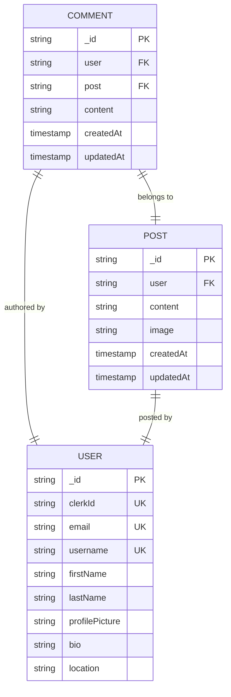

# Comment Model

<cite>
**Referenced Files in This Document**   
- [comment.model.js](file://backend/src/models/comment.model.js)
- [post.model.js](file://backend/src/models/post.model.js)
- [comment.controller.js](file://backend/src/controllers/comment.controller.js)
- [comment.route.js](file://backend/src/routes/comment.route.js)
- [notification.model.js](file://backend/src/models/notification.model.js)
</cite>

## Table of Contents
1. [Introduction](#introduction)
2. [Data Model Structure](#data-model-structure)
3. [Field Specifications](#field-specifications)
4. [Parent-Child Relationship with Post](#parent-child-relationship-with-post)
5. [Indexing and Query Optimization](#indexing-and-query-optimization)
6. [Schema Diagram](#schema-diagram)
7. [Sample Comment Document](#sample-comment-document)
8. [Comment Retrieval and Population Strategy](#comment-retrieval-and-population-strategy)
9. [Performance Considerations](#performance-considerations)
10. [Moderation and Lifecycle Management](#moderation-and-lifecycle-management)

## Introduction
This document provides comprehensive documentation for the Comment model in the xClone application. The Comment model enables users to engage with posts by leaving textual feedback. It supports core social interactions such as commenting, liking, and notification generation. The model is tightly integrated with the Post and User models, forming a hierarchical data structure where comments belong to posts and are authored by users. This documentation details the schema, relationships, API behavior, and performance strategies related to comment management.

## Data Model Structure
The Comment model is implemented using Mongoose in a MongoDB environment. It captures essential information about user comments on posts, including authorship, content, engagement metrics, and timestamps. The model leverages MongoDB's ObjectId references to maintain relationships with other entities.

**Section sources**
- [comment.model.js](file://backend/src/models/comment.model.js#L1-L33)

## Field Specifications
The Comment model consists of the following fields:

### _id
- **Type**: ObjectId (automatically generated)
- **Description**: Unique identifier for each comment
- **Database Constraint**: Primary key, automatically indexed by MongoDB

### post (ref: Post)
- **Type**: ObjectId
- **Reference**: Post model
- **Validation**: Required field
- **Purpose**: Establishes the parent-child relationship between a comment and its associated post
- **Database Constraint**: Foreign key reference to Post collection

### user (ref: User)
- **Type**: ObjectId
- **Reference**: User model
- **Validation**: Required field
- **Purpose**: Identifies the author of the comment
- **Database Constraint**: Foreign key reference to User collection

### content
- **Type**: String
- **Validation**: Required, maximum length of 280 characters
- **Purpose**: Stores the actual text content of the comment
- **Constraints**: Cannot be empty or consist only of whitespace

### likes
- **Type**: Array of ObjectId
- **Reference**: User model
- **Purpose**: Tracks which users have liked the comment
- **Behavior**: Each ObjectId in the array refers to a User who has liked the comment

### createdAt and updatedAt
- **Type**: Date (automatically managed)
- **Purpose**: Timestamps for when the comment was created and last modified
- **Feature**: Automatically added via Mongoose `{ timestamps: true }` option

**Section sources**
- [comment.model.js](file://backend/src/models/comment.model.js#L4-L28)

## Parent-Child Relationship with Post
The Comment model maintains a one-to-many relationship with the Post model through the `post` field. Each comment references exactly one post, while a single post can have multiple comments. This relationship is bidirectional:

- **Forward Reference**: Comment → Post via `post` field
- **Back Reference**: Post → Comments via `comments` array in Post model

When a new comment is created, it is automatically appended to the `comments` array in the corresponding Post document using MongoDB's `$push` operator. Similarly, when a comment is deleted, it is removed from the post's comments array using `$pull`.

This dual-reference strategy ensures data consistency and enables efficient retrieval from either direction—fetching all comments for a post or displaying comments within a post's context.

**Section sources**
- [comment.model.js](file://backend/src/models/comment.model.js#L8-L11)
- [post.model.js](file://backend/src/models/post.model.js#L18-L21)
- [comment.controller.js](file://backend/src/controllers/comment.controller.js#L28-L32)
- [comment.controller.js](file://backend/src/controllers/comment.controller.js#L67-L70)

## Indexing and Query Optimization
To ensure high-performance queries, appropriate indexing strategies are applied:

- **Single Field Index**: An implicit index exists on `post` due to its frequent use in filtering comments by post ID.
- **Compound Queries**: While no explicit compound index is defined, queries involving `user` and timestamp ranges can leverage MongoDB's natural sorting on `createdAt` when combined with user-based filters.

For high-volume scenarios, the following optimizations are recommended:
- Ensure the `post` field is indexed to accelerate comment retrieval by post.
- Consider adding a compound index on `user` and `createdAt` if user-specific comment timelines become a common access pattern.

## Schema Diagram
The following Entity-Relationship diagram illustrates the Comment model and its relationships with Post and User.



**Diagram sources**
- [comment.model.js](file://backend/src/models/comment.model.js#L1-L33)
- [post.model.js](file://backend/src/models/post.model.js#L1-L37)
- [user.model.js](file://backend/src/models/user.model.js#L1-L64)

## Sample Comment Document
Below is an example of a fully populated comment document:

```json
{
  "_id": "652f8d9e1c9d440000a1b2c3",
  "user": {
    "_id": "652f8d9e1c9d440000a1b1a1",
    "username": "johndoe",
    "firstName": "John",
    "lastName": "Doe",
    "profilePicture": "https://example.com/images/john.jpg"
  },
  "post": "652f8d9e1c9d440000a1b1f4",
  "content": "Great post! I really enjoyed reading this.",
  "likes": [
    "652f8d9e1c9d440000a1b1a1",
    "652f8d9e1c9d440000a1b1a2"
  ],
  "createdAt": "2023-10-18T08:45:50.123Z",
  "updatedAt": "2023-10-18T08:45:50.123Z"
}
```

This example shows a comment with two likes, including the author's own like, and demonstrates how user data is populated for display purposes.

## Comment Retrieval and Population Strategy
Comments are retrieved using the `getComment` controller method, which fetches all comments associated with a specific post. The query includes population of the `user` field to include author details such as username, name, and profile picture, while excluding sensitive information like email.

The population strategy uses Mongoose's `.populate()` method with field selection to optimize payload size:
```javascript
.populate("user", "username firstName lastName profilePicture")
```

This approach reduces network overhead by only transferring necessary user data. For nested replies (if implemented in the future), a recursive population strategy or flat threading model could be adopted, but currently the system supports only top-level comments.

**Section sources**
- [comment.controller.js](file://backend/src/controllers/comment.controller.js#L5-L13)

## Performance Considerations
In high-volume commenting scenarios, several performance considerations apply:

- **Scalability**: As comment counts grow, retrieving all comments at once may become inefficient. Implementing pagination using `limit` and `skip` or cursor-based pagination is recommended for production use.
- **Indexing**: Ensure the `post` field is indexed to maintain O(log n) lookup performance.
- **Denormalization**: The current design duplicates comment references in both Comment and Post collections. While this improves read performance, it requires careful transactional handling during create/delete operations.
- **Notification Overhead**: Creating a notification for each comment (except self-comments) adds write overhead but is essential for user engagement.

Future optimizations could include:
- Caching comment threads using Redis
- Implementing background jobs for notification processing
- Using aggregation pipelines for complex comment analytics

**Section sources**
- [comment.controller.js](file://backend/src/controllers/comment.controller.js#L1-L83)
- [notification.model.js](file://backend/src/models/notification.model.js#L1-L35)

## Moderation and Lifecycle Management
The system implements basic moderation through ownership-based access control:

- **Creation**: Only authenticated users can create comments
- **Deletion**: Users can only delete their own comments, enforced by comparing `comment.user` with the authenticated `userId`
- **Editing**: The current implementation does not support comment editing, implying comments are immutable after creation

The `deleteComment` controller ensures referential integrity by:
1. Validating user ownership
2. Removing the comment reference from the parent post
3. Deleting the comment document

Additionally, when a post is deleted, all associated comments are automatically removed via `Comment.deleteMany({ post: postId })` in the `deletePost` controller, ensuring no orphaned comments remain.

For future moderation needs, features like soft deletion, edit history tracking, or admin moderation queues could be implemented.

**Section sources**
- [comment.controller.js](file://backend/src/controllers/comment.controller.js#L42-L83)
- [post.controller.js](file://backend/src/controllers/post.controller.js#L121-L158)