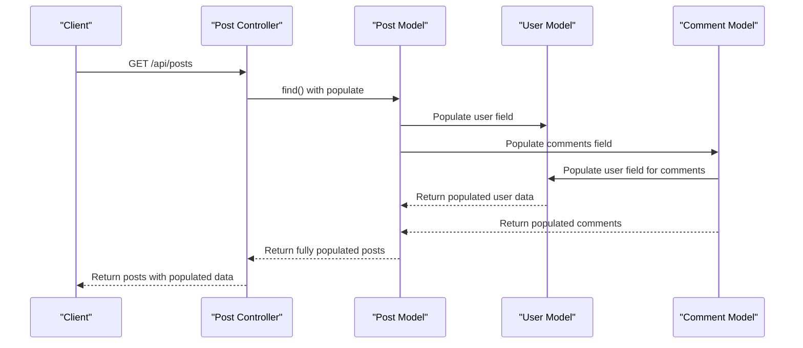
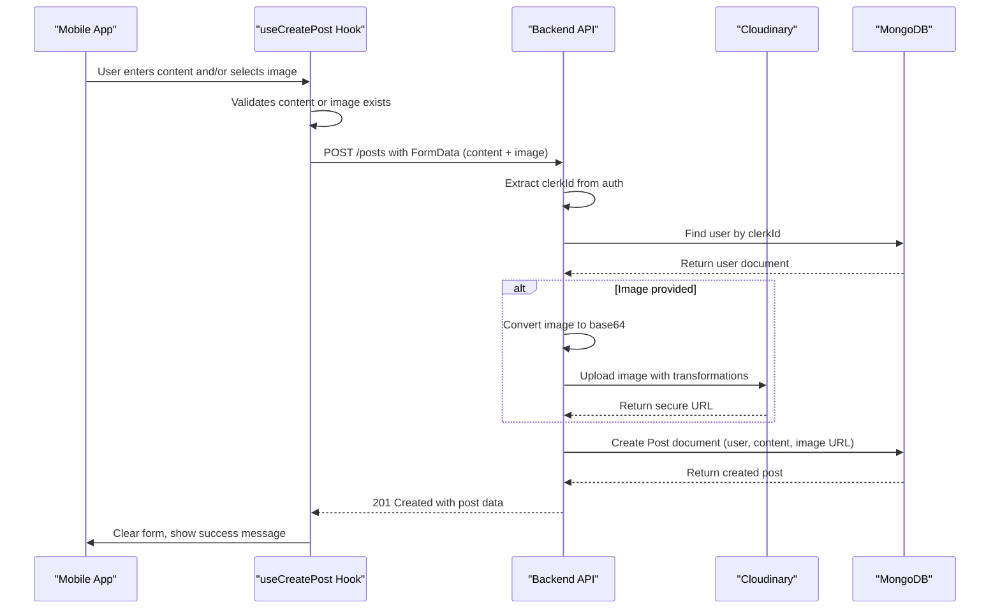
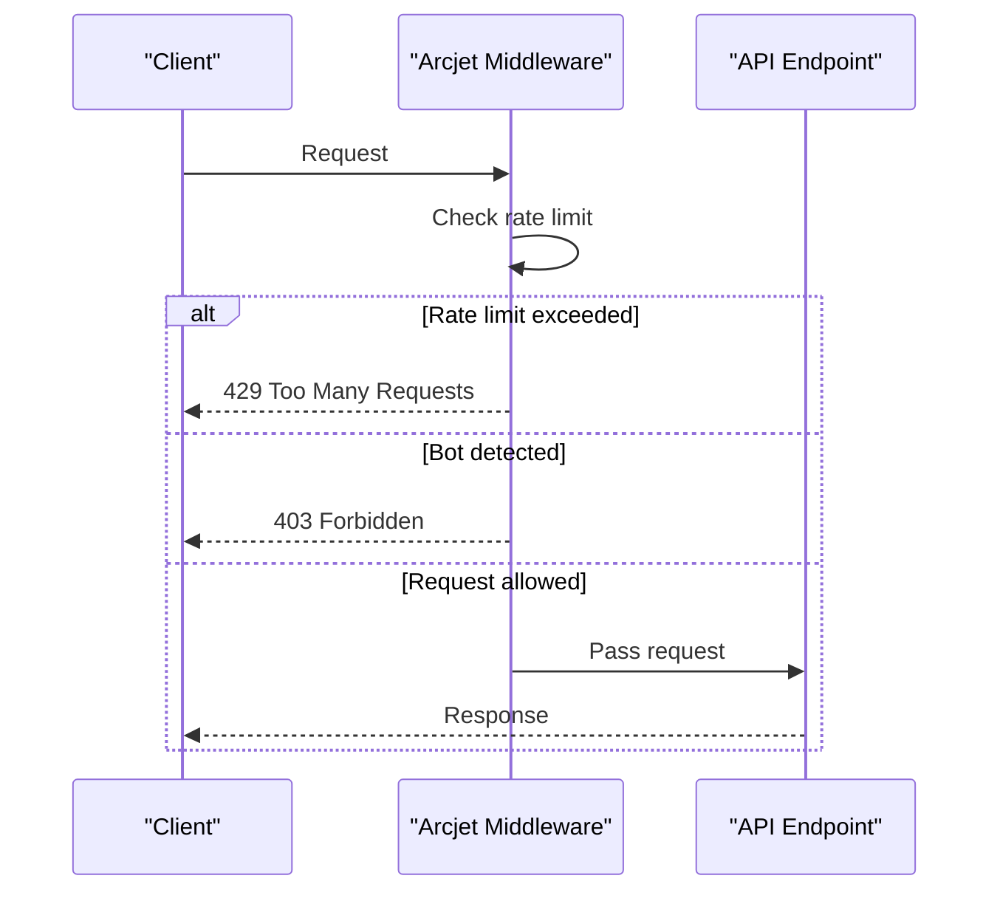

# Data Models & Database Schema

<cite>
**Referenced Files in This Document**   
- [user.model.js](file://backend/src/models/user.model.js)
- [post.model.js](file://backend/src/models/post.model.js)
- [comment.model.js](file://backend/src/models/comment.model.js)
- [notification.model.js](file://backend/src/models/notification.model.js)
- [user.controller.js](file://backend/src/controllers/user.controller.js)
- [post.controller.js](file://backend/src/controllers/post.controller.js#L77-L123) - *Updated in recent commit*
- [comment.controller.js](file://backend/src/controllers/comment.controller.js)
- [notification.controller.js](file://backend/src/controllers/notification.controller.js)
- [useCreatePost.ts](file://mobile/hooks/useCreatePost.ts) - *Added in recent commit*
- [PostComposer.tsx](file://mobile/components/PostComposer.tsx) - *Added in recent commit*
</cite>

## Update Summary
**Changes Made**   
- Updated **Post Model** section to reflect image upload functionality and Cloudinary integration
- Added details about frontend post creation flow in **Data Access Patterns**
- Enhanced **Performance Considerations** with image processing and upload details
- Updated **Mongoose ORM Mapping** to reflect controller-level logic for post creation
- Added new section: **Post Creation Workflow** to document end-to-end flow
- Updated section sources to reflect new and modified files

## Table of Contents
1. [Data Models & Database Schema](#data-models--database-schema)
2. [User Model](#user-model)
3. [Post Model](#post-model)
4. [Comment Model](#comment-model)
5. [Notification Model](#notification-model)
6. [Entity Relationships](#entity-relationships)
7. [Indexes and Data Integrity](#indexes-and-data-integrity)
8. [Sample Documents](#sample-documents)
9. [Data Access Patterns](#data-access-patterns)
10. [Post Creation Workflow](#post-creation-workflow)
11. [Performance Considerations](#performance-considerations)
12. [Data Lifecycle Management](#data-lifecycle-management)
13. [Security Requirements](#security-requirements)
14. [Mongoose ORM Mapping](#mongoose-orm-mapping)

## User Model

The User model represents the core identity of users within the xClone application. It stores essential profile information and social connections.

**Field Definitions:**
- **clerkId**: String, required, unique - External authentication identifier from Clerk
- **email**: String, required, unique - User's email address
- **firstName**: String, required - User's first name
- **lastName**: String, required - User's last name
- **username**: String, required, unique - Unique username for the user
- **profilePicture**: String, optional, default: "" - URL to user's profile picture
- **bannerImage**: String, optional, default: "" - URL to user's banner image
- **bio**: String, optional, default: "", maxLength: 160 - User's biography
- **location**: String, optional, default: "" - User's geographical location
- **followers**: Array of ObjectId references to User - List of users following this user
- **following**: Array of ObjectId references to User - List of users this user is following

The model automatically includes **createdAt** and **updatedAt** timestamp fields due to the `{ timestamps: true }` option in the schema configuration.

**Section sources**
- [user.model.js](file://backend/src/models/user.model.js#L1-L63)

## Post Model

The Post model represents user-generated content within the xClone application, similar to tweets or status updates.

**Field Definitions:**
- **user**: ObjectId reference to User, required - The user who created the post
- **content**: String, optional, maxLength: 280 - The text content of the post (similar to a tweet)
- **image**: String, optional, default: "" - URL to an image attached to the post
- **likes**: Array of ObjectId references to User - Users who have liked this post
- **comments**: Array of ObjectId references to Comment - Comments associated with this post

Like the User model, Post includes automatic **createdAt** and **updatedAt** timestamp fields.

**Updated** The model now supports image attachments through Cloudinary integration, with image URLs stored in the `image` field.

**Section sources**
- [post.model.js](file://backend/src/models/post.model.js#L1-L36)

## Comment Model

The Comment model represents user responses to posts within the xClone application.

**Field Definitions:**
- **user**: ObjectId reference to User, required - The user who created the comment
- **post**: ObjectId reference to Post, required - The post being commented on
- **content**: String, required, maxLength: 280 - The text content of the comment
- **likes**: Array of ObjectId references to User - Users who have liked this comment

The Comment model also includes automatic **createdAt** and **updatedAt** timestamp fields.

**Section sources**
- [comment.model.js](file://backend/src/models/comment.model.js#L1-L32)

## Notification Model

The Notification model handles user notifications for various social interactions within the application.

**Field Definitions:**
- **from**: ObjectId reference to User, required - The user who triggered the notification
- **to**: ObjectId reference to User, required - The user receiving the notification
- **type**: String, required, enum: ["follow", "like", "comment"] - Type of notification
- **post**: ObjectId reference to Post, optional, default: null - Associated post (for like/comment notifications)
- **comment**: ObjectId reference to Comment, optional, default: null - Associated comment (for comment notifications)

This model includes the standard **createdAt** and **updatedAt** timestamp fields.

**Section sources**
- [notification.model.js](file://backend/src/models/notification.model.js#L1-L36)

## Entity Relationships

The data models in xClone are interconnected through various relationships that enable the social networking functionality.

```mermaid
erDiagram
USER {
string clerkId PK UK
string email UK
string username UK
string firstName
string lastName
string profilePicture
string bannerImage
string bio
string location
array followers
array following
timestamp createdAt
timestamp updatedAt
}
POST {
objectid user FK
string content
string image
array likes
array comments
timestamp createdAt
timestamp updatedAt
}
COMMENT {
objectid user FK
objectid post FK
string content
array likes
timestamp createdAt
timestamp updatedAt
}
NOTIFICATION {
objectid from FK
objectid to FK
string type
objectid post FK
objectid comment FK
timestamp createdAt
timestamp updatedAt
}
USER ||--o{ POST : "creates"
USER ||--o{ COMMENT : "creates"
USER ||--o{ "followers/following" } USER : "follows"
USER ||--o{ NOTIFICATION : "receives"
USER ||--o{ NOTIFICATION : "sends"
POST ||--o{ COMMENT : "contains"
POST ||--o{ NOTIFICATION : "triggers"
COMMENT ||--o{ NOTIFICATION : "triggers"
```

**Diagram sources**
- [user.model.js](file://backend/src/models/user.model.js#L1-L63)
- [post.model.js](file://backend/src/models/post.model.js#L1-L36)
- [comment.model.js](file://backend/src/models/comment.model.js#L1-L32)
- [notification.model.js](file://backend/src/models/notification.model.js#L1-L36)

## Indexes and Data Integrity

The MongoDB schema implements several unique constraints and indexes to ensure data integrity and support efficient queries.

**Unique Constraints:**
- **User.clerkId**: Ensures each Clerk authentication ID maps to only one user
- **User.email**: Prevents multiple accounts with the same email address
- **User.username**: Ensures usernames are unique across the platform

These unique constraints are implemented directly in the Mongoose schema using the `unique: true` property, which creates unique indexes in MongoDB.

**Data Validation Rules:**
- **User.bio**: Maximum length of 160 characters
- **Post.content**: Maximum length of 280 characters
- **Comment.content**: Maximum length of 280 characters
- **Notification.type**: Restricted to enum values: "follow", "like", "comment"

The application enforces referential integrity through application-level logic rather than database-level foreign key constraints, which is typical for MongoDB applications.

**Section sources**
- [user.model.js](file://backend/src/models/user.model.js#L1-L63)
- [post.model.js](file://backend/src/models/post.model.js#L1-L36)
- [comment.model.js](file://backend/src/models/comment.model.js#L1-L32)
- [notification.model.js](file://backend/src/models/notification.model.js#L1-L36)

## Sample Documents

### Sample User Document
```json
{
  "_id": "652f8e8b9c9d7b2f4c8d1234",
  "clerkId": "user_123456789",
  "email": "john.doe@example.com",
  "firstName": "John",
  "lastName": "Doe",
  "username": "johndoe",
  "profilePicture": "https://example.com/images/john.jpg",
  "bannerImage": "https://example.com/images/banner.jpg",
  "bio": "Software developer passionate about social media platforms",
  "location": "San Francisco, CA",
  "followers": [
    "652f8e8b9c9d7b2f4c8d1235",
    "652f8e8b9c9d7b2f4c8d1236"
  ],
  "following": [
    "652f8e8b9c9d7b2f4c8d1237"
  ],
  "createdAt": "2023-10-17T14:32:11.123Z",
  "updatedAt": "2023-10-18T09:15:22.456Z"
}
```

### Sample Post Document
```json
{
  "_id": "652f8e8b9c9d7b2f4c8d1238",
  "user": "652f8e8b9c9d7b2f4c8d1234",
  "content": "Just launched my new social media app! #xClone #startup",
  "image": "https://example.com/images/post1.jpg",
  "likes": [
    "652f8e8b9c9d7b2f4c8d1235",
    "652f8e8b9c9d7b2f4c8d1236"
  ],
  "comments": [
    "652f8e8b9c9d7b2f4c8d1239"
  ],
  "createdAt": "2023-10-17T15:45:33.789Z",
  "updatedAt": "2023-10-17T15:45:33.789Z"
}
```

### Sample Comment Document
```json
{
  "_id": "652f8e8b9c9d7b2f4c8d1239",
  "user": "652f8e8b9c9d7b2f4c8d1235",
  "post": "652f8e8b9c9d7b2f4c8d1238",
  "content": "Congrats on the launch! Looks amazing!",
  "likes": [],
  "createdAt": "2023-10-17T16:20:15.234Z",
  "updatedAt": "2023-10-17T16:20:15.234Z"
}
```

### Sample Notification Document
```json
{
  "_id": "652f8e8b9c9d7b2f4c8d1240",
  "from": "652f8e8b9c9d7b2f4c8d1235",
  "to": "652f8e8b9c9d7b2f4c8d1234",
  "type": "like",
  "post": "652f8e8b9c9d7b2f4c8d1238",
  "comment": null,
  "createdAt": "2023-10-17T16:25:44.567Z",
  "updatedAt": "2023-10-17T16:25:44.567Z"
}
```

**Section sources**
- [user.model.js](file://backend/src/models/user.model.js#L1-L63)
- [post.model.js](file://backend/src/models/post.model.js#L1-L36)
- [comment.model.js](file://backend/src/models/comment.model.js#L1-L32)
- [notification.model.js](file://backend/src/models/notification.model.js#L1-L36)

## Data Access Patterns

The application implements specific data access patterns to efficiently retrieve related data while maintaining performance.

### Population Strategies

The application uses Mongoose's `populate()` method to automatically replace referenced document IDs with the actual document data. This is evident in the controller implementations:



**Diagram sources**
- [post.controller.js](file://backend/src/controllers/post.controller.js#L1-L40)
- [post.model.js](file://backend/src/models/post.model.js#L1-L36)

The `getPosts`, `getPost`, and `getUserPosts` controllers implement deep population to include:
- Post user information (username, firstName, lastName, profilePicture)
- Comment information with nested user details for each comment

This strategy reduces the number of database queries needed to display a complete post with all associated data.

**Section sources**
- [post.controller.js](file://backend/src/controllers/post.controller.js#L1-L158)

## Post Creation Workflow

The post creation workflow involves both frontend and backend components working together to create posts with optional image attachments.



**Diagram sources**
- [useCreatePost.ts](file://mobile/hooks/useCreatePost.ts#L34-L78)
- [post.controller.js](file://backend/src/controllers/post.controller.js#L77-L123)
- [PostComposer.tsx](file://mobile/components/PostComposer.tsx#L75-L97)

The workflow includes:
- Frontend validation to ensure content or image is provided
- Image processing and upload to Cloudinary with automatic optimization
- Database persistence of post metadata and image URL
- Error handling for upload failures and validation errors

**Section sources**
- [useCreatePost.ts](file://mobile/hooks/useCreatePost.ts#L0-L104)
- [post.controller.js](file://backend/src/controllers/post.controller.js#L77-L123)
- [PostComposer.tsx](file://mobile/components/PostComposer.tsx#L0-L44)

## Performance Considerations

The data model design and access patterns have been optimized for common query patterns in a social media application.

### Query Optimization

The schema design supports efficient querying for:
- Retrieving all posts sorted by creation date (using the default timestamp index)
- Finding users by username (benefiting from the unique username index)
- Getting all posts by a specific user (using the post.user index)

The application uses projection in population operations to limit the fields retrieved, reducing network payload:
```javascript
.populate("user", "username firstName lastName profilePicture")
```

This retrieves only essential user fields rather than the entire user document.

### Indexing Strategy

While explicit indexes are not defined in the schema files, Mongoose creates indexes for:
- **_id field**: Automatic primary key index
- **Unique fields**: clerkId, email, and username in the User model
- **Timestamp fields**: createdAt and updatedAt (compound index)

For production use, additional indexes should be considered for:
- Post.user field (frequently queried when getting user posts)
- Notification.to field (for retrieving user notifications)
- Post.likes and Comment.likes arrays (for checking like status)

### Image Processing Optimization

The application implements several optimizations for image handling:
- Cloudinary transformations automatically resize images to 800x600 maximum
- Automatic quality optimization ("auto" quality setting)
- Format conversion to optimal format ("auto" format)
- Secure HTTPS delivery of images

These optimizations ensure fast loading times while maintaining visual quality.

**Section sources**
- [post.controller.js](file://backend/src/controllers/post.controller.js#L77-L123)
- [post.controller.js](file://backend/src/controllers/post.controller.js#L1-L158)
- [user.model.js](file://backend/src/models/user.model.js#L1-L63)

## Data Lifecycle Management

The application implements specific data lifecycle management patterns, particularly for maintaining data consistency across related documents.

### Cascade Deletion

When a post is deleted, the application ensures data integrity by also removing associated comments:

```javascript
// In post.controller.js
await Comment.deleteMany({ post: postId });
await Post.findByIdAndDelete(postId);
```

This cascade deletion prevents orphaned comments from remaining in the database after their parent post is removed.

### Reference Synchronization

The application maintains bidirectional relationships between users who follow each other:
```javascript
// When following a user
await User.findByIdAndUpdate(currentUser._id, {
  $push: { following: targetUserId },
});
await User.findByIdAndUpdate(targetUserId, {
  $push: { followers: currentUser._id },
});
```

Similarly, when unfollowing, both references are removed. This ensures consistency in the followers/following relationship.

Currently, there are no explicit data retention policies or automated data cleanup processes implemented in the codebase.

**Section sources**
- [post.controller.js](file://backend/src/controllers/post.controller.js#L134-L158)
- [user.controller.js](file://backend/src/controllers/user.controller.js#L71-L96)

## Security Requirements

The application implements several security measures to protect sensitive data and prevent abuse.

### Sensitive Data Handling

The User model stores sensitive information such as email addresses. The application uses Clerk for authentication, which means:
- Passwords are not stored in the application database
- Authentication is handled externally by Clerk
- The clerkId serves as a secure reference to the authentication provider

### Rate Limiting and Bot Protection

The application uses Arcjet for security protection, configured in `arcjet.js`:
- **Shield**: Protects against common attacks like SQL injection, XSS, and CSRF
- **Bot Detection**: Blocks automated bots while allowing search engine crawlers
- **Rate Limiting**: Implements a token bucket algorithm (10 requests per 10 seconds, 15 maximum)



**Diagram sources**
- [arcjet.middleware.js](file://backend/src/middleware/arcjet.middleware.js#L1-L44)
- [arcjet.js](file://backend/src/config/arcjet.js#L1-L29)

The middleware is applied to routes to protect against abuse while allowing legitimate traffic to proceed.

**Section sources**
- [arcjet.middleware.js](file://backend/src/middleware/arcjet.middleware.js#L1-L44)
- [arcjet.js](file://backend/src/config/arcjet.js#L1-L29)

## Mongoose ORM Mapping

The application uses Mongoose as an Object-Document Mapper (ODM) to interface with MongoDB.

### Schema Definition

All models follow the same Mongoose pattern:
```javascript
const schemaName = new mongoose.Schema(
  { /* field definitions */ },
  { timestamps: true }
);
```

The `{ timestamps: true }` option automatically manages createdAt and updatedAt fields.

### Middleware (Pre/Post Hooks)

The current implementation does not include any explicit pre or post hooks in the model files. Data validation and business logic are handled at the controller level rather than through Mongoose middleware.

For example, password hashing (if implemented) or content sanitization would typically be handled by pre-save hooks, but these are not present in the current codebase.

The relationship management (followers/following, post comments) is handled entirely in the controller logic using direct database operations with $push and $pull operators.

**Section sources**
- [user.model.js](file://backend/src/models/user.model.js#L1-L63)
- [post.model.js](file://backend/src/models/post.model.js#L1-L36)
- [comment.model.js](file://backend/src/models/comment.model.js#L1-L32)
- [notification.model.js](file://backend/src/models/notification.model.js#L1-L36)
- [user.controller.js](file://backend/src/controllers/user.controller.js#L1-L96)
- [post.controller.js](file://backend/src/controllers/post.controller.js#L1-L158)