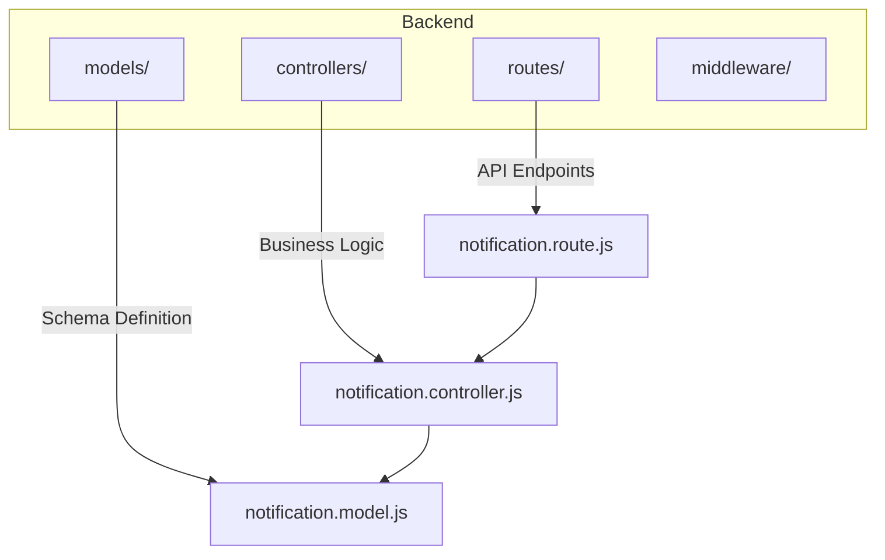
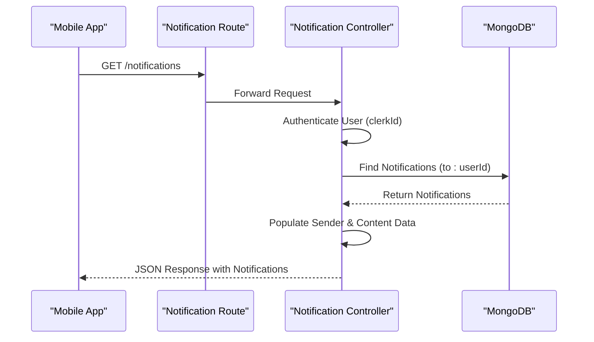
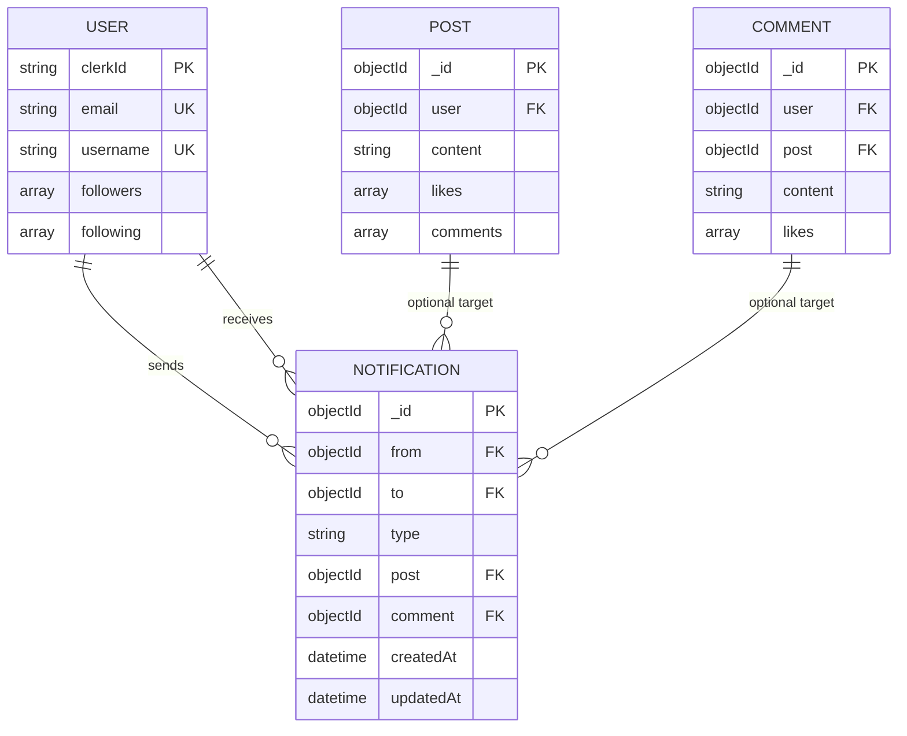
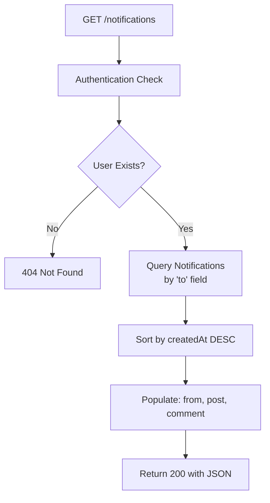
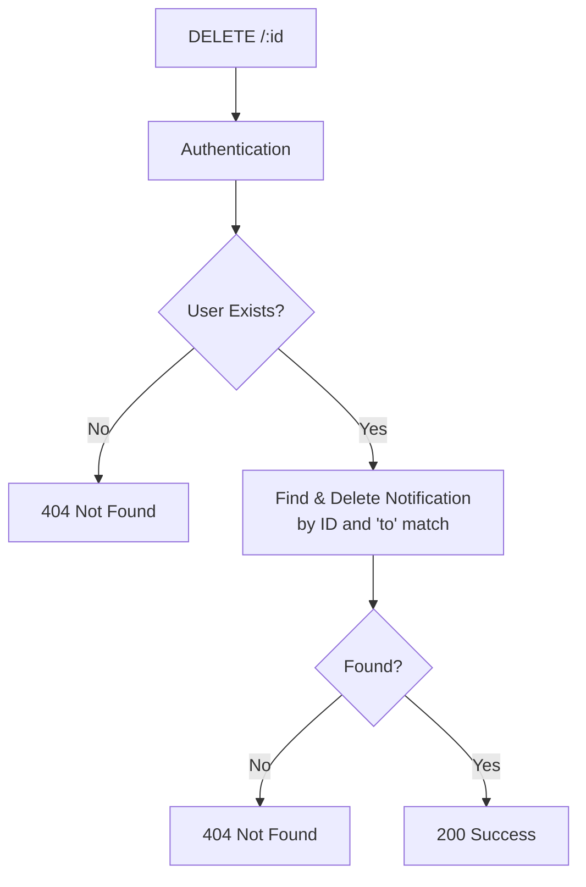
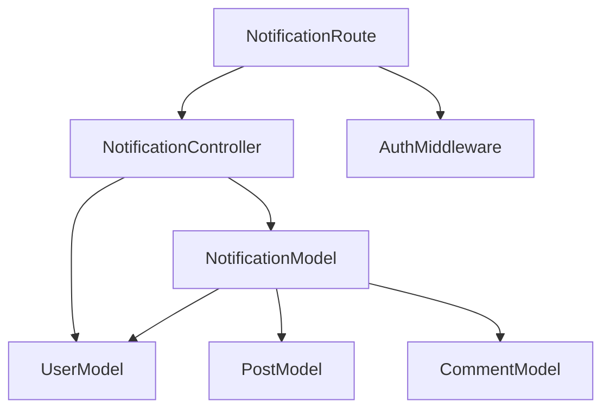

# Notification Model

<cite>
**Referenced Files in This Document**   
- [notification.model.js](file://backend/src/models/notification.model.js#L1-L37)
- [user.model.js](file://backend/src/models/user.model.js#L1-L64)
- [post.model.js](file://backend/src/models/post.model.js#L1-L37)
- [comment.model.js](file://backend/src/models/comment.model.js#L1-L33)
- [notification.controller.js](file://backend/src/controllers/notification.controller.js#L1-L37)
- [notification.route.js](file://backend/src/routes/notification.route.js#L1-L11)
</cite>

## Table of Contents
1. [Introduction](#introduction)
2. [Project Structure](#project-structure)
3. [Core Components](#core-components)
4. [Architecture Overview](#architecture-overview)
5. [Detailed Component Analysis](#detailed-component-analysis)
6. [Dependency Analysis](#dependency-analysis)
7. [Performance Considerations](#performance-considerations)
8. [Troubleshooting Guide](#troubleshooting-guide)
9. [Conclusion](#conclusion)

## Introduction
This document provides a comprehensive overview of the **Notification Model** in xClone's backend system. It details the schema design, relationships with other models, API endpoints, and business logic governing notification creation, retrieval, and deletion. The model supports real-time user engagement through follow, like, and comment events, with polymorphic references to associated content. This documentation is designed to be accessible for both technical and non-technical stakeholders.

## Project Structure
The xClone project follows a modular backend structure using Express.js and MongoDB via Mongoose. The notification functionality resides within the `backend/src` directory, organized into models, controllers, and routes. The mobile frontend consumes these APIs but does not directly influence the notification model logic.



**Diagram sources**
- [notification.model.js](file://backend/src/models/notification.model.js#L1-L37)
- [notification.controller.js](file://backend/src/controllers/notification.controller.js#L1-L37)
- [notification.route.js](file://backend/src/routes/notification.route.js#L1-L11)

**Section sources**
- [notification.model.js](file://backend/src/models/notification.model.js#L1-L37)
- [notification.controller.js](file://backend/src/controllers/notification.controller.js#L1-L37)
- [notification.route.js](file://backend/src/routes/notification.route.js#L1-L11)

## Core Components
The core components of the notification system include:
- **Notification Model**: Defines the structure and constraints of notification data
- **Notification Controller**: Handles API request processing and database interactions
- **Notification Route**: Exposes RESTful endpoints for client consumption
- **User, Post, Comment Models**: Provide referenced entities for relationship mapping

These components work together to deliver user-specific notifications based on social interactions within the platform.

**Section sources**
- [notification.model.js](file://backend/src/models/notification.model.js#L1-L37)
- [notification.controller.js](file://backend/src/controllers/notification.controller.js#L1-L37)
- [notification.route.js](file://backend/src/routes/notification.route.js#L1-L11)

## Architecture Overview
The notification system operates as a service layer between user actions and client presentation. When a user performs an action (like, comment, follow), an event triggers the creation of a notification document. The mobile app periodically fetches unread notifications via the `/notifications` endpoint.



**Diagram sources**
- [notification.controller.js](file://backend/src/controllers/notification.controller.js#L1-L37)
- [notification.route.js](file://backend/src/routes/notification.route.js#L1-L11)

## Detailed Component Analysis

### Notification Model Analysis
The `Notification` model defines how user interaction events are stored and related to other entities in the system.

#### Schema Definition
```javascript
{
  from: { type: ObjectId, ref: "User", required: true },
  to: { type: ObjectId, ref: "User", required: true },
  type: { type: String, required: true, enum: ["follow", "like", "comment"] },
  post: { type: ObjectId, ref: "Post", default: null },
  comment: { type: ObjectId, ref: "Comment", default: null }
}
```

**Key Fields:**
- **from**: Reference to the user who triggered the notification (e.g., someone who liked your post)
- **to**: Reference to the recipient user (e.g., the post owner)
- **type**: Enum indicating the notification category
- **post**: Optional reference to a Post document (used for 'like' and 'comment' types)
- **comment**: Optional reference to a Comment document (used for 'comment' replies)

The model automatically includes `createdAt` and `updatedAt` timestamps due to the `{ timestamps: true }` option.



**Diagram sources**
- [notification.model.js](file://backend/src/models/notification.model.js#L1-L37)
- [user.model.js](file://backend/src/models/user.model.js#L1-L64)
- [post.model.js](file://backend/src/models/post.model.js#L1-L37)
- [comment.model.js](file://backend/src/models/comment.model.js#L1-L33)

**Section sources**
- [notification.model.js](file://backend/src/models/notification.model.js#L1-L37)

#### Polymorphic Target Behavior
The notification model uses optional fields to support multiple content types:
- **follow**: Only requires `from`, `to`, and `type`
- **like**: Requires `post` reference in addition to core fields
- **comment**: Requires either `post` (for top-level comments) or both `post` and `comment` (for replies)

This design avoids complex inheritance patterns while maintaining flexibility.

### API Endpoint Analysis
The notification system exposes two primary endpoints:

#### GET /notifications
Retrieves all notifications for the authenticated user, sorted by creation time (newest first). The response includes populated sender details and associated content.



**Section sources**
- [notification.controller.js](file://backend/src/controllers/notification.controller.js#L1-L37)

#### DELETE /:notificationId
Allows users to remove individual notifications from their feed.



**Section sources**
- [notification.controller.js](file://backend/src/controllers/notification.controller.js#L19-L37)

### Sample Notification Documents
Examples of actual notification documents based on different event types:

**Follow Notification:**
```json
{
  "_id": "652f8e1a9c1b2d3e4f5a6b7c",
  "from": "652f8e1a9c1b2d3e4f5a6b7d",
  "to": "652f8e1a9c1b2d3e4f5a6b7e",
  "type": "follow",
  "post": null,
  "comment": null,
  "createdAt": "2023-10-17T08:23:06.123Z",
  "updatedAt": "2023-10-17T08:23:06.123Z"
}
```

**Like Notification:**
```json
{
  "_id": "652f8e1a9c1b2d3e4f5a6b7f",
  "from": "652f8e1a9c1b2d3e4f5a6b80",
  "to": "652f8e1a9c1b2d3e4f5a6b7e",
  "type": "like",
  "post": "652f8e1a9c1b2d3e4f5a6b81",
  "comment": null,
  "createdAt": "2023-10-17T08:25:12.456Z",
  "updatedAt": "2023-10-17T08:25:12.456Z"
}
```

**Comment Notification:**
```json
{
  "_id": "652f8e1a9c1b2d3e4f5a6b82",
  "from": "652f8e1a9c1b2d3e4f5a6b83",
  "to": "652f8e1a9c1b2d3e4f5a6b7e",
  "type": "comment",
  "post": "652f8e1a9c1b2d3e4f5a6b81",
  "comment": "652f8e1a9c1b2d3e4f5a6b84",
  "createdAt": "2023-10-17T08:27:33.789Z",
  "updatedAt": "2023-10-17T08:27:33.789Z"
}
```

**Section sources**
- [notification.model.js](file://backend/src/models/notification.model.js#L1-L37)

## Dependency Analysis
The notification system depends on several core models and services:



Key dependencies:
- **User Model**: For authentication and recipient validation
- **Post & Comment Models**: For populating referenced content
- **Auth Middleware**: For user session verification
- **Mongoose ODM**: For database operations and schema validation

**Diagram sources**
- [notification.model.js](file://backend/src/models/notification.model.js#L1-L37)
- [user.model.js](file://backend/src/models/user.model.js#L1-L64)
- [post.model.js](file://backend/src/models/post.model.js#L1-L37)
- [comment.model.js](file://backend/src/models/comment.model.js#L1-L33)
- [notification.controller.js](file://backend/src/controllers/notification.controller.js#L1-L37)
- [notification.route.js](file://backend/src/routes/notification.route.js#L1-L11)

**Section sources**
- [notification.model.js](file://backend/src/models/notification.model.js#L1-L37)
- [notification.controller.js](file://backend/src/controllers/notification.controller.js#L1-L37)

## Performance Considerations
While the current implementation works well for moderate user bases, several optimizations can enhance scalability:

### Indexing Strategy
Currently, queries filter by `to` field. Recommended indexes:
```javascript
// Create index for recipient-based queries
db.notifications.createIndex({ "to": 1, "createdAt": -1 })

// Compound index for type-specific filtering if needed
db.notifications.createIndex({ "to": 1, "type": 1 })
```

### Pagination
The current `getNotifications` endpoint retrieves all notifications without pagination, which may cause performance issues at scale. Recommended enhancement:
```javascript
// Add pagination parameters
const page = parseInt(req.query.page) || 1
const limit = parseInt(req.query.limit) || 10
const skip = (page - 1) * limit

Notification.find({ to: user._id })
  .sort({ createdAt: -1 })
  .skip(skip)
  .limit(limit)
  // ... rest of query
```

### Data Retention
Consider implementing automatic cleanup of read notifications older than 30-90 days to control database growth.

### Real-Time Delivery
Currently relies on client polling. Future enhancement could use WebSocket or Firebase Cloud Messaging for push notifications.

## Troubleshooting Guide
Common issues and solutions:

**Issue: Notifications not appearing**
- Verify user authentication is successful
- Check that the `to` field matches the correct user ID
- Ensure the notification document was properly created

**Issue: Missing content in response**
- Confirm `populate()` calls are correctly configured
- Verify referenced Post/Comment documents exist
- Check for database connectivity issues

**Issue: Performance degradation with large datasets**
- Implement pagination as shown above
- Ensure proper indexing on `to` and `createdAt` fields
- Consider archiving old notifications

**Section sources**
- [notification.controller.js](file://backend/src/controllers/notification.controller.js#L1-L37)
- [notification.model.js](file://backend/src/models/notification.model.js#L1-L37)

## Conclusion
The Notification Model in xClone provides a flexible foundation for social interaction tracking. Its polymorphic design accommodates multiple event types while maintaining simplicity. The current implementation effectively supports core functionality but would benefit from pagination, improved indexing, and potential real-time delivery enhancements. The clear separation of concerns between model, controller, and route layers ensures maintainability and extensibility.