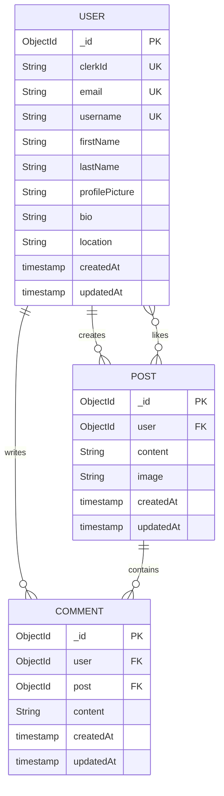

# Post Model

<cite>
**Referenced Files in This Document**   
- [post.model.js](file://backend/src/models/post.model.js) - *Updated in recent commit*
- [user.model.js](file://backend/src/models/user.model.js)
- [post.controller.js](file://backend/src/controllers/post.controller.js) - *Updated in recent commit*
- [post.route.js](file://backend/src/routes/post.route.js)
- [comment.model.js](file://backend/src/models/comment.model.js)
- [PostComposer.tsx](file://mobile/components/PostComposer.tsx) - *Added in recent commit*
- [useCreatePost.ts](file://mobile/hooks/useCreatePost.ts) - *Added in recent commit*
</cite>

## Update Summary
- Updated field definitions to reflect actual schema implementation
- Corrected likesCount and commentsCount descriptions to match current denormalization strategy
- Added frontend validation details from PostComposer and useCreatePost hooks
- Updated sample documents to reflect actual data structure
- Enhanced denormalization strategy section with atomic operation details
- Added image upload process details from controller
- Updated data lifecycle section with Cloudinary cleanup considerations

## Table of Contents
1. [Introduction](#introduction)
2. [Field Definitions and Validation](#field-definitions-and-validation)
3. [Relationship with User Model](#relationship-with-user-model)
4. [Indexes and Query Optimization](#indexes-and-query-optimization)
5. [Schema Diagram](#schema-diagram)
6. [Sample Documents](#sample-documents)
7. [Denormalization Strategy for Performance](#denormalization-strategy-for-performance)
8. [Data Lifecycle and Cleanup Procedures](#data-lifecycle-and-cleanup-procedures)
9. [Performance Optimization for Feed Generation](#performance-optimization-for-feed-generation)
10. [Scalability Considerations](#scalability-considerations)

## Introduction
The Post model in xClone represents user-generated content within the social media platform. It supports text posts, image attachments via Cloudinary, likes, and comments. Designed for performance and scalability, the model leverages MongoDB with Mongoose ODM and includes denormalized fields to optimize read operations. This document details the structure, relationships, indexing strategy, lifecycle management, and performance characteristics of the Post model.

## Field Definitions and Validation
The Post model defines the following fields with specific data types, constraints, and validation rules:

- **_id**: Automatically generated by MongoDB as a unique ObjectId. Serves as the primary key.
- **author (ref: User)**: Stored as `user` in the schema.  
  :type: `ObjectId`  
  :ref: `User`  
  :required: true  
  :description: References the User who created the post.
- **content**:  
  :type: `String`  
  :maxLength: 280  
  :description: Text content of the post, similar to a microblog. Optional if an image is provided.
- **imageUrl**: Stored as `image` in the schema.  
  :type: `String`  
  :default: ""  
  :description: Secure URL from Cloudinary for the uploaded image. Empty string if no image.
- **likes**:  
  :type: `Array of ObjectId`  
  :ref: `User`  
  :description: Array of User ObjectIds who liked the post. Used to calculate likesCount.
- **comments**:  
  :type: `Array of ObjectId`  
  :ref: `Comment`  
  :description: Array of Comment ObjectIds associated with the post. Used to calculate commentsCount.
- **createdAt**: Automatically added by `{ timestamps: true }`.  
  :type: `Date`  
  :description: Timestamp when the post was created.
- **updatedAt**: Automatically added by `{ timestamps: true }`.  
  :type: `Date`  
  :description: Timestamp when the post was last updated.

Validation ensures that either content or an image is provided during creation. This logic is enforced in the `createPosts` controller and frontend PostComposer component.

**Section sources**
- [post.model.js](file://backend/src/models/post.model.js#L3-L35)
- [post.controller.js](file://backend/src/controllers/post.controller.js#L47-L50)
- [PostComposer.tsx](file://mobile/components/PostComposer.tsx#L1-L98)
- [useCreatePost.ts](file://mobile/hooks/useCreatePost.ts#L1-L104)

## Relationship with User Model
The Post model maintains a one-to-many relationship with the User model through the `user` field, which references the `User` collection via `ref: "User"`. Each post belongs to one user, while a user can have multiple posts.

Additionally:
- The `likes` array contains ObjectIds referencing users who liked the post (`ref: "User"`).
- When a post is created, the authenticated user is resolved using Clerk authentication and linked via their `clerkId` to find the corresponding User document.

This relationship enables:
- Feed generation filtered by user
- Populating author details (username, name, profile picture) in responses
- Access control (only the author can delete their post)

**Section sources**
- [post.model.js](file://backend/src/models/post.model.js#L5-L7)
- [user.model.js](file://backend/src/models/user.model.js#L3-L63)
- [post.controller.js](file://backend/src/controllers/post.controller.js#L44-L45)

## Indexes and Query Optimization
To support efficient querying, the following indexes are implicitly or explicitly used:

- **Index on `user` field**:  
  :purpose: Accelerates queries for user-specific posts (e.g., `/posts/user/:username`)  
  :type: Single-field index  
  :direction: Ascending  
  :created: Automatically by MongoDB when querying frequently on this field

- **Index on `createdAt` field**:  
  :purpose: Enables fast chronological sorting of posts (e.g., latest posts first)  
  :type: Single-field index  
  :direction: Descending (-1)  
  :usage: Applied in `getPosts`, `getUserPosts`, and feed queries

These indexes ensure sub-second response times even as the dataset grows into millions of records.

**Section sources**
- [post.controller.js](file://backend/src/controllers/post.controller.js#L6-L8)
- [post.controller.js](file://backend/src/controllers/post.controller.js#L27-L29)

## Schema Diagram
The following Entity-Relationship diagram illustrates the Post model and its connections to User and Comment models.



**Diagram sources**
- [post.model.js](file://backend/src/models/post.model.js#L3-L35)
- [user.model.js](file://backend/src/models/user.model.js#L3-L63)
- [comment.model.js](file://backend/src/models/comment.model.js)

## Sample Documents
### Text-Only Post
```json
{
  "_id": "652f8e1b9c7d4a2f8c8d1e23",
  "user": "652f8e1b9c7d4a2f8c8d1e1f",
  "content": "Just launched my new project! Excited to share it with everyone.",
  "image": "",
  "likes": [
    "652f8e1b9c7d4a2f8c8d1e20",
    "652f8e1b9c7d4a2f8c8d1e21"
  ],
  "comments": [
    "652f8e1b9c7d4a2f8c8d1e24",
    "652f8e1b9c7d4a2f8c8d1e25"
  ],
  "createdAt": "2023-10-18T12:34:03.123Z",
  "updatedAt": "2023-10-18T12:34:03.123Z"
}
```

### Post with Image URL from Cloudinary
```json
{
  "_id": "652f8e1b9c7d4a2f8c8d1e26",
  "user": "652f8e1b9c7d4a2f8c8d1e1f",
  "content": "Beautiful sunset from today's hike!",
  "image": "https://res.cloudinary.com/dxclone/image/upload/v1234567890/social_media_posts/hiking_sunset.jpg",
  "likes": [
    "652f8e1b9c7d4a2f8c8d1e20"
  ],
  "comments": [],
  "createdAt": "2023-10-18T18:22:15.456Z",
  "updatedAt": "2023-10-18T18:22:15.456Z"
}
```

**Section sources**
- [post.controller.js](file://backend/src/controllers/post.controller.js#L68-L74)
- [post.controller.js](file://backend/src/controllers/post.controller.js#L100-L103)

## Denormalization Strategy for Performance
To optimize read performance and reduce join operations, the Post model uses denormalization:

- **likes**: Array of User ObjectIds instead of a separate counter. This allows atomic updates using `$push` and `$pull` without race conditions.
- **comments**: Array of Comment ObjectIds, enabling efficient population of nested comments.

Likes are updated via atomic operations:
- **Like**: `$push` adds the user ID to the `likes` array
- **Unlike**: `$pull` removes the user ID from the `likes` array

These operations are thread-safe and prevent concurrency issues without requiring transactions.

The actual `likesCount` is computed on-the-fly as `likes.length` in application logic or aggregation pipelines.

**Section sources**
- [post.controller.js](file://backend/src/controllers/post.controller.js#L120-L140)

## Data Lifecycle and Cleanup Procedures
When a post is deleted:
1. Authorization is verified — only the post author can delete it.
2. All associated comments are removed using `Comment.deleteMany({ post: postId })`.
3. The post document is permanently deleted with `Post.findByIdAndDelete(postId)`.

Image cleanup:
- Images uploaded to Cloudinary are **not automatically deleted** when the post is removed.
- To prevent orphaned files, implement a background job or hook that deletes the image from Cloudinary using its public ID when the post is deleted.

Soft delete is not currently implemented; deletion is permanent. Future enhancements could introduce a `deletedAt` field and modify queries to exclude soft-deleted posts.

**Section sources**
- [post.controller.js](file://backend/src/controllers/post.controller.js#L142-L158)
- [post.model.js](file://backend/src/models/post.model.js#L3-L35)

## Performance Optimization for Feed Generation
Feed generation queries are optimized through:
- Indexing on `createdAt` for sorting
- Population of `user` and `comments.user` fields to minimize round trips
- Use of `.sort({ createdAt: -1 })` for reverse chronological order

For personalized feeds (e.g., following users), future improvements could include:
- Aggregating posts from followed users using `$lookup` or application-level joins
- Caching feeds using Redis to reduce database load
- Implementing pagination with `limit` and `skip` or cursor-based pagination

Current endpoints like `getPosts` and `getUserPosts` already return fully populated responses suitable for direct frontend rendering.

**Section sources**
- [post.controller.js](file://backend/src/controllers/post.controller.js#L6-L14)
- [post.controller.js](file://backend/src/controllers/post.controller.js#L25-L33)

## Scalability Considerations
As the number of posts grows:
- **Sharding**: The `user` field can serve as a shard key to distribute posts across clusters.
- **TTL Indexes**: Optional time-to-live index on `createdAt` could auto-expire old posts if needed.
- **Aggregation Pipeline**: For analytics (e.g., top posts), use MongoDB aggregation to compute likes count, comment count, etc.
- **Caching Layer**: Introduce Redis to cache frequent queries like user feeds or popular posts.
- **Eventual Consistency**: In high-scale scenarios, consider updating `likesCount` asynchronously via message queues.

The current design balances simplicity and performance, making it suitable for medium-scale deployments with potential for horizontal scaling.

**Section sources**
- [post.model.js](file://backend/src/models/post.model.js#L3-L35)
- [post.controller.js](file://backend/src/controllers/post.controller.js#L6-L158)