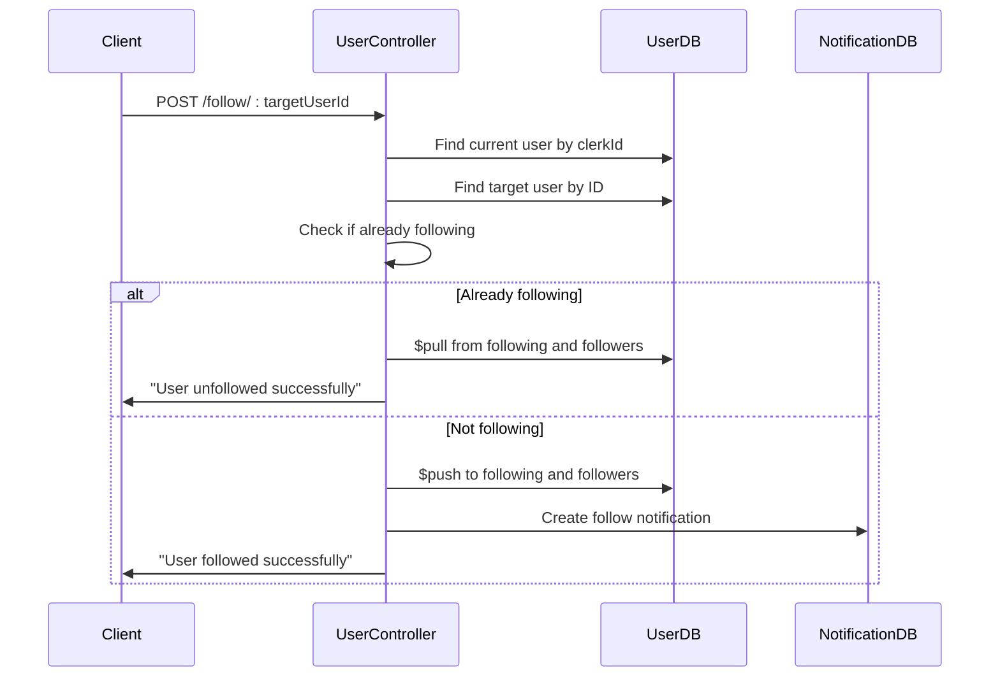

# User Model

<cite>
**Referenced Files in This Document**   
- [user.model.js](file://backend/src/models/user.model.js#L1-L63)
- [post.model.js](file://backend/src/models/post.model.js#L1-L37)
- [comment.model.js](file://backend/src/models/comment.model.js#L1-L33)
- [notification.model.js](file://backend/src/models/notification.model.js#L1-L37)
- [user.controller.js](file://backend/src/controllers/user.controller.js#L1-L95)
- [user.route.js](file://backend/src/routes/user.route.js#L1-L17)
</cite>

## Table of Contents
1. [User Model](#user-model)
2. [Field Specifications](#field-specifications)
3. [Indexing Strategy](#indexing-strategy)
4. [Relationships with Other Models](#relationships-with-other-models)
5. [Schema Diagram](#schema-diagram)
6. [Sample User Document](#sample-user-document)
7. [User Synchronization from Clerk](#user-synchronization-from-clerk)
8. [Follow/Unfollow Workflow](#followunfollow-workflow)
9. [Data Privacy Considerations](#data-privacy-considerations)
10. [Performance Implications](#performance-implications)

## Field Specifications

The User model in xClone's MongoDB schema defines a comprehensive user profile structure with the following fields:

**User Schema Fields**
- **_id**: ObjectId (automatically generated by MongoDB)
- **clerkId**: String, required, unique
- **email**: String, required, unique
- **firstName**: String, required
- **lastName**: String, required
- **username**: String, required, unique
- **profilePicture**: String, default: ""
- **bannerImage**: String, default: ""
- **bio**: String, default: "", maxLength: 160
- **location**: String, default: ""
- **followers**: Array of ObjectIds, references "User" model
- **following**: Array of ObjectIds, references "User" model
- **createdAt**: Date (automatically generated by timestamps option)
- **updatedAt**: Date (automatically generated by timestamps option)

**Validation Rules**
- Required fields: clerkId, email, firstName, lastName, username
- Unique constraints: clerkId, email, username
- Length constraints: bio field limited to 160 characters
- Default values: profilePicture, bannerImage, bio, and location default to empty strings

**Section sources**
- [user.model.js](file://backend/src/models/user.model.js#L1-L63)

## Indexing Strategy

The User model implements multiple indexing strategies to optimize query performance:

**Unique Indexes**
- **clerkId**: Ensures each user has a unique identifier from the Clerk authentication system
- **email**: Prevents duplicate email addresses across users
- **username**: Guarantees username uniqueness for profile identification

**Text Search Index**
- The schema implicitly supports text search through the username, firstName, and lastName fields, enabling efficient user discovery features.

**Performance Benefits**
- Unique indexes prevent duplicate entries and accelerate equality queries
- The combination of clerkId and username indexes supports both authentication and profile lookup workflows
- Indexes on frequently queried fields (email, username) reduce search time from O(n) to O(log n)

**Section sources**
- [user.model.js](file://backend/src/models/user.model.js#L1-L63)

## Relationships with Other Models

The User model serves as a central entity that connects with multiple other models in the xClone application:

**Post Relationship**
- Each Post document references a User via the user field (ObjectId, ref: "User")
- Users can have multiple posts, establishing a one-to-many relationship
- The Post model populates user data for display in feeds and profiles

**Comment Relationship**
- Comment documents reference User through the user field (ObjectId, ref: "User")
- Enables attribution of comments to specific users
- Supports nested population in post threads

**Notification Relationship**
- Notifications track user interactions with from and to fields (both referencing User)
- Supports follow, like, and comment notification types
- Enables activity tracking between users

**Self-Referential Relationships**
- followers array: Contains ObjectIds of users who follow this user
- following array: Contains ObjectIds of users this user follows
- Creates a bidirectional social graph within the same collection

**Section sources**
- [user.model.js](file://backend/src/models/user.model.js#L1-L63)
- [post.model.js](file://backend/src/models/post.model.js#L1-L37)
- [comment.model.js](file://backend/src/models/comment.model.js#L1-L33)
- [notification.model.js](file://backend/src/models/notification.model.js#L1-L37)

## Schema Diagram

```mermaid
erDiagram
USER {
string clerkId PK UK
string email UK
string firstName
string lastName
string username UK
string profilePicture
string bannerImage
string bio
string location
array followers
array following
date createdAt
date updatedAt
}
POST {
objectId user FK
string content
string image
array likes
array comments
date createdAt
date updatedAt
}
COMMENT {
objectId user FK
objectId post FK
string content
array likes
date createdAt
date updatedAt
}
NOTIFICATION {
objectId from FK
objectId to FK
string type
objectId post
objectId comment
date createdAt
date updatedAt
}
USER ||--o{ POST : "authors"
USER ||--o{ COMMENT : "authors"
USER }|--|{ USER : "follows"
USER ||--o{ NOTIFICATION : "sends"
USER ||--o{ NOTIFICATION : "receives"
```

**Diagram sources**
- [user.model.js](file://backend/src/models/user.model.js#L1-L63)
- [post.model.js](file://backend/src/models/post.model.js#L1-L37)
- [comment.model.js](file://backend/src/models/comment.model.js#L1-L33)
- [notification.model.js](file://backend/src/models/notification.model.js#L1-L37)

## Sample User Document

```json
{
  "_id": "64a1b2c3d4e5f6a7b8c9d0e1",
  "clerkId": "user_2abc123def456ghi789jkl",
  "email": "jane.doe@example.com",
  "firstName": "Jane",
  "lastName": "Doe",
  "username": "jane_doe",
  "profilePicture": "https://example.com/images/jane.jpg",
  "bannerImage": "https://example.com/images/banner123.jpg",
  "bio": "Software developer passionate about social technologies",
  "location": "San Francisco, CA",
  "followers": [
    "64a1b2c3d4e5f6a7b8c9d0e2",
    "64a1b2c3d4e5f6a7b8c9d0e3"
  ],
  "following": [
    "64a1b2c3d4e5f6a7b8c9d0e4",
    "64a1b2c3d4e5f6a7b8c9d0e5"
  ],
  "createdAt": "2023-07-01T10:30:00.000Z",
  "updatedAt": "2023-07-15T14:22:00.000Z"
}
```

**Section sources**
- [user.model.js](file://backend/src/models/user.model.js#L1-L63)

## User Synchronization from Clerk

The User model integrates with Clerk for authentication and user data synchronization:

**Sync Process**
- When a user authenticates for the first time, the `syncUser` controller checks if a user with the given clerkId exists
- If no user is found, it creates a new User document using data from Clerk's user object
- The synchronization extracts firstName, lastName, email, and profile image from Clerk

**Data Mapping**
- clerkId: Directly from Clerk's userId
- email: From clerkUser.emailAddresses[0].emailAddress
- firstName: From clerkUser.firstName (with empty string fallback)
- lastName: From clerkUser.lastName (with empty string fallback)
- username: Derived from email (first part before @)
- profilePicture: From clerkUser.imageUrl

**Controller Implementation**
- The `syncUser` function in user.controller.js handles the synchronization logic
- Uses getAuth(req) to extract userId from authentication middleware
- Leverages clerkClient.users.getUser(userId) to fetch user data from Clerk

**Section sources**
- [user.controller.js](file://backend/src/controllers/user.controller.js#L32-L70)

## Follow/Unfollow Workflow

The User model supports social interactions through a follow/unfollow mechanism:

**Follow Process**
- When User A follows User B:
  - User A's following array is updated to include User B's ObjectId
  - User B's followers array is updated to include User A's ObjectId
  - A notification of type "follow" is created from User A to User B

**Unfollow Process**
- When User A unfollows User B:
  - User A's following array has User B's ObjectId removed
  - User B's followers array has User A's ObjectId removed
  - No notification is sent for unfollow actions

**Implementation Details**
- The `followUser` controller handles both follow and unfollow operations
- Uses $push to add to arrays and $pull to remove from arrays
- Prevents self-following with a validation check
- Returns appropriate success messages based on the action performed



**Diagram sources**
- [user.controller.js](file://backend/src/controllers/user.controller.js#L68-L95)
- [user.model.js](file://backend/src/models/user.model.js#L1-L63)

**Section sources**
- [user.controller.js](file://backend/src/controllers/user.controller.js#L32-L95)

## Data Privacy Considerations

The User model implementation addresses several data privacy aspects:

**Personal Information Handling**
- Email addresses are stored but not publicly exposed in profile views
- Full names are stored but can be displayed according to user preferences
- Profile pictures and banner images are stored as URLs to external services

**Authentication Integration**
- Clerk handles sensitive authentication data (passwords, social logins)
- The application only stores the clerkId as a reference
- No password fields are maintained in the User model

**Profile Visibility**
- All profile fields can be edited by users through the updateProfile controller
- Empty default values allow users to maintain minimal public profiles
- The bio field length limit encourages concise self-descriptions

**Section sources**
- [user.model.js](file://backend/src/models/user.model.js#L1-L63)
- [user.controller.js](file://backend/src/controllers/user.controller.js#L32-L70)

## Performance Implications

The User model design has several performance considerations:

**Follower/Following Lookups**
- Array-based storage of followers and following enables efficient lookups using MongoDB's array operators
- The includes() method checks for membership in the following array
- Indexing on ObjectId fields ensures fast document retrieval

**Scalability Challenges**
- Large follower counts may increase document size and memory usage
- The current design may require pagination for users with thousands of followers
- Denormalization could be considered for high-frequency access patterns

**Query Optimization**
- Unique indexes on clerkId, email, and username accelerate authentication and profile lookup queries
- The timestamps option automatically indexes createdAt and updatedAt fields
- Population of user references in Post and Comment queries is optimized through indexing

**Potential Improvements**
- Consider separate collection for follower relationships for very large user bases
- Implement caching strategies for frequently accessed user profiles
- Add partial indexes for inactive users to improve query performance

**Section sources**
- [user.model.js](file://backend/src/models/user.model.js#L1-L63)
- [user.controller.js](file://backend/src/controllers/user.controller.js#L32-L95)