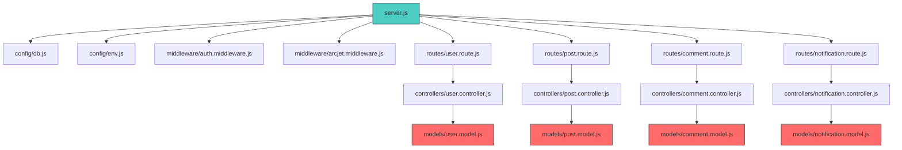
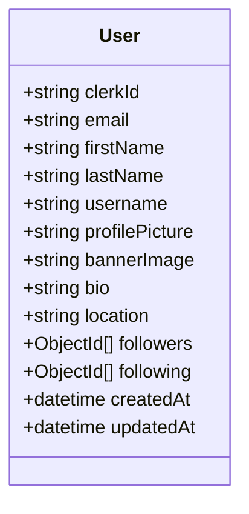
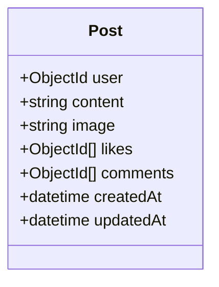
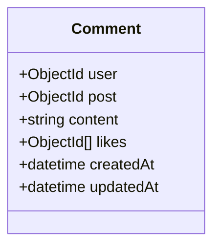
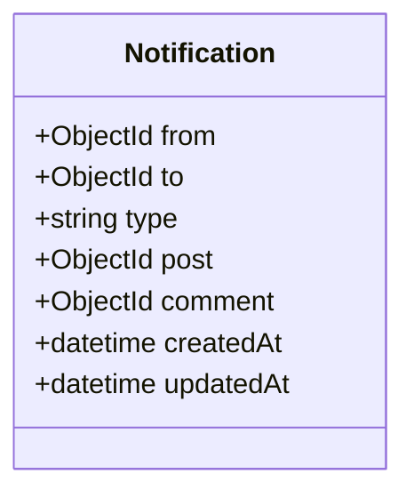
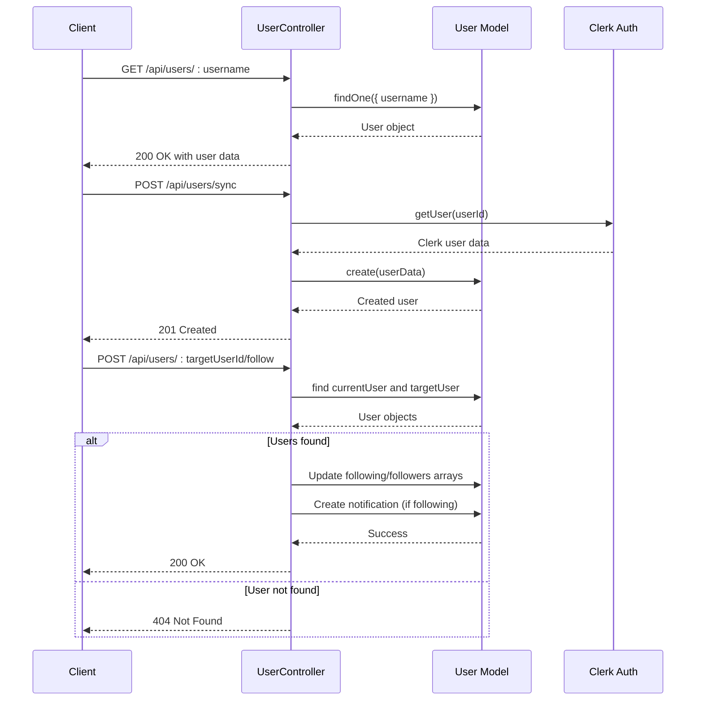
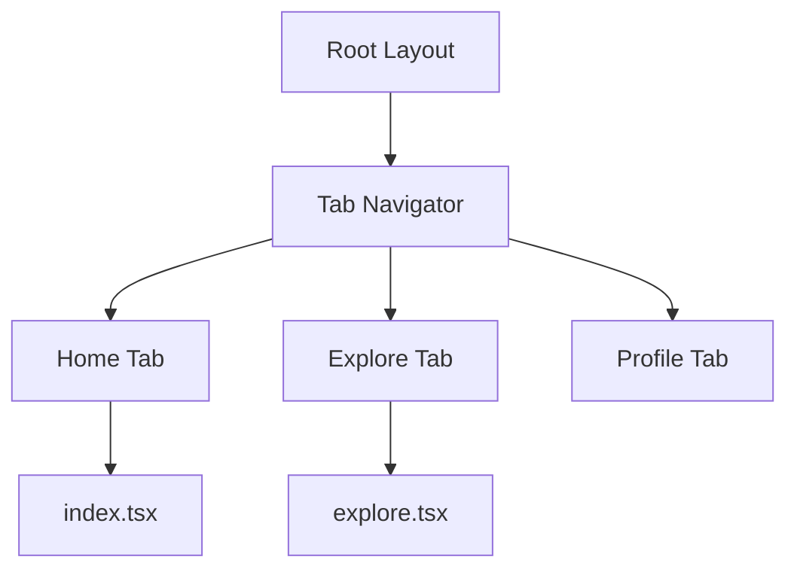
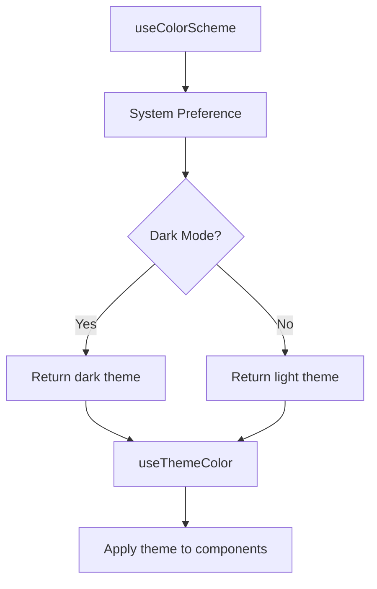

# Directory Structure Breakdown

<cite>
**Referenced Files in This Document**   
- [server.js](file://backend/src/server.js#L1-L48)
- [user.model.js](file://backend/src/models/user.model.js#L1-L64)
- [post.model.js](file://backend/src/models/post.model.js#L1-L37)
- [comment.model.js](file://backend/src/models/comment.model.js#L1-L33)
- [notification.model.js](file://backend/src/models/notification.model.js#L1-L37)
- [user.controller.js](file://backend/src/controllers/user.controller.js#L1-L97)
- [post.controller.js](file://backend/src/controllers/post.controller.js#L1-L50)
- [comment.controller.js](file://backend/src/controllers/comment.controller.js#L1-L30)
- [notification.controller.js](file://backend/src/controllers/notification.controller.js#L1-L25)
- [user.route.js](file://backend/src/routes/user.route.js#L1-L15)
- [post.route.js](file://backend/src/routes/post.route.js#L1-L15)
- [comment.route.js](file://backend/src/routes/comment.route.js#L1-L15)
- [notification.route.js](file://backend/src/routes/notification.route.js#L1-L15)
- [arcjet.middleware.js](file://backend/src/middleware/arcjet.middleware.js#L1-L10)
- [auth.middleware.js](file://backend/src/middleware/auth.middleware.js#L1-L5)
- [upload.middleware.js](file://backend/src/middleware/upload.middleware.js#L1-L8)
- [db.js](file://backend/src/config/db.js#L1-L15)
- [env.js](file://backend/src/config/env.js#L1-L10)
- [cloudinary.js](file://backend/src/config/cloudinary.js#L1-L8)
- [arcjet.js](file://backend/src/config/arcjet.js#L1-L6)
- [app.json](file://mobile/app.json#L1-L43)
- [tsconfig.json](file://mobile/tsconfig.json#L1-L18)
- [package.json](file://mobile/package.json#L1-L50)
- [package.json](file://backend/package.json#L1-L27)
- [_layout.tsx](file://mobile/app/(tabs)/_layout.tsx#L1-L20)
- [index.tsx](file://mobile/app/(tabs)/index.tsx#L1-L15)
- [explore.tsx](file://mobile/app/(tabs)/explore.tsx#L1-L15)
- [Colors.ts](file://mobile/constants/Colors.ts#L1-L30)
- [useColorScheme.ts](file://mobile/hooks/useColorScheme.ts#L1-L10)
- [useThemeColor.ts](file://mobile/hooks/useThemeColor.ts#L1-L15)
</cite>

## Table of Contents
1. [Directory Structure Breakdown](#directory-structure-breakdown)
2. [Backend Architecture Overview](#backend-architecture-overview)
3. [Backend MVC Components](#backend-mvc-components)
4. [Mobile Application Structure](#mobile-application-structure)
5. [Configuration Files](#configuration-files)
6. [File Organization Best Practices](#file-organization-best-practices)

## Backend Architecture Overview

The backend of the xClone project follows a clean, modular Express.js-based MVC (Model-View-Controller) architecture. The application entry point is `server.js`, which initializes the Express server, configures middleware, connects to the database, and mounts API routes.

The backend is organized into distinct directories under `backend/src/`:
- **models**: Define MongoDB schemas using Mongoose
- **controllers**: Handle business logic for API endpoints
- **routes**: Define API endpoints and map them to controller functions
- **middleware**: Reusable functions for authentication, validation, and request processing
- **config**: Configuration files for environment variables, database, and third-party services



**Diagram sources**
- [server.js](file://backend/src/server.js#L1-L48)
- [user.model.js](file://backend/src/models/user.model.js#L1-L64)
- [post.model.js](file://backend/src/models/post.model.js#L1-L37)

**Section sources**
- [server.js](file://backend/src/server.js#L1-L48)
- [db.js](file://backend/src/config/db.js#L1-L15)

## Backend MVC Components

### Models: Data Schema Definition

The models define the data structure and relationships in MongoDB using Mongoose. Each model corresponds to a collection in the database.

#### User Model
The `User` model represents application users with social media profile fields and follower relationships.



**Diagram sources**
- [user.model.js](file://backend/src/models/user.model.js#L1-L64)

#### Post Model
The `Post` model represents user-generated content with text, images, and engagement metrics.



**Diagram sources**
- [post.model.js](file://backend/src/models/post.model.js#L1-L37)

#### Comment Model
The `Comment` model represents comments on posts with user and post references.



**Diagram sources**
- [comment.model.js](file://backend/src/models/comment.model.js#L1-L33)

#### Notification Model
The `Notification` model tracks user interactions like follows, likes, and comments.



**Diagram sources**
- [notification.model.js](file://backend/src/models/notification.model.js#L1-L37)

### Controllers: Business Logic

Controllers contain the business logic for handling HTTP requests and responses. They interact with models to perform CRUD operations.

#### User Controller Flow


**Diagram sources**
- [user.controller.js](file://backend/src/controllers/user.controller.js#L1-L97)

### Routes: API Endpoints

Routes define the API endpoints and map HTTP methods to controller functions. Each route file corresponds to a resource.

```mermaid
flowchart TD
A[/api/users] --> B[GET /:username]
A --> C[POST /sync]
A --> D[GET /current]
A --> E[POST /:targetUserId/follow]
F[/api/posts] --> G[GET /]
F --> H[POST /]
F --> I[GET /:id]
F --> J[DELETE /:id]
K[/api/comments] --> L[POST /]
K --> M[DELETE /:id]
L[/api/notifications] --> N[GET /]
L --> O[GET /:id]
```

**Diagram sources**
- [user.route.js](file://backend/src/routes/user.route.js#L1-L15)
- [post.route.js](file://backend/src/routes/post.route.js#L1-L15)

### Middleware: Cross-Cutting Concerns

Middleware functions handle authentication, security, and request processing across multiple routes.

- **auth.middleware.js**: Integrates with Clerk for authentication
- **arcjet.middleware.js**: Provides rate limiting and bot protection
- **upload.middleware.js**: Handles file uploads using Multer

**Section sources**
- [auth.middleware.js](file://backend/src/middleware/auth.middleware.js#L1-L5)
- [arcjet.middleware.js](file://backend/src/middleware/arcjet.middleware.js#L1-L10)

### Config: Service Integrations

Configuration files manage external service connections and environment-specific settings.

- **db.js**: MongoDB connection setup using Mongoose
- **env.js**: Environment variable management
- **cloudinary.js**: Cloudinary image upload configuration
- **arcjet.js**: Arcjet security service configuration

**Section sources**
- [db.js](file://backend/src/config/db.js#L1-L15)
- [env.js](file://backend/src/config/env.js#L1-L10)

## Mobile Application Structure

The mobile application is built with React Native and Expo, using Expo Router for navigation. The structure follows modern React Native best practices with a focus on reusability and theming.

### Navigation Layout: (tabs)

The `(tabs)` directory contains the tab-based navigation layout for the application.

- **_layout.tsx**: Defines the tab navigator with bottom tab bar
- **index.tsx**: Home feed tab (default route)
- **explore.tsx**: Explore content tab



**Diagram sources**
- [_layout.tsx](file://mobile/app/(tabs)/_layout.tsx#L1-L20)

### Components: Reusable UI Elements

The `components` directory contains reusable UI components that follow the DRY principle.

- **ui/**: Atomic UI components (buttons, icons, etc.)
- **Collapsible.tsx**: Animated collapsible content
- **ExternalLink.tsx**: Link to external URLs
- **HapticTab.tsx**: Tab with haptic feedback
- **ParallaxScrollView.tsx**: Scroll view with parallax effect
- **ThemedText.tsx**: Text component with theme support
- **ThemedView.tsx**: View component with theme support

**Section sources**
- [ThemedText.tsx](file://mobile/components/ThemedText.tsx#L1-L25)
- [ThemedView.tsx](file://mobile/components/ThemedView.tsx#L1-L25)

### Hooks: Theme Management

Custom React hooks manage application state and theming.

- **useColorScheme.ts**: Detects system color scheme preference
- **useColorScheme.web.ts**: Web-specific color scheme detection
- **useThemeColor.ts**: Retrieves colors based on current theme



**Diagram sources**
- [useColorScheme.ts](file://mobile/hooks/useColorScheme.ts#L1-L10)
- [useThemeColor.ts](file://mobile/hooks/useThemeColor.ts#L1-L15)

### Constants: Design Tokens

The `constants` directory contains design system tokens.

- **Colors.ts**: Color palette for light and dark themes

**Section sources**
- [Colors.ts](file://mobile/constants/Colors.ts#L1-L30)

## Configuration Files

### Backend Configuration

The backend `package.json` defines dependencies and scripts:

- **Dependencies**: Express, Mongoose, Clerk authentication, Arcjet security, Cloudinary
- **Scripts**: `dev` (with file watching) and `start` for production

```json
{
  "name": "backend",
  "version": "1.0.0",
  "scripts": {
    "dev": "node --watch src/server.js",
    "start": "node src/server.js"
  },
  "dependencies": {
    "express": "^5.1.0",
    "mongoose": "^8.16.0",
    "@clerk/express": "^1.7.0",
    "cloudinary": "^2.0.0"
  }
}
```

**Section sources**
- [package.json](file://backend/package.json#L1-L27)

### Mobile Configuration

#### app.json (Expo Configuration)
```json
{
  "expo": {
    "name": "mobile",
    "slug": "mobile",
    "version": "1.0.0",
    "orientation": "portrait",
    "icon": "./assets/images/icon.png",
    "userInterfaceStyle": "automatic",
    "plugins": ["expo-router"],
    "experiments": {
      "typedRoutes": true
    }
  }
}
```

**Section sources**
- [app.json](file://mobile/app.json#L1-L43)

#### tsconfig.json (TypeScript Configuration)
```json
{
  "extends": "expo/tsconfig.base",
  "compilerOptions": {
    "strict": true,
    "paths": {
      "@/*": ["./"]
    }
  }
}
```

**Section sources**
- [tsconfig.json](file://mobile/tsconfig.json#L1-L18)

#### package.json (Mobile Dependencies)
```json
{
  "name": "mobile",
  "version": "1.0.0",
  "scripts": {
    "start": "expo start",
    "android": "expo start --android",
    "ios": "expo start --ios",
    "web": "expo start --web"
  },
  "dependencies": {
    "react": "19.0.0",
    "react-native": "0.79.6",
    "expo": "~53.0.22",
    "expo-router": "~5.1.5"
  }
}
```

**Section sources**
- [package.json](file://mobile/package.json#L1-L50)

## File Organization Best Practices

The xClone project follows several best practices for file organization:

1. **Separation of Concerns**: Clear separation between models, controllers, and routes
2. **Feature-Based Grouping**: Related files grouped by feature (e.g., user, post, comment)
3. **Consistent Naming**: Descriptive file names that match their purpose
4. **Configuration Centralization**: All config files in a dedicated directory
5. **Reusable Components**: Mobile components designed for reuse across screens
6. **Environment Management**: Proper separation of environment variables
7. **Type Safety**: TypeScript configuration with strict mode enabled
8. **Routing Convention**: Expo Router with file-based routing and typed routes

These practices make the codebase maintainable, scalable, and easy to navigate for new developers.

**Section sources**
- [server.js](file://backend/src/server.js#L1-L48)
- [app.json](file://mobile/app.json#L1-L43)
- [tsconfig.json](file://mobile/tsconfig.json#L1-L18)