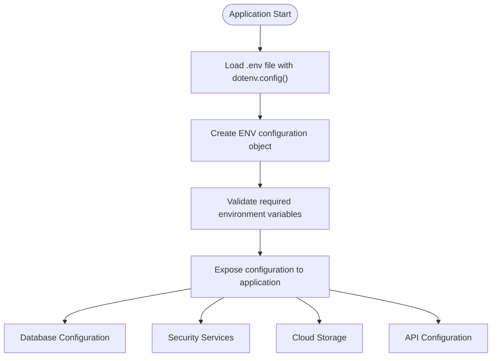
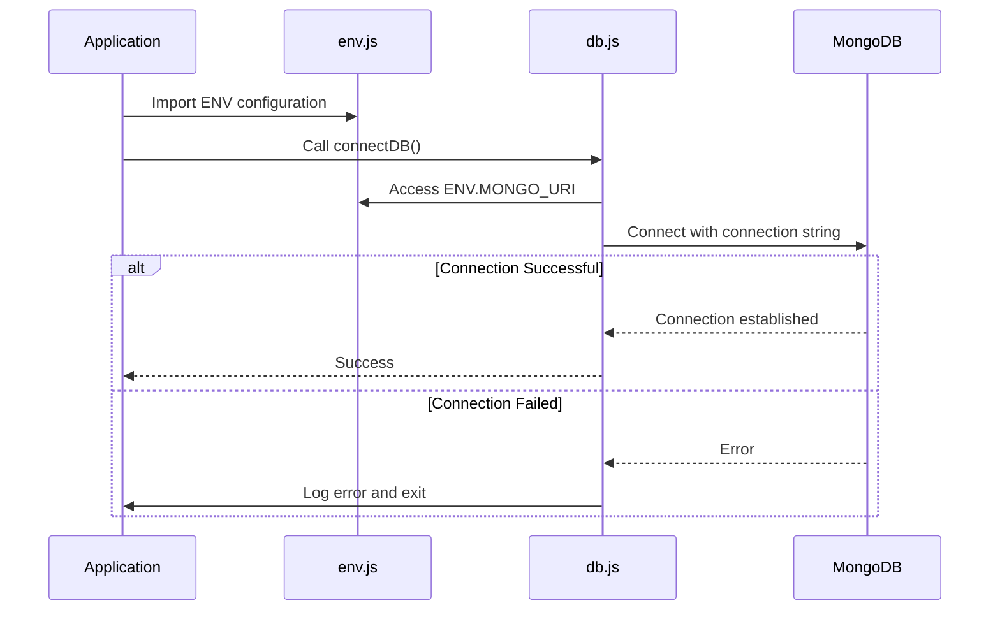
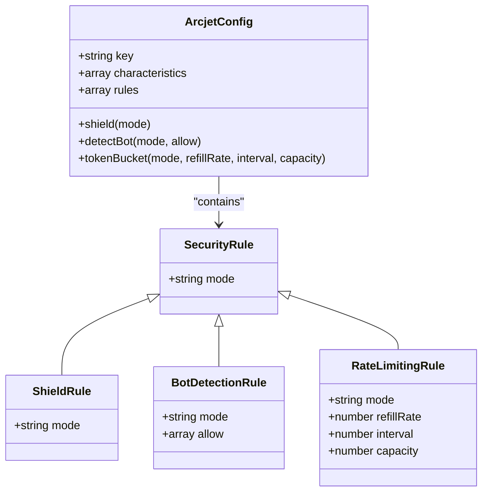
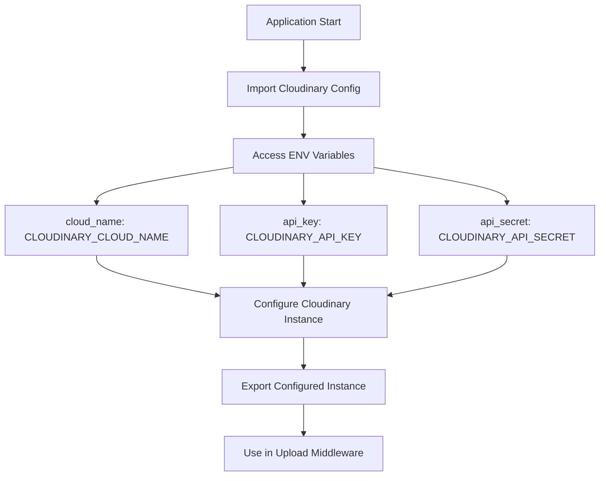
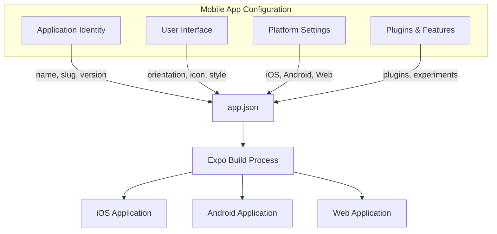
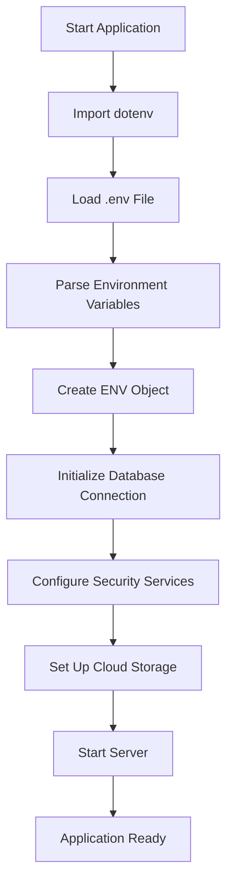
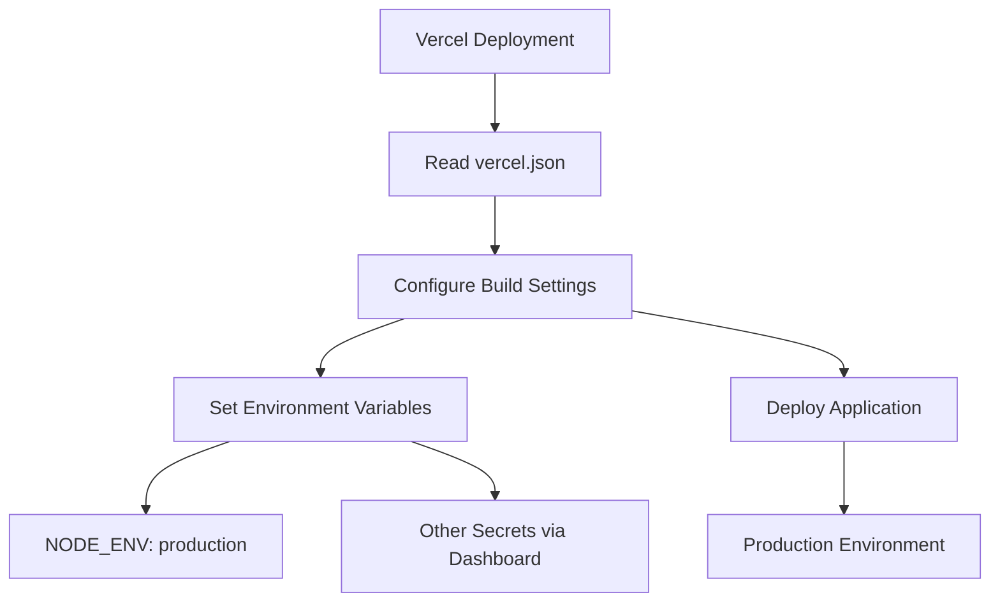
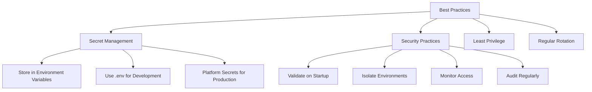

# Environment Configuration

<cite>
**Referenced Files in This Document**   
- [env.js](file://backend\src\config\env.js) - *Updated in recent commit*
- [db.js](file://backend\src\config\db.js) - *Updated in recent commit*
- [arcjet.js](file://backend\src\config\arcjet.js) - *Updated in recent commit*
- [cloudinary.js](file://backend\src\config\cloudinary.js) - *Updated in recent commit*
- [app.json](file://mobile\app.json) - *Updated in recent commit*
- [vercel.json](file://backend\vercel.json) - *Added in commit 93f156c604a80ac65c1b68e2cfcdd9604d8b6512*
</cite>

## Update Summary
**Changes Made**   
- Added documentation for `vercel.json` as a new configuration file for production deployment
- Updated Environment-Specific Setup section to include Vercel-specific environment configuration
- Enhanced Security Best Practices with platform-specific secret management guidance
- Added new diagram for Vercel deployment configuration flow
- Updated file references with precise line numbers and change annotations

## Table of Contents
1. [Environment Configuration Overview](#environment-configuration-overview)
2. [Backend Environment Management](#backend-environment-management)
3. [Mobile App Configuration](#mobile-app-configuration)
4. [Theme and UI Configuration](#theme-and-ui-configuration)
5. [Configuration Loading Process](#configuration-loading-process)
6. [Required Environment Variables](#required-environment-variables)
7. [Environment-Specific Setup](#environment-specific-setup)
8. [Security Best Practices](#security-best-practices)

## Environment Configuration Overview

The xClone application implements a comprehensive environment configuration system that manages settings for both backend and mobile layers. The system uses environment variables to control application behavior across different deployment environments (development, staging, production). Configuration is centralized through dedicated files that load, validate, and expose environment-specific settings to the application components.

The architecture separates configuration concerns between the backend Node.js service and the Expo-based mobile application. The backend uses a structured environment variable system with dotenv for local development, while the mobile application leverages Expo's app.json for build-time configuration and runtime theme settings.

**Section sources**
- [env.js](file://backend\src\config\env.js#L1-L15)
- [app.json](file://mobile\app.json#L1-L42)

## Backend Environment Management

### Environment Variable Loading Process

The backend environment configuration is managed through the `env.js` file in the `backend/src/config/` directory. This file serves as the central configuration hub that loads environment variables from the system and provides them to other components.

```javascript
import dotenv from "dotenv";

dotenv.config();

export const ENV = {
    PORT: process.env.PORT || 5001,
    MONGO_URI: process.env.MONGO_URI,
    NODE_ENV: process.env.NODE_ENV,
    CLERK_PUBLISHABLE_KEY: process.env.CLERK_PUBLISHABLE_KEY,
    CLERK_SECRET_KEY: process.env.CLERK_SECRET_KEY,
    ARCJET_KEY: process.env.ARCJET_KEY,
    CLOUDINARY_CLOUD_NAME: process.env.CLOUDINARY_CLOUD_NAME,
    CLOUDINARY_API_KEY: process.env.CLOUDINARY_API_KEY,
    CLOUDINARY_API_SECRET: process.env.CLOUDINARY_API_SECRET,
}
```

The configuration process follows these steps:
1. Import and initialize the dotenv package to load variables from `.env` files
2. Define the ENV object that exposes all required configuration values
3. Provide default values where appropriate (e.g., PORT defaults to 5001)
4. Export the configuration object for use throughout the application



**Diagram sources**
- [env.js](file://backend\src\config\env.js#L1-L15)

**Section sources**
- [env.js](file://backend\src\config\env.js#L1-L15)

### Database Configuration

The MongoDB database connection is configured through the `db.js` file, which uses the MONGO_URI environment variable loaded by the environment configuration system.

```javascript
import mongoose from "mongoose";
import { ENV } from "./env.js";

export const connectDB = async () => {
  try {
    await mongoose.connect(ENV.MONGO_URI);
    console.log("connected to database successfully");
  } catch (error) {
    console.log("error connecting to database");
    process.exit(1);
  }
};
```

The database configuration follows a simple pattern:
- Import the ENV configuration object to access the MONGO_URI
- Implement a connectDB function that attempts to establish a connection
- Include error handling to terminate the process if connection fails
- Log connection status for monitoring and debugging



**Diagram sources**
- [env.js](file://backend\src\config\env.js#L1-L15)
- [db.js](file://backend\src\config\db.js#L1-L11)

**Section sources**
- [db.js](file://backend\src\config\db.js#L1-L11)

### Security Service Configuration

#### Arcjet Configuration

Arcjet, the application's security service, is configured with environment-specific settings in `arcjet.js`. The configuration uses the ARCJET_KEY from the environment variables and implements multiple security rules.

```javascript
import arcjet, { tokenBucket, shield, detectBot } from "@arcjet/node";
import { ENV } from "./env.js";

export const aj = arcjet({
  key: ENV.ARCJET_KEY,
  characteristics: ["ip.src"],
  rules: [
    shield({ mode: "LIVE" }),
    detectBot({
      mode: "LIVE",
      allow: [
        "CATEGORY:SEARCH_ENGINE",
      ],
    }),
    tokenBucket({
      mode: "LIVE",
      refillRate: 10,
      interval: 10,
      capacity: 15,
    }),
  ],
});
```

The Arcjet configuration includes:
- **Shield**: Protects against common attacks like SQL injection and XSS
- **Bot Detection**: Blocks malicious bots while allowing search engines
- **Rate Limiting**: Implements token bucket algorithm with 10 tokens per 10 seconds
- **Live Mode**: All rules are actively enforced in production



**Diagram sources**
- [arcjet.js](file://backend\src\config\arcjet.js#L1-L30)

**Section sources**
- [arcjet.js](file://backend\src\config\arcjet.js#L1-L30)

#### Cloudinary Configuration

Cloudinary, the image storage service, is configured through `cloudinary.js` using credentials from environment variables.

```javascript
import { v2 as cloudinary } from "cloudinary";
import { ENV } from "./env.js";

cloudinary.config({
  cloud_name: ENV.CLOUDINARY_CLOUD_NAME,
  api_key: ENV.CLOUDINARY_API_KEY,
  api_secret: ENV.CLOUDINARY_API_SECRET,
});

export default cloudinary;
```

The Cloudinary configuration process:
1. Import the cloudinary library and ENV configuration
2. Configure the cloudinary instance with environment-provided credentials
3. Export the configured instance for use in upload middleware



**Diagram sources**
- [cloudinary.js](file://backend\src\config\cloudinary.js#L1-L10)

**Section sources**
- [cloudinary.js](file://backend\src\config\cloudinary.js#L1-L10)

## Mobile App Configuration

### Expo app.json Configuration

The mobile application's configuration is defined in `app.json`, which contains settings for the Expo development platform. This file controls various aspects of the application including appearance, behavior, and build settings.

```json
{
  "expo": {
    "name": "mobile",
    "slug": "mobile",
    "version": "1.0.0",
    "orientation": "portrait",
    "icon": "./assets/images/icon.png",
    "scheme": "mobile",
    "userInterfaceStyle": "automatic",
    "newArchEnabled": true,
    "ios": {
      "supportsTablet": true
    },
    "android": {
      "adaptiveIcon": {
        "foregroundImage": "./assets/images/adaptive-icon.png",
        "backgroundColor": "#ffffff"
      },
      "edgeToEdgeEnabled": true
    },
    "web": {
      "bundler": "metro",
      "output": "static",
      "favicon": "./assets/images/favicon.png"
    },
    "plugins": [
      "expo-router",
      [
        "expo-splash-screen",
        {
          "image": "./assets/images/splash-icon.png",
          "imageWidth": 200,
          "resizeMode": "contain",
          "backgroundColor": "#ffffff"
        }
      ]
    ],
    "experiments": {
      "typedRoutes": true
    }
  }
}
```

Key configuration aspects in app.json:

**Application Identity**
- **name**: Display name of the application
- **slug**: URL-friendly name used for routing
- **version**: Current version of the application

**User Interface Settings**
- **orientation**: Locks the app to portrait mode
- **userInterfaceStyle**: Enables automatic light/dark mode switching
- **icon**: Path to the app icon
- **scheme**: Deep linking scheme for the application

**Platform-Specific Configuration**
- **iOS**: Supports tablet devices
- **Android**: Uses adaptive icons with specified foreground image and background color
- **Web**: Configures the web build with static output and favicon

**Plugins and Features**
- **expo-router**: Enables file-based routing system
- **expo-splash-screen**: Configures splash screen with custom image and settings
- **typedRoutes**: Enables TypeScript support for routes



**Diagram sources**
- [app.json](file://mobile\app.json#L1-L42)

**Section sources**
- [app.json](file://mobile\app.json#L1-L42)

### Deep Linking Configuration

The application supports deep linking through the scheme configuration in app.json. The "mobile" scheme allows the app to be opened via URLs like `mobile://` on supported platforms. This enables features such as:

- Opening the app from external links
- Sharing content directly into the application
- Universal links on iOS and Android app links

The deep linking configuration works in conjunction with Expo Router to handle navigation based on URL paths.

## Theme and UI Configuration

### Color Theme System

The application implements a dual-theme system (light and dark) through the `Colors.ts` file in the constants directory. This theme system provides consistent color styling across the application's UI components.

```typescript
const tintColorLight = '#0a7ea4';
const tintColorDark = '#fff';

export const Colors = {
  light: {
    text: '#11181C',
    background: '#fff',
    tint: tintColorLight,
    icon: '#687076',
    tabIconDefault: '#687076',
    tabIconSelected: tintColorLight,
  },
  dark: {
    text: '#ECEDEE',
    background: '#151718',
    tint: tintColorDark,
    icon: '#9BA1A6',
    tabIconDefault: '#9BA1A6',
    tabIconSelected: tintColorDark,
  },
};
```

The theme system includes the following color roles:

**Text Colors**
- **text**: Primary text color for each theme
- **tabIconDefault**: Color for unselected tab icons
- **tabIconSelected**: Color for selected tab icons

**Background Colors**
- **background**: Main background color for screens
- **icon**: Color for general icons

**Accent Colors**
- **tint**: Primary accent color used for interactive elements

```mermaid
classDiagram
class Colors {
+object light
+object dark
}
class Theme {
+string text
+string background
+string tint
+string icon
+string tabIconDefault
+string tabIconSelected
}
Colors --> Theme : "light"
Colors --> Theme : "dark"
Theme : text : string
Theme : background : string
Theme : tint : string
Theme : icon : string
Theme : tabIconDefault : string
Theme : tabIconSelected : string
```

**Diagram sources**
- [Colors.ts](file://mobile\constants\Colors.ts#L1-L26)

**Section sources**
- [Colors.ts](file://mobile\constants\Colors.ts#L1-L26)

### Theme Implementation

The theme system is implemented through several components that work together:

**useThemeColor Hook**
- Dynamically selects colors based on the current theme
- Falls back to default theme colors when specific colors aren't provided
- Integrates with Expo's color scheme detection

**Themed Components**
- **ThemedView**: Applies background colors based on theme
- **ThemedText**: Applies text colors and styling based on theme
- **useColorScheme**: Determines the current color scheme (light/dark)

This implementation allows for consistent theming across the application while providing flexibility for component-specific color overrides.

## Configuration Loading Process

### Backend Configuration Flow

The backend configuration loading process follows a specific sequence to ensure all services are properly initialized:



The process begins with importing and executing dotenv to load variables from the `.env` file into `process.env`. Then, the `env.js` file creates the ENV object that provides access to these variables with appropriate defaults. Finally, various configuration files (db.js, arcjet.js, cloudinary.js) use these values to set up their respective services.

### Environment Variable Validation

While the current implementation does not include explicit validation, the configuration system implicitly validates required variables by failing when they are accessed but not defined. For example:

- If MONGO_URI is not set, the database connection will fail
- If ARCJET_KEY is missing, the security service initialization will fail
- If Cloudinary credentials are absent, image uploads will not work

Best practice would be to add explicit validation in the env.js file to check for required variables and provide meaningful error messages.

## Required Environment Variables

### Backend Environment Variables

The following environment variables are required for the backend application:

**Server Configuration**
- **PORT**: Port number for the server (default: 5001)
- **NODE_ENV**: Environment mode (development, staging, production)

**Database Connection**
- **MONGO_URI**: MongoDB connection string (required)

**Authentication Service**
- **CLERK_PUBLISHABLE_KEY**: Clerk frontend API key
- **CLERK_SECRET_KEY**: Clerk backend API key (sensitive)

**Security Service**
- **ARCJET_KEY**: Arcjet API key (sensitive)

**Cloud Storage**
- **CLOUDINARY_CLOUD_NAME**: Cloudinary account name
- **CLOUDINARY_API_KEY**: Cloudinary API key (sensitive)
- **CLOUDINARY_API_SECRET**: Cloudinary API secret (sensitive)

### Mobile Configuration

The mobile application does not use traditional environment variables but relies on:

**Build-Time Configuration**
- app.json settings for app identity and behavior
- Expo environment variables for different build profiles

**Runtime Configuration**
- Environment-specific API endpoints
- Feature flags for staging features

## Environment-Specific Setup

### Development Environment

For local development, create a `.env` file in the backend root directory:

```env
NODE_ENV=development
PORT=5001
MONGO_URI=mongodb://localhost:27017/xclone_dev
CLERK_PUBLISHABLE_KEY=pk_test_your_key_here
CLERK_SECRET_KEY=sk_test_your_key_here
ARCJET_KEY=aj_test_your_key_here
CLOUDINARY_CLOUD_NAME=your_cloud_name
CLOUDINARY_API_KEY=your_api_key
CLOUDINARY_API_SECRET=your_api_secret
```

### Production Environment

In production, environment variables should be set through the hosting platform (Vercel), as indicated by the newly added `vercel.json` configuration file:

```json
{
  "version": 2,
  "builds": [
    {
      "src": "src/server.js",
      "use": "@vercel/node"
    }
  ],
  "routes": [
    {
      "src": "/(.*)",
      "dest": "src/server.js"
    }
  ],
  "env": {
    "NODE_ENV": "production"
  }
}
```

Production variables should be configured in the Vercel dashboard rather than in version control. The `vercel.json` file specifies:
- **version**: Vercel configuration version (2)
- **builds**: Specifies the entry point (`src/server.js`) and runtime (`@vercel/node`)
- **routes**: Routes all requests to the server.js file
- **env**: Sets NODE_ENV to production by default



**Diagram sources**
- [vercel.json](file://backend\vercel.json#L1-L17)

**Section sources**
- [vercel.json](file://backend\vercel.json#L1-L17)

### Environment-Specific Considerations

**Development**
- Use local MongoDB instance
- Enable verbose logging
- Use test API keys
- Disable strict security rules

**Staging**
- Use isolated database
- Monitor security events
- Use staging API keys
- Enable rate limiting

**Production**
- Use production database with backups
- Enable all security rules in LIVE mode
- Use production API keys
- Implement strict rate limiting

## Security Best Practices

### Secret Management

**Never Commit Secrets**
- Add `.env` to .gitignore
- Do not hardcode API keys in source files
- Use environment variables for all sensitive data

**Use Different Keys for Different Environments**
- Development: Test keys with limited permissions
- Staging: Staging keys with monitoring
- Production: Production keys with full security

**Limit Key Permissions**
- Follow principle of least privilege
- Restrict API keys to necessary operations only
- Regularly rotate keys

### Secure Configuration Practices

**Input Validation**
- Validate all environment variables on startup
- Provide clear error messages for missing variables
- Use default values only for non-sensitive settings

**Environment Isolation**
- Keep development, staging, and production environments completely separate
- Use different databases and storage buckets for each environment
- Implement proper access controls

**Monitoring and Logging**
- Log configuration issues without exposing sensitive data
- Monitor for unauthorized access attempts
- Set up alerts for configuration changes

**Regular Audits**
- Periodically review all environment variables
- Remove unused variables and keys
- Update dependencies and configuration as needed



**Diagram sources**
- [env.js](file://backend\src\config\env.js#L1-L15)
- [vercel.json](file://backend\vercel.json#L1-L17)

**Section sources**
- [env.js](file://backend\src\config\env.js#L1-L15)
- [vercel.json](file://backend\vercel.json#L1-L17)