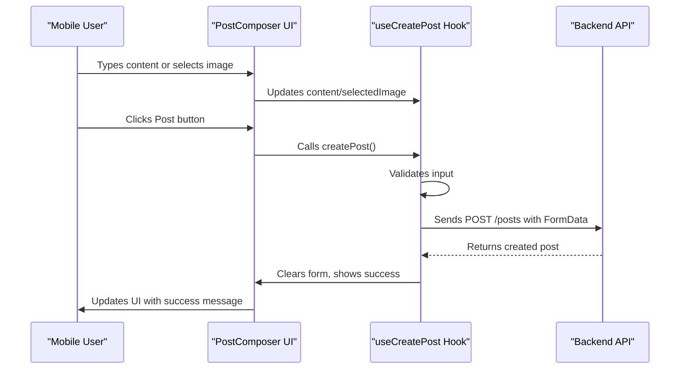
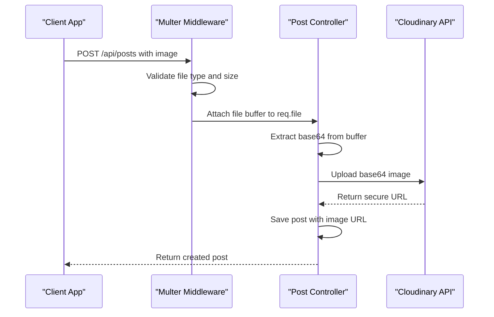
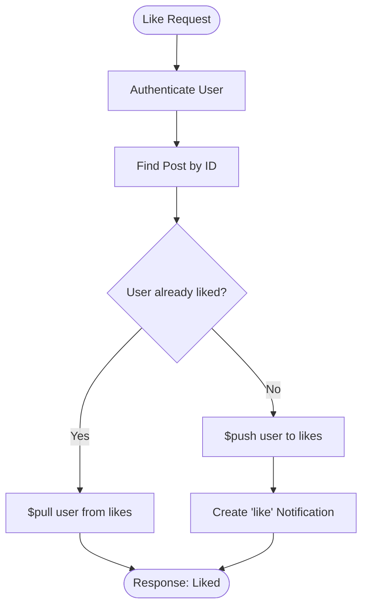
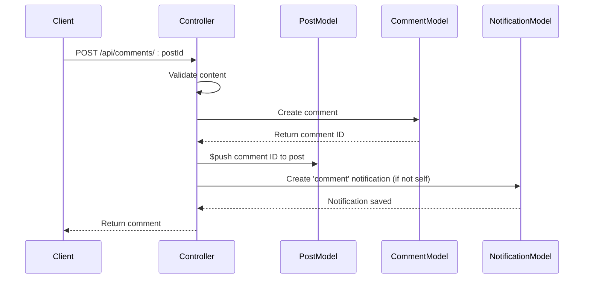
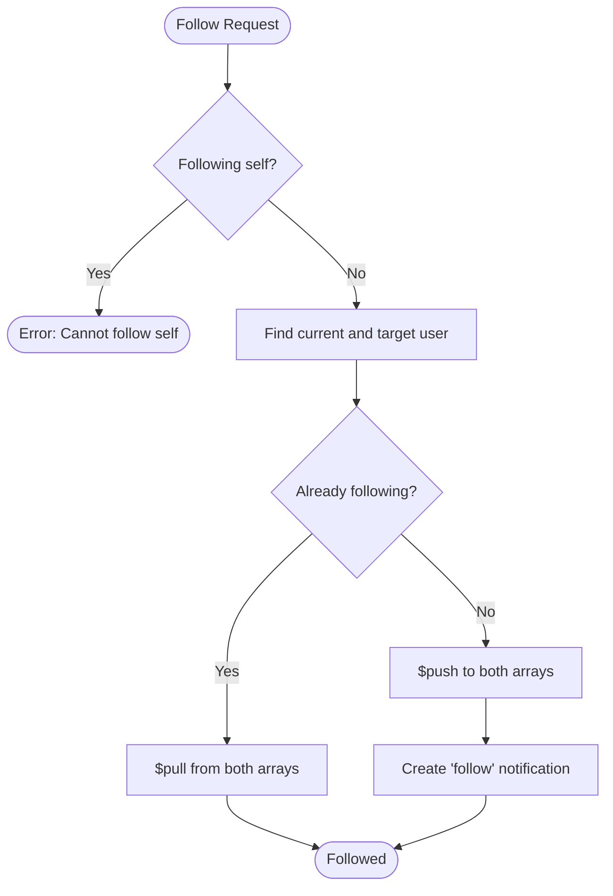
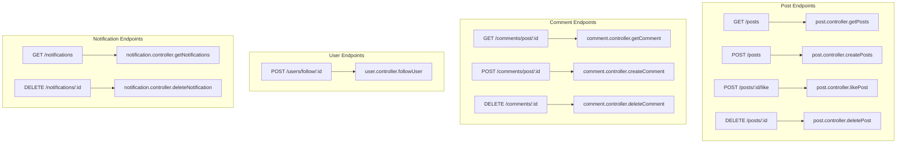
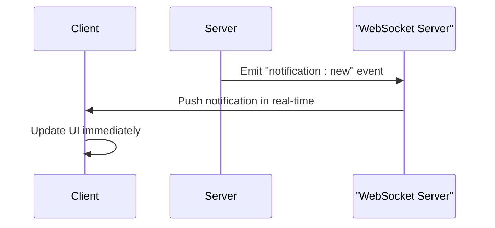

# Feature Implementation Details

<cite>
**Referenced Files in This Document**   
- [post.controller.js](file://backend/src/controllers/post.controller.js) - *Updated in recent commit*
- [comment.controller.js](file://backend/src/controllers/comment.controller.js) - *Updated in commit 910493a*
- [notification.controller.js](file://backend/src/controllers/notification.controller.js) - *Updated in commit 910493a*
- [user.controller.js](file://backend/src/controllers/user.controller.js)
- [post.route.js](file://backend/src/routes/post.route.js)
- [comment.route.js](file://backend/src/routes/comment.route.js)
- [notification.route.js](file://backend/src/routes/notification.route.js)
- [user.route.js](file://backend/src/routes/user.route.js)
- [upload.middleware.js](file://backend/src/middleware/upload.middleware.js)
- [cloudinary.js](file://backend/src/config/cloudinary.js)
- [post.model.js](file://backend/src/models/post.model.js)
- [comment.model.js](file://backend/src/models/comment.model.js)
- [notification.model.js](file://backend/src/models/notification.model.js)
- [user.model.js](file://backend/src/models/user.model.js)
- [PostComposer.tsx](file://mobile/components/PostComposer.tsx) - *Added in commit b0614c5*
- [useCreatePost.ts](file://mobile/hooks/useCreatePost.ts) - *Added in commit b0614c5*
</cite>

## Update Summary
- **Post Creation Pipeline**: Updated to include frontend implementation details with new components and hooks
- **New Sections Added**: Added documentation for PostComposer UI component and useCreatePost hook
- **Section sources**: Updated to include new frontend files and their line ranges
- **API Integration**: Enhanced documentation of frontend-backend interaction for post creation
- **File References**: Added new frontend files to referenced files list with proper annotations

## Table of Contents
1. [Introduction](#introduction)
2. [Post Creation Pipeline](#post-creation-pipeline)
3. [Social Interaction System](#social-interaction-system)
4. [Notification Architecture](#notification-architecture)
5. [Business Logic and Error Handling](#business-logic-and-error-handling)
6. [API Endpoint Relationships](#api-endpoint-relationships)
7. [Race Conditions and Concurrency](#race-conditions-and-concurrency)
8. [Performance Optimization](#performance-optimization)

## Introduction
xClone is a social media application that enables users to create posts, interact with content through likes and comments, follow other users, and receive real-time notifications. The backend is built using Node.js with Express, MongoDB via Mongoose, and leverages Cloudinary for image storage. Authentication is managed through Clerk, and file uploads are handled using Multer. The frontend is implemented with React Native and Expo. This document details the implementation of core features, focusing on the post creation pipeline, social interactions, notification system, and underlying business logic.

## Post Creation Pipeline

The post creation pipeline handles both text content and image uploads. When a user submits a post, the request passes through Multer middleware to process any attached image before reaching the controller.

### Frontend Implementation: PostComposer Component

The PostComposer component provides a user interface for creating posts with text and image content. It integrates with the useCreatePost hook to manage state and API interactions.



**Diagram sources**
- [PostComposer.tsx](file://mobile/components/PostComposer.tsx#L0-L98)
- [useCreatePost.ts](file://mobile/hooks/useCreatePost.ts#L0-L104)

#### PostComposer Component Structure
The PostComposer component displays the user's profile picture, a text input field with character counter, image preview, and action buttons for media selection.

```javascript
const PostComposer = () => {
  const {
    content,
    setContent,
    selectedImage,
    isCreating,
    pickImageFromGallery,
    takePhoto,
    removeImage,
    createPost,
  } = useCreatePost();

  const { user } = useUser();

  return (
    <View className="border-b border-gray-100 p-4 bg-white">
      <View className="flex-row">
        <Image source={{ uri: user?.imageUrl }} className="w-12 h-12 rounded-full mr-3" />
        <View className="flex-1">
          <TextInput
            className="text-gray-900 text-lg"
            placeholder="What's happening?"
            placeholderTextColor="#657786"
            multiline
            value={content}
            onChangeText={setContent}
            maxLength={280}
          />
        </View>
      </View>
      {/* Image preview and action buttons */}
    </View>
  );
};
```

**Section sources**
- [PostComposer.tsx](file://mobile/components/PostComposer.tsx#L0-L98)

### Image Upload Processing with Multer and Cloudinary

Multer is configured to store files in memory as buffers, allowing direct upload to Cloudinary without saving to disk. The upload is restricted to image files under 5MB.



**Diagram sources**
- [upload.middleware.js](file://backend/src/middleware/upload.middleware.js#L1-L21)
- [post.controller.js](file://backend/src/controllers/post.controller.js#L45-L75)
- [cloudinary.js](file://backend/src/config/cloudinary.js#L1-L10)

#### Multer Configuration
```javascript
const storage = multer.memoryStorage();
const upload = multer({
  storage: storage,
  fileFilter: (req, file, cb) => {
    if (file.mimetype.startsWith("image/")) {
      cb(null, true);
    } else {
      cb(new Error("Only image files are allowed"), false);
    }
  },
  limits: { fileSize: 5 * 1024 * 1024 }, // 5MB
});
```

#### Cloudinary Upload Process
The image buffer is converted to a base64 data URL and uploaded to Cloudinary with transformations for size, quality, and format optimization.

```javascript
const base64Image = `data:${imageFile.mimetype};base64,${imageFile.buffer.toString("base64")}`;
const uploadResponse = await cloudinary.uploader.upload(base64Image, {
  folder: "social_media_posts",
  resource_type: "image",
  transformation: [
    { width: 800, height: 600, crop: "limit" },
    { quality: "auto" },
    { format: "auto" },
  ],
});
```

**Section sources**
- [upload.middleware.js](file://backend/src/middleware/upload.middleware.js#L1-L21)
- [cloudinary.js](file://backend/src/config/cloudinary.js#L1-L10)
- [post.controller.js](file://backend/src/controllers/post.controller.js#L45-L75)

### Frontend Hook: useCreatePost

The useCreatePost hook manages the state and logic for creating posts, including image selection, validation, and API communication.

```javascript
export const useCreatePost = () => {
  const [content, setContent] = useState("");
  const [selectedImage, setSelectedImage] = useState<string | null>(null);
  const api = useApiClient();
  const queryClient = useQueryClient();

  const createPostMutation = useMutation({
    mutationFn: async (postData: { content: string; imageUri?: string }) => {
      const formData = new FormData();

      if (postData.content) formData.append("content", postData.content);

      if (postData.imageUri) {
        const uriParts = postData.imageUri.split(".");
        const fileType = uriParts[uriParts.length - 1].toLowerCase();

        const mimeTypeMap: Record<string, string> = {
          png: "image/png",
          gif: "image/gif",
          webp: "image/webp",
        };
        const mimeType = mimeTypeMap[fileType] || "image/jpeg";

        formData.append("image", {
          uri: postData.imageUri,
          name: `image.${fileType}`,
          type: mimeType,
        } as any);
      }

      return api.post("/posts", formData, {
        headers: { "Content-Type": "multipart/form-data" },
      });
    },
    onSuccess: () => {
      setContent("");
      setSelectedImage(null);
      queryClient.invalidateQueries({ queryKey: ["posts"] });
      Alert.alert("Success", "Post created successfully!");
    },
    onError: () => {
      Alert.alert("Error", "Failed to create post. Please try again.");
    },
  });

  const handleImagePicker = async (useCamera: boolean = false) => {
    // Image picker implementation
  };

  const createPost = () => {
    if (!content.trim() && !selectedImage) {
      Alert.alert("Empty Post", "Please write something or add an image before posting!");
      return;
    }

    const postData: { content: string; imageUri?: string } = {
      content: content.trim(),
    };

    if (selectedImage) postData.imageUri = selectedImage;

    createPostMutation.mutate(postData);
  };

  return {
    content,
    setContent,
    selectedImage,
    isCreating: createPostMutation.isPending,
    pickImageFromGallery: () => handleImagePicker(false),
    takePhoto: () => handleImagePicker(true),
    removeImage: () => setSelectedImage(null),
    createPost,
  };
};
```

**Section sources**
- [useCreatePost.ts](file://mobile/hooks/useCreatePost.ts#L0-L104)
- [api.ts](file://mobile/utils/api.ts#L38-L45)

## Social Interaction System

The social interaction system supports likes, comments, and follow/unfollow operations. Each action is secured via authentication and includes validation and database updates.

### Like/Unlike Functionality

Users can like or unlike a post. The operation checks if the user's ID is already in the post's `likes` array. If present, it removes the ID (unlike); otherwise, it adds it (like).



**Diagram sources**
- [post.controller.js](file://backend/src/controllers/post.controller.js#L90-L115)

The `likePost` controller uses MongoDB's `$push` and `$pull` operators for atomic updates:

```javascript
if (isLiked) {
  await Post.findByIdAndUpdate(postId, { $pull: { likes: user._id } });
} else {
  await Post.findByIdAndUpdate(postId, { $push: { likes: user._id } });
}
```

**Section sources**
- [post.controller.js](file://backend/src/controllers/post.controller.js#L90-L115)
- [post.model.js](file://backend/src/models/post.model.js#L1-L37)

### Comment Creation and Deletion

Comments are created with content validation and linked to both the user and post. The comment ID is added to the post's `comments` array.



**Diagram sources**
- [comment.controller.js](file://backend/src/controllers/comment.controller.js#L15-L50)

On deletion, the comment is removed from the post's `comments` array and deleted from the database:

```javascript
await Post.findByIdAndUpdate(comment.post, { $pull: { comments: commentId } });
await Comment.findByIdAndDelete(commentId);
```

**Section sources**
- [comment.controller.js](file://backend/src/controllers/comment.controller.js#L55-L83)
- [comment.model.js](file://backend/src/models/comment.model.js#L1-L33)

### Follow/Unfollow Operations

Users can follow or unfollow others. The operation updates both users' `following` and `followers` arrays atomically.



**Diagram sources**
- [user.controller.js](file://backend/src/controllers/user.controller.js#L65-L95)

**Section sources**
- [user.controller.js](file://backend/src/controllers/user.controller.js#L65-L95)
- [user.model.js](file://backend/src/models/user.model.js#L1-L64)

## Notification Architecture

Notifications are generated for three types of events: likes, comments, and follows. Each notification records the sender (`from`), recipient (`to`), type, and optional references to posts or comments.

### Notification Types and Triggers

| Type | Trigger Event | Associated Data |
|------|---------------|-----------------|
| "like" | User likes a post | `post` reference |
| "comment" | User comments on a post | `post` and `comment` references |
| "follow" | User follows another | None |

Notifications are created only when the action is not self-performed (e.g., liking your own post does not generate a notification).

```javascript
if (post.user.toString() !== user._id.toString()) {
  await Notification.create({
    from: user._id,
    to: post.user,
    type: "like",
    post: postId,
  });
}
```

**Section sources**
- [post.controller.js](file://backend/src/controllers/post.controller.js#L105-L110)
- [comment.controller.js](file://backend/src/controllers/comment.controller.js#L40-L45)
- [user.controller.js](file://backend/src/controllers/user.controller.js#L88-L92)
- [notification.model.js](file://backend/src/models/notification.model.js#L1-L37)

### Notification Retrieval and Deletion

Users retrieve their notifications sorted by creation time, with populated sender details and associated content:

```javascript
const notifications = await Notification.find({ to: user._id })
  .sort({ createdAt: -1 })
  .populate("from", "username firstName lastName profilePicture")
  .populate("post", "content image")
  .populate("comment", "content");
```

Notifications can now be deleted individually by the recipient. The deletion endpoint ensures users can only delete their own notifications:

```javascript
const notification = await Notification.findOneAndDelete({
  _id: notificationId,
  to: user._id,
});
```

**Section sources**
- [notification.controller.js](file://backend/src/controllers/notification.controller.js#L10-L35)
- [notification.route.js](file://backend/src/routes/notification.route.js#L1-L10)

## Business Logic and Error Handling

The application implements robust business logic with validation, database operations, and error handling.

### Data Validation Examples

- **Post creation**: Requires content or image
- **Comment creation**: Content must not be empty
- **Follow**: Cannot follow self
- **Ownership checks**: Only owners can delete posts/comments

### Database Operations

All operations use Mongoose models with proper references:
- `Post` references `User` and `Comment`
- `Comment` references `User` and `Post`
- `Notification` references `User`, `Post`, and `Comment`

### Error Handling Strategy

The application uses `express-async-handler` to catch asynchronous errors and return appropriate HTTP status codes:
- 400: Bad request (validation)
- 403: Forbidden (ownership)
- 404: Not found (user/post)
- 500: Internal server error (Cloudinary upload failure)

**Section sources**
- [post.controller.js](file://backend/src/controllers/post.controller.js#L1-L158)
- [comment.controller.js](file://backend/src/controllers/comment.controller.js#L1-L83)
- [user.controller.js](file://backend/src/controllers/user.controller.js#L1-L96)

## API Endpoint Relationships

The API routes map directly to controller functions, with protected routes requiring authentication.



**Diagram sources**
- [post.route.js](file://backend/src/routes/post.route.js#L1-L21)
- [comment.route.js](file://backend/src/routes/comment.route.js#L1-L15)
- [user.route.js](file://backend/src/routes/user.route.js#L1-L18)
- [notification.route.js](file://backend/src/routes/notification.route.js#L1-L10)

## Race Conditions and Concurrency

A potential race condition exists in the like/unlike functionality when multiple requests occur simultaneously. For example, two "like" requests could both read `isLiked = false` and proceed to add the user, resulting in duplicate entries.

### Solution: Atomic Operations with MongoDB

MongoDB's `$addToSet` operator can prevent duplicates by only adding the ID if it doesn't already exist:

```javascript
await Post.findByIdAndUpdate(postId, {
  $addToSet: { likes: user._id },
});
```

Alternatively, using transactions or application-level locking could ensure consistency, but `$addToSet` is the most efficient solution for this use case.

**Section sources**
- [post.controller.js](file://backend/src/controllers/post.controller.js#L90-L115)

## Performance Optimization

### Feed Generation Optimization

Currently, `getPosts` retrieves all posts with full comment population, which can be slow as the dataset grows.

**Optimization Recommendations:**
1. **Pagination**: Add limit and offset parameters
2. **Selective Population**: Only populate top-level comments initially
3. **Caching**: Cache popular posts using Redis
4. **Indexing**: Ensure indexes on `createdAt`, `user`, and `likes`

```javascript
// Example with pagination
const page = parseInt(req.query.page) || 1;
const limit = 10;
const posts = await Post.find()
  .sort({ createdAt: -1 })
  .skip((page - 1) * limit)
  .limit(limit)
  .populate("user", "username profilePicture");
```

### Real-Time Updates

The current implementation uses HTTP polling for notifications. For real-time updates:

**Recommendations:**
1. **WebSocket Integration**: Use Socket.IO to push notifications instantly
2. **Event-Driven Architecture**: Emit events on like/comment/follow and broadcast to recipients
3. **Client-Side Caching**: Maintain a local notification count and update UI without full reload



**Section sources**
- [notification.controller.js](file://backend/src/controllers/notification.controller.js#L1-L36)
- [post.controller.js](file://backend/src/controllers/post.controller.js#L90-L115)
- [comment.controller.js](file://backend/src/controllers/comment.controller.js#L15-L50)