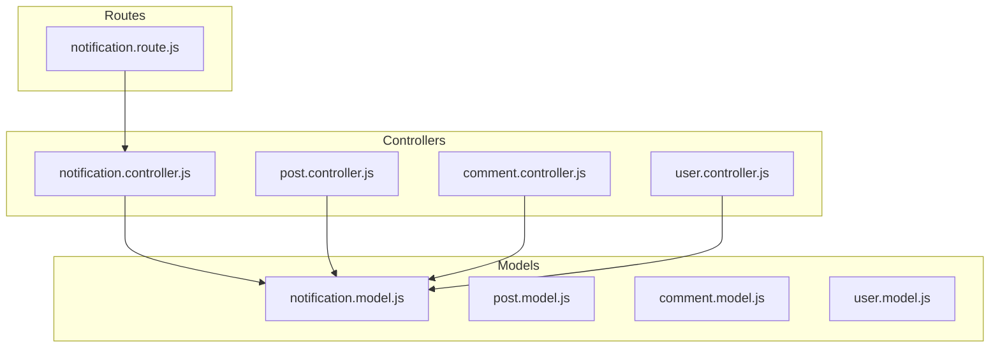
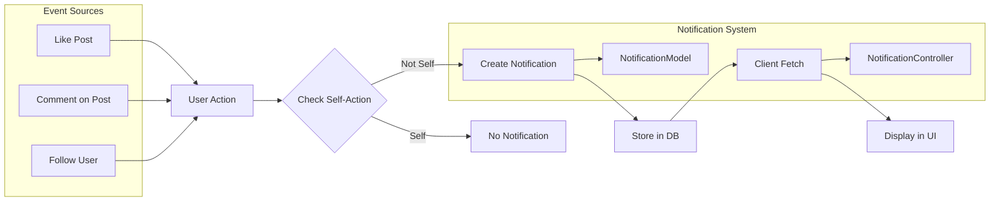
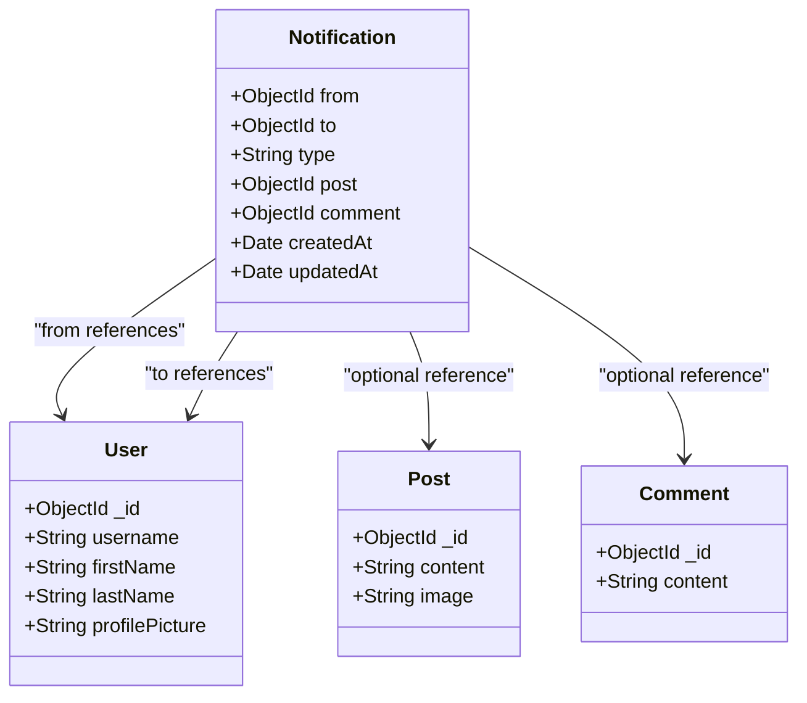
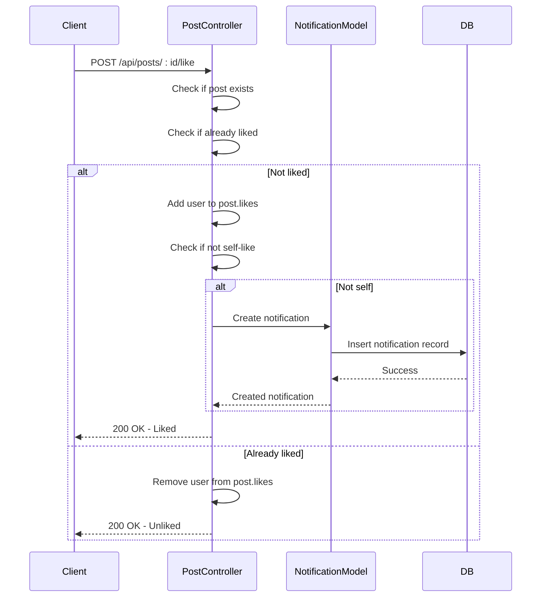
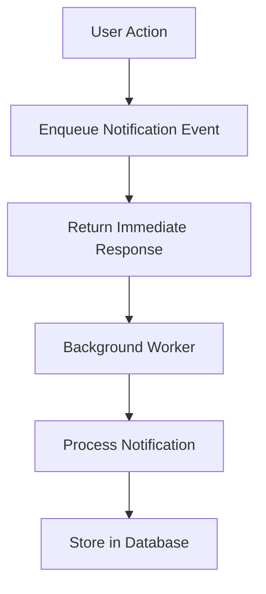

# Notification Architecture

<cite>
**Referenced Files in This Document**   
- [notification.model.js](file://backend/src/models/notification.model.js)
- [notification.controller.js](file://backend/src/controllers/notification.controller.js)
- [post.controller.js](file://backend/src/controllers/post.controller.js)
- [comment.controller.js](file://backend/src/controllers/comment.controller.js)
- [user.controller.js](file://backend/src/controllers/user.controller.js)
- [notification.route.js](file://backend/src/routes/notification.route.js)
</cite>

## Table of Contents
1. [Introduction](#introduction)
2. [Project Structure](#project-structure)
3. [Core Components](#core-components)
4. [Architecture Overview](#architecture-overview)
5. [Detailed Component Analysis](#detailed-component-analysis)
6. [Event-Driven Notification Flow](#event-driven-notification-flow)
7. [Data Structure of Notifications](#data-structure-of-notifications)
8. [Query Patterns and Pagination](#query-patterns-and-pagination)
9. [Common Issues and Mitigations](#common-issues-and-mitigations)
10. [Performance Optimization Strategies](#performance-optimization-strategies)
11. [Conclusion](#conclusion)

## Introduction
The xClone application implements an event-driven notification system that alerts users about social interactions such as likes, comments, and follows. This document details the architecture, data model, and implementation of the notification system, focusing on how events from various controllers trigger notifications, how they are stored and retrieved, and strategies for scalability and performance.

## Project Structure
The backend of xClone is built using Node.js with Express, MongoDB via Mongoose, and follows a modular MVC-like structure. The notification system spans multiple directories including models, controllers, and routes.



**Diagram sources**
- [notification.model.js](file://backend/src/models/notification.model.js)
- [notification.controller.js](file://backend/src/controllers/notification.controller.js)
- [post.controller.js](file://backend/src/controllers/post.controller.js)
- [comment.controller.js](file://backend/src/controllers/comment.controller.js)
- [user.controller.js](file://backend/src/controllers/user.controller.js)
- [notification.route.js](file://backend/src/routes/notification.route.js)

**Section sources**
- [notification.model.js](file://backend/src/models/notification.model.js)
- [notification.controller.js](file://backend/src/controllers/notification.controller.js)
- [post.controller.js](file://backend/src/controllers/post.controller.js)
- [comment.controller.js](file://backend/src/controllers/comment.controller.js)
- [user.controller.js](file://backend/src/controllers/user.controller.js)
- [notification.route.js](file://backend/src/routes/notification.route.js)

## Core Components
The notification system consists of several core components:
- **Notification Model**: Defines the schema for storing notifications
- **Notification Controller**: Handles retrieval and deletion of notifications
- **Event Emitters**: Post, comment, and user controllers that create notifications
- **Routes**: API endpoints for accessing notifications

These components work together to provide a real-time social feedback mechanism.

**Section sources**
- [notification.model.js](file://backend/src/models/notification.model.js)
- [notification.controller.js](file://backend/src/controllers/notification.controller.js)
- [post.controller.js](file://backend/src/controllers/post.controller.js)
- [comment.controller.js](file://backend/src/controllers/comment.controller.js)
- [user.controller.js](file://backend/src/controllers/user.controller.js)

## Architecture Overview
The notification architecture follows an event-driven pattern where user actions in the post, comment, and user domains trigger the creation of notification records. These notifications are persisted in MongoDB and can be fetched by the client via API endpoints.



**Diagram sources**
- [notification.model.js](file://backend/src/models/notification.model.js)
- [notification.controller.js](file://backend/src/controllers/notification.controller.js)
- [post.controller.js](file://backend/src/controllers/post.controller.js)
- [comment.controller.js](file://backend/src/controllers/comment.controller.js)
- [user.controller.js](file://backend/src/controllers/user.controller.js)

## Detailed Component Analysis

### Notification Model Analysis
The notification model defines the structure of notification records in MongoDB.



**Diagram sources**
- [notification.model.js](file://backend/src/models/notification.model.js)
- [user.model.js](file://backend/src/models/user.model.js)

**Section sources**
- [notification.model.js](file://backend/src/models/notification.model.js#L1-L35)

## Event-Driven Notification Flow
The system uses an inline event pattern where notification creation occurs synchronously within controller actions. This ensures transactional consistency between the primary action and notification creation.



**Diagram sources**
- [post.controller.js](file://backend/src/controllers/post.controller.js#L77-L158)

**Section sources**
- [post.controller.js](file://backend/src/controllers/post.controller.js#L77-L158)

## Data Structure of Notifications
The notification data structure is designed to support multiple types of social interactions with appropriate references.

**Notification Schema**
- **from**: ObjectId reference to User (required)
- **to**: ObjectId reference to User (required)
- **type**: String enum ["follow", "like", "comment"] (required)
- **post**: ObjectId reference to Post (optional)
- **comment**: ObjectId reference to Comment (optional)
- **timestamps**: createdAt and updatedAt (automatically managed)

This structure allows for efficient querying and population of related data when serving notifications to clients.

**Section sources**
- [notification.model.js](file://backend/src/models/notification.model.js#L1-L35)

## Query Patterns and Pagination
The system implements efficient query patterns for retrieving user notifications with proper indexing and data population.

```javascript
// Query pattern in notification.controller.js
const notifications = await Notification.find({ to: user._id })
  .sort({ createdAt: -1 })
  .populate("from", "username firstName lastName profilePicture")
  .populate("post", "content image")
  .populate("comment", "content");
```

This query:
- Filters by recipient (`to` field)
- Sorts by creation time (newest first)
- Populates sender information (minimal fields)
- Optionally populates post or comment content

For production use, this should be extended with:
- Pagination using `limit()` and `skip()`
- Unread status tracking
- Caching mechanisms

**Section sources**
- [notification.controller.js](file://backend/src/controllers/notification.controller.js#L5-L20)

## Common Issues and Mitigations

### Duplicate Notifications
The current implementation does not prevent duplicate notifications if a user rapidly likes/unlikes a post. This could be mitigated by:
- Implementing deduplication logic using composite indexes
- Adding a unique constraint on (from, to, type, post, comment)
- Using a cooldown period

### Spam Prevention
The system lacks rate limiting on notification creation. Recommendations:
- Implement rate limiting on follow/like/comment actions
- Add user reputation scoring
- Provide notification filtering options

### Performance Bottlenecks
In high-traffic scenarios, synchronous notification creation could impact primary action performance. The current implementation blocks the main thread during notification creation.

**Section sources**
- [post.controller.js](file://backend/src/controllers/post.controller.js#L100-L120)
- [comment.controller.js](file://backend/src/controllers/comment.controller.js#L34-L40)
- [user.controller.js](file://backend/src/controllers/user.controller.js#L68-L75)

## Performance Optimization Strategies

### Background Processing Queues
Implement a message queue (e.g., RabbitMQ, Redis) to handle notification creation asynchronously:



This decouples primary actions from notification processing, improving response times.

### Read/Write Separation
Separate read and write operations:
- Use dedicated read replicas for notification queries
- Implement connection pooling
- Consider read-after-write consistency patterns

### Soft Deletion and History Retention
Instead of hard deletion, implement soft deletion for notification history:

```javascript
// Add to notification schema
isDeleted: { type: Boolean, default: false },
deletedAt: { type: Date, default: null }
```

This allows for:
- Notification recovery
- Analytics and reporting
- Compliance with data retention policies

Additional optimizations:
- Index optimization on `to` and `createdAt` fields
- Caching frequently accessed notification lists
- Implementing infinite scrolling with cursor-based pagination

**Section sources**
- [notification.model.js](file://backend/src/models/notification.model.js)
- [notification.controller.js](file://backend/src/controllers/notification.controller.js)

## Conclusion
The xClone notification system provides a solid foundation for social interaction alerts with a clean, event-driven architecture. While the current implementation ensures transactional integrity through synchronous notification creation, future improvements should focus on asynchronous processing, better deduplication, and enhanced query performance. The modular design allows for incremental improvements without major refactoring, making it well-suited for scaling as the user base grows.