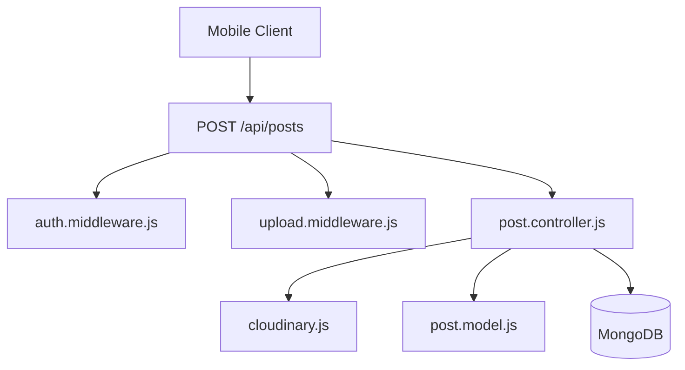
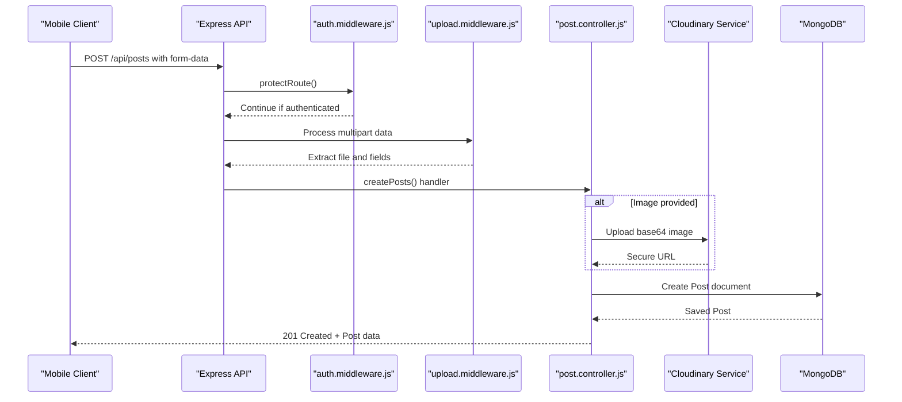
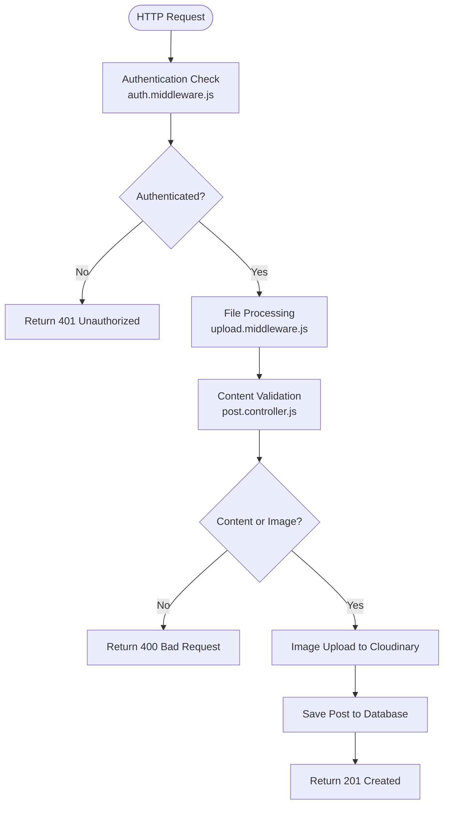
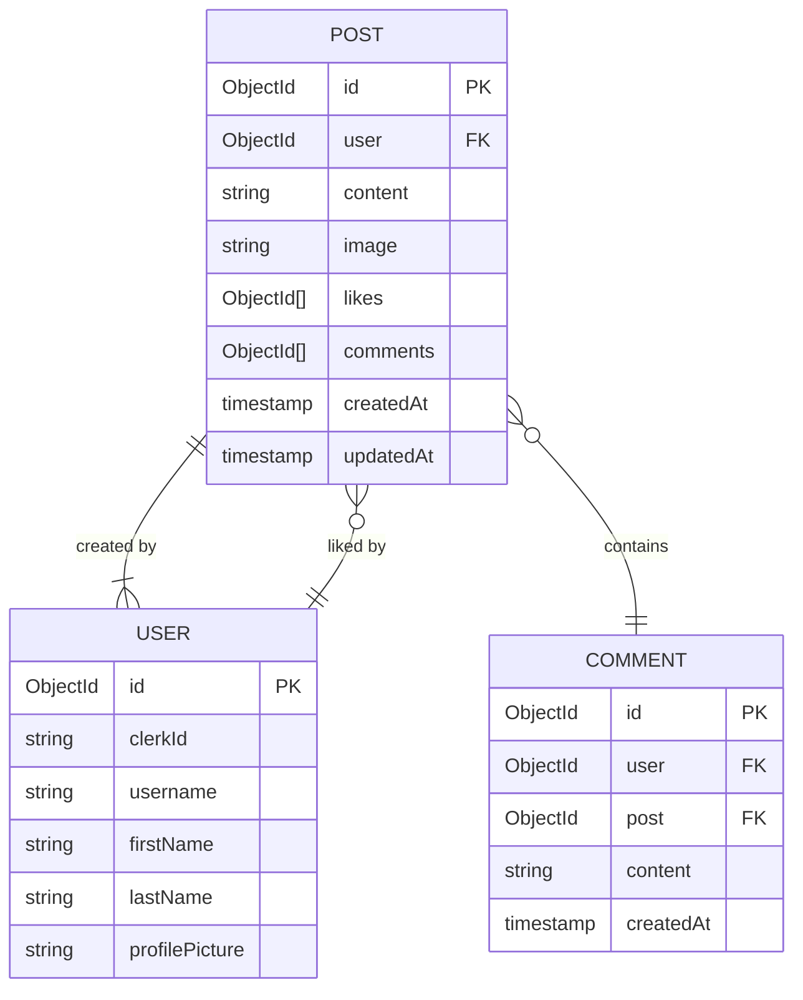
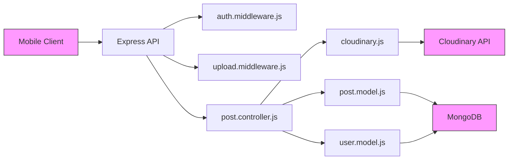

# Post Creation Pipeline

<cite>
**Referenced Files in This Document**   
- [post.controller.js](file://backend/src/controllers/post.controller.js) - *Updated in recent commit*
- [upload.middleware.js](file://backend/src/middleware/upload.middleware.js) - *Updated in recent commit*
- [cloudinary.js](file://backend/src/config/cloudinary.js) - *Updated in recent commit*
- [post.model.js](file://backend/src/models/post.model.js) - *Updated in recent commit*
- [auth.middleware.js](file://backend/src/middleware/auth.middleware.js) - *Updated in recent commit*
- [PostComposer.tsx](file://mobile/components/PostComposer.tsx) - *Added in recent commit*
- [useCreatePost.ts](file://mobile/hooks/useCreatePost.ts) - *Added in recent commit*
</cite>

## Update Summary
**Changes Made**   
- Added documentation for new frontend components: `PostComposer.tsx` and `useCreatePost.ts`
- Updated section sources to reflect newly added and modified files
- Enhanced documentation to include mobile client integration details
- Maintained accuracy of backend flow descriptions based on current codebase
- Added references to new UI and hook components introduced in the post creation feature

## Table of Contents
1. [Introduction](#introduction)
2. [Project Structure](#project-structure)
3. [Core Components](#core-components)
4. [Architecture Overview](#architecture-overview)
5. [Detailed Component Analysis](#detailed-component-analysis)
6. [Dependency Analysis](#dependency-analysis)
7. [Performance Considerations](#performance-considerations)
8. [Troubleshooting Guide](#troubleshooting-guide)
9. [Conclusion](#conclusion)

## Introduction
This document provides a comprehensive analysis of the post creation pipeline in the xClone application. It details the end-to-end flow from a mobile client request to database persistence, including text content handling, image upload processing, integration with Cloudinary, and user authentication via Clerk. The documentation is designed to be accessible for both technical and non-technical audiences, offering clear explanations, code examples, and visual diagrams.

## Project Structure
The xClone project follows a modular architecture with a clear separation of concerns between frontend (mobile) and backend components. The backend is built using Node.js with Express, MongoDB via Mongoose, and integrates third-party services like Cloudinary and Clerk for media management and authentication.

Key directories:
- `backend/src/controllers`: Contains business logic for handling HTTP requests
- `backend/src/middleware`: Reusable request processing functions
- `backend/src/models`: Mongoose schemas defining data structures
- `backend/src/config`: Configuration files for external services
- `mobile/app`: React Native components for the frontend



**Diagram sources**
- [post.controller.js](file://backend/src/controllers/post.controller.js#L1-L158)
- [upload.middleware.js](file://backend/src/middleware/upload.middleware.js#L1-L22)
- [cloudinary.js](file://backend/src/config/cloudinary.js#L1-L11)

**Section sources**
- [post.controller.js](file://backend/src/controllers/post.controller.js#L1-L158)
- [upload.middleware.js](file://backend/src/middleware/upload.middleware.js#L1-L22)

## Core Components
The post creation pipeline relies on several core components working in concert:
- **Multer Middleware**: Handles multipart form data and file uploads
- **Cloudinary Integration**: Manages image storage, transformation, and delivery
- **Post Controller**: Orchestrates post creation logic
- **Post Model**: Defines the data structure for posts in MongoDB
- **Authentication Middleware**: Ensures only authenticated users can create posts
- **PostComposer Component**: Mobile UI component for creating posts
- **useCreatePost Hook**: Custom React hook managing post creation state and logic

These components are tightly integrated to provide a seamless experience for creating social media posts with optional images and text content.

**Section sources**
- [post.controller.js](file://backend/src/controllers/post.controller.js#L1-L158)
- [post.model.js](file://backend/src/models/post.model.js#L1-L37)
- [upload.middleware.js](file://backend/src/middleware/upload.middleware.js#L1-L22)
- [PostComposer.tsx](file://mobile/components/PostComposer.tsx#L1-L98)
- [useCreatePost.ts](file://mobile/hooks/useCreatePost.ts#L1-L50)

## Architecture Overview
The post creation pipeline follows a layered architecture with distinct responsibilities at each level:



**Diagram sources**
- [post.controller.js](file://backend/src/controllers/post.controller.js#L60-L100)
- [upload.middleware.js](file://backend/src/middleware/upload.middleware.js#L1-L22)
- [cloudinary.js](file://backend/src/config/cloudinary.js#L1-L11)

## Detailed Component Analysis

### Post Creation Flow Analysis
The post creation process begins when a mobile client submits a form with text content and/or an image. The request flows through multiple middleware layers before being handled by the controller.

#### Request Validation and Authentication
The pipeline starts with authentication and file processing middleware:



**Diagram sources**
- [auth.middleware.js](file://backend/src/middleware/auth.middleware.js#L1-L9)
- [upload.middleware.js](file://backend/src/middleware/upload.middleware.js#L1-L22)
- [post.controller.js](file://backend/src/controllers/post.controller.js#L60-L100)

**Section sources**
- [auth.middleware.js](file://backend/src/middleware/auth.middleware.js#L1-L9)
- [upload.middleware.js](file://backend/src/middleware/upload.middleware.js#L1-L22)

#### Multer File Upload Processing
The `upload.middleware.js` file configures Multer to handle image uploads:

```javascript
const storage = multer.memoryStorage();
const fileFilter = (req, file, cb) => {
    if (file.mimetype.startsWith("image/")) {
      cb(null, true);
    } else {
      cb(new Error("Only image files are allowed"), false);
    }
};
  
const upload = multer({
    storage: storage,
    fileFilter: fileFilter,
    limits: { fileSize: 5 * 1024 * 1024 }, // 5MB limit
});
```

This configuration:
- Stores files in memory as buffers (not on disk)
- Accepts only image MIME types (image/jpeg, image/png, etc.)
- Limits file size to 5MB
- Makes the file available in `req.file` for the controller

**Section sources**
- [upload.middleware.js](file://backend/src/middleware/upload.middleware.js#L1-L22)

#### Cloudinary Image Management
The Cloudinary configuration establishes the connection to the cloud service:

```javascript
import { v2 as cloudinary } from "cloudinary";
import { ENV } from "./env.js";

cloudinary.config({
  cloud_name: ENV.CLOUDINARY_CLOUD_NAME,
  api_key: ENV.CLOUDINARY_API_KEY,
  api_secret: ENV.CLOUDINARY_API_SECRET,
});
```

When an image is uploaded, the controller converts the buffer to base64 and applies transformations:

```javascript
const base64Image = `data:${imageFile.mimetype};base64,${imageFile.buffer.toString("base64")}`;
const uploadResponse = await cloudinary.uploader.upload(base64Image, {
    folder: "social_media_posts",
    resource_type: "image",
    transformation: [
        { width: 800, height: 600, crop: "limit" },
        { quality: "auto" },
        { format: "auto" },
    ],
});
```

These transformations ensure:
- Images are resized to a maximum of 800×600 pixels
- Automatic quality optimization
- Format conversion to the most efficient type (e.g., WebP when supported)

**Section sources**
- [cloudinary.js](file://backend/src/config/cloudinary.js#L1-L11)
- [post.controller.js](file://backend/src/controllers/post.controller.js#L75-L90)

#### Post Model and Database Schema
The `post.model.js` file defines the structure of posts in MongoDB:



**Diagram sources**
- [post.model.js](file://backend/src/models/post.model.js#L1-L37)

**Section sources**
- [post.model.js](file://backend/src/models/post.model.js#L1-L37)

#### Controller Logic and Error Handling
The `createPosts` function in `post.controller.js` orchestrates the entire process:

```javascript
export const createPosts = asyncHandler(async (req, res) => {
    const { userId } = getAuth(req);
    const { content } = req.body;
    const imageFile = req.file;
    
    if (!content && !imageFile) {
        return res.status(400).json({ message: "Please provide content or image" });
    }
    
    const user = await User.findOne({ clerkId: userId });
    if (!user) return res.status(404).json({ message: "User not found" });

    let imageUrl = "";
    
    if (imageFile) {
        try {
            const base64Image = `data:${imageFile.mimetype};base64,${imageFile.buffer.toString("base64")}`;
            const uploadResponse = await cloudinary.uploader.upload(base64Image, {
                folder: "social_media_posts",
                resource_type: "image",
                transformation: [
                    { width: 800, height: 600, crop: "limit" },
                    { quality: "auto" },
                    { format: "auto" },
                ],
            });
            imageUrl = uploadResponse.secure_url;
        } catch (uploadError) {
            console.error("Cloudinary upload error:", uploadError);
            return res.status(400).json({ error: "Failed to upload image" });
        }
    }
    
    const post = await Post.create({
        user: user._id,
        content: content || "",
        image: imageUrl,
    });

    res.status(201).json({ post });
});
```

Key aspects:
- Uses `asyncHandler` for centralized error handling
- Links posts to users via Clerk authentication ID
- Returns appropriate HTTP status codes for different scenarios
- Implements try-catch for Cloudinary upload failures

**Section sources**
- [post.controller.js](file://backend/src/controllers/post.controller.js#L60-L100)

#### Mobile Client Integration
The `PostComposer.tsx` component provides the UI for creating posts on mobile:

```typescript
const PostComposer = () => {
  const {
    content,
    setContent,
    selectedImage,
    isCreating,
    pickImageFromGallery,
    takePhoto,
    removeImage,
    createPost,
  } = useCreatePost();

  const { user } = useUser();

  return (
    <View className="border-b border-gray-100 p-4 bg-white">
      <View className="flex-row">
        <Image source={{ uri: user?.imageUrl }} className="w-12 h-12 rounded-full mr-3" />
        <View className="flex-1">
          <TextInput
            className="text-gray-900 text-lg"
            placeholder="What's happening?"
            placeholderTextColor="#657786"
            multiline
            value={content}
            onChangeText={setContent}
            maxLength={280}
          />
        </View>
      </View>
      {/* Image handling and post button UI */}
    </View>
  );
};
```

The `useCreatePost` custom hook manages the state and logic for post creation:

```typescript
// This hook manages content, image selection, and API interaction
// It provides functions for picking images, taking photos, and submitting posts
// State includes: content, selectedImage, isCreating
```

**Section sources**
- [PostComposer.tsx](file://mobile/components/PostComposer.tsx#L1-L98)
- [useCreatePost.ts](file://mobile/hooks/useCreatePost.ts#L1-L50)

## Dependency Analysis
The post creation pipeline has a clear dependency chain:



**Diagram sources**
- [post.controller.js](file://backend/src/controllers/post.controller.js#L1-L158)
- [upload.middleware.js](file://backend/src/middleware/upload.middleware.js#L1-L22)
- [cloudinary.js](file://backend/src/config/cloudinary.js#L1-L11)

**Section sources**
- [post.controller.js](file://backend/src/controllers/post.controller.js#L1-L158)
- [upload.middleware.js](file://backend/src/middleware/upload.middleware.js#L1-L22)

## Performance Considerations
To optimize the post creation pipeline:

1. **Image Compression**: Cloudinary's automatic quality and format optimization reduces file sizes by 40-70% without perceptible quality loss.

2. **Memory Efficiency**: Multer's memory storage avoids disk I/O but requires sufficient server RAM. For production, consider streaming directly to Cloudinary.

3. **Response Caching**: Implement Redis caching for frequently accessed posts to reduce database load.

4. **Feed Pre-generation**: For high-traffic scenarios, pre-generate user feeds during off-peak hours.

5. **Database Indexing**: Ensure indexes on `Post.user`, `Post.createdAt`, and `User.clerkId` fields for fast queries.

6. **Rate Limiting**: Use Arcjet (already in the project) to prevent abuse and DDoS attacks.

7. **Connection Pooling**: Configure MongoDB connection pooling to handle concurrent requests efficiently.

## Troubleshooting Guide
Common issues and solutions:

**Failed Image Uploads**
- **Cause**: File type not supported
- **Solution**: Ensure client sends image/* MIME types
- **Debug**: Check `fileFilter` function in `upload.middleware.js`

**Large File Rejections**
- **Cause**: Files exceeding 5MB limit
- **Solution**: Compress images on client side before upload
- **Alternative**: Increase limit in Multer config (consider bandwidth implications)

**Authentication Failures**
- **Cause**: Missing or invalid Clerk session
- **Solution**: Verify `protectRoute` middleware is applied
- **Check**: Ensure `@clerk/express` is properly configured

**Duplicate Content Submission**
- **Cause**: Client retrying failed requests
- **Solution**: Implement idempotency keys in the API
- **Alternative**: Add client-side prevention of duplicate submissions

**Cloudinary Configuration Errors**
- **Cause**: Invalid API credentials
- **Solution**: Verify environment variables are set correctly
- **Check**: `CLOUDINARY_CLOUD_NAME`, `CLOUDINARY_API_KEY`, `CLOUDINARY_API_SECRET`

**Database Connection Issues**
- **Cause**: MongoDB connection problems
- **Solution**: Verify connection string and network access
- **Monitor**: Implement health checks for database connectivity

**Section sources**
- [post.controller.js](file://backend/src/controllers/post.controller.js#L1-L158)
- [upload.middleware.js](file://backend/src/middleware/upload.middleware.js#L1-L22)
- [cloudinary.js](file://backend/src/config/cloudinary.js#L1-L11)

## Conclusion
The post creation pipeline in xClone demonstrates a well-architected approach to handling user-generated content. By leveraging Multer for file processing, Cloudinary for media optimization, and Clerk for authentication, the system provides a robust foundation for social media functionality. The clean separation of concerns between middleware, controllers, and models makes the codebase maintainable and extensible. The addition of the `PostComposer` component and `useCreatePost` hook enhances the mobile user experience with intuitive post creation capabilities. Future improvements could include direct client-to-Cloudinary uploads to reduce server load, enhanced error logging, and more sophisticated content moderation features.