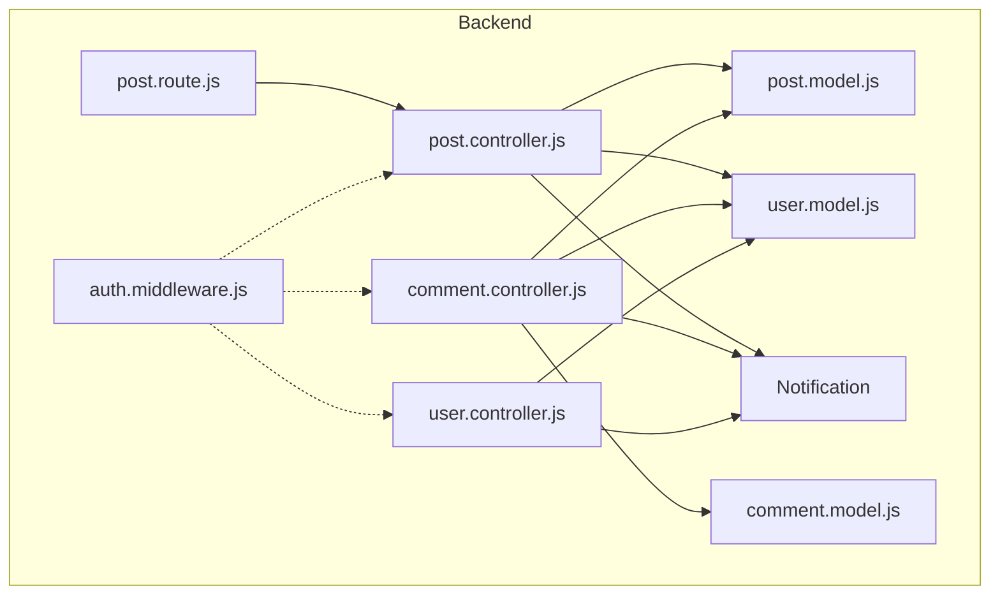
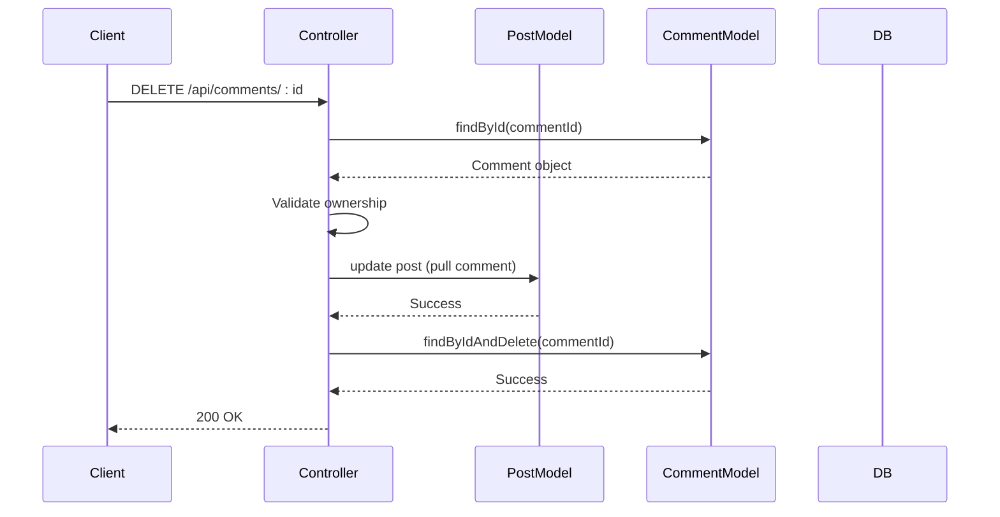
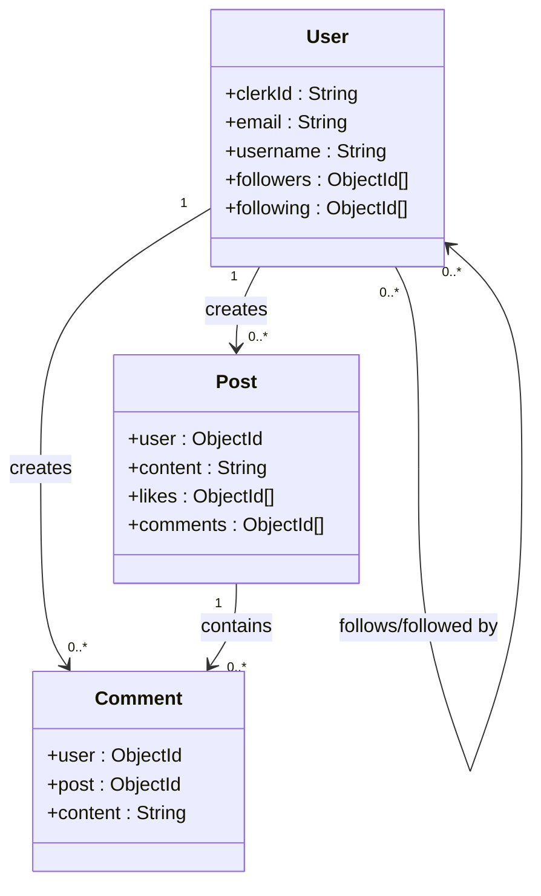
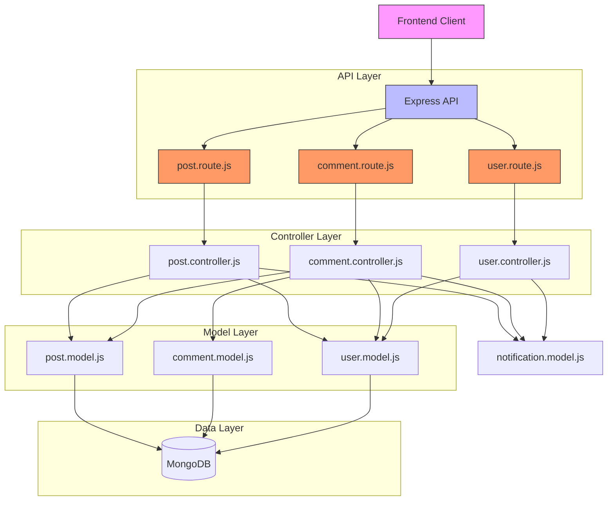
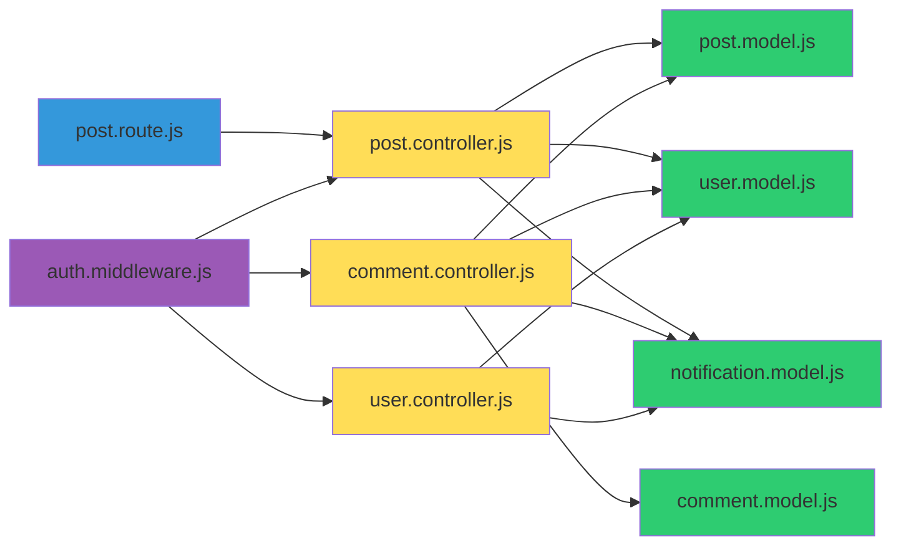

# Social Interactions System

<cite>
**Referenced Files in This Document**   
- [post.controller.js](file://backend/src/controllers/post.controller.js)
- [comment.controller.js](file://backend/src/controllers/comment.controller.js)
- [user.controller.js](file://backend/src/controllers/user.controller.js)
- [post.model.js](file://backend/src/models/post.model.js)
- [comment.model.js](file://backend/src/models/comment.model.js)
- [user.model.js](file://backend/src/models/user.model.js)
- [post.route.js](file://backend/src/routes/post.route.js)
</cite>

## Table of Contents
1. [Introduction](#introduction)
2. [Project Structure](#project-structure)
3. [Core Components](#core-components)
4. [Like/Unlike Functionality](#likeunlike-functionality)
5. [Comment Management](#comment-management)
6. [Follow/Unfollow Operations](#followunfollow-operations)
7. [Architecture Overview](#architecture-overview)
8. [Dependency Analysis](#dependency-analysis)
9. [Performance Considerations](#performance-considerations)
10. [Troubleshooting Guide](#troubleshooting-guide)
11. [Conclusion](#conclusion)

## Introduction
The Social Interactions System in xClone enables users to engage with content and each other through likes, comments, and follow relationships. This document provides a comprehensive analysis of the implementation, focusing on idempotent operations, atomic updates, real-time synchronization, and integration with frontend components. The backend is built using Express.js with Mongoose for MongoDB interactions, and leverages Clerk for authentication.

## Project Structure
The project is organized into a backend and mobile frontend. The backend contains models, controllers, routes, and middleware for handling social interactions. Key directories include:
- `models/`: Data schemas for Post, Comment, User, and Notification
- `controllers/`: Business logic for posts, comments, users, and notifications
- `routes/`: Express route definitions
- `middleware/`: Authentication and file upload handling



**Diagram sources**
- [post.controller.js](file://backend/src/controllers/post.controller.js)
- [comment.controller.js](file://backend/src/controllers/comment.controller.js)
- [user.controller.js](file://backend/src/controllers/user.controller.js)
- [post.model.js](file://backend/src/models/post.model.js)
- [comment.model.js](file://backend/src/models/comment.model.js)
- [user.model.js](file://backend/src/models/user.model.js)
- [post.route.js](file://backend/src/routes/post.route.js)

**Section sources**
- [post.controller.js](file://backend/src/controllers/post.controller.js)
- [comment.controller.js](file://backend/src/controllers/comment.controller.js)
- [user.controller.js](file://backend/src/controllers/user.controller.js)

## Core Components
The core components of the social interactions system include:
- **Post Model**: Manages content, likes, and comments
- **Comment Model**: Handles user comments on posts
- **User Model**: Tracks followers and following relationships
- **Controllers**: Implement CRUD and interaction logic
- **Routes**: Define API endpoints with authentication middleware

These components work together to provide a seamless social experience with proper ownership validation and cascade effects.

**Section sources**
- [post.model.js](file://backend/src/models/post.model.js#L1-L37)
- [comment.model.js](file://backend/src/models/comment.model.js#L1-L32)
- [user.model.js](file://backend/src/models/user.model.js#L1-L63)

## Like/Unlike Functionality

The like/unlike system is implemented in `likePost` controller method and provides idempotent operations through a toggle mechanism. When a user likes a post, their ID is added to the post's `likes` array; when they unlike, it is removed.

### Implementation Details
The operation is atomic using MongoDB's `$push` and `$pull` operators within `findByIdAndUpdate`. This prevents race conditions by ensuring the database operation is performed in a single atomic step.

```javascript
export const likePost = asyncHandler(async (req, res) => {
  const { postId } = req.params;
  const { userId } = getAuth(req);
  const user = await User.findOne({ clerkId: userId });
  const post = await Post.findById(postId);
  
  if (!user || !post)
    return res.status(404).json({ message: "User or post Not found" });

  const isLiked = post.likes.includes(user._id);

  if (isLiked) {
    // unlike
    await Post.findByIdAndUpdate(postId, {
      $pull: { likes: user._id },
    });
  } else {
    // like
    await Post.findByIdAndUpdate(postId, {
      $push: { likes: user._id },
    });

    // create notification if not liking own post
    if (post.user.toString() !== user._id.toString()) {
      await Notification.create({
        from: user._id,
        to: post.user,
        type: "like",
        post: postId,
      });
    }
  }

  res.status(200).json({
    message: isLiked ? "Post unliked successfully" : "Post liked successfully",
  });
});
```

### Key Features
- **Idempotent Operations**: The same action (like or unlike) produces the same result regardless of how many times it's executed
- **Atomic Updates**: MongoDB operations ensure data consistency
- **Notification System**: Users are notified when others like their posts (except self-likes)
- **Ownership Validation**: Ensures valid user and post existence before processing

### Frontend Integration
The system supports optimistic UI updates where the frontend immediately reflects the like state change, rolling back only if the server returns an error. This creates a responsive user experience.

**Section sources**
- [post.controller.js](file://backend/src/controllers/post.controller.js#L120-L158)
- [post.model.js](file://backend/src/models/post.model.js#L15-L21)

## Comment Management

The comment system allows users to create and delete comments on posts, with proper ownership validation and cascade effects on post metadata.

### Create Comment Workflow
When a user creates a comment:
1. Validate content is not empty
2. Find the user and post
3. Create the comment document
4. Link the comment to the post by pushing to the post's `comments` array
5. Create a notification for the post owner (if not self-commenting)

```javascript
export const createComment = asyncHandler(async (req, res) => {
  const { userId } = getAuth(req);
  const { postId } = req.params;
  const { content } = req.body;
  if (!content || content.trim() === "") {
    return res.status(400).json({ error: "Comment cannot be empty" });
  }
  const user = await User.findOne({ clerkId: userId });
  const post = await Post.findById(postId);
  if (!user || !post)
    return res.status(404).json({ message: "user or post not found" });

  const comment = await Comment.create({
    user: user._id,
    post: post._id,
    content,
  });

  // Link the comment to the post
  await Post.findByIdAndUpdate(postId, {
    $push: { comments: comment._id },
  });

  // create notification if not commenting on own post
  if (post.user.toString() !== user._id.toString()) {
    await Notification.create({
      from: user._id,
      to: post.user,
      type: "comment",
      post: postId,
      comment: comment._id,
    });
  }

  res.status(201).json({ comment });
});
```

### Delete Comment Workflow
When deleting a comment:
1. Verify the user owns the comment
2. Remove the comment reference from the parent post
3. Delete the comment document



**Diagram sources**
- [comment.controller.js](file://backend/src/controllers/comment.controller.js#L45-L83)

**Section sources**
- [comment.controller.js](file://backend/src/controllers/comment.controller.js#L1-L83)
- [comment.model.js](file://backend/src/models/comment.model.js#L1-L32)

## Follow/Unfollow Operations

The follow/unfollow system manages user relationships with mutual tracking and follower count updates.

### Implementation
The `followUser` controller implements a bidirectional relationship:
- The current user adds the target to their `following` array
- The target user adds the current user to their `followers` array
- A notification is created for the followed user

```javascript
export const followUser = asyncHandler(async (req, res) => {
  const { userId } = getAuth(req);
  const { targetUserId } = req.params;

  if (userId === targetUserId)
    return res.status(400).json({ error: "You cannot follow yourself" });

  const currentUser = await User.findOne({ clerkId: userId });
  const targetUser = await User.findById(targetUserId);

  if (!currentUser || !targetUser)
    return res.status(404).json({ error: "User not found" });

  const isFollowing = currentUser.following.includes(targetUserId);

  if (isFollowing) {
    // unfollow
    await User.findByIdAndUpdate(currentUser._id, {
      $pull: { following: targetUserId },
    });
    await User.findByIdAndUpdate(targetUserId, {
      $pull: { followers: currentUser._id },
    });
  } else {
    // follow
    await User.findByIdAndUpdate(currentUser._id, {
      $push: { following: targetUserId },
    });
    await User.findByIdAndUpdate(targetUserId, {
      $push: { followers: currentUser._id },
    });

    // create notification
    await Notification.create({
      from: currentUser._id,
      to: targetUserId,
      type: "follow",
    });
  }

  res.status(200).json({
    message: isFollowing
      ? "User unfollowed successfully"
      : "User followed successfully",
  });
});
```

### Key Features
- **Mutual Relationship Tracking**: Both `followers` and `following` arrays are updated
- **Self-Follow Prevention**: Users cannot follow themselves
- **Notification System**: Users are notified when someone follows them
- **Idempotent Operations**: Multiple calls produce the same result



**Diagram sources**
- [user.model.js](file://backend/src/models/user.model.js#L1-L63)
- [post.model.js](file://backend/src/models/post.model.js#L1-L37)
- [comment.model.js](file://backend/src/models/comment.model.js#L1-L32)

**Section sources**
- [user.controller.js](file://backend/src/controllers/user.controller.js#L70-L96)
- [user.model.js](file://backend/src/models/user.model.js#L45-L60)

## Architecture Overview

The social interactions system follows a clean, modular architecture with separation of concerns between models, controllers, and routes.



**Diagram sources**
- [post.route.js](file://backend/src/routes/post.route.js)
- [post.controller.js](file://backend/src/controllers/post.controller.js)
- [comment.controller.js](file://backend/src/controllers/comment.controller.js)
- [user.controller.js](file://backend/src/controllers/user.controller.js)

## Dependency Analysis

The social interactions system has a well-defined dependency structure with clear relationships between components.



**Diagram sources**
- [post.controller.js](file://backend/src/controllers/post.controller.js)
- [comment.controller.js](file://backend/src/controllers/comment.controller.js)
- [user.controller.js](file://backend/src/controllers/user.controller.js)
- [post.model.js](file://backend/src/models/post.model.js)
- [comment.model.js](file://backend/src/models/comment.model.js)
- [user.model.js](file://backend/src/models/user.model.js)
- [post.route.js](file://backend/src/routes/post.route.js)

**Section sources**
- [post.controller.js](file://backend/src/controllers/post.controller.js)
- [comment.controller.js](file://backend/src/controllers/comment.controller.js)
- [user.controller.js](file://backend/src/controllers/user.controller.js)

## Performance Considerations

### Optimization Strategies
- **Indexing**: Ensure indexes on frequently queried fields like `Post.user`, `Comment.post`, and `User.username`
- **Denormalization**: Store counts (like count, comment count) on posts to avoid aggregation queries
- **Bulk Operations**: Use bulk writes for batch updates when possible
- **Caching**: Implement Redis caching for frequently accessed posts and user profiles

### Common Issues and Solutions
- **Concurrent Likes**: MongoDB's atomic operations prevent race conditions
- **Unauthorized Actions**: Authentication middleware (`protectRoute`) ensures only authenticated users can perform actions
- **Notification Spam**: The system only creates notifications for meaningful interactions (not self-actions)
- **Data Consistency**: Cascade operations ensure referential integrity (e.g., deleting comments when post is deleted)

### Error Recovery Patterns
The system uses Express-async-handler for consistent error handling. Key patterns include:
- Validating existence of users and posts before operations
- Checking ownership before allowing modifications
- Using try-catch for external service calls (Cloudinary)
- Returning appropriate HTTP status codes

## Troubleshooting Guide

### Common Issues
- **404 Not Found**: User or post does not exist - verify IDs and existence
- **403 Forbidden**: User trying to modify content they don't own - check ownership logic
- **400 Bad Request**: Invalid input - validate content and parameters
- **Cloudinary Upload Failures**: Check file size, type, and network connectivity

### Debugging Tips
1. Verify authentication token is valid and user exists in database
2. Check that referenced documents (posts, comments, users) exist
3. Validate that ownership conditions are met
4. Monitor database indexes for performance issues
5. Use logging to trace execution flow

**Section sources**
- [post.controller.js](file://backend/src/controllers/post.controller.js)
- [comment.controller.js](file://backend/src/controllers/comment.controller.js)
- [user.controller.js](file://backend/src/controllers/user.controller.js)

## Conclusion
The Social Interactions System in xClone provides a robust foundation for user engagement through likes, comments, and follow relationships. The implementation emphasizes data consistency, security, and user experience with atomic database operations, proper authentication, and support for optimistic UI updates. By following RESTful principles and maintaining separation of concerns, the system is maintainable and scalable. Future improvements could include real-time updates via WebSockets, more sophisticated notification management, and enhanced performance through caching and denormalization.