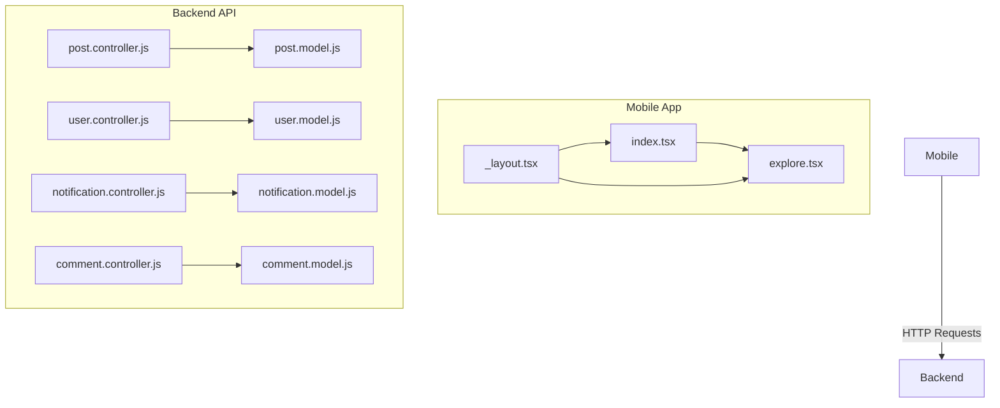
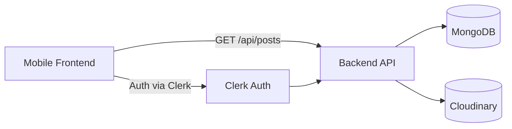
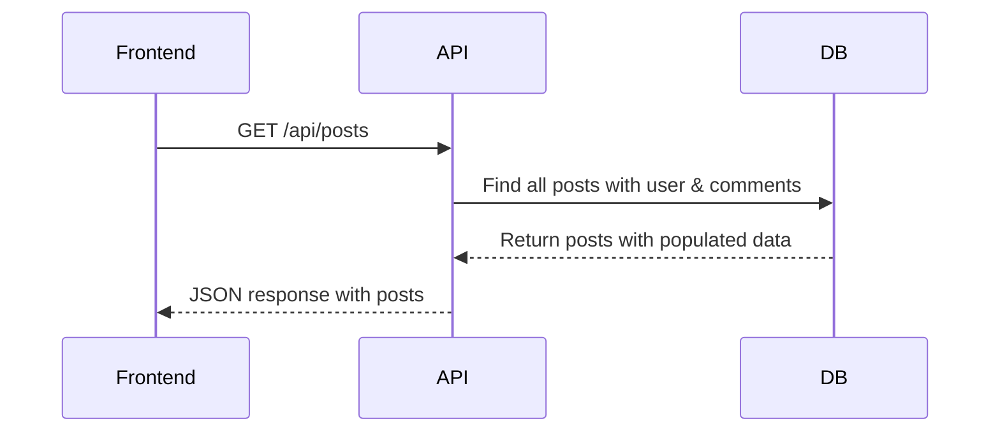
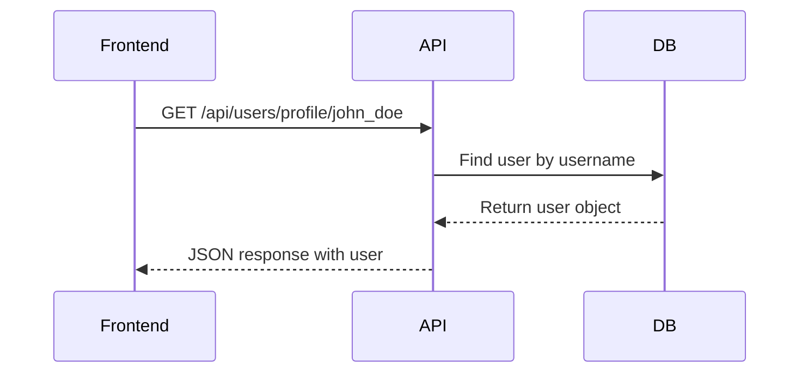
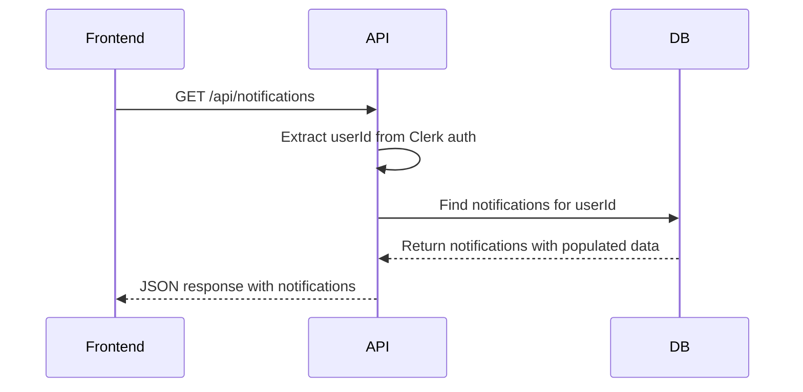
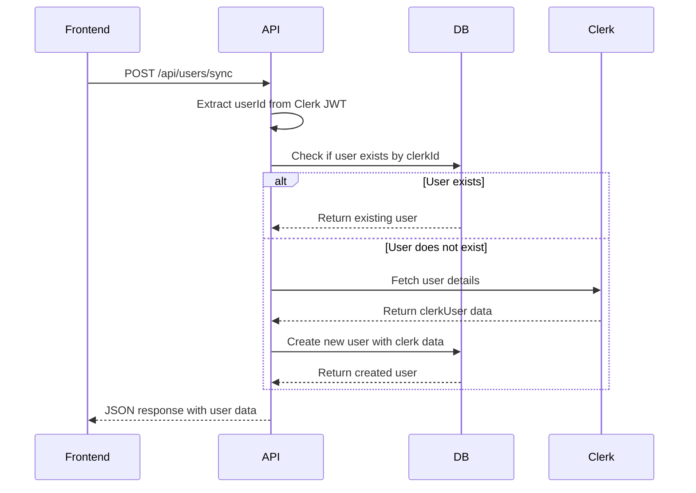
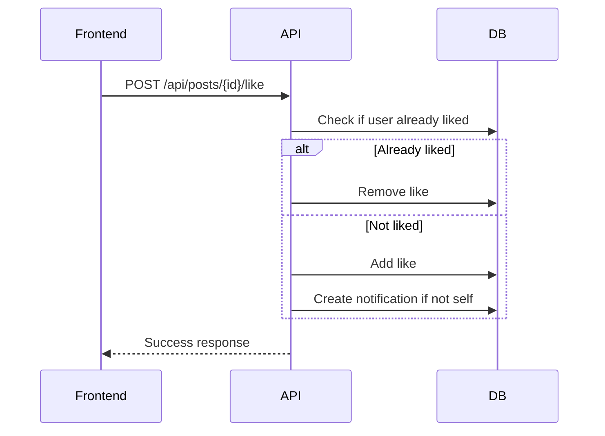
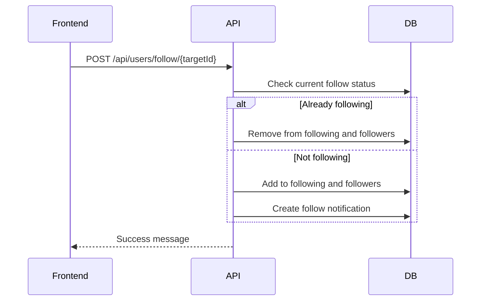
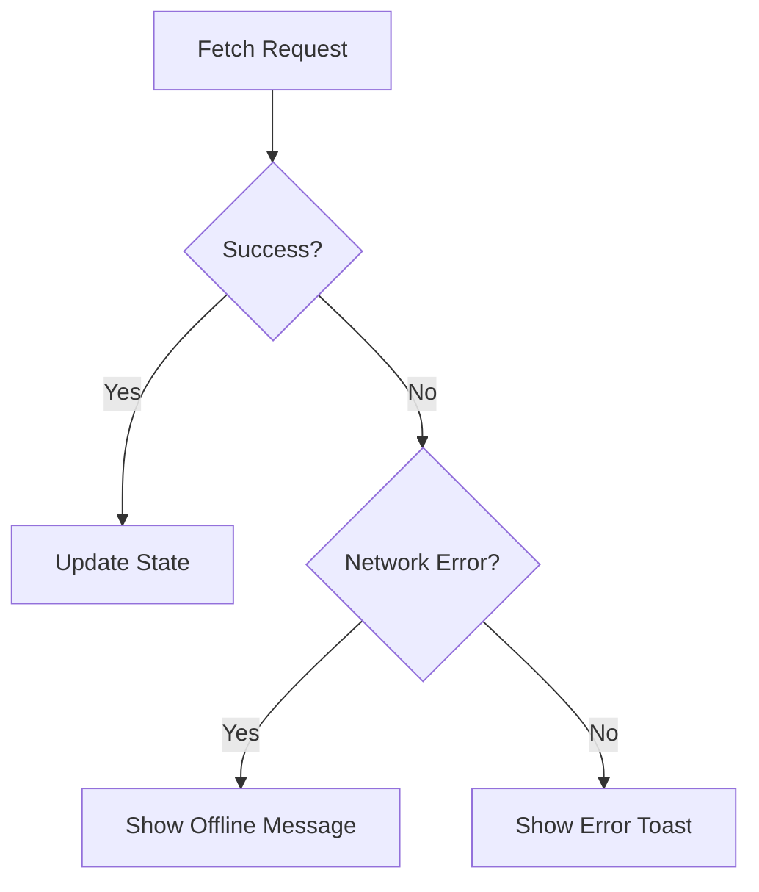

# API Clients and Data Fetching

<cite>
**Referenced Files in This Document**   
- [post.controller.js](file://backend/src/controllers/post.controller.js)
- [user.controller.js](file://backend/src/controllers/user.controller.js)
- [notification.controller.js](file://backend/src/controllers/notification.controller.js)
- [comment.controller.js](file://backend/src/controllers/comment.controller.js)
- [server.js](file://backend/src/server.js)
- [index.tsx](file://mobile/app/(tabs)/index.tsx)
- [explore.tsx](file://mobile/app/(tabs)/explore.tsx)
- [notification.model.js](file://backend/src/models/notification.model.js)
- [post.model.js](file://backend/src/models/post.model.js)
- [user.model.js](file://backend/src/models/user.model.js)
- [comment.model.js](file://backend/src/models/comment.model.js)
- [useUserSync.ts](file://mobile/hooks/useUserSync.ts) - *Added in commit 54ca48c*
- [api.ts](file://mobile/utils/api.ts) - *Updated in commit 54ca48c*
</cite>

## Update Summary
**Changes Made**   
- Added new section on User Synchronization via React Query
- Updated API Integration Patterns to reflect use of React Query and Axios client abstraction
- Enhanced Data Flow section to include user sync lifecycle
- Added new sequence diagram for user synchronization
- Updated section sources to reflect new and modified files

## Table of Contents
1. [Introduction](#introduction)
2. [Project Structure](#project-structure)
3. [Core Components](#core-components)
4. [Architecture Overview](#architecture-overview)
5. [Detailed Component Analysis](#detailed-component-analysis)
6. [API Integration Patterns](#api-integration-patterns)
7. [Data Flow from API to UI](#data-flow-from-api-to-ui)
8. [Mutation Patterns for Likes and Follows](#mutation-patterns-for-likes-and-follows)
9. [Caching, Retry Logic, and Error Handling](#caching-retry-logic-and-error-handling)
10. [Best Practices for API Abstraction](#best-practices-for-api-abstraction)

## Introduction
The xClone mobile frontend is built using Expo and React Native, designed to interact with a backend REST API for social media functionality such as posts, user profiles, comments, and notifications. This document details how the frontend fetches and manages data from the backend, focusing on API integration patterns, authentication, data flow, and best practices for maintainability.

## Project Structure
The project is divided into two main directories: `backend` and `mobile`. The `mobile` directory contains the React Native application using Expo Router for file-based routing. Key components include tab screens (`index.tsx`, `explore.tsx`), UI components, and hooks for theming. The `backend` is a Node.js/Express server with controllers, models, and routes for handling CRUD operations and user interactions.



**Diagram sources**
- [index.tsx](file://mobile/app/(tabs)/index.tsx)
- [post.controller.js](file://backend/src/controllers/post.controller.js)
- [user.controller.js](file://backend/src/controllers/user.controller.js)

## Core Components
The core components of the frontend include tab-based navigation, reusable UI components (e.g., `ThemedText`, `ParallaxScrollView`), and routing via Expo Router. The backend features RESTful endpoints for posts, users, comments, and notifications, secured with Clerk authentication.

**Section sources**
- [index.tsx](file://mobile/app/(tabs)/index.tsx)
- [explore.tsx](file://mobile/app/(tabs)/explore.tsx)
- [post.controller.js](file://backend/src/controllers/post.controller.js)

## Architecture Overview
The architecture follows a client-server model where the mobile frontend consumes a REST API. The backend uses Express with MongoDB (via Mongoose), Cloudinary for image uploads, and Clerk for authentication. Requests from the frontend include authentication headers automatically handled by Clerk middleware.



**Diagram sources**
- [server.js](file://backend/src/server.js)
- [post.controller.js](file://backend/src/controllers/post.controller.js)
- [user.controller.js](file://backend/src/controllers/user.controller.js)

## Detailed Component Analysis

### Post Data Fetching
The frontend retrieves posts via GET requests to `/api/posts`. The backend controller `getPosts` in `post.controller.js` fetches all posts sorted by creation date, populating user and comment data.



**Diagram sources**
- [post.controller.js](file://backend/src/controllers/post.controller.js#L0-L40)
- [post.model.js](file://backend/src/models/post.model.js)

**Section sources**
- [post.controller.js](file://backend/src/controllers/post.controller.js#L0-L40)

### User Profile Retrieval
User data is fetched via `GET /api/users/profile/:username`. The `getUserProfile` controller queries the User model and returns profile information.



**Diagram sources**
- [user.controller.js](file://backend/src/controllers/user.controller.js#L0-L10)
- [user.model.js](file://backend/src/models/user.model.js)

**Section sources**
- [user.controller.js](file://backend/src/controllers/user.controller.js#L0-L10)

### Notification Fetching
Notifications are retrieved from `GET /api/notifications`. The `getNotifications` controller uses the authenticated user's ID (from Clerk) to find relevant notifications, populating sender, post, and comment data.



**Diagram sources**
- [notification.controller.js](file://backend/src/controllers/notification.controller.js#L0-L15)
- [notification.model.js](file://backend/src/models/notification.model.js)

**Section sources**
- [notification.controller.js](file://backend/src/controllers/notification.controller.js#L0-L15)

### User Synchronization
Upon authentication, the frontend automatically synchronizes user data with the backend via `POST /api/users/sync`. The `useUserSync` hook uses React Query's `useMutation` to call the `syncUser` endpoint, which creates a new user in MongoDB if they don't exist.



**Diagram sources**
- [useUserSync.ts](file://mobile/hooks/useUserSync.ts#L0-L24)
- [user.controller.js](file://backend/src/controllers/user.controller.js#L45-L65)
- [user.model.js](file://backend/src/models/user.model.js)

**Section sources**
- [useUserSync.ts](file://mobile/hooks/useUserSync.ts#L0-L24)
- [user.controller.js](file://backend/src/controllers/user.controller.js#L45-L65)
- [api.ts](file://mobile/utils/api.ts#L38-L42)

## API Integration Patterns
The frontend uses standard HTTP methods (GET, POST, PUT, DELETE) to interact with the backend. Authentication headers are automatically included via Clerk's middleware. The API client is abstracted using Axios with interceptors for authentication and error handling.

### Request Formatting
- **GET /api/posts**: Retrieves all posts
- **GET /api/users/profile/{username}**: Gets user profile
- **GET /api/notifications**: Fetches user notifications
- **POST /api/posts**: Creates a new post with optional image upload to Cloudinary
- **POST /api/users/sync**: Synchronizes authenticated user with backend database

Authentication is handled via `clerkMiddleware()` in `server.js`, which parses the JWT and attaches user data to the request. The frontend uses `createApiClient` with an interceptor that automatically adds the Bearer token from Clerk.

**Section sources**
- [server.js](file://backend/src/server.js#L0-L10)
- [post.controller.js](file://backend/src/controllers/post.controller.js)
- [notification.controller.js](file://backend/src/controllers/notification.controller.js)
- [api.ts](file://mobile/utils/api.ts#L0-L37)

## Data Flow from API to UI
Data flows from the API to the UI through React components. For example, in `index.tsx`, the `useUserSync` hook is called to ensure the user is synchronized with the backend upon authentication. The response is handled via React Query's mutation callbacks.

Example pattern in `index.tsx`:
```tsx
const HomeScreen = () => {
  useUserSync();
  return (
    <SafeAreaView className="flex-1">
      <Text>Home</Text>
      <SignOutButton />
    </SafeAreaView>
  );
};
```

The `useUserSync` hook uses `useEffect` to trigger the sync mutation when the user is signed in. Loading and error states are managed internally by React Query's mutation state.

**Section sources**
- [index.tsx](file://mobile/app/(tabs)/index.tsx)
- [useUserSync.ts](file://mobile/hooks/useUserSync.ts#L0-L24)
- [post.controller.js](file://backend/src/controllers/post.controller.js)

## Mutation Patterns for Likes and Follows
### Like/Unlike Posts
The `likePost` controller toggles a user's like on a post. If the user likes their own post, no notification is sent. Otherwise, a notification of type "like" is created.



**Diagram sources**
- [post.controller.js](file://backend/src/controllers/post.controller.js#L77-L123)

### Follow/Unfollow Users
The `followUser` controller manages follow relationships. When a user follows another, both users' follower/following lists are updated, and a "follow" notification is sent.



**Diagram sources**
- [user.controller.js](file://backend/src/controllers/user.controller.js#L68-L95)

**Section sources**
- [user.controller.js](file://backend/src/controllers/user.controller.js#L68-L95)

## Caching, Retry Logic, and Error Handling
The current implementation uses React Query for mutation state management, providing built-in loading, success, and error states. Error handling is implemented via Express error middleware in `server.js`, which logs unhandled errors and returns a 500 response.

Network errors are handled in the frontend using React Query's `onError` callback and Axios interceptors. The API client includes a response interceptor that specifically handles 403 errors from Arcjet's bot detection.



**Section sources**
- [server.js](file://backend/src/server.js#L40-L46)
- [api.ts](file://mobile/utils/api.ts#L25-L35)

## Best Practices for API Abstraction
To improve maintainability, API calls are abstracted into service modules and custom hooks. The `api.ts` file exports a `useApiClient` hook and service objects (`userApi`, `postApi`, `commentApi`) that encapsulate endpoint logic.

Example abstraction:
```ts
// utils/api.ts
export const userApi = {
  syncUser: (api: AxiosInstance) => api.post("/users/sync"),
  getCurrentUser: (api: AxiosInstance) => api.get("/users/me"),
  updateProfile: (api: AxiosInstance, data: any) =>
    api.put("/users/profile", data),
};
```

Custom hooks like `useUserSync` encapsulate complex logic such as authentication state checking and mutation orchestration, promoting reusability and separation of concerns.

**Section sources**
- [api.ts](file://mobile/utils/api.ts)
- [useUserSync.ts](file://mobile/hooks/useUserSync.ts)
- [index.tsx](file://mobile/app/(tabs)/index.tsx)