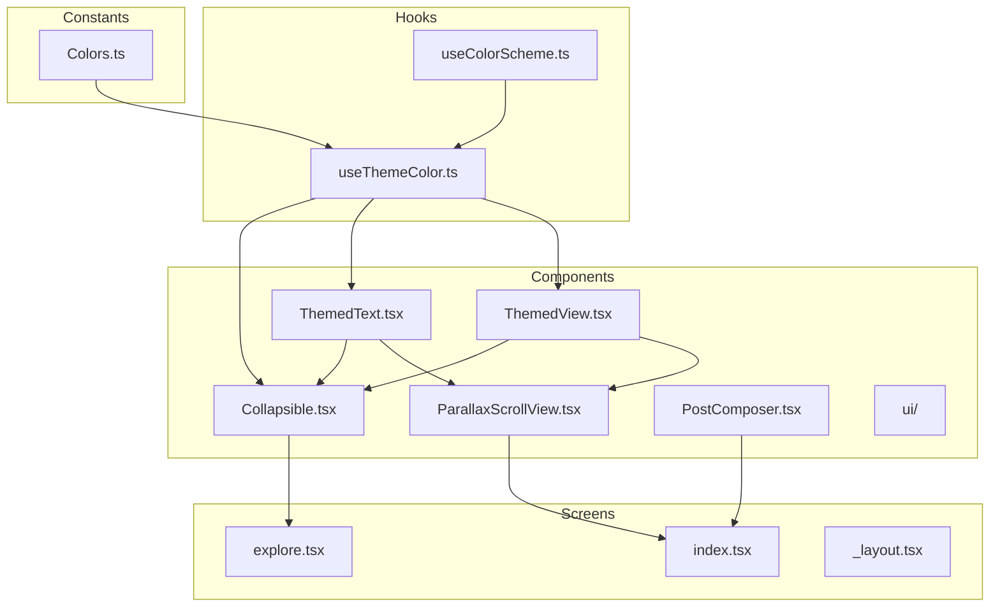
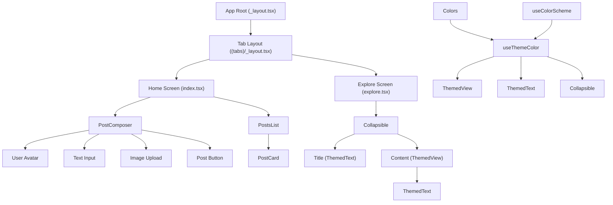
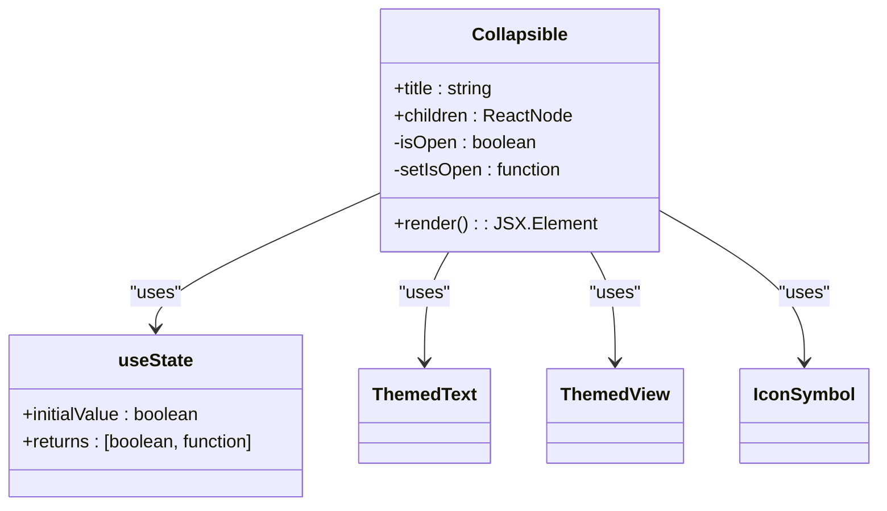
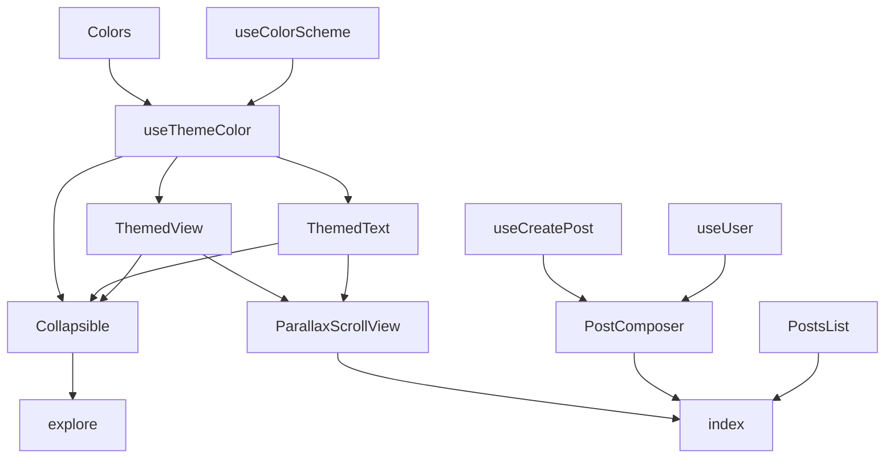

# Component Hierarchy

<cite>
**Referenced Files in This Document**   
- [ThemedView.tsx](file://mobile/components/ThemedView.tsx)
- [ThemedText.tsx](file://mobile/components/ThemedText.tsx)
- [ParallaxScrollView.tsx](file://mobile/components/ParallaxScrollView.tsx)
- [Collapsible.tsx](file://mobile/components/Collapsible.tsx)
- [useThemeColor.ts](file://mobile/hooks/useThemeColor.ts)
- [Colors.ts](file://mobile/constants/Colors.ts)
- [index.tsx](file://mobile/app/(tabs)/index.tsx) - *Updated in recent commit*
- [_layout.tsx](file://mobile/app/(tabs)/_layout.tsx)
- [explore.tsx](file://mobile/app/(tabs)/explore.tsx)
- [PostComposer.tsx](file://mobile/components/PostComposer.tsx) - *Added in recent commit*
</cite>

## Update Summary
**Changes Made**   
- Added documentation for the new PostComposer component
- Updated architecture overview and component analysis sections to reflect integration of PostComposer
- Added new diagram showing PostComposer in the component hierarchy
- Updated section sources to include newly added and modified files
- Enhanced dependency analysis to include PostComposer relationships

## Table of Contents
1. [Introduction](#introduction)
2. [Project Structure](#project-structure)
3. [Core Components](#core-components)
4. [Architecture Overview](#architecture-overview)
5. [Detailed Component Analysis](#detailed-component-analysis)
6. [Dependency Analysis](#dependency-analysis)
7. [Performance Considerations](#performance-considerations)
8. [Conclusion](#conclusion)

## Introduction
This document provides a comprehensive analysis of the UI component hierarchy in the xClone mobile frontend. It details the design, usage, and integration of custom components such as ThemedView, ThemedText, ParallaxScrollView, and Collapsible. The documentation explains how these components support consistent theming, responsive layout, and accessibility while promoting reusability and maintainable code structure through abstraction via hooks like useThemeColor. This update includes documentation for the newly added PostComposer component that enables users to create posts from the home screen.

## Project Structure
The xClone mobile application follows a modular structure with clear separation of concerns. The core UI components reside in the `components` directory, while tab-based navigation screens are organized under `app/(tabs)`. Theming logic is abstracted into hooks and constants, enabling consistent styling across light and dark modes.



**Diagram sources**
- [ThemedView.tsx](file://mobile/components/ThemedView.tsx#L1-L15)
- [ThemedText.tsx](file://mobile/components/ThemedText.tsx#L1-L61)
- [ParallaxScrollView.tsx](file://mobile/components/ParallaxScrollView.tsx#L1-L83)
- [Collapsible.tsx](file://mobile/components/Collapsible.tsx#L1-L46)
- [useThemeColor.ts](file://mobile/hooks/useThemeColor.ts#L1-L22)
- [Colors.ts](file://mobile/constants/Colors.ts#L1-L27)
- [PostComposer.tsx](file://mobile/components/PostComposer.tsx#L1-L98) - *Added in recent commit*
- [index.tsx](file://mobile/app/(tabs)/index.tsx#L1-L30) - *Updated in recent commit*

**Section sources**
- [ThemedView.tsx](file://mobile/components/ThemedView.tsx#L1-L15)
- [ThemedText.tsx](file://mobile/components/ThemedText.tsx#L1-L61)

## Core Components
The xClone frontend leverages several reusable UI components designed to enforce consistent styling, support dynamic theming, and enhance user experience. These components abstract styling logic and promote composability across screens. The newly added PostComposer component allows users to create text posts with optional images directly from the home screen, integrating with the useCreatePost hook for state management and API communication.

**Section sources**
- [ThemedView.tsx](file://mobile/components/ThemedView.tsx#L1-L15)
- [ThemedText.tsx](file://mobile/components/ThemedText.tsx#L1-L61)
- [ParallaxScrollView.tsx](file://mobile/components/ParallaxScrollView.tsx#L1-L83)
- [Collapsible.tsx](file://mobile/components/Collapsible.tsx#L1-L46)
- [PostComposer.tsx](file://mobile/components/PostComposer.tsx#L1-L98) - *Added in recent commit*

## Architecture Overview
The UI architecture is built around reusable, theme-aware components that encapsulate styling and behavior. The component tree flows from high-level layout containers down to atomic UI elements, with theming managed centrally via hooks and constants. The home screen now integrates the PostComposer component above the PostsList, creating a seamless user experience for content creation.



**Diagram sources**
- [index.tsx](file://mobile/app/(tabs)/index.tsx#L1-L30) - *Updated in recent commit*
- [PostComposer.tsx](file://mobile/components/PostComposer.tsx#L1-L98) - *Added in recent commit*
- [PostsList.tsx](file://mobile/components/PostsList.tsx#L1-L15)
- [PostCard.ts](file://mobile/components/PostCard.ts#L1-L25)
- [ParallaxScrollView.tsx](file://mobile/components/ParallaxScrollView.tsx#L1-L83)
- [Collapsible.tsx](file://mobile/components/Collapsible.tsx#L1-L46)
- [ThemedView.tsx](file://mobile/components/ThemedView.tsx#L1-L15)
- [ThemedText.tsx](file://mobile/components/ThemedText.tsx#L1-L61)
- [useThemeColor.ts](file://mobile/hooks/useThemeColor.ts#L1-L22)

## Detailed Component Analysis

### ThemedView Analysis
ThemedView is a wrapper around React Native's View component that supports dynamic theming. It accepts optional lightColor and darkColor props to override default background colors based on the current theme.

**Props:**
- `style`: Additional styles to apply
- `lightColor`: Background color in light mode
- `darkColor`: Background color in dark mode

It uses `useThemeColor` to resolve the appropriate background color, falling back to the default theme value if no custom color is provided.

```mermaid
classDiagram
class ThemedView {
+style : ViewStyle
+lightColor? : string
+darkColor? : string
-backgroundColor : string
+render() : JSX.Element
}
class useThemeColor {
+props : { light? : string; dark? : string }
+colorName : "background"
+returns : string
}
ThemedView --> useThemeColor : "uses"
useThemeColor --> Colors : "reads"
```

**Diagram sources**
- [ThemedView.tsx](file://mobile/components/ThemedView.tsx#L1-L15)
- [useThemeColor.ts](file://mobile/hooks/useThemeColor.ts#L1-L22)

**Section sources**
- [ThemedView.tsx](file://mobile/components/ThemedView.tsx#L1-L15)

### ThemedText Analysis
ThemedText extends React Native's Text component with theming and predefined typography styles. It supports multiple text types including default, title, subtitle, and link variants.

**Props:**
- `type`: One of 'default', 'title', 'defaultSemiBold', 'subtitle', 'link'
- `lightColor`: Text color in light mode
- `darkColor`: Text color in dark mode

The component applies semantic styling based on the type prop and resolves text color using `useThemeColor`. The "link" type has a fixed blue color regardless of theme.

```mermaid
classDiagram
class ThemedText {
+style : TextStyle
+type : "default" | "title" | "defaultSemiBold" | "subtitle" | "link"
+lightColor? : string
+darkColor? : string
-color : string
-fontSize : number
-fontWeight : string
+render() : JSX.Element
}
class useThemeColor {
+props : { light? : string; dark? : string }
+colorName : "text"
+returns : string
}
ThemedText --> useThemeColor : "uses"
useThemeColor --> Colors : "reads"
```

**Diagram sources**
- [ThemedText.tsx](file://mobile/components/ThemedText.tsx#L1-L61)
- [useThemeColor.ts](file://mobile/hooks/useThemeColor.ts#L1-L22)

**Section sources**
- [ThemedText.tsx](file://mobile/components/ThemedText.tsx#L1-L61)

### ParallaxScrollView Analysis
ParallaxScrollView implements a scrollable container with a parallax header effect. It uses react-native-reanimated to create smooth animations as the user scrolls.

**Props:**
- `headerImage`: React element to display in the header
- `headerBackgroundColor`: Object with light and dark mode background colors

The component calculates scroll offset and applies interpolated transforms (translateY and scale) to create a parallax effect. It wraps content in ThemedView for consistent styling and integrates with the tab bar overflow system.

```mermaid
classDiagram
class ParallaxScrollView {
+headerImage : ReactElement
+headerBackgroundColor : { light : string; dark : string }
-scrollRef : AnimatedRef
-scrollOffset : number
-headerAnimatedStyle : AnimatedStyle
+render() : JSX.Element
}
class useScrollViewOffset {
+ref : AnimatedRef
+returns : number
}
class interpolate {
+inputRange : number[]
+outputRange : number[]
+returns : number
}
ParallaxScrollView --> useScrollViewOffset : "uses"
ParallaxScrollView --> interpolate : "uses"
ParallaxScrollView --> ThemedView : "uses"
ParallaxScrollView --> useColorScheme : "uses"
```

**Diagram sources**
- [ParallaxScrollView.tsx](file://mobile/components/ParallaxScrollView.tsx#L1-L83)
- [useColorScheme.ts](file://mobile/hooks/useColorScheme.ts#L1-L3)

**Section sources**
- [ParallaxScrollView.tsx](file://mobile/components/ParallaxScrollView.tsx#L1-L83)

### Collapsible Analysis
Collapsible provides an expandable section with a toggleable header. It manages internal open/closed state and animates the chevron icon rotation.

**Props:**
- `title`: String to display in the header
- `children`: Content to show when expanded

The component uses TouchableOpacity for press handling and applies conditional rendering to show/hide content. Icon rotation is controlled via transform style based on isOpen state.



**Diagram sources**
- [Collapsible.tsx](file://mobile/components/Collapsible.tsx#L1-L46)
- [ThemedText.tsx](file://mobile/components/ThemedText.tsx#L1-L61)
- [ThemedView.tsx](file://mobile/components/ThemedView.tsx#L1-L15)

**Section sources**
- [Collapsible.tsx](file://mobile/components/Collapsible.tsx#L1-L46)

### PostComposer Analysis
PostComposer is a new component that enables users to create posts with text and optional images. It integrates with the useCreatePost hook for state management and API communication.

**Props:**
None - self-contained component with internal state management

**Key Features:**
- Text input with 280-character limit
- Image attachment from gallery or camera
- Real-time character counter with warning at 260+ characters
- Disabled post button until content or image is provided
- Loading state during post creation
- User avatar display from Clerk authentication

The component uses Tailwind CSS for styling and Expo Vector Icons for UI elements. It manages its state through the useCreatePost hook which handles content, image selection, and API submission.

```mermaid
classDiagram
class PostComposer {
+content : string
+selectedImage? : string
+isCreating : boolean
+setContent() : function
+pickImageFromGallery() : function
+takePhoto() : function
+removeImage() : function
+createPost() : function
+render() : JSX.Element
}
class useCreatePost {
+returns : { content, setContent, selectedImage, pickImageFromGallery, takePhoto, removeImage, createPost, isCreating }
}
class useUser {
+returns : { user }
}
PostComposer --> useCreatePost : "uses"
PostComposer --> useUser : "uses"
```

**Diagram sources**
- [PostComposer.tsx](file://mobile/components/PostComposer.tsx#L1-L98) - *Added in recent commit*
- [useCreatePost.ts](file://mobile/hooks/useCreatePost.ts#L1-L45) - *Existing hook*
- [useUser.ts](file://mobile/hooks/useCurrentUser.ts#L1-L15) - *Existing hook*

**Section sources**
- [PostComposer.tsx](file://mobile/components/PostComposer.tsx#L1-L98) - *Added in recent commit*

## Dependency Analysis
The component system demonstrates a clean dependency hierarchy with proper abstraction layers. Theming logic is centralized, preventing duplication and ensuring consistency. The new PostComposer component depends on the useCreatePost hook for state management and the useUser hook from Clerk for user information, while being composed within the home screen alongside PostsList.



**Diagram sources**
- [Colors.ts](file://mobile/constants/Colors.ts#L1-L27)
- [useThemeColor.ts](file://mobile/hooks/useThemeColor.ts#L1-L22)
- [useColorScheme.ts](file://mobile/hooks/useColorScheme.ts#L1-L3)
- [ThemedView.tsx](file://mobile/components/ThemedView.tsx#L1-L15)
- [ThemedText.tsx](file://mobile/components/ThemedText.tsx#L1-L61)
- [Collapsible.tsx](file://mobile/components/Collapsible.tsx#L1-L46)
- [ParallaxScrollView.tsx](file://mobile/components/ParallaxScrollView.tsx#L1-L83)
- [PostComposer.tsx](file://mobile/components/PostComposer.tsx#L1-L98) - *Added in recent commit*
- [useCreatePost.ts](file://mobile/hooks/useCreatePost.ts#L1-L45) - *Existing hook*
- [useUser.ts](file://mobile/hooks/useCurrentUser.ts#L1-L15) - *Existing hook*
- [index.tsx](file://mobile/app/(tabs)/index.tsx#L1-L30) - *Updated in recent commit*

**Section sources**
- [Colors.ts](file://mobile/constants/Colors.ts#L1-L27)
- [useThemeColor.ts](file://mobile/hooks/useThemeColor.ts#L1-L22)

## Performance Considerations
The ParallaxScrollView component leverages react-native-reanimated for smooth, native-thread animations, minimizing JavaScript thread interference during scrolling. However, excessive nesting of ThemedView and ThemedText components could lead to view hierarchy bloat. The use of StyleSheet.create and memoized styles helps optimize rendering performance. The Collapsible component uses conditional rendering rather than visibility toggling, reducing unnecessary layout calculations when content is hidden. The PostComposer component efficiently manages state through the useCreatePost hook, minimizing re-renders and ensuring optimal performance during user interaction.

## Conclusion
The xClone mobile frontend employs a well-structured component hierarchy that promotes reusability, consistent theming, and maintainable code. By abstracting styling logic into hooks and creating semantic UI components, the architecture supports rapid development while ensuring visual consistency across the application. The integration of animated components like ParallaxScrollView enhances user experience without sacrificing performance, thanks to proper use of native animation systems. The recent addition of the PostComposer component demonstrates the extensibility of this architecture, seamlessly integrating with existing components and hooks to deliver new functionality while maintaining code quality and consistency.