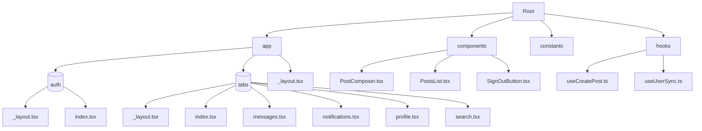
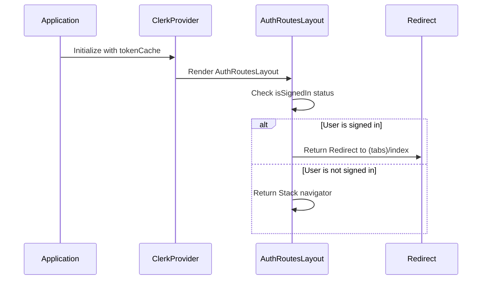
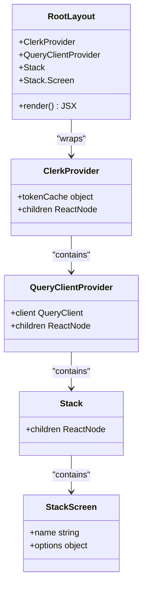
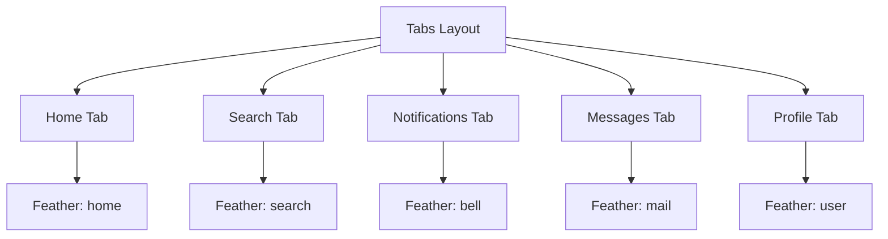
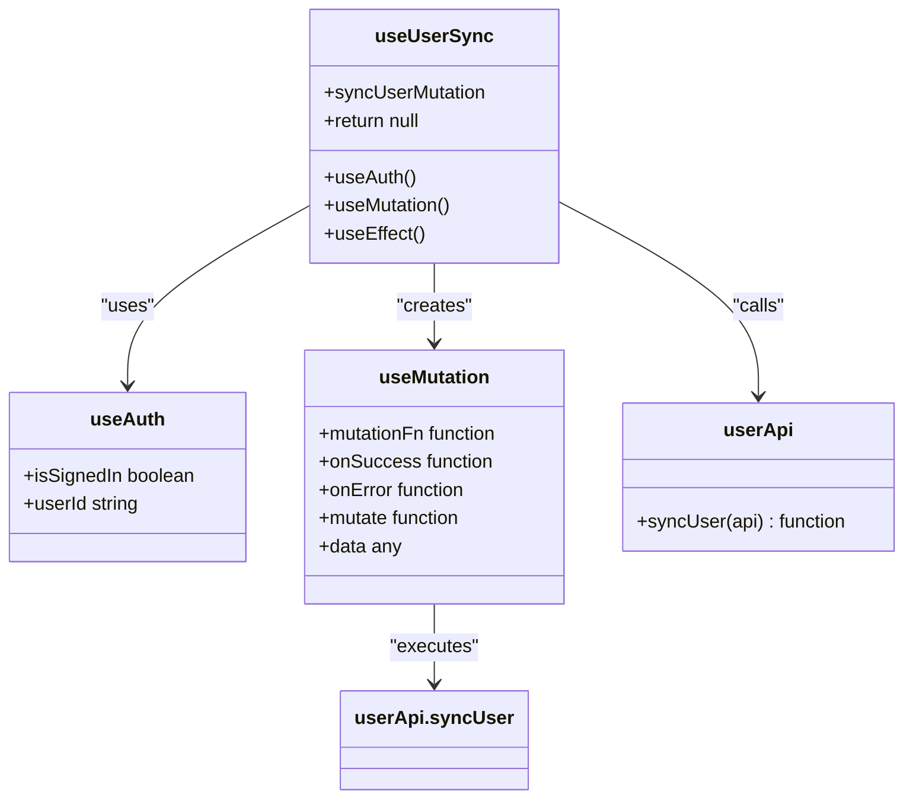
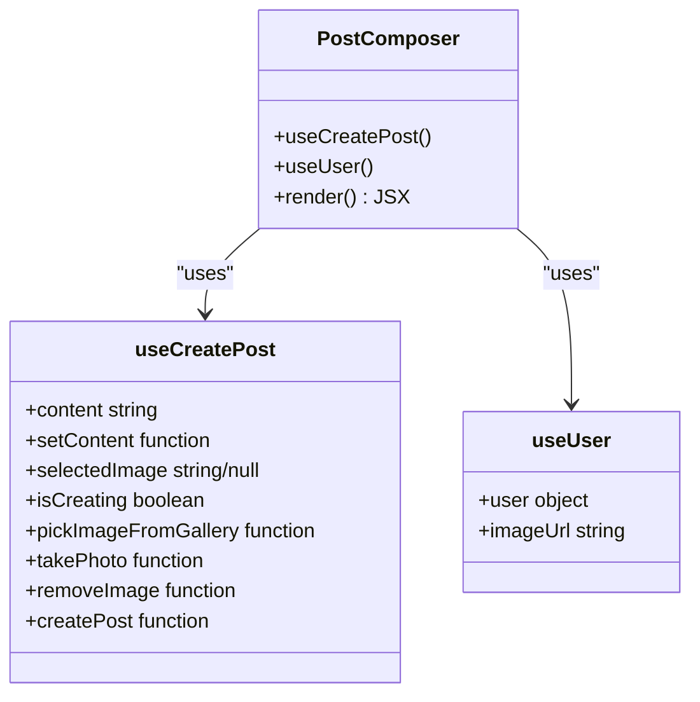

# Frontend Architecture

<cite>
**Referenced Files in This Document**   
- [app\_layout.tsx](file://mobile/app/_layout.tsx) - *Updated in recent commit*
- [auth\_layout.tsx](file://mobile/app/(auth)/_layout.tsx) - *Added in recent commit*
- [tabs\_layout.tsx](file://mobile/app/(tabs)/_layout.tsx) - *Modified in recent commit*
- [index.tsx](file://mobile/app/(auth)/index.tsx) - *Modified in recent commit*
- [useUserSync.ts](file://mobile/hooks/useUserSync.ts) - *Added in recent commit*
- [index.tsx](file://mobile/app/(tabs)/index.tsx) - *Modified in recent commit*
- [PostComposer.tsx](file://mobile/components/PostComposer.tsx) - *Added in recent commit*
- [useCreatePost.ts](file://mobile/hooks/useCreatePost.ts) - *Added in recent commit*
</cite>

## Update Summary
**Changes Made**   
- Updated documentation to reflect integration of Clerk authentication with tab-based navigation
- Added documentation for authentication flow and redirection logic
- Restored documentation for tab navigation system which remains active
- Clarified routing structure and layout hierarchy
- Updated architectural diagrams to reflect actual implementation
- Added new section on User Synchronization System to document the `useUserSync` hook and its integration
- Updated Root Layout Component section to include React Query and user sync initialization
- Enhanced Architecture Overview with user synchronization flow
- Added new section on Post Creation System to document the `PostComposer` component and `useCreatePost` hook
- Updated Home Screen section to include PostComposer integration
- Added diagram for post creation workflow

## Table of Contents
1. [Introduction](#introduction)
2. [Project Structure](#project-structure)
3. [Architecture Overview](#architecture-overview)
4. [Authentication Flow](#authentication-flow)
5. [Root Layout Component](#root-layout-component)
6. [Tab Navigation System](#tab-navigation-system)
7. [User Synchronization System](#user-synchronization-system)
8. [Post Creation System](#post-creation-system)

## Introduction
This document provides comprehensive architectural documentation for the xClone mobile frontend application. The application is built using React Native with Expo Router's file-based routing system, implementing a modern component-based architecture. Recent changes have enhanced the authentication flow using Clerk while maintaining the tab-based navigation system. This documentation has been updated to accurately reflect the current routing structure and provide insights into the integrated authentication, navigation, and user data synchronization design. Additionally, new functionality for creating posts has been implemented and documented.

## Project Structure
The xClone mobile frontend follows a well-organized directory structure that separates concerns and promotes maintainability. The application uses Expo Router's file-based routing system, where the `app` directory serves as the entry point for all routes. The structure is divided into several key directories:

- **app**: Contains all route definitions and screen components, using Expo Router's file-based routing
- **components**: Houses reusable UI components, including themed components and utility components
- **constants**: Stores application-wide constants, primarily color definitions
- **hooks**: Contains custom React hooks for theme management and other reusable logic
- **scripts**: Includes utility scripts for project maintenance

The `(auth)` directory within the `app` directory indicates a route group for authentication-related routes. This directory contains the authentication layout and entry point screen. The `(tabs)` directory contains the tab navigation layout and associated tab screens.



**Section sources**
- [app\_layout.tsx](file://mobile/app/_layout.tsx)
- [auth\_layout.tsx](file://mobile/app/(auth)/_layout.tsx)
- [tabs\_layout.tsx](file://mobile/app/(tabs)/_layout.tsx)

**Diagram sources**
- [app\_layout.tsx](file://mobile/app/_layout.tsx)
- [auth\_layout.tsx](file://mobile/app/(auth)/_layout.tsx)
- [tabs\_layout.tsx](file://mobile/app/(tabs)/_layout.tsx)

## Architecture Overview
The xClone mobile frontend implements an authentication-first approach using Clerk, while maintaining a tab-based navigation system for authenticated users. The architecture centers around authentication state management, with the root layout component serving as the entry point that wraps all screens with the Clerk provider. The system now includes automatic user data synchronization with the backend upon sign-in and a new post creation system for user content generation.

```mermaid
graph TD
A[Root Layout] --> B[ClerkProvider]
B --> C[QueryClientProvider]
C --> D[Stack Navigator]
D --> E[Auth Routes Layout]
E --> F{isSignedIn?}
F --> |Yes| G[Redirect to (tabs)/index]
F --> |No| H[Show Auth Screens]
G --> I[Tabs Layout]
I --> J[Home Tab]
I --> K[Search Tab]
I --> L[Notifications Tab]
I --> M[Messages Tab]
I --> N[Profile Tab]
J --> O[useUserSync Hook]
O --> P{User Synced?}
P --> |No| Q[POST /users/sync]
P --> |Yes| R[Continue]
J --> S[PostComposer]
S --> T[useCreatePost Hook]
T --> U{Valid Content?}
U --> |Yes| V[POST /posts]
U --> |No| W[Show Error]
```

**Section sources**
- [app\_layout.tsx](file://mobile/app/_layout.tsx)
- [auth\_layout.tsx](file://mobile/app/(auth)/_layout.tsx)
- [tabs\_layout.tsx](file://mobile/app/(tabs)/_layout.tsx)
- [useUserSync.ts](file://mobile/hooks/useUserSync.ts)
- [PostComposer.tsx](file://mobile/components/PostComposer.tsx)
- [useCreatePost.ts](file://mobile/hooks/useCreatePost.ts)

**Diagram sources**
- [app\_layout.tsx](file://mobile/app/_layout.tsx#L1-L14)
- [auth\_layout.tsx](file://mobile/app/(auth)/_layout.tsx#L1-L12)
- [tabs\_layout.tsx](file://mobile/app/(tabs)/_layout.tsx#L1-L56)
- [useUserSync.ts](file://mobile/hooks/useUserSync.ts#L1-L25)
- [PostComposer.tsx](file://mobile/components/PostComposer.tsx#L1-L98)
- [useCreatePost.ts](file://mobile/hooks/useCreatePost.ts#L1-L104)

## Authentication Flow
The xClone application implements an authentication-first navigation flow using Clerk for user management. The authentication system is integrated at the root level of the application, ensuring that user authentication status is available throughout the application.

### Authentication Layout
The authentication layout (`app/(auth)/_layout.tsx`) manages the authentication state and redirects users based on their sign-in status. It uses the `useAuth` hook from Clerk to determine if a user is signed in and redirects authenticated users to the tab-based home screen.



**Section sources**
- [auth\_layout.tsx](file://mobile/app/(auth)/_layout.tsx#L1-L12)

**Diagram sources**
- [auth\_layout.tsx](file://mobile/app/(auth)/_layout.tsx#L1-L12)

## Root Layout Component
The root layout component (`app/_layout.tsx`) serves as the entry point for the application and sets up the global authentication context. It uses ClerkProvider to manage authentication state and token caching across the application. The component has been updated to include React Query for data management and state synchronization.



**Section sources**
- [app\_layout.tsx](file://mobile/app/_layout.tsx#L1-L30)

**Diagram sources**
- [app\_layout.tsx](file://mobile/app/_layout.tsx#L1-L30)

## Tab Navigation System
The xClone application implements a tab-based navigation system through the `(tabs)` directory. The tabs layout component (`app/(tabs)/_layout.tsx`) uses Expo Router's Tabs component to create a bottom tab navigator with five main sections: Home, Search, Notifications, Messages, and Profile.

The tab navigation system uses Feather icons from @expo/vector-icons for tab bar icons. Each tab screen is configured with a specific icon and empty title, creating a clean, icon-based navigation interface.



**Section sources**
- [tabs\_layout.tsx](file://mobile/app/(tabs)/_layout.tsx#L1-L56)

**Diagram sources**
- [tabs\_layout.tsx](file://mobile/app/(tabs)/_layout.tsx#L1-L56)

## User Synchronization System
The xClone application has implemented an automatic user synchronization system that ensures user data from Clerk authentication is properly stored in the application's MongoDB database upon first sign-in. This system is managed through the `useUserSync` custom hook located in the hooks directory.

The `useUserSync` hook leverages React Query's mutation functionality to handle the asynchronous user synchronization process. When a user signs in through Clerk, the hook automatically triggers a mutation that sends user data to the backend API endpoint `/users/sync`. The hook uses the `useAuth` hook from Clerk to monitor authentication status and only attempts synchronization when the user is signed in and no previous successful sync exists.



The user synchronization process follows these steps:
1. User successfully authenticates through Clerk
2. The `useUserSync` hook detects the signed-in state via `useAuth`
3. A mutation is triggered to call the `userApi.syncUser` function
4. The API request sends a POST request to `/users/sync` with authentication token
5. The backend creates a new user record in MongoDB with profile data from Clerk
6. Success or error is logged accordingly

This system ensures that all authenticated users have their data properly stored in the application database, enabling features like social interactions, content ownership, and personalized experiences.

**Section sources**
- [useUserSync.ts](file://mobile/hooks/useUserSync.ts#L1-L25)
- [index.tsx](file://mobile/app/(tabs)/index.tsx#L1-L17)
- [api.ts](file://mobile/utils/api.ts#L38-L72)

**Diagram sources**
- [useUserSync.ts](file://mobile/hooks/useUserSync.ts#L1-L25)
- [user.controller.js](file://backend/src/controllers/user.controller.js#L54-L79)
- [user.route.js](file://backend/src/routes/user.route.js#L1-L18)

## Post Creation System
The xClone application has implemented a comprehensive post creation system that allows users to compose and publish content with optional images. This system is centered around the `PostComposer` component and the `useCreatePost` custom hook, enabling users to create posts directly from the home screen.

### PostComposer Component
The `PostComposer` component (`components/PostComposer.tsx`) provides a user interface for creating posts with text content and optional images. It displays the user's profile picture, a text input field with character limit (280 characters), image attachment preview, and action buttons for adding images from gallery or camera. The component also includes a character counter that turns red when approaching the limit.



### Post Creation Hook
The `useCreatePost` hook (`hooks/useCreatePost.ts`) manages the state and logic for creating posts. It handles text content, image selection, form validation, and API communication. The hook uses React Query's mutation functionality to manage the asynchronous post creation process, automatically invalidating the posts query upon successful creation to trigger UI updates.

The post creation process follows these steps:
1. User enters text content and/or selects an image
2. The `createPost` function validates that either content or image is provided
3. A mutation is triggered to call the `postApi.createPost` function
4. The API request sends a POST request to `/posts` with form data (text and image)
5. The backend creates a new post record in MongoDB and uploads image to Cloudinary if provided
6. The posts list is automatically refreshed via query invalidation
7. Success or error alert is displayed to the user

The system supports image uploads from both gallery and camera, with proper permission handling and error messaging. Image files are processed with appropriate MIME types and uploaded as multipart form data.

**Section sources**
- [PostComposer.tsx](file://mobile/components/PostComposer.tsx#L1-L98)
- [useCreatePost.ts](file://mobile/hooks/useCreatePost.ts#L1-L104)
- [index.tsx](file://mobile/app/(tabs)/index.tsx#L1-L31)
- [api.ts](file://mobile/utils/api.ts#L38-L72)
- [post.controller.js](file://backend/src/controllers/post.controller.js#L38-L79)

**Diagram sources**
- [PostComposer.tsx](file://mobile/components/PostComposer.tsx#L1-L98)
- [useCreatePost.ts](file://mobile/hooks/useCreatePost.ts#L1-L104)
- [post.controller.js](file://backend/src/controllers/post.controller.js#L38-L79)