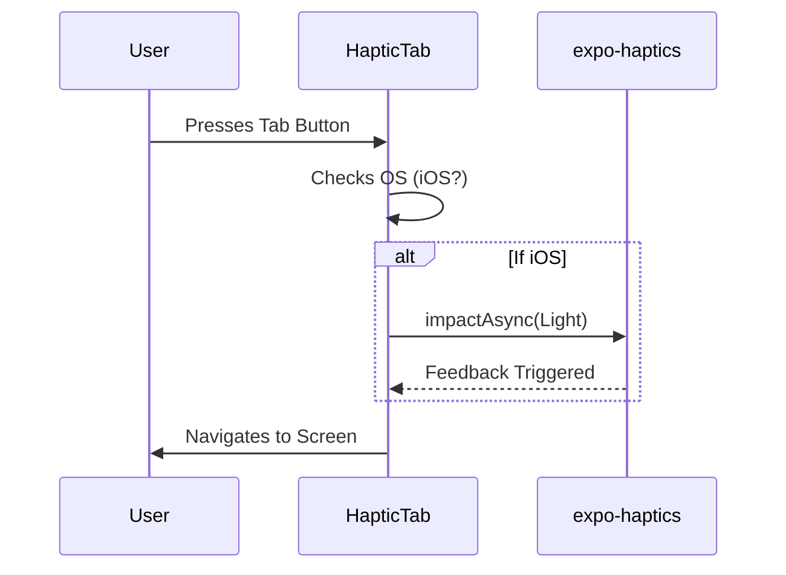

# Navigation Structure

<cite>
**Referenced Files in This Document**   
- [app/_layout.tsx](file://mobile/app/_layout.tsx) - *Updated in recent commit for auth implementation*
- [app/(auth)/_layout.tsx](file://mobile/app/(auth)/_layout.tsx) - *Added in recent commit for authentication flow*
- [app/(tabs)/_layout.tsx](file://mobile/app/(tabs)/_layout.tsx)
- [app/+not-found.tsx](file://mobile/app/+not-found.tsx)
- [components/HapticTab.tsx](file://mobile/components/HapticTab.tsx)
- [app/(tabs)/index.tsx](file://mobile/app/(tabs)/index.tsx)
- [app/(tabs)/search.tsx](file://mobile/app/(tabs)/search.tsx)
- [app/(tabs)/notifications.tsx](file://mobile/app/(tabs)/notifications.tsx)
- [app/(tabs)/messages.tsx](file://mobile/app/(tabs)/messages.tsx)
- [app/(tabs)/profile.tsx](file://mobile/app/(tabs)/profile.tsx)
- [hooks/useSocialAuth.ts](file://mobile/hooks/useSocialAuth.ts)
</cite>

## Update Summary
**Changes Made**   
- Updated **Root Layout and Stack Navigation** section to reflect new authentication routing logic
- Added **Authentication Flow and Conditional Redirects** section to document `(auth)` route group and sign-in redirection
- Updated **Routing Flow and Deep Linking Considerations** to include authentication state checks
- Removed outdated references to `explore.tsx` which no longer exists in the codebase
- Added new file references related to authentication implementation

## Table of Contents
1. [Introduction](#introduction)
2. [Project Structure](#project-structure)
3. [Root Layout and Stack Navigation](#root-layout-and-stack-navigation)
4. [Authentication Flow and Conditional Redirects](#authentication-flow-and-conditional-redirects)
5. [Tab-Based Navigation with (tabs) Directory](#tab-based-navigation-with-tabs-directory)
6. [Haptic Feedback in Tab Navigation](#haptic-feedback-in-tab-navigation)
7. [Error Handling with +not-found.tsx](#error-handling-with-not-foundtsx)
8. [Routing Flow and Deep Linking Considerations](#routing-flow-and-deep-linking-considerations)
9. [Screen Options and Tab Bar Appearance](#screen-options-and-tab-bar-appearance)
10. [Client-Side Navigation Best Practices](#client-side-navigation-best-practices)
11. [Performance and Bundle Splitting Implications](#performance-and-bundle-splitting-implications)

## Introduction
This document provides a comprehensive overview of the navigation system in the xClone mobile application, built using Expo Router's file-based routing architecture. It details how nested navigators are structured through `_layout.tsx` files, particularly focusing on the tab-based navigation implemented within the `(tabs)` directory. The integration of tactile feedback via `HapticTab`, authentication flow with conditional redirects, error routing with `+not-found.tsx`, and performance considerations related to file-based routing are also covered.

## Project Structure
The project follows a modular structure with clear separation between backend and mobile components. The mobile application uses Expo Router for navigation, leveraging file-based routing conventions to define navigational hierarchy.

```mermaid
graph TB
Root[app/_layout.tsx] --> Auth[app/(auth)/_layout.tsx]
Auth --> TabsRedirect[Redirect to (tabs)/index if signed in]
Auth --> AuthStack[Stack with headerShown: false]
Root --> Tabs[app/(tabs)/_layout.tsx]
Tabs --> Home[app/(tabs)/index.tsx]
Tabs --> Search[app/(tabs)/search.tsx]
Tabs --> Notifications[app/(tabs)/notifications.tsx]
Tabs --> Messages[app/(tabs)/messages.tsx]
Tabs --> Profile[app/(tabs)/profile.tsx]
Root --> NotFound[app/+not-found.tsx]
style Root fill:#f9f,stroke:#333
style Auth fill:#ffcccb,stroke:#333
style Tabs fill:#bbf,stroke:#333
style Home fill:#dfd,stroke:#333
style Search fill:#dfd,stroke:#333
style Notifications fill:#dfd,stroke:#333
style Messages fill:#dfd,stroke:#333
style Profile fill:#dfd,stroke:#333
style NotFound fill:#fdd,stroke:#333
```

**Diagram sources**
- [app/_layout.tsx](file://mobile/app/_layout.tsx#L1-L14)
- [app/(auth)/_layout.tsx](file://mobile/app/(auth)/_layout.tsx#L1-L12)
- [app/(tabs)/_layout.tsx](file://mobile/app/(tabs)/_layout.tsx#L1-L57)
- [app/(tabs)/index.tsx](file://mobile/app/(tabs)/index.tsx#L1-L12)

**Section sources**
- [app/_layout.tsx](file://mobile/app/_layout.tsx#L1-L14)
- [app/(auth)/_layout.tsx](file://mobile/app/(auth)/_layout.tsx#L1-L12)

## Root Layout and Stack Navigation
The root layout file (`app/_layout.tsx`) serves as the entry point for the entire navigation stack. It wraps the app in a `ClerkProvider` for authentication context and defines a `Stack` navigator from `expo-router`. This stack contains two primary routes: `(auth)` and `index`.

### Key Responsibilities:
- **Authentication Context**: Uses `ClerkProvider` from `@clerk/clerk-expo` to manage authentication state across the app.
- **Stack Configuration**: Defines screen options such as hiding headers for the auth route and setting the title for the index route.

```tsx
<Stack>
  <Stack.Screen name="(auth)" options={{ headerShown: false }} />
  <Stack.Screen name="index" options={{ title: "Home" }} />
</Stack>
```

This configuration ensures that when users navigate to the auth flow, the header is hidden, providing a clean interface. The `index` route displays "Home" as the title when accessed directly.

**Section sources**
- [app/_layout.tsx](file://mobile/app/_layout.tsx#L1-L14)

## Authentication Flow and Conditional Redirects
The `(auth)` directory implements the authentication flow using Expo Router's conditional navigation. The `_layout.tsx` inside this directory checks the user's authentication status and redirects accordingly.

### Implementation Details:
- **Authentication Check**: Uses `useAuth()` from `@clerk/clerk-expo` to determine if the user is signed in.
- **Conditional Redirect**: If the user is authenticated, they are automatically redirected to the main tabs interface at `/(tabs)/index`.
- **Stack Configuration**: Renders a stack navigator with hidden headers when authentication is required.

```tsx
const { isSignedIn } = useAuth()

if (isSignedIn) {
  return <Redirect href={'/(tabs)/index'} />
}

return <Stack screenOptions={{ headerShown: false }} />;
```

This pattern ensures that authenticated users bypass the login screen and are taken directly to the main application interface, while unauthenticated users can access authentication screens defined within the `(auth)` group.

**Section sources**
- [app/(auth)/_layout.tsx](file://mobile/app/(auth)/_layout.tsx#L1-L12)
- [hooks/useSocialAuth.ts](file://mobile/hooks/useSocialAuth.ts#L1-L28)

## Tab-Based Navigation with (tabs) Directory
The `(tabs)` directory encapsulates all tab-based navigation logic. The `_layout.tsx` inside this directory configures a `Tabs` navigator using `expo-router`, which renders bottom tabs for switching between screens.

### Tab Screens:
- **Home (index)**: Displays the main dashboard.
- **Search (search)**: Provides search functionality.
- **Notifications (notifications)**: Shows user notifications.
- **Messages (messages)**: Displays message inbox.
- **Profile (profile)**: User profile interface.

Each tab is defined using `<Tabs.Screen>` with specific options:
- `title`: Empty string to hide text labels.
- `tabBarIcon`: Function returning an icon component (`Feather`) based on active state.

```tsx
<Tabs.Screen
  name="index"
  options={{
    title: "",
    tabBarIcon: ({ color, size }) => (
      <Feather name="home" size={size} color={color} />
    ),
  }}
/>
```

The use of parentheses `(tabs)` indicates a grouped route that does not appear in the URL path but organizes related screens.

**Section sources**
- [app/(tabs)/_layout.tsx](file://mobile/app/(tabs)/_layout.tsx#L1-L57)
- [app/(tabs)/index.tsx](file://mobile/app/(tabs)/index.tsx#L1-L12)

## Haptic Feedback in Tab Navigation
To enhance user experience on iOS devices, the app integrates haptic feedback during tab interaction using the `HapticTab` component.

### Implementation Details:
- **Component**: `HapticTab` wraps `PlatformPressable` and triggers `impactAsync` from `expo-haptics` when pressed.
- **Conditional Activation**: Only activates on iOS (`process.env.EXPO_OS === 'ios'`).
- **Integration**: Assigned via `tabBarButton` in `screenOptions`.

```tsx
tabBarButton: HapticTab
```

This provides subtle tactile feedback when users press a tab, improving perceived responsiveness without affecting functionality on non-iOS platforms.



**Diagram sources**
- [components/HapticTab.tsx](file://mobile/components/HapticTab.tsx#L1-L17)
- [app/(tabs)/_layout.tsx](file://mobile/app/(tabs)/_layout.tsx#L1-L57)

**Section sources**
- [components/HapticTab.tsx](file://mobile/components/HapticTab.tsx#L1-L17)

## Error Handling with +not-found.tsx
The `+not-found.tsx` file handles navigation to undefined routes, serving as a global 404 page.

### Behavior:
- Renders when a user attempts to access a non-existent route.
- Displays a friendly message: "This screen does not exist."
- Includes a link back to the home screen using `expo-router`'s `Link` component.

```tsx
<Link href="/" style={styles.link}>
  <ThemedText type="link">Go to home screen!</ThemedText>
</Link>
```

This ensures graceful degradation and prevents crashes due to invalid navigation attempts.

**Section sources**
- [app/+not-found.tsx](file://mobile/app/+not-found.tsx#L1-L31)

## Routing Flow and Deep Linking Considerations
Navigation flows from the root stack through authentication checks into the tab navigator:
1. App starts at `app/_layout.tsx`.
2. Stack routes to `(auth)` → loads `app/(auth)/_layout.tsx`.
3. Authentication check determines redirect to `(tabs)` if signed in.
4. Tabs render `index`, `search`, `notifications`, `messages`, and `profile` screens.

### Deep Linking:
Expo Router supports deep linking out-of-the-box. For example:
- `xclone://home` → opens Home tab
- `xclone://search` → opens Search tab

No additional configuration is required beyond defining the file structure, as Expo automatically maps file paths to URLs.

**Section sources**
- [app/_layout.tsx](file://mobile/app/_layout.tsx#L1-L14)
- [app/(auth)/_layout.tsx](file://mobile/app/(auth)/_layout.tsx#L1-L12)
- [app/(tabs)/_layout.tsx](file://mobile/app/(tabs)/_layout.tsx#L1-L57)

## Screen Options and Tab Bar Appearance
Visual appearance of the tab bar is customized through `screenOptions` in `Tabs`:

### Customizations:
- **Icons**: Uses Feather icons from `@expo/vector-icons` for consistent cross-platform appearance.
- **Labels**: Hidden by setting `title: ""` in each tab's options.
- **Active State**: Icon color and size are dynamically controlled by the Tabs component.

```tsx
tabBarIcon: ({ color, size }) => (
  <Feather name="home" size={size} color={color} />
)
```

This creates a clean, icon-only tab bar interface that follows modern mobile design patterns.

**Section sources**
- [app/(tabs)/_layout.tsx](file://mobile/app/(tabs)/_layout.tsx#L1-L57)

## Client-Side Navigation Best Practices
Expo Router enables declarative navigation using `Link` and programmatic navigation via hooks.

### Recommended Patterns:
- Use `<Link href="/(tabs)/search">` for static navigation in JSX.
- Use `router.push('/(tabs)/notifications')` for dynamic navigation.
- Leverage `Redirect` component for authentication-based navigation.
- Avoid direct navigation to non-existent routes; rely on `+not-found` for error handling.

Example:
```tsx
import { Link } from 'expo-router';
<Link href="/(tabs)/profile">Profile</Link>
```

This ensures compatibility across platforms and leverages Expo’s optimized routing engine.

**Section sources**
- [app/+not-found.tsx](file://mobile/app/+not-found.tsx#L1-L31)
- [app/(tabs)/profile.tsx](file://mobile/app/(tabs)/profile.tsx)

## Performance and Bundle Splitting Implications
File-based routing in Expo Router enables automatic code splitting:
- Each route (`index`, `search`, `notifications`) is bundled separately.
- Lazy loading reduces initial load time.
- Only active screens are loaded into memory.

### Optimization Benefits:
- Faster startup due to smaller initial bundle.
- Efficient memory usage via route-level chunking.
- Seamless integration with React 18+ rendering.

No manual splitting configuration is needed—Expo handles this automatically based on the file structure.

**Section sources**
- [app/_layout.tsx](file://mobile/app/_layout.tsx#L1-L14)
- [app/(tabs)/_layout.tsx](file://mobile/app/(tabs)/_layout.tsx#L1-L57)