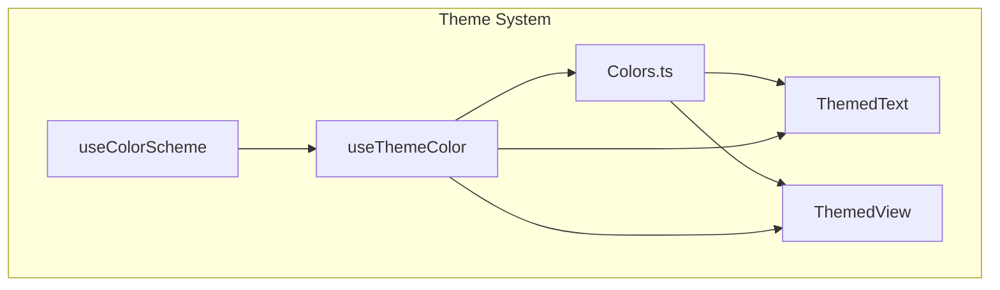
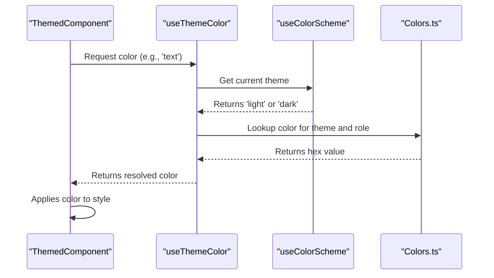
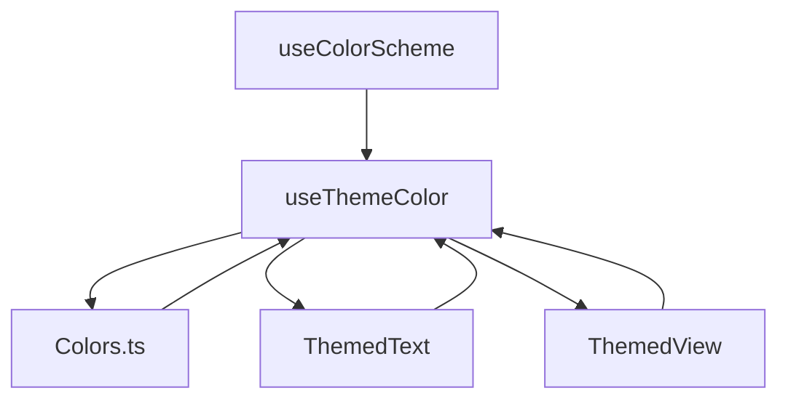

# State and Theme Management

<cite>
**Referenced Files in This Document**   
- [Colors.ts](file://mobile/constants/Colors.ts)
- [useColorScheme.ts](file://mobile/hooks/useColorScheme.ts)
- [useColorScheme.web.ts](file://mobile/hooks/useColorScheme.web.ts)
- [useThemeColor.ts](file://mobile/hooks/useThemeColor.ts)
- [ThemedText.tsx](file://mobile/components/ThemedText.tsx)
- [ThemedView.tsx](file://mobile/components/ThemedView.tsx)
</cite>

## Table of Contents
1. [Introduction](#introduction)
2. [Project Structure](#project-structure)
3. [Core Components](#core-components)
4. [Architecture Overview](#architecture-overview)
5. [Detailed Component Analysis](#detailed-component-analysis)
6. [Dependency Analysis](#dependency-analysis)
7. [Performance Considerations](#performance-considerations)
8. [Troubleshooting Guide](#troubleshooting-guide)
9. [Conclusion](#conclusion)

## Introduction
The xClone mobile application implements a robust and scalable state and theme management system using React Native and Expo. This system enables dynamic adaptation to user preferences for light and dark modes across all components. The architecture leverages custom hooks and centralized color definitions to ensure visual consistency, performance efficiency, and ease of maintenance. This document provides a comprehensive analysis of how the theme system detects system-wide appearance settings, maps semantic roles to actual colors, and propagates theme changes throughout the app.

## Project Structure
The theme management system is organized under dedicated directories within the `mobile` module:
- `constants/Colors.ts`: Centralized color palette for light and dark themes
- `hooks/`: Custom React hooks for theme detection and color resolution
- `components/`: Themed UI components that consume the theme system

This separation of concerns ensures that design tokens are decoupled from presentation logic, enabling consistent theming while supporting future extensibility.



**Diagram sources**
- [useColorScheme.ts](file://mobile/hooks/useColorScheme.ts)
- [useThemeColor.ts](file://mobile/hooks/useThemeColor.ts)
- [Colors.ts](file://mobile/constants/Colors.ts)
- [ThemedText.tsx](file://mobile/components/ThemedText.tsx)
- [ThemedView.tsx](file://mobile/components/ThemedView.tsx)

**Section sources**
- [useColorScheme.ts](file://mobile/hooks/useColorScheme.ts)
- [useThemeColor.ts](file://mobile/hooks/useThemeColor.ts)
- [Colors.ts](file://mobile/constants/Colors.ts)

## Core Components
The theme system consists of three core components:
1. **useColorScheme**: Detects the user's preferred color scheme (light/dark) via platform APIs
2. **useThemeColor**: Maps semantic color roles (e.g., text, background) to actual hex values based on the active theme
3. **Colors.ts**: Central repository defining all color values for both themes

These components work together to provide a type-safe, performant, and maintainable theming solution.

**Section sources**
- [useColorScheme.ts](file://mobile/hooks/useColorScheme.ts)
- [useThemeColor.ts](file://mobile/hooks/useThemeColor.ts)
- [Colors.ts](file://mobile/constants/Colors.ts)

## Architecture Overview
The theme management follows a dependency injection pattern where components receive colors through props or context, rather than hardcoding them. The flow begins with `useColorScheme` detecting the system preference, which is then used by `useThemeColor` to resolve appropriate color values from the `Colors` object.



**Diagram sources**
- [useColorScheme.ts](file://mobile/hooks/useColorScheme.ts)
- [useThemeColor.ts](file://mobile/hooks/useThemeColor.ts)
- [Colors.ts](file://mobile/constants/Colors.ts)

## Detailed Component Analysis

### useColorScheme Hook
The `useColorScheme` implementation differs between native and web platforms to handle server-side rendering correctly.

On native platforms, it directly re-exports React Native's built-in hook:
```typescript
export { useColorScheme } from 'react-native';
```

On web, a custom implementation ensures hydration consistency:
```typescript
export function useColorScheme() {
  const [hasHydrated, setHasHydrated] = useState(false);

  useEffect(() => {
    setHasHydrated(true);
  }, []);

  const colorScheme = useRNColorScheme();

  if (hasHydrated) {
    return colorScheme;
  }

  return 'light';
}
```
During server-side rendering, the hook initially returns `'light'` to avoid flash-of-wrong-theme issues, then synchronizes with the client preference after hydration.

**Section sources**
- [useColorScheme.ts](file://mobile/hooks/useColorScheme.ts#L1-L2)
- [useColorScheme.web.ts](file://mobile/hooks/useColorScheme.web.ts#L1-L21)

### useThemeColor Hook
This hook serves as the primary interface for accessing theme-aware colors. It accepts two parameters:
- `props`: Optional light/dark color overrides
- `colorName`: Semantic role (e.g., 'text', 'background')

```typescript
export function useThemeColor(
  props: { light?: string; dark?: string },
  colorName: keyof typeof Colors.light & keyof typeof Colors.dark
) {
  const theme = useColorScheme() ?? 'light';
  const colorFromProps = props[theme];

  if (colorFromProps) {
    return colorFromProps;
  } else {
    return Colors[theme][colorName];
  }
}
```

The hook first checks for component-specific color overrides in props. If none exist, it falls back to the centralized `Colors` definition. This design enables both global consistency and local customization.

**Section sources**
- [useThemeColor.ts](file://mobile/hooks/useThemeColor.ts#L1-L21)

### Colors.ts - Centralized Color Palette
The `Colors` object defines all design tokens for both themes:

```typescript
export const Colors = {
  light: {
    text: '#11181C',
    background: '#fff',
    tint: tintColorLight,
    icon: '#687076',
    tabIconDefault: '#687076',
    tabIconSelected: tintColorLight,
  },
  dark: {
    text: '#ECEDEE',
    background: '#151718',
    tint: tintColorDark,
    icon: '#9BA1A6',
    tabIconDefault: '#9BA1A6',
    tabIconSelected: tintColorDark,
  },
};
```

This centralization ensures that color changes only need to be made in one location, reducing the risk of visual inconsistencies.

**Section sources**
- [Colors.ts](file://mobile/constants/Colors.ts#L1-L26)

### Themed Components Implementation
The system provides pre-built themed components like `ThemedText` and `ThemedView` that automatically apply appropriate colors.

**ThemedText.tsx**:
```typescript
export function ThemedText({
  style,
  lightColor,
  darkColor,
  type = 'default',
  ...rest
}: ThemedTextProps) {
  const color = useThemeColor({ light: lightColor, dark: darkColor }, 'text');

  return (
    <Text
      style={[
        { color },
        type === 'default' ? styles.default : undefined,
        // ... other type styles
        style,
      ]}
      {...rest}
    />
  );
}
```

**ThemedView.tsx**:
```typescript
export function ThemedView({ style, lightColor, darkColor, ...otherProps }: ThemedViewProps) {
  const backgroundColor = useThemeColor({ light: lightColor, dark: darkColor }, 'background');

  return <View style={[{ backgroundColor }, style]} {...otherProps} />;
}
```

These components demonstrate how the theme system can be consumed in practice, allowing developers to either use default theme colors or provide custom overrides.

**Section sources**
- [ThemedText.tsx](file://mobile/components/ThemedText.tsx#L1-L60)
- [ThemedView.tsx](file://mobile/components/ThemedView.tsx#L1-L14)

## Dependency Analysis
The theme system exhibits a clean dependency hierarchy with minimal coupling:



Key characteristics:
- **Unidirectional flow**: Theme information flows downward from detection to application
- **Loose coupling**: Components depend on abstractions (semantic roles) rather than concrete values
- **No circular dependencies**: Clear dependency chain prevents maintenance issues
- **Extensibility**: New components can easily integrate with the existing system

**Diagram sources**
- [useColorScheme.ts](file://mobile/hooks/useColorScheme.ts)
- [useThemeColor.ts](file://mobile/hooks/useThemeColor.ts)
- [Colors.ts](file://mobile/constants/Colors.ts)
- [ThemedText.tsx](file://mobile/components/ThemedText.tsx)
- [ThemedView.tsx](file://mobile/components/ThemedView.tsx)

**Section sources**
- [useColorScheme.ts](file://mobile/hooks/useColorScheme.ts)
- [useThemeColor.ts](file://mobile/hooks/useThemeColor.ts)
- [Colors.ts](file://mobile/constants/Colors.ts)

## Performance Considerations
The theme system is optimized for performance through several mechanisms:

1. **Memoization**: React's internal memoization of hook results prevents unnecessary recalculations
2. **Minimal re-renders**: Theme changes trigger re-renders only in components that consume the theme
3. **Static color objects**: The `Colors` object is immutable, enabling reliable reference comparisons
4. **Web hydration optimization**: The web implementation avoids visual flickering during SSR hydration

The system avoids context providers for theme state, instead relying on React Native's built-in `useColorScheme`, which is already optimized for performance and platform integration.

## Troubleshooting Guide
Common issues and solutions:

**Issue**: Theme does not update when system preference changes  
**Solution**: Ensure components are using `useThemeColor` and not caching color values

**Issue**: Web version shows dark theme briefly on load  
**Solution**: The system intentionally defaults to light theme during SSR; this prevents flash-of-dark-content. Override only if necessary.

**Issue**: Type error when accessing colorName  
**Solution**: Ensure the colorName parameter exists in both `Colors.light` and `Colors.dark` objects for type safety.

**Issue**: Custom color overrides not applying  
**Solution**: Verify prop names are `lightColor` and `darkColor` (not `light` and `dark`)

**Section sources**
- [useThemeColor.ts](file://mobile/hooks/useThemeColor.ts#L1-L21)
- [useColorScheme.web.ts](file://mobile/hooks/useColorScheme.web.ts#L1-L21)

## Conclusion
The xClone theme management system provides a robust, type-safe, and performant solution for handling light and dark modes. By leveraging React Native's platform APIs and a clean architectural pattern, it ensures visual consistency while remaining easy to extend and maintain. The separation of color definitions from component logic enables efficient updates and reduces bugs. Future enhancements could include support for custom themes, dynamic color generation, or user preference persistence beyond system settings.