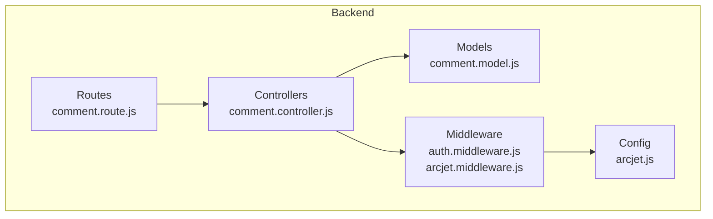
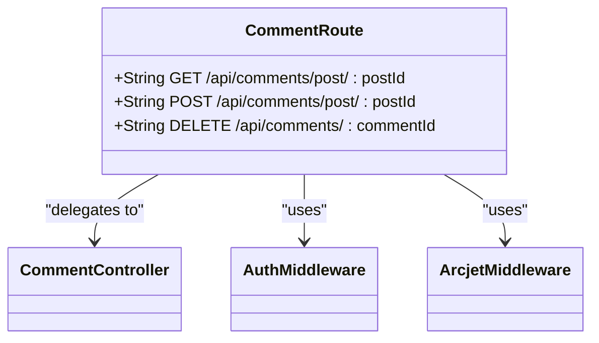
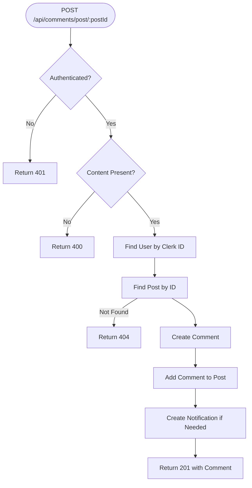
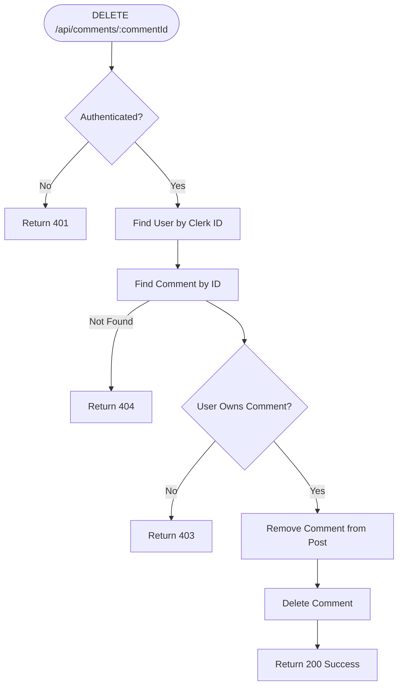
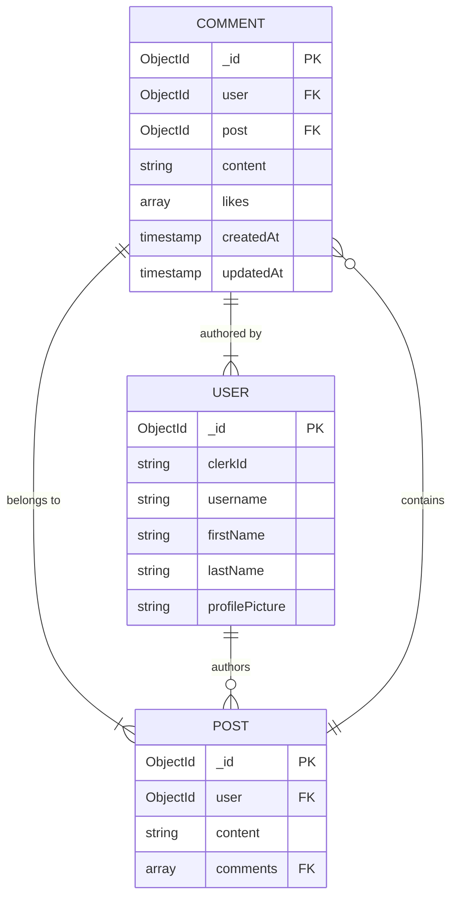
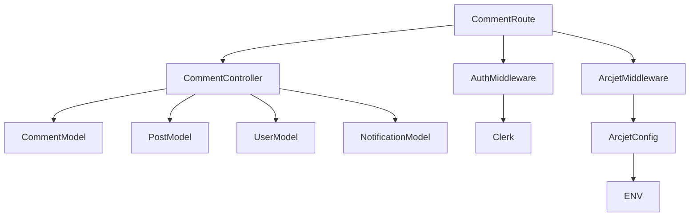

# Comment API Endpoints

<cite>
**Referenced Files in This Document**   
- [comment.route.js](file://backend/src/routes/comment.route.js#L1-L15)
- [comment.controller.js](file://backend/src/controllers/comment.controller.js#L1-L83)
- [comment.model.js](file://backend/src/models/comment.model.js#L1-L32)
- [auth.middleware.js](file://backend/src/middleware/auth.middleware.js#L1-L8)
- [arcjet.middleware.js](file://backend/src/middleware/arcjet.middleware.js#L1-L45)
- [arcjet.js](file://backend/src/config/arcjet.js#L1-L30)
</cite>

## Table of Contents
1. [Introduction](#introduction)
2. [Project Structure](#project-structure)
3. [Core Components](#core-components)
4. [Architecture Overview](#architecture-overview)
5. [Detailed Component Analysis](#detailed-component-analysis)
6. [Dependency Analysis](#dependency-analysis)
7. [Performance Considerations](#performance-considerations)
8. [Troubleshooting Guide](#troubleshooting-guide)
9. [Conclusion](#conclusion)

## Introduction
This document provides comprehensive documentation for the comment functionality in xClone, a social media application. It details the RESTful API endpoints responsible for creating, retrieving, and deleting comments. The system enforces authentication via Clerk JWT and implements rate limiting and bot protection using Arcjet. Access control ensures users can only delete their own comments. This documentation is designed to be accessible to developers and technical stakeholders, offering clear explanations, code examples, and architectural insights.

## Project Structure
The xClone project is organized into two main directories: `backend` and `mobile`. The backend, built with Node.js and Express, contains the API logic, models, middleware, and configuration files. The mobile directory houses a React Native frontend. The comment functionality resides entirely in the backend under the `src` directory, following a modular MVC-like pattern with separate folders for routes, controllers, models, and middleware.



**Diagram sources**
- [comment.route.js](file://backend/src/routes/comment.route.js#L1-L15)
- [comment.controller.js](file://backend/src/controllers/comment.controller.js#L1-L83)
- [comment.model.js](file://backend/src/models/comment.model.js#L1-L32)
- [auth.middleware.js](file://backend/src/middleware/auth.middleware.js#L1-L8)
- [arcjet.middleware.js](file://backend/src/middleware/arcjet.middleware.js#L1-L45)
- [arcjet.js](file://backend/src/config/arcjet.js#L1-L30)

**Section sources**
- [comment.route.js](file://backend/src/routes/comment.route.js#L1-L15)
- [comment.controller.js](file://backend/src/controllers/comment.controller.js#L1-L83)

## Core Components
The core components of the comment system are the route handler, controller logic, data model, and security middleware. The `comment.route.js` file defines the API endpoints and applies middleware. The `comment.controller.js` file contains the business logic for handling requests. The `comment.model.js` file defines the MongoDB schema for comments. Security is enforced by `auth.middleware.js` for authentication and `arcjet.middleware.js` for rate limiting and bot detection.

**Section sources**
- [comment.route.js](file://backend/src/routes/comment.route.js#L1-L15)
- [comment.controller.js](file://backend/src/controllers/comment.controller.js#L1-L83)
- [comment.model.js](file://backend/src/models/comment.model.js#L1-L32)
- [auth.middleware.js](file://backend/src/middleware/auth.middleware.js#L1-L8)
- [arcjet.middleware.js](file://backend/src/middleware/arcjet.middleware.js#L1-L45)

## Architecture Overview
The comment API follows a standard Express.js middleware and controller pattern. Incoming HTTP requests are first processed by Arcjet middleware for security, then by authentication middleware. Validated requests are routed to the appropriate controller function, which interacts with the database via Mongoose models and sends a JSON response.

```mermaid
sequenceDiagram
participant Client as "Client"
participant Arcjet as "Arcjet Middleware"
participant Auth as "Auth Middleware"
participant Router as "Comment Router"
participant Controller as "Comment Controller"
participant DB as "MongoDB"
Client->>Arcjet : HTTP Request
Arcjet->>Arcjet : Rate Limit / Bot Check
alt Request Denied
Arcjet-->>Client : 429/403 Response
stop
end
Arcjet->>Auth : Pass Request
Auth->>Auth : Check Clerk JWT
alt Not Authenticated
Auth-->>Client : 401 Response
stop
end
Auth->>Router : Pass Request
Router->>Controller : Route to Handler
Controller->>DB : Query/Update
DB-->>Controller : Data
Controller-->>Client : JSON Response
```

**Diagram sources**
- [arcjet.middleware.js](file://backend/src/middleware/arcjet.middleware.js#L1-L45)
- [auth.middleware.js](file://backend/src/middleware/auth.middleware.js#L1-L8)
- [comment.route.js](file://backend/src/routes/comment.route.js#L1-L15)
- [comment.controller.js](file://backend/src/controllers/comment.controller.js#L1-L83)

## Detailed Component Analysis

### Comment Route Handler
The `comment.route.js` file defines three endpoints for comment management. It uses Express Router to map HTTP methods and URL patterns to controller functions. Authentication and rate limiting are applied as middleware.



**Diagram sources**
- [comment.route.js](file://backend/src/routes/comment.route.js#L1-L15)
- [comment.controller.js](file://backend/src/controllers/comment.controller.js#L1-L83)
- [auth.middleware.js](file://backend/src/middleware/auth.middleware.js#L1-L8)
- [arcjet.middleware.js](file://backend/src/middleware/arcjet.middleware.js#L1-L45)

**Section sources**
- [comment.route.js](file://backend/src/routes/comment.route.js#L1-L15)

### Comment Controller Logic
The `comment.controller.js` file contains the core business logic. It handles request validation, database operations, and response generation. The controller uses `express-async-handler` for error handling and interacts with Mongoose models for data persistence.

#### Create Comment Flow


**Diagram sources**
- [comment.controller.js](file://backend/src/controllers/comment.controller.js#L1-L83)

#### Delete Comment Flow


**Diagram sources**
- [comment.controller.js](file://backend/src/controllers/comment.controller.js#L1-L83)

**Section sources**
- [comment.controller.js](file://backend/src/controllers/comment.controller.js#L1-L83)

### Comment Data Model
The `comment.model.js` file defines the MongoDB schema for comments. It establishes relationships with the User and Post models through ObjectID references and includes validation rules.



**Diagram sources**
- [comment.model.js](file://backend/src/models/comment.model.js#L1-L32)

**Section sources**
- [comment.model.js](file://backend/src/models/comment.model.js#L1-L32)

## Dependency Analysis
The comment functionality depends on several internal and external modules. Internally, it relies on Mongoose models, Express middleware, and controller utilities. Externally, it integrates with Clerk for authentication and Arcjet for security.



**Diagram sources**
- [comment.route.js](file://backend/src/routes/comment.route.js#L1-L15)
- [comment.controller.js](file://backend/src/controllers/comment.controller.js#L1-L83)
- [auth.middleware.js](file://backend/src/middleware/auth.middleware.js#L1-L8)
- [arcjet.middleware.js](file://backend/src/middleware/arcjet.middleware.js#L1-L45)
- [arcjet.js](file://backend/src/config/arcjet.js#L1-L30)

**Section sources**
- [comment.route.js](file://backend/src/routes/comment.route.js#L1-L15)
- [comment.controller.js](file://backend/src/controllers/comment.controller.js#L1-L83)
- [auth.middleware.js](file://backend/src/middleware/auth.middleware.js#L1-L8)
- [arcjet.middleware.js](file://backend/src/middleware/arcjet.middleware.js#L1-L45)
- [arcjet.js](file://backend/src/config/arcjet.js#L1-L30)

## Performance Considerations
The comment API is designed for efficiency with indexed database queries and minimal round trips. The use of Mongoose `populate` ensures related user data is fetched in a single query. Arcjet's token bucket rate limiting prevents abuse without impacting legitimate users. Database operations are kept atomic where necessary, and error handling ensures the application remains stable under load.

## Troubleshooting Guide
Common issues and their solutions:

- **401 Unauthorized**: Ensure the client includes a valid Clerk JWT in the request. Verify the `Authorization` header is correctly formatted.
- **403 Forbidden**: This may indicate a rate limit (429) or bot detection. Check Arcjet logs. For ownership errors, confirm the user is trying to delete their own comment.
- **404 Not Found**: Verify the `postId` or `commentId` exists in the database. Check for typos in the URL.
- **400 Bad Request**: Ensure the `content` field is present and not empty in the request body.
- **Slow Responses**: Monitor database performance and ensure indexes are in place for `post` and `user` fields in the Comment collection.

**Section sources**
- [auth.middleware.js](file://backend/src/middleware/auth.middleware.js#L1-L8)
- [arcjet.middleware.js](file://backend/src/middleware/arcjet.middleware.js#L1-L45)
- [comment.controller.js](file://backend/src/controllers/comment.controller.js#L1-L83)

## Conclusion
The xClone comment API provides a robust, secure, and efficient system for managing user comments. It leverages modern Node.js practices with Express, Mongoose, and third-party services for authentication and security. The modular structure makes it easy to maintain and extend. By following the documented endpoints and best practices, developers can integrate comment functionality seamlessly into the application.