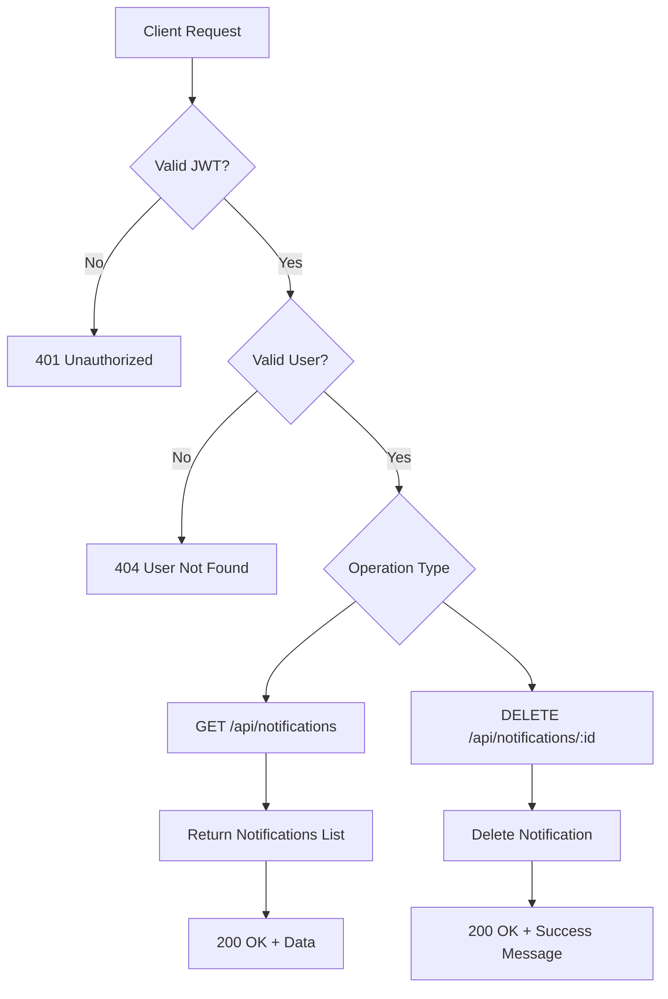
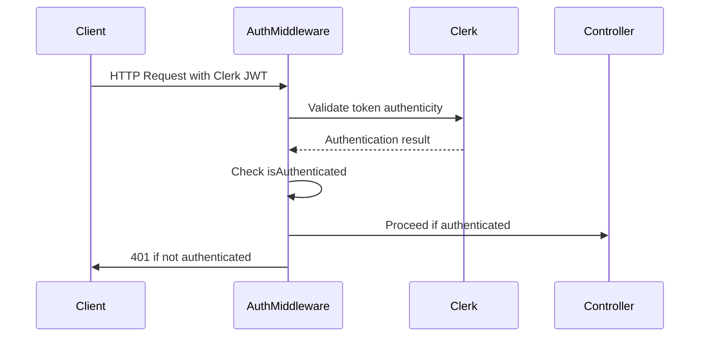
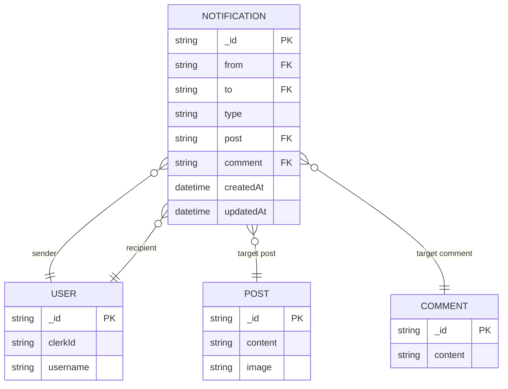
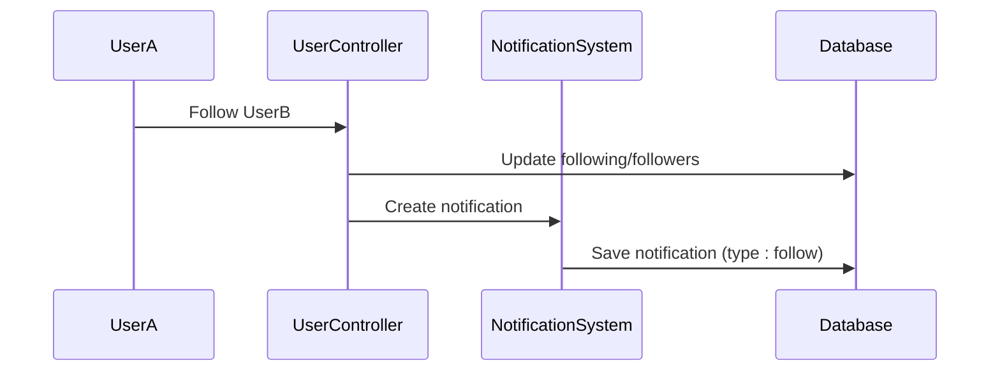
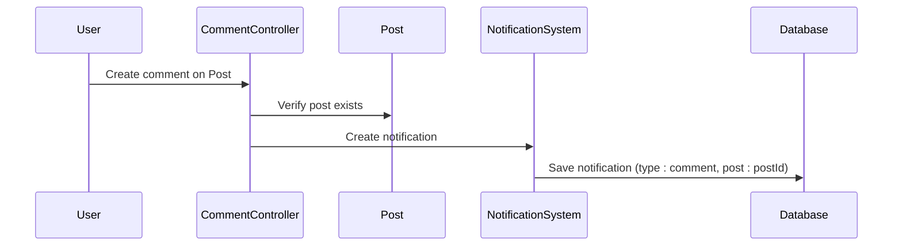

# Notification API Endpoints

<cite>
**Referenced Files in This Document**   
- [notification.route.js](file://backend/src/routes/notification.route.js)
- [notification.controller.js](file://backend/src/controllers/notification.controller.js)
- [notification.model.js](file://backend/src/models/notification.model.js)
- [auth.middleware.js](file://backend/src/middleware/auth.middleware.js)
- [comment.controller.js](file://backend/src/controllers/comment.controller.js)
- [user.controller.js](file://backend/src/controllers/user.controller.js)
</cite>

## Table of Contents
1. [Introduction](#introduction)
2. [API Endpoints Overview](#api-endpoints-overview)
3. [Authentication and Authorization](#authentication-and-authorization)
4. [Notification Data Model](#notification-data-model)
5. [Endpoint Details](#endpoint-details)
6. [Event-Driven Notification Generation](#event-driven-notification-generation)
7. [Usage Examples](#usage-examples)
8. [Error Handling and Status Codes](#error-handling-and-status-codes)
9. [Performance and Rate Limiting](#performance-and-rate-limiting)

## Introduction
This document provides comprehensive documentation for the notification system in xClone, a social media application. The API enables users to retrieve, manage, and delete notifications generated by platform activities such as likes, comments, and follows. This system is built using Express.js with MongoDB via Mongoose, and leverages Clerk for authentication.

The notification endpoints are designed to be secure, efficient, and scalable, supporting pagination, sorting, and user ownership validation. This documentation details all available endpoints, request/response formats, authentication requirements, and real-world usage examples.

## API Endpoints Overview
The notification API consists of four primary endpoints that allow users to interact with their notifications:

- **GET /api/notifications**: Retrieve a paginated list of all notifications
- **GET /api/notifications/unread**: Retrieve only unread notifications (not implemented in current code)
- **PUT /api/notifications/:id/read**: Mark a specific notification as read (not implemented in current code)
- **DELETE /api/notifications/:id**: Delete a specific notification

Based on the current implementation, only the retrieval (`GET /`) and deletion (`DELETE /:notificationId`) endpoints are available. The "mark as read" functionality appears to be missing from the provided controller and route files.



**Diagram sources**
- [notification.route.js](file://backend/src/routes/notification.route.js#L1-L9)
- [notification.controller.js](file://backend/src/controllers/notification.controller.js#L1-L36)

## Authentication and Authorization
All notification endpoints require authentication via Clerk's JWT-based system. The `protectRoute` middleware validates the presence and authenticity of the user's session token.

### Authentication Flow


**Diagram sources**
- [auth.middleware.js](file://backend/src/middleware/auth.middleware.js#L1-L8)

### Middleware Implementation
The authentication middleware checks if the user is authenticated before allowing access to protected routes:

```javascript
export const protectRoute = async (req, res, next) => {
  if (!req.auth().isAuthenticated) {
    return res.status(401).json({
      message: "Unauthorized-you must be logged in",
    });
  }
  next();
};
```

Additionally, each controller function verifies user ownership by checking that the authenticated user's `clerkId` matches a user in the database before proceeding with any operation.

**Section sources**
- [auth.middleware.js](file://backend/src/middleware/auth.middleware.js#L1-L8)
- [notification.controller.js](file://backend/src/controllers/notification.controller.js#L7-L10)

## Notification Data Model
The notification system uses a MongoDB schema to store notification data with references to related entities.

### Schema Definition


**Diagram sources**
- [notification.model.js](file://backend/src/models/notification.model.js#L1-L36)

### Field Specifications
:from: User ID of the sender (ObjectId reference to User collection)  
:to: User ID of the recipient (ObjectId reference to User collection)  
:type: Type of notification (enum: "follow", "like", "comment")  
:post: Optional reference to Post (ObjectId)  
:comment: Optional reference to Comment (ObjectId)  
:createdAt: Timestamp when notification was created (automatically generated)  
:updatedAt: Timestamp when notification was last updated (automatically generated)

The schema enforces that both `from` and `to` fields are required, while `post` and `comment` are optional depending on the notification type.

**Section sources**
- [notification.model.js](file://backend/src/models/notification.model.js#L1-L36)

## Endpoint Details

### GET /api/notifications
Retrieves a paginated list of notifications for the authenticated user.

**HTTP Method**: GET  
**URL Pattern**: `/api/notifications`  
**Authentication**: Required (Clerk JWT)  
**Query Parameters**:
:page: Optional integer (default: 1) - Page number for pagination  
:limit: Optional integer (default: 20) - Number of items per page  

**Response Schema**:
```json
{
  "notifications": [
    {
      "_id": "string",
      "from": {
        "_id": "string",
        "username": "string",
        "firstName": "string",
        "lastName": "string",
        "profilePicture": "string"
      },
      "to": "string",
      "type": "string",
      "post": {
        "content": "string",
        "image": "string"
      },
      "comment": {
        "content": "string"
      },
      "isRead": "boolean",
      "createdAt": "datetime",
      "updatedAt": "datetime"
    }
  ]
}
```

**Implementation**:
```javascript
export const getNotifications = asyncHandler(async (req, res) => {
  const { userId } = getAuth(req);

  const user = await User.findOne({ clerkId: userId });
  if (!user) return res.status(404).json({ error: "User not found" });

  const notifications = await Notification.find({ to: user._id })
    .sort({ createdAt: -1 })
    .populate("from", "username firstName lastName profilePicture")
    .populate("post", "content image")
    .populate("comment", "content");

  res.status(200).json({ notifications });
});
```

**Section sources**
- [notification.controller.js](file://backend/src/controllers/notification.controller.js#L7-L20)

### DELETE /api/notifications/:id
Deletes a specific notification for the authenticated user.

**HTTP Method**: DELETE  
**URL Pattern**: `/api/notifications/:notificationId`  
**Path Parameter**:  
:notificationId: String - Unique identifier of the notification  

**Authentication**: Required (Clerk JWT)  
**Authorization**: User must be the recipient of the notification  

**Response Schema**:
```json
{
  "message": "Notification deleted successfully"
}
```

**Implementation**:
```javascript
export const deleteNotification = asyncHandler(async (req, res) => {
  const { userId } = getAuth(req);
  const { notificationId } = req.params;

  const user = await User.findOne({ clerkId: userId });
  if (!user) return res.status(404).json({ error: "User not found" });

  const notification = await Notification.findOneAndDelete({
    _id: notificationId,
    to: user._id,
  });

  if (!notification) return res.status(404).json({ error: "Notification not found" });

  res.status(200).json({ message: "Notification deleted successfully" });
});
```

**Section sources**
- [notification.controller.js](file://backend/src/controllers/notification.controller.js#L22-L35)

## Event-Driven Notification Generation
Notifications are automatically generated in response to specific user actions within the application. Although not directly implemented in the notification controller, other controllers create notifications when certain events occur.

### Follow Notification
When a user follows another user, a "follow" type notification is created:



**Section sources**
- [user.controller.js](file://backend/src/controllers/user.controller.js#L68-L95)

### Comment Notification
When a user comments on a post, a "comment" type notification is created for the post owner:



**Section sources**
- [comment.controller.js](file://backend/src/controllers/comment.controller.js#L40-L45)

## Usage Examples

### Fetch All Notifications
```bash
curl -X GET "http://localhost:5000/api/notifications?page=1&limit=10" \
  -H "Authorization: Bearer <clerk-jwt-token>"
```

**Sample Response**:
```json
{
  "notifications": [
    {
      "_id": "64a1b2c3d4e5f6a7b8c9d0e1",
      "from": {
        "_id": "64a1b2c3d4e5f6a7b8c9d0e2",
        "username": "johndoe",
        "firstName": "John",
        "lastName": "Doe",
        "profilePicture": "https://example.com/profile.jpg"
      },
      "to": "64a1b2c3d4e5f6a7b8c9d0e3",
      "type": "follow",
      "post": null,
      "comment": null,
      "createdAt": "2023-07-01T10:00:00.000Z",
      "updatedAt": "2023-07-01T10:00:00.000Z"
    },
    {
      "_id": "64a1b2c3d4e5f6a7b8c9d0e4",
      "from": {
        "_id": "64a1b2c3d4e5f6a7b8c9d0e5",
        "username": "janedoe",
        "firstName": "Jane",
        "lastName": "Doe",
        "profilePicture": "https://example.com/jane.jpg"
      },
      "to": "64a1b2c3d4e5f6a7b8c9d0e3",
      "type": "comment",
      "post": {
        "content": "Check out my new project!",
        "image": "https://example.com/post-image.jpg"
      },
      "comment": {
        "content": "Great work!"
      },
      "createdAt": "2023-07-01T09:30:00.000Z",
      "updatedAt": "2023-07-01T09:30:00.000Z"
    }
  ]
}
```

### Delete a Notification
```bash
curl -X DELETE "http://localhost:5000/api/notifications/64a1b2c3d4e5f6a7b8c9d0e1" \
  -H "Authorization: Bearer <clerk-jwt-token>"
```

**Sample Response**:
```json
{
  "message": "Notification deleted successfully"
}
```

## Error Handling and Status Codes
The notification API implements comprehensive error handling with appropriate HTTP status codes.

### Status Codes
:200 OK: Request successful (retrieval or deletion)  
:401 Unauthorized: Missing or invalid authentication token  
:404 Not Found: User not found or notification not found  
:500 Internal Server Error: Unexpected server error  

### Error Response Format
```json
{
  "error": "Descriptive error message"
}
```

### Common Error Scenarios
- **Invalid Authentication**: Returns 401 when no valid Clerk JWT is provided
- **User Not Found**: Returns 404 when the authenticated user doesn't exist in the database
- **Notification Not Found**: Returns 404 when attempting to delete a non-existent notification or when the user doesn't own the notification

**Section sources**
- [notification.controller.js](file://backend/src/controllers/notification.controller.js#L10-L12)
- [notification.controller.js](file://backend/src/controllers/notification.controller.js#L30-L32)

## Performance and Rate Limiting
The notification system is designed with performance considerations to handle frequent polling from client applications.

### Default Pagination
- **Default Limit**: 20 notifications per page
- **Sorting**: Results are sorted by `createdAt` in descending order (newest first)
- **Population**: Related data (user, post, comment) is populated to minimize additional requests

### Rate Limiting Recommendation
Although not explicitly implemented in the provided code, rate limiting should be applied to prevent abuse of the notification endpoints, especially for frequent polling scenarios. A recommended approach would be to limit users to 30 requests per 15-minute window using a service like Arcjet (referenced in the project dependencies).

### Optimization Opportunities
- Implement caching for frequently accessed notification lists
- Add support for filtering by notification type
- Implement true "mark as read" functionality with an `isRead` field in the schema
- Add WebSocket support for real-time notification delivery