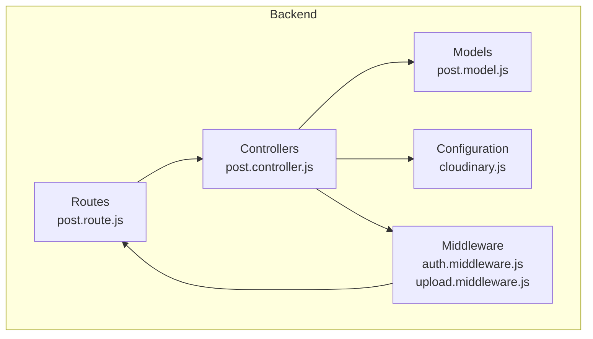
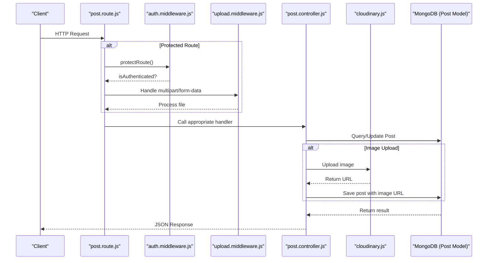
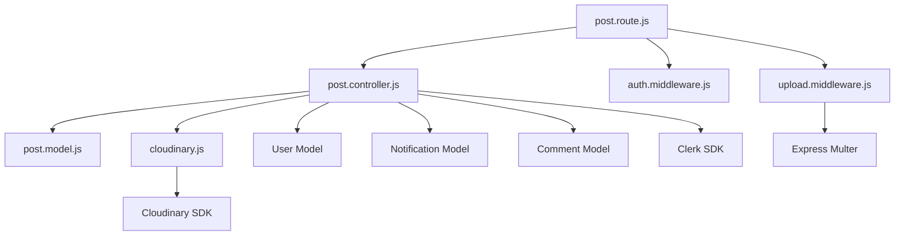

# Post API Endpoints

<cite>
**Referenced Files in This Document**   
- [post.route.js](file://backend/src/routes/post.route.js)
- [post.controller.js](file://backend/src/controllers/post.controller.js)
- [auth.middleware.js](file://backend/src/middleware/auth.middleware.js)
- [upload.middleware.js](file://backend/src/middleware/upload.middleware.js)
- [post.model.js](file://backend/src/models/post.model.js)
- [cloudinary.js](file://backend/src/config/cloudinary.js)
</cite>

## Table of Contents
1. [Introduction](#introduction)
2. [Project Structure](#project-structure)
3. [Core Components](#core-components)
4. [Architecture Overview](#architecture-overview)
5. [Detailed Component Analysis](#detailed-component-analysis)
6. [Dependency Analysis](#dependency-analysis)
7. [Performance Considerations](#performance-considerations)
8. [Troubleshooting Guide](#troubleshooting-guide)
9. [Conclusion](#conclusion)

## Introduction
This document provides comprehensive documentation for the post management RESTful API endpoints in xClone. It covers all core operations including creating, retrieving, updating, deleting, and liking posts. The API leverages Clerk for JWT-based authentication, Cloudinary for image processing, and MongoDB for data persistence. This guide details request/response formats, authentication requirements, file upload constraints, error handling, and usage examples.

## Project Structure
The xClone project follows a modular backend architecture with clear separation of concerns. The backend is built using Node.js with Express, while the mobile frontend uses React Native. The backend organizes code into controllers, models, middleware, routes, and configuration files.



**Diagram sources**
- [post.route.js](file://backend/src/routes/post.route.js#L1-L21)
- [post.controller.js](file://backend/src/controllers/post.controller.js#L1-L158)
- [post.model.js](file://backend/src/models/post.model.js#L1-L36)
- [auth.middleware.js](file://backend/src/middleware/auth.middleware.js#L1-L8)
- [upload.middleware.js](file://backend/src/middleware/upload.middleware.js#L1-L21)
- [cloudinary.js](file://backend/src/config/cloudinary.js#L1-L10)

**Section sources**
- [post.route.js](file://backend/src/routes/post.route.js#L1-L21)
- [post.controller.js](file://backend/src/controllers/post.controller.js#L1-L158)

## Core Components
The post management system consists of several key components that work together to handle CRUD operations and social interactions. The main components include route definitions, controller logic, data models, authentication middleware, file upload handling, and cloud storage integration.

**Section sources**
- [post.controller.js](file://backend/src/controllers/post.controller.js#L1-L158)
- [post.model.js](file://backend/src/models/post.model.js#L1-L36)
- [auth.middleware.js](file://backend/src/middleware/auth.middleware.js#L1-L8)

## Architecture Overview
The post API follows a standard Express.js MVC pattern with additional layers for authentication and file processing. Requests flow from the router through middleware before reaching the controller, which interacts with the database model and external services.



**Diagram sources**
- [post.route.js](file://backend/src/routes/post.route.js#L1-L21)
- [auth.middleware.js](file://backend/src/middleware/auth.middleware.js#L1-L8)
- [upload.middleware.js](file://backend/src/middleware/upload.middleware.js#L1-L21)
- [post.controller.js](file://backend/src/controllers/post.controller.js#L1-L158)
- [cloudinary.js](file://backend/src/config/cloudinary.js#L1-L10)
- [post.model.js](file://backend/src/models/post.model.js#L1-L36)

## Detailed Component Analysis

### POST /api/posts - Create Post
Handles creation of new posts with optional text content and image upload.

**HTTP Method**: POST  
**URL**: `/api/posts`  
**Authentication**: Required via Clerk JWT  
**Headers**: 
- `Authorization: Bearer <token>`
- `Content-Type: multipart/form-data`

**Request Parameters**:
- `content` (string, optional): Text content of the post (max 280 characters)
- `image` (file, optional): Image file (jpg/png, max 5MB)

**File Upload Constraints**:
- Maximum file size: 5MB
- Accepted formats: JPEG, PNG
- Maximum images: 1 per post
- Stored in Cloudinary with transformations (800x600 limit, auto quality, auto format)

**Response Schema**:
```json
{
  "post": {
    "_id": "string",
    "user": {
      "_id": "string",
      "username": "string",
      "firstName": "string",
      "lastName": "string",
      "profilePicture": "string"
    },
    "content": "string",
    "image": "string",
    "likes": [],
    "comments": [],
    "createdAt": "datetime",
    "updatedAt": "datetime",
    "likeCount": 0,
    "commentCount": 0
  }
}
```

**Status Codes**:
- `201 Created`: Post successfully created
- `400 Bad Request`: Missing content and image, or file upload failed
- `401 Unauthorized`: Missing or invalid authentication token
- `404 Not Found`: User not found in database

**Example Request (curl)**:
```bash
curl -X POST https://xclone.com/api/posts \
  -H "Authorization: Bearer <your_token>" \
  -H "Content-Type: multipart/form-data" \
  -F "content=Hello World!" \
  -F "image=@/path/to/image.jpg"
```

**Example Response**:
```json
{
  "post": {
    "_id": "652f8e8b9c9d7b2f44c8a3d2",
    "user": {
      "_id": "652f8e8b9c9d7b2f44c8a3c1",
      "username": "johndoe",
      "firstName": "John",
      "lastName": "Doe",
      "profilePicture": "https://example.com/profile.jpg"
    },
    "content": "Hello World!",
    "image": "https://res.cloudinary.com/social-media-posts/image/upload/v1234567890/photo.jpg",
    "likes": [],
    "comments": [],
    "createdAt": "2023-10-17T12:34:51.123Z",
    "updatedAt": "2023-10-17T12:34:51.123Z"
  }
}
```

**Section sources**
- [post.route.js](file://backend/src/routes/post.route.js#L10-L12)
- [post.controller.js](file://backend/src/controllers/post.controller.js#L45-L85)
- [upload.middleware.js](file://backend/src/middleware/upload.middleware.js#L1-L21)
- [cloudinary.js](file://backend/src/config/cloudinary.js#L1-L10)

### GET /api/posts - Get All Posts
Retrieves all posts in reverse chronological order with populated author and comment data.

**HTTP Method**: GET  
**URL**: `/api/posts`  
**Authentication**: Not required  
**Headers**: None

**Query Parameters**: None  
**Response Schema**:
```json
{
  "posts": [
    {
      "_id": "string",
      "user": {
        "username": "string",
        "firstName": "string",
        "lastName": "string",
        "profilePicture": "string"
      },
      "content": "string",
      "image": "string",
      "likes": [
        "string"
      ],
      "comments": [
        {
          "_id": "string",
          "user": {
            "username": "string",
            "firstName": "string",
            "lastName": "string",
            "profilePicture": "string"
          },
          "text": "string",
          "createdAt": "datetime"
        }
      ],
      "createdAt": "datetime",
      "updatedAt": "datetime"
    }
  ]
}
```

**Status Codes**:
- `200 OK`: Posts successfully retrieved
- `404 Not Found`: No posts exist (empty array returned)

**Example Response**:
```json
{
  "posts": [
    {
      "_id": "652f8e8b9c9d7b2f44c8a3d2",
      "user": {
        "username": "johndoe",
        "firstName": "John",
        "lastName": "Doe",
        "profilePicture": "https://example.com/profile.jpg"
      },
      "content": "Hello World!",
      "image": "https://res.cloudinary.com/social-media-posts/image/upload/v1234567890/photo.jpg",
      "likes": [],
      "comments": [],
      "createdAt": "2023-10-17T12:34:51.123Z",
      "updatedAt": "2023-10-17T12:34:51.123Z"
    }
  ]
}
```

**Section sources**
- [post.route.js](file://backend/src/routes/post.route.js#L6-L7)
- [post.controller.js](file://backend/src/controllers/post.controller.js#L4-L15)

### GET /api/posts/:id - Get Single Post
Retrieves a specific post by ID with full author and comment details.

**HTTP Method**: GET  
**URL**: `/api/posts/:postId`  
**Authentication**: Not required  
**Headers**: None

**Path Parameters**:
- `postId` (string): Unique identifier of the post

**Response Schema**:
```json
{
  "post": {
    "_id": "string",
    "user": {
      "username": "string",
      "firstName": "string",
      "lastName": "string",
      "profilePicture": "string"
    },
    "content": "string",
    "image": "string",
    "likes": ["string"],
    "comments": [
      {
        "_id": "string",
        "user": {
          "username": "string",
          "firstName": "string",
          "lastName": "string",
          "profilePicture": "string"
        },
        "text": "string",
        "createdAt": "datetime"
      }
    ],
    "createdAt": "datetime",
    "updatedAt": "datetime"
  }
}
```

**Status Codes**:
- `200 OK`: Post successfully retrieved
- `404 Not Found`: Post does not exist

**Example Response**:
```json
{
  "post": {
    "_id": "652f8e8b9c9d7b2f44c8a3d2",
    "user": {
      "username": "johndoe",
      "firstName": "John",
      "lastName": "Doe",
      "profilePicture": "https://example.com/profile.jpg"
    },
    "content": "Hello World!",
    "image": "https://res.cloudinary.com/social-media-posts/image/upload/v1234567890/photo.jpg",
    "likes": ["652f8e8b9c9d7b2f44c8a3c2"],
    "comments": [
      {
        "_id": "652f8e8b9c9d7b2f44c8a3e1",
        "user": {
          "username": "janedoe",
          "firstName": "Jane",
          "lastName": "Doe",
          "profilePicture": "https://example.com/jane.jpg"
        },
        "text": "Great post!",
        "createdAt": "2023-10-17T12:35:20.456Z"
      }
    ],
    "createdAt": "2023-10-17T12:34:51.123Z",
    "updatedAt": "2023-10-17T12:34:51.123Z"
  }
}
```

**Section sources**
- [post.route.js](file://backend/src/routes/post.route.js#L8-L9)
- [post.controller.js](file://backend/src/controllers/post.controller.js#L17-L29)

### PUT /api/posts/:id - Update Post
*Note: This endpoint is not implemented in the current codebase.*

The PUT method for updating posts is not currently available in the xClone API. Only creation, retrieval, liking, and deletion operations are supported.

### DELETE /api/posts/:id - Delete Post
Removes a post and all associated comments.

**HTTP Method**: DELETE  
**URL**: `/api/posts/:postId`  
**Authentication**: Required  
**Headers**:
- `Authorization: Bearer <token>`

**Path Parameters**:
- `postId` (string): Unique identifier of the post to delete

**Business Logic**:
1. Verify user authentication
2. Check that the post belongs to the authenticated user
3. Delete all comments associated with the post
4. Remove the post from the database

**Status Codes**:
- `200 OK`: Post successfully deleted
- `401 Unauthorized`: User not authenticated
- `403 Forbidden`: User attempting to delete another user's post
- `404 Not Found`: Post or user not found

**Example Response**:
```json
{
  "message": "Post deleted successfully"
}
```

**Section sources**
- [post.route.js](file://backend/src/routes/post.route.js#L13-L14)
- [post.controller.js](file://backend/src/controllers/post.controller.js#L135-L158)

### POST /api/posts/:id/like - Like/Unlike Post
Toggles like status on a post and creates notifications for others' posts.

**HTTP Method**: POST  
**URL**: `/api/posts/:postId/like`  
**Authentication**: Required  
**Headers**:
- `Authorization: Bearer <token>`

**Path Parameters**:
- `postId` (string): Unique identifier of the post to like/unlike

**Business Logic**:
1. Check if user already likes the post
2. If liked: remove like (unlike)
3. If not liked: add like and create notification (unless liking own post)
4. Update post document in database

**Status Codes**:
- `200 OK`: Like/unlike operation completed
- `401 Unauthorized`: User not authenticated
- `404 Not Found`: Post or user not found

**Example Response (Like)**:
```json
{
  "message": "Post liked successfully"
}
```

**Example Response (Unlike)**:
```json
{
  "message": "Post unliked successfully"
}
```

**Example Request (curl)**:
```bash
curl -X POST https://xclone.com/api/posts/652f8e8b9c9d7b2f44c8a3d2/like \
  -H "Authorization: Bearer <your_token>"
```

**Section sources**
- [post.route.js](file://backend/src/routes/post.route.js#L12-L13)
- [post.controller.js](file://backend/src/controllers/post.controller.js#L90-L133)

## Dependency Analysis
The post API components have well-defined dependencies that follow the dependency inversion principle. Higher-level components depend on abstractions rather than concrete implementations.



**Diagram sources**
- [post.route.js](file://backend/src/routes/post.route.js#L1-L21)
- [post.controller.js](file://backend/src/controllers/post.controller.js#L1-L158)
- [auth.middleware.js](file://backend/src/middleware/auth.middleware.js#L1-L8)
- [upload.middleware.js](file://backend/src/middleware/upload.middleware.js#L1-L21)
- [post.model.js](file://backend/src/models/post.model.js#L1-L36)
- [cloudinary.js](file://backend/src/config/cloudinary.js#L1-L10)

**Section sources**
- [post.route.js](file://backend/src/routes/post.route.js#L1-L21)
- [post.controller.js](file://backend/src/controllers/post.controller.js#L1-L158)

## Performance Considerations
The post API has several performance characteristics to consider:

1. **Database Queries**: All post retrieval operations use `.populate()` to fetch related user and comment data, which may impact performance as data scales. Consider implementing pagination for the GET /api/posts endpoint.

2. **Image Processing**: Cloudinary transformations (resizing, compression) occur synchronously during post creation, adding latency to the POST request. The 5MB file size limit helps mitigate this.

3. **Authentication**: The `protectRoute` middleware checks authentication status on every protected request, adding minimal overhead.

4. **Error Handling**: The API uses express-async-handler for consistent error handling without blocking the event loop.

5. **Caching Opportunities**: Response caching could be implemented for GET endpoints to reduce database load for frequently accessed posts.

## Troubleshooting Guide
Common issues and solutions for the post API:

**Issue**: 400 Bad Request when uploading image  
**Cause**: File exceeds 5MB limit or is not a valid image format  
**Solution**: Compress image or convert to JPG/PNG format

**Issue**: 401 Unauthorized error  
**Cause**: Missing or expired JWT token in Authorization header  
**Solution**: Ensure valid token is included in request headers

**Issue**: 403 Forbidden when deleting post  
**Cause**: User attempting to delete a post they don't own  
**Solution**: Only the original poster can delete their posts

**Issue**: Image upload fails with Cloudinary error  
**Cause**: Invalid Cloudinary credentials or network issues  
**Solution**: Verify CLOUDINARY_* environment variables are correctly configured

**Issue**: Post created but image URL is empty  
**Cause**: No image file provided in multipart/form-data  
**Solution**: Include image field in form data or ensure content is provided

**Section sources**
- [post.controller.js](file://backend/src/controllers/post.controller.js#L45-L85)
- [upload.middleware.js](file://backend/src/middleware/upload.middleware.js#L1-L21)
- [auth.middleware.js](file://backend/src/middleware/auth.middleware.js#L1-L8)

## Conclusion
The xClone post API provides a robust set of endpoints for managing social media posts with support for text content, image uploads, likes, and comments. The architecture follows best practices with proper separation of concerns, authentication protection, and external service integration. Key strengths include seamless Cloudinary image processing and Clerk-based authentication. Future improvements could include pagination, rate limiting, and caching mechanisms to enhance performance at scale.