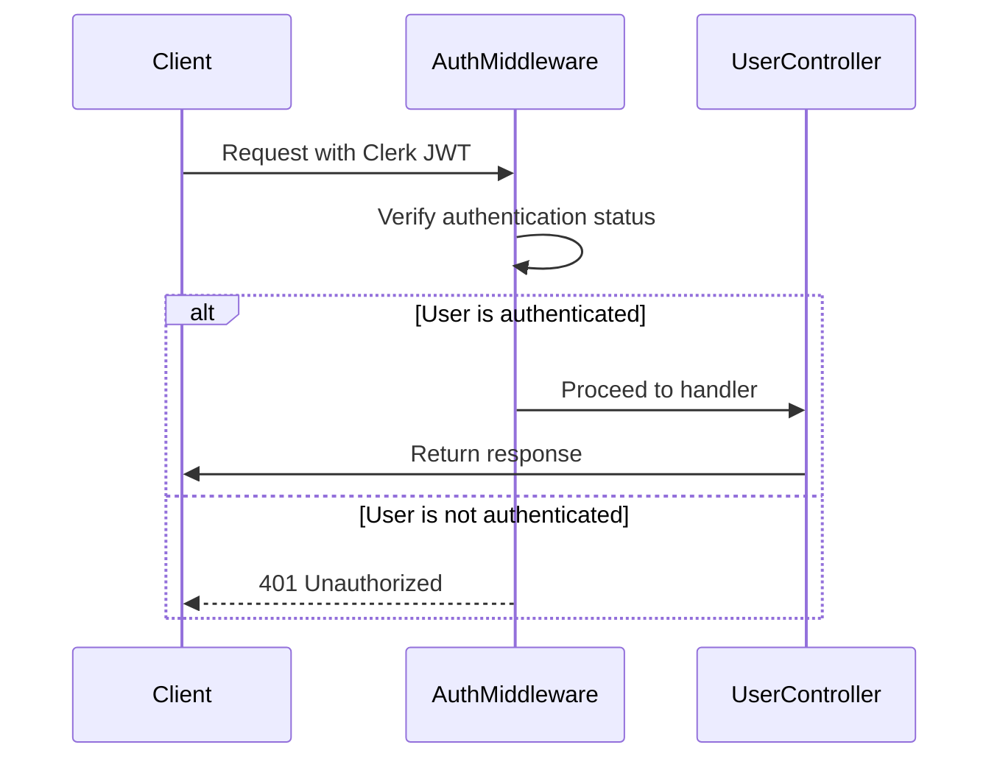
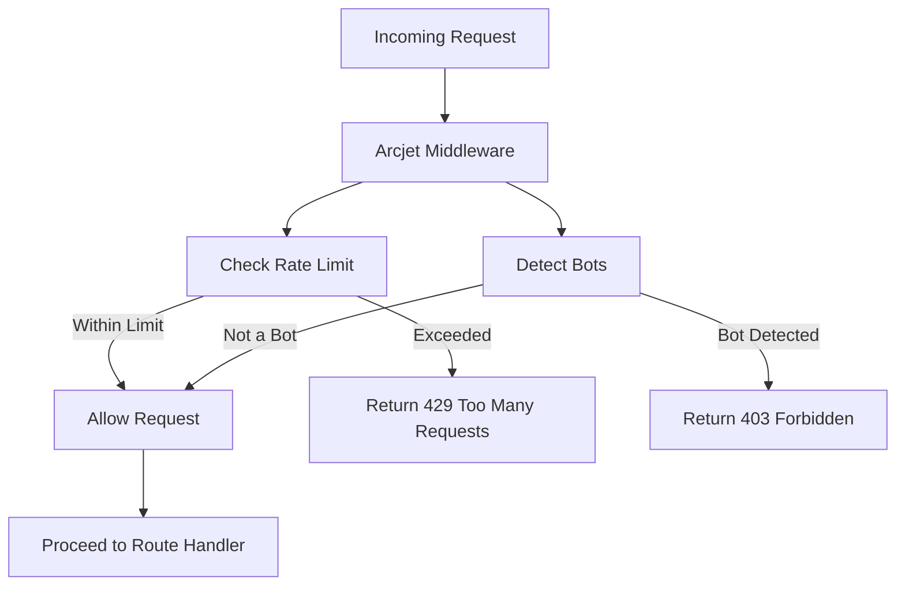
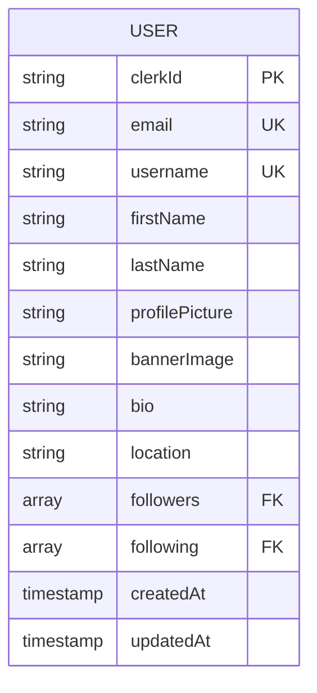
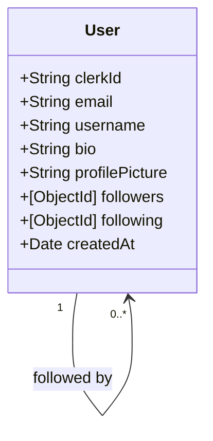

# User API Endpoints

<cite>
**Referenced Files in This Document**   
- [user.route.js](file://backend/src/routes/user.route.js#L1-L18)
- [user.controller.js](file://backend/src/controllers/user.controller.js#L1-L96)
- [user.model.js](file://backend/src/models/user.model.js#L1-L63)
- [auth.middleware.js](file://backend/src/middleware/auth.middleware.js#L1-L8)
- [arcjet.middleware.js](file://backend/src/middleware/arcjet.middleware.js#L1-L45)
- [arcjet.js](file://backend/src/config/arcjet.js#L1-L30)
</cite>

## Table of Contents
1. [User API Endpoints](#user-api-endpoints)
2. [Authentication and Security](#authentication-and-security)
3. [Rate Limiting with Arcjet](#rate-limiting-with-arcjet)
4. [User Model Structure](#user-model-structure)
5. [Endpoint Details](#endpoint-details)
6. [Request and Response Examples](#request-and-response-examples)
7. [Data Validation Rules](#data-validation-rules)
8. [User Relationships (Followers/Following)](#user-relationships-followersfollowing)

## Authentication and Security

The xClone backend enforces authentication on protected user endpoints using Clerk for JWT-based identity verification. The `protectRoute` middleware ensures only authenticated users can access secured routes.



**Diagram sources**
- [auth.middleware.js](file://backend/src/middleware/auth.middleware.js#L1-L8)

**Section sources**
- [auth.middleware.js](file://backend/src/middleware/auth.middleware.js#L1-L8)

## Rate Limiting with Arcjet

Arcjet is used to enforce rate limiting, bot protection, and security policies on user-related operations. The configuration applies a token bucket algorithm with a refill rate of 10 tokens per 10 seconds and a maximum capacity of 15 tokens.



**Diagram sources**
- [arcjet.middleware.js](file://backend/src/middleware/arcjet.middleware.js#L1-L45)
- [arcjet.js](file://backend/src/config/arcjet.js#L1-L30)

**Section sources**
- [arcjet.middleware.js](file://backend/src/middleware/arcjet.middleware.js#L1-L45)
- [arcjet.js](file://backend/src/config/arcjet.js#L1-L30)

## User Model Structure

The `User` model defines the structure of user data stored in MongoDB. It includes profile information, social relationships, and metadata.



**Diagram sources**
- [user.model.js](file://backend/src/models/user.model.js#L1-L63)

**Section sources**
- [user.model.js](file://backend/src/models/user.model.js#L1-L63)

## Endpoint Details

### GET /api/users/profile/:username
Retrieves a user's public profile by username.

- **Method**: GET
- **Authentication**: Not required (public route)
- **Path Parameters**:
  - `username`: The username of the target user
- **Response Schema**:
  ```json
  {
    "user": {
      "username": "string",
      "firstName": "string",
      "lastName": "string",
      "profilePicture": "string",
      "bio": "string",
      "location": "string",
      "followers": ["User IDs"],
      "following": ["User IDs"],
      "createdAt": "datetime"
    }
  }
  ```

**Section sources**
- [user.route.js](file://backend/src/routes/user.route.js#L7-L8)
- [user.controller.js](file://backend/src/controllers/user.controller.js#L3-L10)

### PUT /api/users/profile
Updates the authenticated user's profile.

- **Method**: PUT
- **Authentication**: Required (`protectRoute`)
- **Headers**:
  - `Authorization`: Bearer token (Clerk JWT)
  - `Content-Type`: application/json
- **Request Body**:
  - Any updatable user fields (e.g., `bio`, `location`, `profilePicture`)
- **Rate Limited**: Yes (via Arcjet)
- **Response Schema**:
  ```json
  {
    "user": { /* updated user object */ }
  }
  ```

**Section sources**
- [user.route.js](file://backend/src/routes/user.route.js#L13-L14)
- [user.controller.js](file://backend/src/controllers/user.controller.js#L12-L20)

### POST /api/users/follow/:targetUserId
Toggles follow/unfollow status for a target user.

- **Method**: POST
- **Authentication**: Required (`protectRoute`)
- **Path Parameters**:
  - `targetUserId`: MongoDB ID of the user to follow/unfollow
- **Rate Limited**: Yes (via Arcjet)
- **Response Schema**:
  ```json
  {
    "message": "User followed successfully | User unfollowed successfully"
  }
  ```

**Section sources**
- [user.route.js](file://backend/src/routes/user.route.js#L15-L16)
- [user.controller.js](file://backend/src/controllers/user.controller.js#L50-L96)

### POST /api/users/me
Retrieves the current authenticated user's full profile.

- **Method**: POST
- **Authentication**: Required (`protectRoute`)
- **Response Schema**:
  ```json
  {
    "user": { /* full user object */ }
  }
  ```

**Section sources**
- [user.route.js](file://backend/src/routes/user.route.js#L12-L13)
- [user.controller.js](file://backend/src/controllers/user.controller.js#L40-L47)

### POST /api/users/sync
Syncs user data from Clerk to MongoDB (creates user if not exists).

- **Method**: POST
- **Authentication**: Required (`protectRoute`)
- **Response Schema**:
  ```json
  {
    "user": { /* created or existing user object */ },
    "message": "User created successfully | User already exists"
  }
  ```

**Section sources**
- [user.route.js](file://backend/src/routes/user.route.js#L11-L12)
- [user.controller.js](file://backend/src/controllers/user.controller.js#L22-L38)

## Request and Response Examples

### Sample cURL Commands

**Update User Profile**
```bash
curl -X PUT https://xclone.com/api/users/profile \
  -H "Authorization: Bearer <clerk-jwt>" \
  -H "Content-Type: application/json" \
  -d '{
    "bio": "Full-stack developer passionate about web3",
    "location": "San Francisco, CA"
  }'
```

**Fetch Public Profile**
```bash
curl https://xclone.com/api/users/profile/johndoe
```

**Follow a User**
```bash
curl -X POST https://xclone.com/api/users/follow/60d5ecf9c45d7b1a2c8b4567 \
  -H "Authorization: Bearer <clerk-jwt>"
```

### Example Responses

**200 OK - Successful Profile Fetch**
```json
{
  "user": {
    "username": "johndoe",
    "firstName": "John",
    "lastName": "Doe",
    "profilePicture": "https://example.com/avatar.jpg",
    "bio": "Software engineer",
    "location": "New York, NY",
    "followers": ["60d5ecf9c45d7b1a2c8b4568"],
    "following": ["60d5ecf9c45d7b1a2c8b4569"],
    "createdAt": "2023-01-15T10:00:00.000Z"
  }
}
```

**404 Not Found - User Not Found**
```json
{
  "message": "User not found"
}
```

**401 Unauthorized - Missing Authentication**
```json
{
  "message": "Unauthorized-you must be logged in"
}
```

**429 Too Many Requests - Rate Limited**
```json
{
  "error": "Too Many Requests",
  "message": "Rate limit exceeded. Please try again later."
}
```

## Data Validation Rules

The following validation rules are enforced at the application level:

- **Username**: Must be 3–30 characters long
- **Bio**: Maximum 160 characters
- **Image URLs**: Must be valid HTTP/HTTPS URLs (validated via Cloudinary integration)
- **Email**: Automatically derived from Clerk and must be unique

Note: While model-level constraints exist (e.g., `maxLength: 160` for bio), additional validation should be implemented in the frontend and middleware layers.

**Section sources**
- [user.model.js](file://backend/src/models/user.model.js#L1-L63)

## User Relationships (Followers/Following)

User relationships are represented as arrays of MongoDB ObjectIds in the user document:

- **followers**: List of user IDs who follow this user
- **following**: List of user IDs that this user follows

When a user follows another:
1. The follower's ID is added to the target user's `followers` array
2. The target user's ID is added to the follower's `following` array
3. A notification of type `follow` is created for the target user

Unfollowing reverses this process by removing the respective IDs from both arrays.



**Diagram sources**
- [user.model.js](file://backend/src/models/user.model.js#L1-L63)
- [user.controller.js](file://backend/src/controllers/user.controller.js#L50-L96)

**Section sources**
- [user.model.js](file://backend/src/models/user.model.js#L1-L63)
- [user.controller.js](file://backend/src/controllers/user.controller.js#L50-L96)