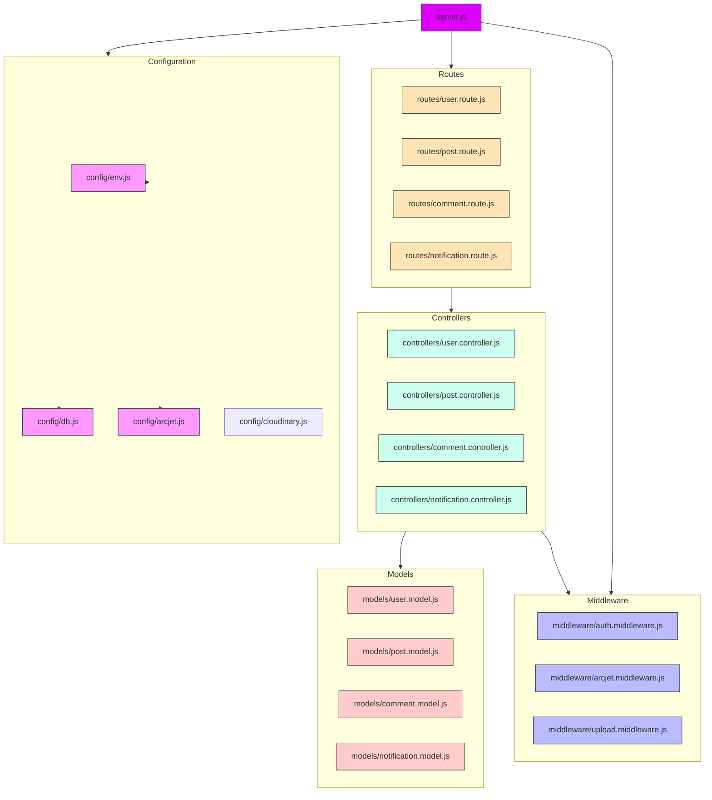
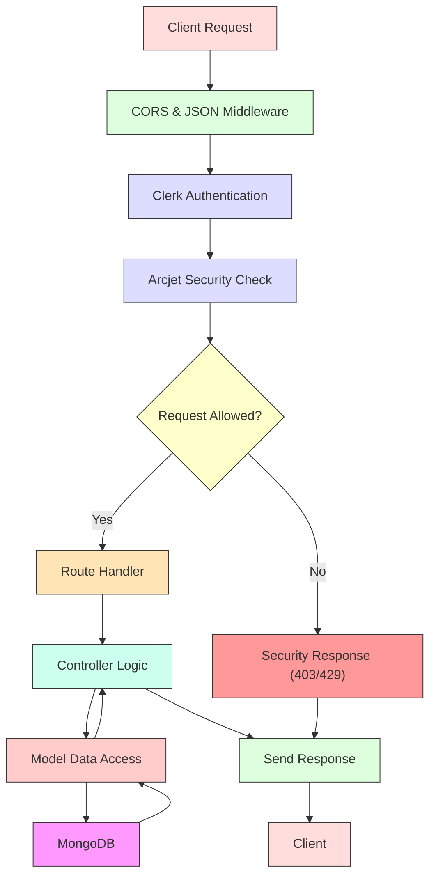
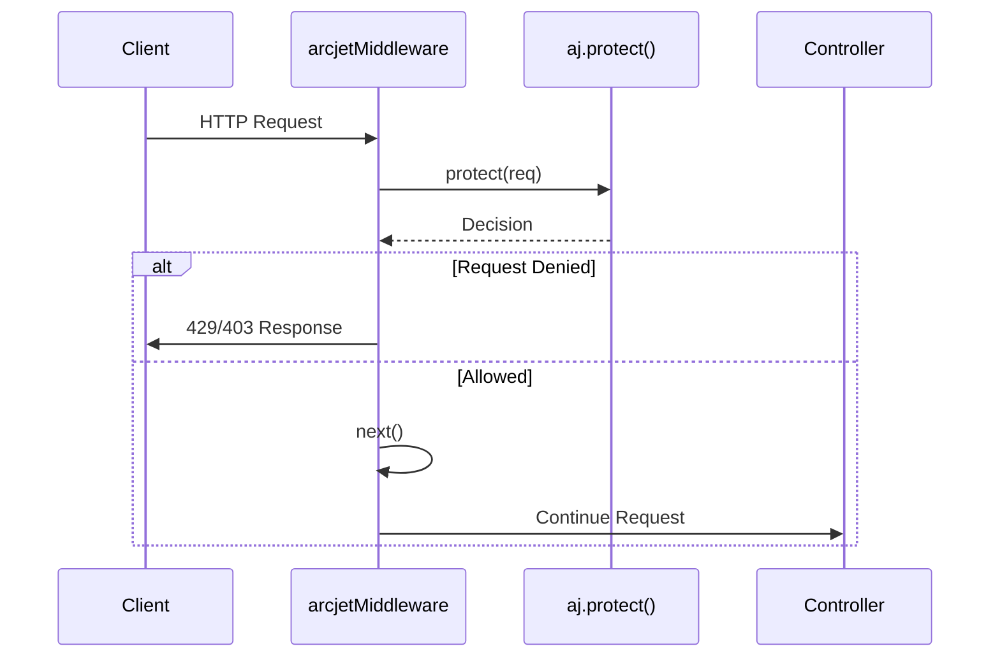
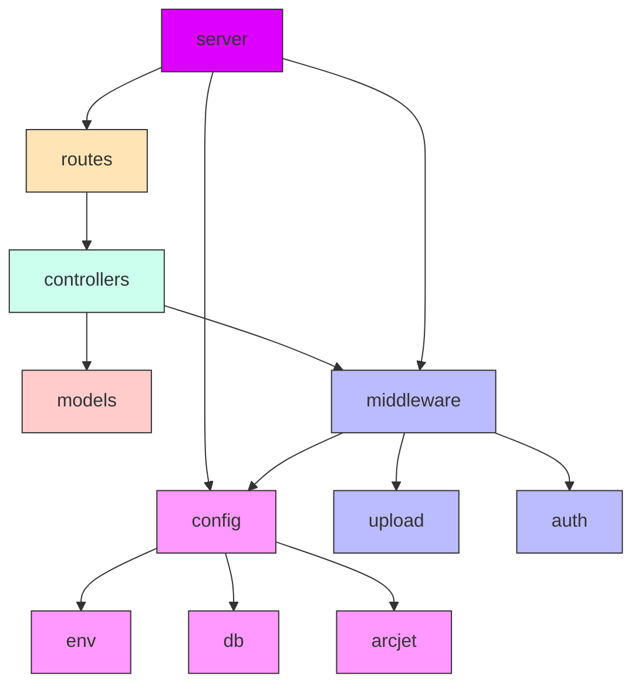

# Backend Architecture

<cite>
**Referenced Files in This Document**   
- [server.js](file://backend/src/server.js#L1-L48)
- [db.js](file://backend/src/config/db.js#L1-L12)
- [env.js](file://backend/src/config/env.js#L1-L16)
- [arcjet.js](file://backend/src/config/arcjet.js#L1-L31)
- [arcjet.middleware.js](file://backend/src/middleware/arcjet.middleware.js#L1-L46)
- [post.route.js](file://backend/src/routes/post.route.js#L1-L22)
- [post.controller.js](file://backend/src/controllers/post.controller.js)
- [auth.middleware.js](file://backend/src/middleware/auth.middleware.js)
- [upload.middleware.js](file://backend/src/middleware/upload.middleware.js)
</cite>

## Table of Contents
1. [Introduction](#introduction)
2. [Project Structure](#project-structure)
3. [Core Components](#core-components)
4. [Architecture Overview](#architecture-overview)
5. [Detailed Component Analysis](#detailed-component-analysis)
6. [Dependency Analysis](#dependency-analysis)
7. [Performance Considerations](#performance-considerations)
8. [Troubleshooting Guide](#troubleshooting-guide)
9. [Conclusion](#conclusion)

## Introduction
This document provides a comprehensive architectural overview of the Express.js backend for xClone, a social media application. The backend follows the Model-View-Controller (MVC) design pattern, separating concerns across models, controllers, and routes. It uses Mongoose as an Object-Relational Mapping (ORM) tool for MongoDB, implements security via Clerk and Arcjet, and manages configuration through environment variables. This documentation details the server initialization, middleware setup, routing mechanism, database connection strategy, and request lifecycle.

## Project Structure
The backend is organized into a modular structure that separates configuration, business logic, data models, and routing. This promotes maintainability, testability, and scalability.



**Diagram sources**
- [server.js](file://backend/src/server.js#L1-L48)
- [config](file://backend/src/config)
- [middleware](file://backend/src/middleware)
- [models](file://backend/src/models)
- [controllers](file://backend/src/controllers)
- [routes](file://backend/src/routes)

**Section sources**
- [server.js](file://backend/src/server.js#L1-L48)

## Core Components
The backend consists of several core components that work together to handle HTTP requests, process business logic, interact with the database, and enforce security policies. These include:
- **server.js**: Entry point that initializes Express, middleware, and routes.
- **config/db.js**: Handles MongoDB connection via Mongoose.
- **config/env.js**: Centralized environment variable management.
- **config/arcjet.js**: Security configuration for rate limiting, bot detection, and attack protection.
- **middleware/arcjet.middleware.js**: Express middleware wrapper for Arcjet security rules.
- **routes/post.route.js**: Example route file defining public and protected endpoints.
- **controllers/post.controller.js**: Contains business logic for post-related operations.

**Section sources**
- [server.js](file://backend/src/server.js#L1-L48)
- [db.js](file://backend/src/config/db.js#L1-L12)
- [env.js](file://backend/src/config/env.js#L1-L16)
- [arcjet.js](file://backend/src/config/arcjet.js#L1-L31)
- [arcjet.middleware.js](file://backend/src/middleware/arcjet.middleware.js#L1-L46)
- [post.route.js](file://backend/src/routes/post.route.js#L1-L22)

## Architecture Overview
The backend follows a layered MVC architecture where:
- **Models** define the data schema and interact with MongoDB via Mongoose.
- **Controllers** contain the business logic and handle request processing.
- **Routes** define API endpoints and delegate requests to controllers.
- **Middleware** handles cross-cutting concerns like authentication, file uploads, and security.

The server initializes with essential middleware (CORS, JSON parsing, Clerk authentication, Arcjet protection), connects to MongoDB, and starts listening on a specified port.



**Diagram sources**
- [server.js](file://backend/src/server.js#L1-L48)
- [arcjet.middleware.js](file://backend/src/middleware/arcjet.middleware.js#L1-L46)
- [post.route.js](file://backend/src/routes/post.route.js#L1-L22)
- [post.controller.js](file://backend/src/controllers/post.controller.js)
- [db.js](file://backend/src/config/db.js#L1-L12)

## Detailed Component Analysis

### Server Initialization and Middleware Setup
The `server.js` file is the entry point of the application. It initializes Express, configures middleware, sets up routes, and starts the server after connecting to the database.

#### Key Responsibilities:
- **CORS**: Enables cross-origin requests.
- **JSON Parsing**: Parses incoming JSON payloads.
- **Clerk Authentication**: Integrates with Clerk for user authentication.
- **Arcjet Protection**: Applies security rules for rate limiting and bot detection.
- **Error Handling**: Global error handler for uncaught exceptions.
- **Route Mounting**: Registers API routes under versioned paths.

```javascript
app.use(cors());
app.use(express.json());
app.use(clerkMiddleware());
app.use(arcjetMiddleware);
```

These middleware functions are executed in sequence for each incoming request.

**Section sources**
- [server.js](file://backend/src/server.js#L1-L48)

### Database Connection Strategy
The `db.js` file exports a `connectDB` function that establishes a connection to MongoDB using Mongoose.

#### Implementation Details:
- Uses the `MONGO_URI` environment variable for connection string.
- Logs success or failure messages.
- Exits the process on connection failure to prevent running with an unconnected database.

```javascript
await mongoose.connect(ENV.MONGO_URI);
```

This ensures the application only proceeds when the database is available.

**Section sources**
- [db.js](file://backend/src/config/db.js#L1-L12)

### Security Configuration with Arcjet
Arcjet is configured in `arcjet.js` and applied via middleware in `arcjet.middleware.js`.

#### Security Rules:
- **Shield**: Protects against common attacks (SQL injection, XSS, CSRF).
- **Bot Detection**: Blocks malicious bots while allowing search engines.
- **Rate Limiting**: Token bucket algorithm (10 tokens/10s, max 15).

The middleware intercepts requests and responds with appropriate status codes if the request is denied.



**Diagram sources**
- [arcjet.js](file://backend/src/config/arcjet.js#L1-L31)
- [arcjet.middleware.js](file://backend/src/middleware/arcjet.middleware.js#L1-L46)

**Section sources**
- [arcjet.js](file://backend/src/config/arcjet.js#L1-L31)
- [arcjet.middleware.js](file://backend/src/middleware/arcjet.middleware.js#L1-L46)

### Routing Mechanism and Request Delegation
Routes are defined in separate files (e.g., `post.route.js`) and mounted under API prefixes in `server.js`.

#### Example: Post Routes
```javascript
router.get("/", getPosts); // Public
router.post("/", protectRoute, upload.single("image"), createPosts); // Protected
```

- **Public routes** are accessible to all users.
- **Protected routes** use `protectRoute` middleware for authentication.
- **File uploads** use `upload.middleware.js` for handling image uploads via Cloudinary.

Requests are delegated from routes → controllers → models → database.

**Section sources**
- [post.route.js](file://backend/src/routes/post.route.js#L1-L22)
- [server.js](file://backend/src/server.js#L1-L48)

### MVC Separation of Concerns
The architecture enforces clear separation:
- **Models**: Define schema and database interactions.
- **Controllers**: Handle business logic and request/response.
- **Routes**: Map HTTP verbs and paths to controller methods.

This improves code maintainability and testability.

```mermaid
classDiagram
class PostModel {
+String title
+String content
+ObjectId author
+Array likes
+save() Promise
+find() Query
}
class PostController {
+getPosts(req, res) void
+createPosts(req, res) void
+likePost(req, res) void
}
class PostRoute {
+GET /api/posts → getPosts
+POST /api/posts → createPosts
+POST /api/posts/ : id/like → likePost
}
PostRoute --> PostController : "delegates"
PostController --> PostModel : "uses"
PostModel --> "MongoDB" : "persists"
```

**Diagram sources**
- [models/post.model.js](file://backend/src/models/post.model.js)
- [controllers/post.controller.js](file://backend/src/controllers/post.controller.js)
- [routes/post.route.js](file://backend/src/routes/post.route.js#L1-L22)

## Dependency Analysis
The backend has a well-defined dependency hierarchy:



**Diagram sources**
- [server.js](file://backend/src/server.js#L1-L48)
- [routes](file://backend/src/routes)
- [controllers](file://backend/src/controllers)
- [models](file://backend/src/models)
- [middleware](file://backend/src/middleware)
- [config](file://backend/src/config)

**Section sources**
- [server.js](file://backend/src/server.js#L1-L48)

## Performance Considerations
- **Rate Limiting**: Prevents abuse with token bucket algorithm (10 req/10s).
- **Bot Protection**: Reduces server load from malicious bots.
- **Database Connection**: Persistent connection avoids repeated handshakes.
- **Error Resilience**: Arcjet failures do not block requests (`next()` called on error).
- **Asynchronous Operations**: Non-blocking I/O with async/await throughout.

## Troubleshooting Guide
### Common Issues:
- **Database Connection Failure**: Verify `MONGO_URI` in environment.
- **429 Too Many Requests**: Client exceeded rate limit (10 requests per 10 seconds).
- **403 Forbidden**: Request blocked by bot detection or security policy.
- **CORS Errors**: Ensure frontend origin is allowed.
- **File Upload Failures**: Check Cloudinary configuration and file size.

### Logging:
- Connection status logged in `db.js`.
- Arcjet errors logged in middleware.
- Unhandled errors caught by global error handler.

**Section sources**
- [db.js](file://backend/src/config/db.js#L1-L12)
- [arcjet.middleware.js](file://backend/src/middleware/arcjet.middleware.js#L1-L46)
- [server.js](file://backend/src/server.js#L1-L48)

## Conclusion
The xClone backend implements a robust, secure, and scalable Express.js architecture using MVC patterns. It effectively separates concerns, leverages modern security tools (Clerk, Arcjet), and maintains clean code organization. The modular structure allows for easy extension and maintenance. Key strengths include comprehensive security, clear separation of concerns, and resilient error handling.