# Business Logic Layer

<cite>
**Referenced Files in This Document**   
- [post.controller.js](file://backend/src/controllers/post.controller.js)
- [user.controller.js](file://backend/src/controllers/user.controller.js)
- [comment.controller.js](file://backend/src/controllers/comment.controller.js)
- [notification.controller.js](file://backend/src/controllers/notification.controller.js)
- [post.route.js](file://backend/src/routes/post.route.js)
- [user.route.js](file://backend/src/routes/user.route.js)
- [comment.route.js](file://backend/src/routes/comment.route.js)
- [auth.middleware.js](file://backend/src/middleware/auth.middleware.js)
- [upload.middleware.js](file://backend/src/middleware/upload.middleware.js)
- [post.model.js](file://backend/src/models/post.model.js)
- [user.model.js](file://backend/src/models/user.model.js)
- [comment.model.js](file://backend/src/models/comment.model.js)
- [notification.model.js](file://backend/src/models/notification.model.js)
</cite>

## Table of Contents
1. [Introduction](#introduction)
2. [Project Structure](#project-structure)
3. [Core Components](#core-components)
4. [Architecture Overview](#architecture-overview)
5. [Detailed Component Analysis](#detailed-component-analysis)
6. [Dependency Analysis](#dependency-analysis)
7. [Performance Considerations](#performance-considerations)
8. [Troubleshooting Guide](#troubleshooting-guide)
9. [Conclusion](#conclusion)

## Introduction
This document provides a comprehensive analysis of the business logic layer in the Express.js backend of the xClone application. The focus is on the implementation of core social media functionalities such as user profile management, post creation with image handling, comment submission, and notification generation. The analysis covers the flow from HTTP routes through controller methods to interactions with MongoDB models and external services like Cloudinary and Clerk. Special attention is given to domain logic including like counting, follower updates, transactional operations, and error handling using `express-async-handler`. The document is designed to be accessible to beginners while offering technical depth for advanced developers.

## Project Structure
The backend of the xClone application follows a clean, modular structure based on the MVC (Model-View-Controller) pattern, with clear separation of concerns across directories:

- **controllers**: Contains business logic for handling HTTP requests.
- **models**: Defines MongoDB schemas and relationships.
- **routes**: Maps HTTP verbs and endpoints to controller functions.
- **middleware**: Provides reusable request processing logic (authentication, file upload).
- **config**: Houses external service configurations (Cloudinary, Clerk, database).

The primary entry point is `server.js`, which sets up Express and mounts the route handlers. The frontend is implemented in React Native under the `mobile` directory, but this document focuses exclusively on the backend business logic.


**Diagram sources**
- [post.route.js](file://backend/src/routes/post.route.js#L1-L22)
- [post.controller.js](file://backend/src/controllers/post.controller.js#L1-L159)
- [post.model.js](file://backend/src/models/post.model.js)

## Core Components
The business logic layer is implemented through a set of Express controllers that handle specific domain entities: posts, users, comments, and notifications. Each controller exports async functions wrapped with `express-async-handler` to simplify error handling. These functions interact with Mongoose models to perform CRUD operations and emit notifications when relevant.

Key patterns observed:
- Use of Clerk for authentication via `getAuth(req)`
- Integration with Cloudinary for image uploads
- Population of MongoDB references for rich responses
- Atomic updates using `$push` and `$pull` for array fields
- Protection of routes using `protectRoute` middleware

The controllers are stateless and follow REST conventions, with clear separation between public and authenticated endpoints.

**Section sources**
- [post.controller.js](file://backend/src/controllers/post.controller.js#L1-L159)
- [user.controller.js](file://backend/src/controllers/user.controller.js#L1-L97)
- [comment.controller.js](file://backend/src/controllers/comment.controller.js#L1-L84)

## Architecture Overview
The system architecture follows a layered approach where HTTP requests flow through middleware before reaching controller logic, which then interacts with data models and external services.


**Diagram sources**
- [post.route.js](file://backend/src/routes/post.route.js#L1-L22)
- [auth.middleware.js](file://backend/src/middleware/auth.middleware.js)
- [upload.middleware.js](file://backend/src/middleware/upload.middleware.js)
- [post.controller.js](file://backend/src/controllers/post.controller.js#L1-L159)

## Detailed Component Analysis

### Post Management System

#### Post Creation and Image Handling
The `createPosts` controller method handles both text and image-based posts. When an image is uploaded, it's converted to base64 and sent to Cloudinary with automatic optimization.


**Diagram sources**
- [post.controller.js](file://backend/src/controllers/post.controller.js#L50-L100)
- [upload.middleware.js](file://backend/src/middleware/upload.middleware.js)

**Section sources**
- [post.controller.js](file://backend/src/controllers/post.controller.js#L50-L100)
- [post.model.js](file://backend/src/models/post.model.js)

#### Like/Unlike Mechanism and Race Condition Handling
The `likePost` function implements idempotent liking behavior by checking if the user already liked the post before modifying the likes array. This prevents duplicate entries and handles the like/unlike toggle.

```javascript
const isLiked = post.likes.includes(user._id);
if (isLiked) {
  await Post.findByIdAndUpdate(postId, { $pull: { likes: user._id } });
} else {
  await Post.findByIdAndUpdate(postId, { $push: { likes: user._id } });
}
```

Although the current implementation does not use database transactions, it relies on MongoDB's atomic update operations (`$push` and `$pull`) which are thread-safe and prevent race conditions during concurrent like operations.

**Section sources**
- [post.controller.js](file://backend/src/controllers/post.controller.js#L102-L130)

### User Profile and Follow System

#### Follow/Unfollow Workflow
The `followUser` controller manages bidirectional updates to both users' follower and following lists. It ensures data consistency by performing two separate atomic updates.


**Diagram sources**
- [user.controller.js](file://backend/src/controllers/user.controller.js#L60-L97)

**Section sources**
- [user.controller.js](file://backend/src/controllers/user.controller.js#L60-L97)
- [user.model.js](file://backend/src/models/user.model.js)

### Comment and Notification System

#### Comment Creation and Notification Flow
When a user comments on a post, the system links the comment to both the post and user, then creates a notification if the commenter is not the post owner.

```mermaid
flowchart TD
A([Create Comment]) --> B[Authenticate User]
B --> C[Validate Content]
C --> D[Find User and Post]
D --> E[Create Comment Document]
E --> F[Update Post with Comment ID]
F --> G{Commenter ≠ Post Owner?}
G --> |Yes| H[Create Comment Notification]
G --> |No| I[Skip Notification]
H --> J[Return Comment]
I --> J
```



**Diagram sources**
- [comment.controller.js](file://backend/src/controllers/comment.controller.js#L20-L50)

**Section sources**
- [comment.controller.js](file://backend/src/controllers/comment.controller.js#L1-L84)
- [notification.model.js](file://backend/src/models/notification.model.js)

## Dependency Analysis
The business logic layer has well-defined dependencies that follow a unidirectional flow from routes to controllers to models.


**Diagram sources**
- [post.controller.js](file://backend/src/controllers/post.controller.js)
- [user.controller.js](file://backend/src/controllers/user.controller.js)
- [comment.controller.js](file://backend/src/controllers/comment.controller.js)
- [notification.controller.js](file://backend/src/controllers/notification.controller.js)

**Section sources**
- [post.controller.js](file://backend/src/controllers/post.controller.js#L1-L159)
- [user.controller.js](file://backend/src/controllers/user.controller.js#L1-L97)

## Performance Considerations
The current implementation has several performance characteristics worth noting:

- **Database Queries**: The use of `.populate()` on nested references (e.g., comments with user data) can lead to multiple queries. Consider using MongoDB aggregation with `$lookup` for complex joins.
- **Image Uploads**: Base64 encoding increases payload size by ~33%. Consider direct buffer upload or streaming for large files.
- **Atomic Operations**: The use of `$push` and `$pull` ensures atomicity but doesn't prevent race conditions in complex scenarios. For high-concurrency environments, consider using MongoDB transactions.
- **Caching**: No caching layer is implemented. Frequently accessed data (e.g., user profiles, popular posts) could benefit from Redis caching.
- **Error Handling**: `express-async-handler` simplifies error handling but may hide detailed error contexts. Consider structured error logging for production.

## Troubleshooting Guide
Common issues and their solutions:

**Issue**: Image upload fails with 400 error  
**Cause**: Cloudinary upload rejection or network issue  
**Solution**: Check Cloudinary credentials, validate image format, ensure file size limits

**Issue**: User not found during sync  
**Cause**: Clerk user data missing required fields  
**Solution**: Validate `clerkUser.emailAddresses[0]` exists before accessing

**Issue**: Race condition in likes  
**Cause**: Concurrent like/unlike requests  
**Solution**: The current atomic updates mitigate this, but for high traffic, implement rate limiting or optimistic locking

**Issue**: Notification not created  
**Cause**: Post user ID comparison fails due to ObjectId.toString()  
**Solution**: Ensure proper string conversion: `post.user.toString() !== user._id.toString()`

**Issue**: Circular population in responses  
**Cause**: Deep nesting of populated fields  
**Solution**: Limit population depth or use selective field projection

**Section sources**
- [post.controller.js](file://backend/src/controllers/post.controller.js#L70-L85)
- [user.controller.js](file://backend/src/controllers/user.controller.js#L30-L40)
- [comment.controller.js](file://backend/src/controllers/comment.controller.js#L35-L45)

## Conclusion
The business logic layer of the xClone application demonstrates a well-structured Express.js implementation with clear separation of concerns. The use of Mongoose models, middleware composition, and external service integration provides a solid foundation for a social media platform. Key strengths include proper authentication flow, image handling with Cloudinary, and real-time notification generation. Areas for improvement include adding request validation, implementing caching, and enhancing error logging. The code is accessible to beginners while incorporating modern patterns like async/await and atomic database operations.